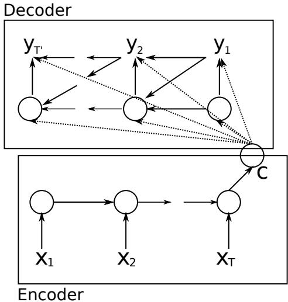
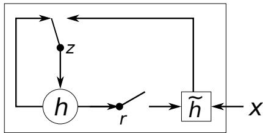
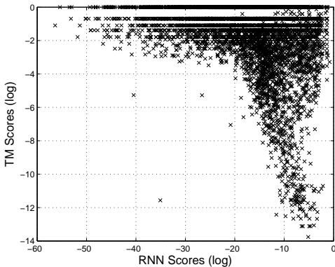
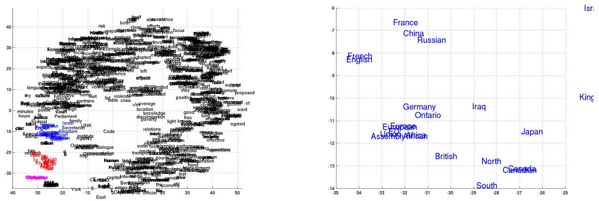
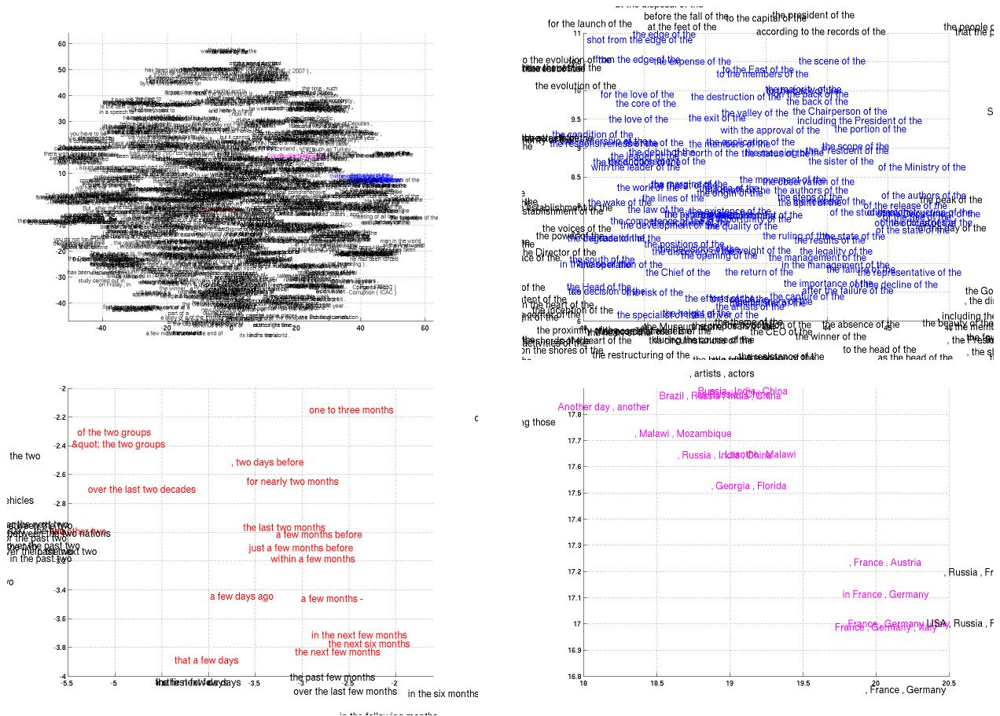

# Learning Phrase Representations using RNN Encoder-Decoder for Statistical Machine Translation

Kyunghyun Cho Bart van Merrienboer Caglar Gulcehre Université de Montréal firstname.lastname@umontreal.ca

Dzmitry Bahdanau Jacobs University, Germany d.bahdanau@ jacobs-university.de

Fethi Bougares Holger Schwenk Yoshua Bengio Université du Maine, France Université de Montréal, CIFAR Senior Fellow firstname.lastname@lium.univ-lemans.fr

find.me@on.the.web

# Abstract

In this paper, we propose a novel neural network model called RNN EncoderDecoder that consists of two recurrent neural networks (RNN). One RNN encodes a sequence of symbols into a fixedlength vector representation, and the other decodes the representation into another sequence of symbols. The encoder and decoder of the proposed model are jointly trained to maximize the conditional probability of a target sequence given a source sequence. The performance of a statistical machine translation system is empirically found to improve by using the conditional probabilities of phrase pairs computed by the RNN Encoder-Decoder as an additional feature in the existing log-linear model. Qualitatively, we show that the proposed model learns a semantically and syntactically meaningful representation of linguistic phrases.

# 1 Introduction

Deep neural networks have shown great success in various applications such as objection recognition (see, e.g., (Krizhevsky et al., 2012)) and speech recognition (see, e.g., (Dahl et al., 2012)). Furthermore, many recent works showed that neural networks can be successfully used in a number of tasks in natural language processing (NLP). These include, but are not limited to, language modeling (Bengio et al., 2003), paraphrase detection (Socher et al., 2011) and word embedding extraction (Mikolov et al., 2013). In the field of statistical machine translation (SMT), deep neural networks have begun to show promising results. (Schwenk, 2012) summarizes a successful usage of feedforward neural networks in the framework of phrase-based SMT system.

Along this line of research on using neural networks for SMT, this paper focuses on a novel neural network architecture that can be used as a part of the conventional phrase-based SMT system. The proposed neural network architecture, which we will refer to as an RNN Encoder-Decoder, consists of two recurrent neural networks (RNN) that act as an encoder and a decoder pair. The encoder maps a variable-length source sequence to a fi xed-length vector, and the decoder maps the vector representation back to a variable-length target sequence. The two networks are trained jointly to maximize the conditional probability of the target sequence given a source sequence. Additionally, we propose to use a rather sophisticated hidden unit in order to improve both the memory capacity and the ease of training.

The proposed RNN Encoder-Decoder with a novel hidden unit is empirically evaluated on the task of translating from English to French. We train the model to learn the translation probability of an English phrase to a corresponding French phrase. The model is then used as a part of a standard phrase-based SMT system by scoring each phrase pair in the phrase table. The empirical evaluation reveals that this approach of scoring phrase pairs with an RNN Encoder-Decoder improves the translation performance.

We qualitatively analyze the trained RNN Encoder-Decoder by comparing its phrase scores with those given by the existing translation model. The qualitative analysis shows that the RNN Encoder-Decoder is better at capturing the linguistic regularities in the phrase table, indirectly explaining the quantitative improvements in the overall translation performance. The further analysis of the model reveals that the RNN Encoder– Decoder learns a continuous space representation of a phrase that preserves both the semantic and syntactic structure of the phrase.

# 2 RNN Encoder-Decoder

# 2.1 Preliminary: Recurrent Neural Networks

A recurrent neural network (RNN) is a neural network that consists of a hidden state $\mathbf { h }$ and an optional output $\mathbf { y }$ which operates on a variablelength sequence $\mathbf { x } = ( x _ { 1 } , \dots , x _ { T } )$ . At each time step $t$ , the hidden state $\mathbf { h } _ { \langle t \rangle }$ of the RNN is updated by

$$
{ \bf h } _ { \langle t \rangle } = f \left( { \bf h } _ { \langle t - 1 \rangle } , x _ { t } \right) ,
$$

where $f$ is a non-linear activation function. $f$ may be as simple as an elementwise logistic sigmoid function and as complex as a long short-term memory (LSTM) unit (Hochreiter and Schmidhuber, 1997).

An RNN can learn a probability distribution over a sequence by being trained to predict the next symbol in a sequence. In that case, the output at each timestep $t$ is the conditional distribution $p ( x _ { t } \mid x _ { t - 1 } , . . . , x _ { 1 } )$ . For example, a multinomial distribution (1-of- $K$ coding) can be output using a softmax activation function

$$
p ( x _ { t , j } = 1 \mid x _ { t - 1 } , \ldots , x _ { 1 } ) = { \frac { \exp { \big ( } { \mathbf { w } _ { j } \mathbf { h } } _ { \langle t \rangle } { \big ) } } { \sum _ { j ^ { \prime } = 1 } ^ { K } \exp { \big ( } { \mathbf { w } _ { j ^ { \prime } } \mathbf { h } } _ { \langle t \rangle } { \big ) } } } ,
$$

for all possible symbols $j = 1 , \ldots , K$ , where ${ \bf w } _ { j }$ are the rows of a weight matrix W. By combining these probabilities, we can compute the probability of the sequence $\mathbf { x }$ using

$$
p ( \mathbf { x } ) = \prod _ { t = 1 } ^ { T } p ( x _ { t } \mid x _ { t - 1 } , . . . , x _ { 1 } ) .
$$

From this learned distribution, it is straightforward to sample a new sequence by iteratively sampling a symbol at each time step.

# 2.2 RNN Encoder-Decoder

In this paper, we propose a novel neural network architecture that learns to encode a variable-length sequence into a fixed-length vector representation and to decode a given fixed-length vector representation back into a variable-length sequence. From a probabilistic perspective, this new model is a general method to learn the conditional distribution over a variable-length sequence conditioned on yet another variable-length sequence, e.g. $p ( y _ { 1 } , \dots , y _ { T ^ { \prime } } \quad | \quad x _ { 1 } , \dots , x _ { T } )$ , where one should note that the input and output sequence lengths $T$ and $T ^ { \prime }$ may differ.

  
Figure 1: An illustration of the proposed RNN Encoder-Decoder.

The encoder is an RNN that reads each symbol of an input sequence x sequentially. As it reads each symbol, the hidden state of the RNN changes according to Eq. (1). After reading the end of the sequence (marked by an end-of-sequence symbol), the hidden state of the RNN is a summary c of the whole input sequence.

The decoder of the proposed model is another RNN which is trained to generate the output sequence by predicting the next symbol $y _ { t }$ given the hidden state $\mathbf { h } _ { \langle t \rangle }$ . However, unlike the RNN described in Sec. 2.1, both $y _ { t }$ and $\mathbf { h } _ { \langle t \rangle }$ are also conditioned on $y _ { t - 1 }$ and on the summary c of the input sequence. Hence, the hidden state of the decoder at time $t$ is computed by,

$$
{ \bf h } _ { \langle t \rangle } = f \left( { \bf h } _ { \langle t - 1 \rangle } , y _ { t - 1 } , \mathbf { c } \right) ,
$$

and similarly, the conditional distribution of the next symbol is

$$
P ( y _ { t } | y _ { t - 1 } , y _ { t - 2 } , . . . , y _ { 1 } , \mathbf { c } ) = g \left( \mathbf { h } _ { \langle t \rangle } , y _ { t - 1 } , \mathbf { c } \right) .
$$

for given activation functions $f$ and $g$ (the latter must produce valid probabilities, e.g. with a softmax).

See Fig. 1 for a graphical depiction of the proposed model architecture.

The two components of the proposed RNN Encoder-Decoder are jointly trained to maximize the conditional log-likelihood

$$
\operatorname* { m a x } _ { \pmb { \theta } } \frac { 1 } { N } \sum _ { n = 1 } ^ { N } \log p _ { \pmb { \theta } } ( \mathbf { y } _ { n } \mid \mathbf { x } _ { n } ) ,
$$

where $\pmb \theta$ is the set of the model parameters and each $\left( \mathbf { x } _ { n } , \mathbf { y } _ { n } \right)$ is an (input sequence, output sequence) pair from the training set. In our case, as the output of the decoder, starting from the input, is differentiable, we can use a gradient-based algorithm to estimate the model parameters.

Once the RNN Encoder–Decoder is trained, the model can be used in two ways. One way is to use the model to generate a target sequence given an input sequence. On the other hand, the model can be used to score a given pair of input and output sequences, where the score is simply a probability $p _ { \pmb { \theta } } ( \mathbf { y } \mid \mathbf { x } )$ from Eqs. (3) and (4).

# 2.3 Hidden Unit that Adaptively Remembers and Forgets

In addition to a novel model architecture, we also propose a new type of hidden unit $f$ in Eq. (1)) that has been motivated by the LSTM unit but is much simpler to compute and implement.1 Fig. 2 shows the graphical depiction of the proposed hidden unit.

Let us describe how the activation of the $j$ -th hidden unit is computed. First, the reset gate $r _ { j }$ is computed by

$$
r _ { j } = \sigma \left( \left[ { \bf W } _ { r } { \bf x } \right] _ { j } + \left[ { \bf U } _ { r } { \bf h } _ { \langle t - 1 \rangle } \right] _ { j } \right) ,
$$

where $\sigma$ is the logistic sigmoid function, and $[ . ] _ { j }$ denotes the $j$ -th element of a vector. $\mathbf { x }$ and $\mathbf { h } _ { t - 1 }$ are the input and the previous hidden state, respectively. $\mathbf { W } _ { r }$ and $\mathbf { U } _ { r }$ are weight matrices which are learned.

Similarly, the update gate $z _ { j }$ is computed by

$$
z _ { j } = \sigma \left( \left[ \mathbf { W } _ { z } \mathbf { x } \right] _ { j } + \left[ \mathbf { U } _ { z } \mathbf { h } _ { \langle t - 1 \rangle } \right] _ { j } \right) .
$$

The actual activation of the proposed unit $h _ { j }$ is then computed by

$$
h _ { j } ^ { \langle t \rangle } = z _ { j } h _ { j } ^ { \langle t - 1 \rangle } + ( 1 - z _ { j } ) \tilde { h } _ { j } ^ { \langle t \rangle } ,
$$

where

$$
\begin{array} { r } { \tilde { h } _ { j } ^ { \langle t \rangle } = \phi \left( \left[ \mathbf { W } \mathbf { x } \right] _ { j } + \left[ \mathbf { U } \left( \mathbf { r } \odot \mathbf { h } _ { \langle t - 1 \rangle } \right) \right] _ { j } \right) . } \end{array}
$$

In this formulation, when the reset gate is close to 0, the hidden state is forced to ignore the previous hidden state and reset with the current input only. This effectively allows the hidden state to drop any information that is found to be irrelevant later in the future, thus, allowing a more compact representation.

  
Figure 2: An illustration of the proposed hidden activation function. The update gate $z$ selects whether the hidden state is to be updated with a new hidden state $\tilde { h }$ . The reset gate $r$ decides whether the previous hidden state is ignored. See Eqs. (5)–(8) for the detailed equations of $r , z , h$ and $\tilde { h }$

On the other hand, the update gate controls how much information from the previous hidden state will carry over to the current hidden state. This acts similarly to the memory cell in the LSTM network and helps the RNN to remember longterm information. Furthermore, this may be considered an adaptive variant of a leaky-integration unit (Bengio et al., 2013).

As each hidden unit has separate reset and update gates, each hidden unit will learn to capture dependencies over different time scales. Those units that learn to capture short-term dependencies will tend to have reset gates that are frequently active, but those that capture longer-term dependencies will have update gates that are mostly active.

In our preliminary experiments, we found that it is crucial to use this new unit with gating units. We were not able to get meaningful result with an oft-used tanh unit without any gating.

# 3 Statistical Machine Translation

In a commonly used statistical machine translation system (SMT), the goal of the system (decoder, specifi cally) is to fi nd a translation f given a source sentence e, which maximizes

$$
p ( \mathbf { f } \mid \mathbf { e } ) \propto p ( \mathbf { e } \mid \mathbf { f } ) p ( \mathbf { f } ) ,
$$

where the first term at the right hand side is called translation model and the latter language model (see, e.g., (Koehn, 2005)). In practice, however, most SMT systems model $\log p ( \textbf { f } | \textbf { e } )$ as a loglinear model with additional features and corre

sponding weights:

$$
\log p ( \mathbf { f } \mid \mathbf { e } ) = \sum _ { n = 1 } ^ { N } w _ { n } f _ { n } ( \mathbf { f } , \mathbf { e } ) + \log Z ( \mathbf { e } ) ,
$$

where $f _ { n }$ and $w _ { n }$ are the $n$ -th feature and weight, respectively. $Z ( \mathbf { e } )$ is a normalization constant that does not depend on the weights. The weights are often optimized to maximize the BLEU score on a development set.

In the phrase-based SMT framework introduced in (Koehn et al., 2003) and (Marcu and Wong, 2002), the translation model $\log p ( \mathbf { e } \mid \mathbf { f } )$ is factorized into the translation probabilities of matching phrases in the source and target sentences.2 These probabilities are once again considered additional features in the log-linear model (see Eq. (9) and are weighted accordingly to maximize the BLEU score.

Since the neural net language model was proposed in (Bengio et al., 2003), neural networks have been used widely in SMT systems. In many cases, neural networks have been used to rescore translation hypotheses $\mathbf { \bar { \rho } } _ { n }$ -best lists) (see, e.g., (Schwenk et al., 2006)). Recently, however, there has been interest in training neural networks to score the translated sentence (or phrase pairs) using a representation of the source sentence as an additional input. See, e.g., (Schwenk, 2012), (Son et al., 2012) and (Zou et al., 2013).

# 3.1 Scoring Phrase Pairs with RNN Encoder-Decoder

Here we propose to train the RNN EncoderDecoder (see Sec. 2.2) on a table of phrase pairs and use its scores as additional features in the loglinear model in Eq. (9) when tuning the SMT decoder.

When we train the RNN Encoder-Decoder, we ignore the (normalized) frequencies of each phrase pair in the original corpora. This measure was taken in order (1) to reduce the computational expense of randomly selecting phrase pairs from a large phrase table according to the normalized frequencies and (2) to ensure that the RNN Encoder– Decoder does not simply learn to rank the phrase pairs according to their numbers of occurrences. One underlying reason for this choice was that the existing translation probability in the phrase table already reflects the frequencies of the phrase pairs in the original corpus. With a fixed capacity of the RNN Encoder-Decoder, we try to ensure that most of the capacity of the model is focused toward learning linguistic regularities, i.e., distinguishing between plausible and implausible translations, or learning the "'manifold" (region of probability concentration) of plausible translations.

Once the RNN Encoder-Decoder is trained, we add a new score for each phrase pair to the existing phrase table. This allows the new scores to enter into the existing tuning algorithm with minimal additional overhead in computation.

As Schwenk pointed out in (Schwenk, 2012), it is possible to completely replace the existing phrase table with the proposed RNN EncoderDecoder. In that case, for a given source phrase, the RNN Encoder–Decoder will need to generate a list of (good) target phrases. This requires, however, an expensive sampling procedure to be performed repeatedly. In this paper, thus, we only consider rescoring the phrase pairs in the phrase table.

# 3.2 Related Approaches: Neural Networks in Machine Translation

Before presenting the empirical results, we discuss a number of recent works that have proposed to use neural networks in the context of SMT.

Schwenk in (Schwenk, 2012) proposed a similar approach of scoring phrase pairs. Instead of the RNN-based neural network, he used a feedforward neural network that has fixed-size inputs (7 words in his case, with zero-padding for shorter phrases) and fixed-size outputs (7 words in the target language). When it is used specifically for scoring phrases for the SMT system, the maximum phrase length is often chosen to be small. However, as the length of phrases increases or as we apply neural networks to other variable-length sequence data, it is important that the neural network can handle variable-length input and output. The proposed RNN Encoder-Decoder is well-suited for these applications.

Similar to (Schwenk, 2012), Devlin et al. (Devlin et al., 2014) proposed to use a feedforward neural network to model a translation model, however, by predicting one word in a target phrase at a time. They reported an impressive improvement, but their approach still requires the maximum length of the input phrase (or context words) to be fi xed a priori.

Although it is not exactly a neural network they train, the authors of (Zou et al., 2013) proposed to learn a bilingual embedding of words/phrases. They use the learned embedding to compute the distance between a pair of phrases which is used as an additional score of the phrase pair in an SMT system.

In (Chandar et al., 2014), a feedforward neural network was trained to learn a mapping from a bag-of-words representation of an input phrase to an output phrase. This is closely related to both the proposed RNN Encoder-Decoder and the model proposed in (Schwenk, 2012), except that their input representation of a phrase is a bag-of-words. A similar approach of using bag-of-words representations was proposed in (Gao et al., 2013) as well. Earlier, a similar encoder—decoder model using two recursive neural networks was proposed in (Socher et al., 2011), but their model was restricted to a monolingual setting, i.e. the model reconstructs an input sentence. More recently, another encoder–decoder model using an RNN was proposed in (Auli et al., 2013), where the decoder is conditioned on a representation of either a source sentence or a source context.

One important difference between the proposed RNN Encoder-Decoder and the approaches in (Zou et al., 2013) and (Chandar et al., 2014) is that the order of the words in source and target phrases is taken into account. The RNN Encoder-Decoder naturally distinguishes between sequences that have the same words but in a different order, whereas the aforementioned approaches effectively ignore order information.

The closest approach related to the proposed RNN Encoder-Decoder is the Recurrent Continuous Translation Model (Model 2) proposed in (Kalchbrenner and Blunsom, 2013). In their paper, they proposed a similar model that consists of an encoder and decoder. The difference with our model is that they used a convolutional $n$ -gram model (CGM) for the encoder and the hybrid of an inverse CGM and a recurrent neural network for the decoder. They, however, evaluated their model on rescoring the $n$ -best list proposed by the conventional SMT system and computing the perplexity of the gold standard translations.

# 4 Experiments

We evaluate our approach on the English/French translation task of the WMT'14 workshop.

# 4.1 Data and Baseline System

Large amounts of resources are available to build an English/French SMT system in the framework of the WMT'14 translation task. The bilingual corpora include Europarl (61M words), news commentary (5.5M), UN (421M), and two crawled corpora of 90M and 780M words respectively. The last two corpora are quite noisy. To train the French language model, about 712M words of crawled newspaper material is available in addition to the target side of the bitexts. All the word counts refer to French words after tokenization.

It is commonly acknowledged that training statistical models on the concatenation of all this data does not necessarily lead to optimal performance, and results in extremely large models which are difficult to handle. Instead, one should focus on the most relevant subset of the data for a given task. We have done so by applying the data selection method proposed in (Moore and Lewis, 2010), and its extension to bitexts (Axelrod et al., 2011). By these means we selected a subset of 418M words out of more than 2G words for language modeling and a subset of 348M out of 850M words for training the RNN Encoder-Decoder. We used the test set newstest2012 and 2013 for data selection and weight tuning with MERT, and newstest2014 as our test set. Each set has more than 70 thousand words and a single reference translation.

For training the neural networks, including the proposed RNN Encoder–Decoder, we limited the source and target vocabulary to the most frequent 15,000 words for both English and French. This covers approximately $93 \%$ of the dataset. All the out-of-vocabulary words were mapped to a special token [UNK]).

The baseline phrase-based SMT system was built using Moses with default settings. This system achieves a BLEU score of 30.64 and 33.3 on the development and test sets, respectively (see Table 1).

# 4.1.1 RNN Encoder-Decoder

The RNN Encoder-Decoder used in the experiment had 1000 hidden units with the proposed gates at the encoder and at the decoder. The input matrix between each input symbol $x _ { \langle t \rangle }$ and the hidden unit is approximated with two lower-rank matrices, and the output matrix is approximated similarly. We used rank-100 matrices, equivalent to learning an embedding of dimension 100 for each word. The activation function used for $\tilde { h }$ in Eq. (8) is a hyperbolic tangent function. The computation from the hidden state in the decoder to the output is implemented as a deep neural network (Pascanu et al., 2014) with a single intermediate layer having 500 maxout units each pooling 2 inputs (Goodfellow et al., 2013).

Table 1: BLEU scores computed on the development and test sets using different combinations of approaches. WP denotes a word penalty, where we penalizes the number of unknown words to neural networks.   

<table><tr><td>Models</td><td colspan="2">BLEU dev test</td></tr><tr><td>Baseline</td><td>30.64</td><td>33.30</td></tr><tr><td>RNN</td><td>31.20</td><td>33.87</td></tr><tr><td>CSLM + RNN</td><td>31.48</td><td>34.64</td></tr><tr><td>CSLM + RNN + WP</td><td>31.50</td><td>34.54</td></tr></table>

All the weight parameters in the RNN Encoder— Decoder were initialized by sampling from an isotropic zero-mean (white) Gaussian distribution with its standard deviation fixed to 0.01, except for the recurrent weight parameters. For the recurrent weight matrices, we fi rst sampled from a white Gaussian distribution and used its left singular vectors matrix, following (Saxe et al., 2014).

We used Adadelta and stochastic gradient descent to train the RNN Encoder-Decoder with hyperparameters $\epsilon \quad = \quad 1 0 ^ { - 6 }$ and $\rho \quad =$ 0.95 (Zeiler, 2012). At each update, we used 64 randomly selected phrase pairs from a phrase table (which was created from 348M words). The model was trained for approximately three days.

Details of the architecture used in the experiments are explained in more depth in the supplementary material.

tem add up or are redundant.

We trained the CSLM model on 7-grams from the target corpus. Each input word was projected into the embedding space $\mathbb { R } ^ { 5 1 2 }$ , and they were concatenated to form a 3072- dimensional vector. The concatenated vector was fed through two rectified layers (of size 1536 and 1024) (Glorot et al., 2011). The output layer was a simple softmax layer (see Eq. (2)). All the weight parameters were initialized uniformly between $- 0 . 0 1$ and 0.01, and the model was trained until the validation perplexity did not improve for 10 epochs. After training, the language model achieved a perplexity of 45.80. The validation set was a random selection of $0 . 1 \%$ of the corpus. The model was used to score partial translations during the decoding process, which generally leads to higher gains in BLEU score than n-best list rescoring (Vaswani et al., 2013).

To address the computational complexity of using a CSLM in the decoder a buffer was used to aggregate n-grams during the stacksearch performed by the decoder. Only when the buffer is full, or a stack is about to be pruned, the n-grams are scored by the CSLM. This allows us to perform fast matrixmatrix multiplication on GPU using Theano (Bergstra et al., 2010; Bastien et al., 2012).

# 4.1.2 Neural Language Model

  
Figure 3: The visualization of phrase pairs according to their scores (log-probabilities) by the RNN Encoder-Decoder and the translation model.

In order to assess the effectiveness of scoring phrase pairs with the proposed RNN EncoderDecoder, we also tried a more traditional approach of using a neural network for learning a target language model (CSLM) (Schwenk, 2007). Especially, the comparison between the SMT system using CSLM and that using the proposed approach of phrase scoring by RNN Encoder-Decoder will clarify whether the contributions from multiple neural networks in different parts of the SMT sys

# 4.2Quantitative Analysis

We tried the following combinations:

1. Baseline confi guration   
2. Baseline $^ +$ RNN   
3. Baseline $+ \mathrm { C S L M + R N N }$   
4. Baseline $+ \mathrm { C S L M } + \mathrm { R N N } + \mathrm { W o r d }$ penalty

<table><tr><td rowspan=1 colspan=1>Source</td><td rowspan=1 colspan=1>Translation Model</td><td rowspan=1 colspan=2>RNN Encoder-Decoder</td></tr><tr><td rowspan=1 colspan=1>at the end of the</td><td rowspan=1 colspan=1>[a la fin de la] [f la fin des années] [etre sup-primés à la fin de la]</td><td rowspan=1 colspan=2>[à la fin du] [à la fin des] [à la fin de la]</td></tr><tr><td rowspan=1 colspan=1>for the fi rst time</td><td rowspan=1 colspan=1>[r © pour la premirere fois] [été donnés pourla première fois] [été commémorée pour lapremière fois]</td><td rowspan=1 colspan=2>[pour la première fois] [pour la première fois ,][pour la première fois que]</td></tr><tr><td rowspan=1 colspan=1>in the United Statesand</td><td rowspan=1 colspan=1>[? aux ?tats-Unis et] [été ouvertes aux États-Unis et] [été constatées aux États-Unis et]</td><td rowspan=1 colspan=2>[aux Etats-Unis et] [des Etats-Unis et] [desEtats-Unis et]</td></tr><tr><td rowspan=1 colspan=1>, as well as</td><td rowspan=1 colspan=1>[?s , qu&#x27;] [?s , ainsi que] [?re aussi bien que]</td><td rowspan=1 colspan=2>[, ainsi qu&#x27;] [, ainsi que] [, ainsi que les]</td></tr><tr><td rowspan=1 colspan=1>one of the most</td><td rowspan=1 colspan=1>[?t ?I&#x27; un des plus] [?1&#x27; un des plus] [ètre retenuecomme un de ses plus]</td><td rowspan=1 colspan=2>[I&#x27; un des] [le] [un des]</td></tr><tr><td rowspan=1 colspan=4>(a) Long, frequent source phrases</td></tr><tr><td rowspan=1 colspan=1>Source</td><td rowspan=1 colspan=1>Translation Model</td><td rowspan=1 colspan=2>RNN Encoder-Decoder</td></tr><tr><td rowspan=1 colspan=1>, Minister of Commu-nications and Trans-port</td><td rowspan=1 colspan=1>[Secrétaire aux communications et aux trans-ports :] [Secrétaire aux communications et auxtransports]</td><td rowspan=1 colspan=2>[Secrétaire aux communications et aux trans-ports] [Secrétaire aux communications et auxtransports :]</td></tr><tr><td rowspan=1 colspan=1>did not comply withthe</td><td rowspan=1 colspan=1>[vestimentaire , ne correspondaient pas à des][susmentionnée n&#x27; était pas conforme aux][présentées n&#x27; étaient pas conformes à la]</td><td rowspan=1 colspan=2>[n&#x27;ont pas respecté les] [n&#x27; était pas conformeaux] [n&#x27; ont pas respecté la]</td></tr><tr><td rowspan=1 colspan=1>parts of the world .</td><td rowspan=1 colspan=1>[© gions du monde .] [régions du monde con-sidérées .] [région du monde considérée .]</td><td rowspan=1 colspan=2>[parties du monde .] [les parties du monde .][des parties du monde .]</td></tr><tr><td rowspan=1 colspan=1>the past few days .</td><td rowspan=1 colspan=1>[le petit texte .] [cours des tout derniers jours .][les tout derniers jours .]</td><td rowspan=1 colspan=1>[ces derniers iours.] [1</td><td rowspan=1 colspan=1>[ces derniers jours .] [les derniers jours .] [coursdes derniers jours .]</td></tr><tr><td rowspan=2 colspan=1>on Friday and Satur-day</td><td rowspan=1 colspan=1>[vendredi et samedi à la] [vendredi et samedi a]</td><td rowspan=2 colspan=2>[le vendredi et le samedi] [le vendredi et samedi][vendredi et samedi]</td></tr><tr><td rowspan=1 colspan=1>[se déroulera vendredi et samedi ,]</td></tr></table>

(b) Long, rare source phrases

Table 2: The top scoring target phrases for a small set of source phrases according to the translation model (direct translation probability) and by the RNN Encoder-Decoder. Source phrases were randomly selected from phrases with 4 or more words. ? denotes an incomplete (partial) character. r is a Cyrillic letter ghe.

The results are presented in Table 1. As expected, adding features computed by neural networks consistently improves the performance over the baseline performance.

The best performance was achieved when we used both CSLM and the phrase scores from the RNN Encoder-Decoder. This suggests that the contributions of the CSLM and the RNN EncoderDecoder are not too correlated and that one can expect better results by improving each method independently. Furthermore, we tried penalizing the number of words that are unknown to the neural networks (i.e. words which are not in the shortlist). We do so by simply adding the number of unknown words as an additional feature the loglinear model in Eq. (9).3 However, in this case we were not able to achieve better performance on the test set, but only on the development set.

# 4.3 Qualitative Analysis

In order to understand where the performance improvement comes from, we analyze the phrase pair scores computed by the RNN Encoder-Decoder against the corresponding $p ( \mathbf { f _ { \alpha } } | \mathbf { e } )$ from the translation model. Since the existing translation model relies solely on the statistics of the phrase pairs in the corpus, we expect its scores to be better estimated for the frequent phrases but badly estimated for rare phrases. Also, as we mentioned earlier in Sec. 3.1, we further expect the RNN EncoderDecoder which was trained without any frequency information to score the phrase pairs based rather on the linguistic regularities than on the statistics of their occurrences in the corpus.

We focus on those pairs whose source phrase is long (more than 3 words per source phrase) and frequent. For each such source phrase, we look at the target phrases that have been scored high either by the translation probability $p ( \mathbf { f } \ \mid \mathbf { e } )$ or by the RNN Encoder-Decoder. Similarly, we perform the same procedure with those pairs whose source phrase is long but rare in the corpus.

Table 3: Samples generated from the RNN Encoder-Decoder for each source phrase used in Table 2. We show the top-5 target phrases out of 50 samples. They are sorted by the RNN Encoder-Decoder scores.   

<table><tr><td rowspan=1 colspan=1>Source</td><td rowspan=1 colspan=2>Samples from RNN Encoder-Decoder</td></tr><tr><td rowspan=1 colspan=1>at the end of the</td><td rowspan=1 colspan=2>[à la fin de la] (× 11)</td></tr><tr><td rowspan=1 colspan=1>for the first time</td><td rowspan=1 colspan=2>[pour la première fois] (× 24) [pour la première fois que] (× 2)</td></tr><tr><td rowspan=1 colspan=1>in the United States and</td><td rowspan=1 colspan=2>[aux Etats-Unis et] (× 6) [dans les Etats-Unis et] (×4)</td></tr><tr><td rowspan=1 colspan=1>, as well as</td><td rowspan=1 colspan=2>[, ainsi que] [,] [ainsi que] [, ainsi qu&#x27;] [et UNK]</td></tr><tr><td rowspan=1 colspan=1>one of the most</td><td rowspan=1 colspan=2>[1&#x27; un des plus] (× 9) [1&#x27; un des] (× 5) [1&#x27; une des plus] (× 2)</td></tr><tr><td rowspan=1 colspan=3>(a) Long, frequent source phrases</td></tr><tr><td rowspan=1 colspan=1>Source</td><td rowspan=1 colspan=2>Samples from RNN Encoder-Decoder</td></tr><tr><td rowspan=1 colspan=1>, Minister of Communica-</td><td rowspan=2 colspan=2>[ , ministre des communications et le transport] (× 13)</td></tr><tr><td rowspan=1 colspan=1>tions and Transport</td></tr><tr><td rowspan=1 colspan=1>did not comply with the</td><td rowspan=1 colspan=1></td><td rowspan=1 colspan=1>[n&#x27; tait pas conforme aux] [n&#x27; a pas respect 1&#x27;] (× 2) [n&#x27; a pas respect la] (× 3)</td></tr><tr><td rowspan=1 colspan=1>parts of the world</td><td rowspan=1 colspan=1></td><td rowspan=1 colspan=1>[arts du monde .] (× 11) [des arts du monde .] (× 7)</td></tr><tr><td rowspan=1 colspan=1>the past few days .</td><td rowspan=1 colspan=1></td><td rowspan=1 colspan=1>[quelques jours .] (× 5) [les derniers jours .] (×5) [ces derniers jours .] (× 2)</td></tr><tr><td rowspan=1 colspan=1>on Friday and Saturday</td><td rowspan=1 colspan=1></td><td rowspan=1 colspan=1>[vendredi et samedi] (× 5) [le vendredi et samedi] (× 7) [le vendredi et le samedi] (×4)</td></tr></table>

(b) Long, rare source phrases

  
Figure 4: 2-D embedding of the learned word representation. The left one shows the full embedding space, while the right one shows a zoomed-in view of one region (color-coded). For more plots, see the supplementary material.

Table 2 lists the top-3 target phrases per source phrase favored either by the translation model or by the RNN Encoder-Decoder. The source phrases were randomly chosen among long ones having more than 4 or 5 words.

In most cases, the choices of the target phrases by the RNN Encoder-Decoder are closer to actual or literal translations. We can observe that the RNN Encoder-Decoder prefers shorter phrases in general.

Interestingly, many phrase pairs were scored similarly by both the translation model and the RNN Encoder-Decoder, but there were as many other phrase pairs that were scored radically different (see Fig. 3). This could arise from the proposed approach of training the RNN EncoderDecoder on a set of unique phrase pairs, discouraging the RNN Encoder-Decoder from learning simply the frequencies of the phrase pairs from the corpus, as explained earlier.

Furthermore, in Table 3, we show for each of the source phrases in Table 2, the generated samples from the RNN Encoder-Decoder. For each source phrase, we generated 50 samples and show the top-five phrases accordingly to their scores. We can see that the RNN Encoder-Decoder is able to propose well-formed target phrases without looking at the actual phrase table. Importantly, the generated phrases do not overlap completely with the target phrases from the phrase table. This encourages us to further investigate the possibility of replacing the whole or a part of the phrase table with the proposed RNN Encoder-Decoder in the future.

  
Figure 5: 2–D embedding of the learned phrase representation. The top left one shows the full representation space (5000 randomly selected points), while the other three fi gures show the zoomed-in view of specific regions (color-coded).

# 4.4 Word and Phrase Representations

Since the proposed RNN Encoder-Decoder is not specifically designed only for the task of machine translation, here we briefly look at the properties of the trained model.

It has been known for some time that continuous space language models using neural networks are able to learn semantically meaningful embeddings (See, e.g., (Bengio et al., 2003; Mikolov et al., 2013)). Since the proposed RNN Encoder–Decoder also projects to and maps back from a sequence of words into a continuous space vector, we expect to see a similar property with the proposed model as well.

The left plot in Fig. 4 shows the 2–D embedding of the words using the word embedding matrix learned by the RNN Encoder-Decoder. The projection was done by the recently proposed BarnesHut-SNE (van der Maaten, 2013). We can clearly see that semantically similar words are clustered with each other (see the zoomed-in plots in Fig. 4).

The proposed RNN Encoder-Decoder naturally generates a continuous-space representation of a phrase. The representation (c in Fig. 1) in this case is a 1000-dimensional vector. Similarly to the word representations, we visualize the representations of the phrases that consists of four or more words using the Barnes-Hut-SNE in Fig. 5.

From the visualization, it is clear that the RNN Encoder–Decoder captures both semantic and syntactic structures of the phrases. For instance, in the bottom-left plot, most of the phrases are about the duration of time, while those phrases that are syntactically similar are clustered together. The bottom-right plot shows the cluster of phrases that are semantically similar (countries or regions). On the other hand, the top-right plot shows the phrases that are syntactically similar.

# 5 Conclusion

In this paper, we proposed a new neural network architecture, called an RNN Encoder-Decoder that is able to learn the mapping from a sequence of an arbitrary length to another sequence, possibly from a different set, of an arbitrary length. The proposed RNN Encoder–Decoder is able to either score a pair of sequences (in terms of a conditional probability) or generate a target sequence given a source sequence. Along with the new architecture, we proposed a novel hidden unit that includes a reset gate and an update gate that adaptively control how much each hidden unit remembers or forgets while reading/generating a sequence.

We evaluated the proposed model with the task of statistical machine translation, where we used the RNN Encoder-Decoder to score each phrase pair in the phrase table. Qualitatively, we were able to show that the new model is able to capture linguistic regularities in the phrase pairs well and also that the RNN Encoder-Decoder is able to propose well-formed target phrases.

The scores by the RNN Encoder-Decoder were found to improve the overall translation performance in terms of BLEU scores. Also, we found that the contribution by the RNN EncoderDecoder is rather orthogonal to the existing approach of using neural networks in the SMT system, so that we can improve further the performance by using, for instance, the RNN EncoderDecoder and the neural net language model together.

Our qualitative analysis of the trained model shows that it indeed captures the linguistic regularities in multiple levels i.e. at the word level as well as phrase level. This suggests that there may be more natural language related applications that may benefit from the proposed RNN EncoderDecoder.

The proposed architecture has large potential for further improvement and analysis. One approach that was not investigated here is to replace the whole, or a part of the phrase table by letting the RNN Encoder-Decoder propose target phrases. Also, noting that the proposed model is not limited to being used with written language, it will be an important future research to apply the proposed architecture to other applications such as speech transcription.

# Acknowledgments

KC, BM, CG, DB and YB would like to thank NSERC, Calcul Québec, Compute Canada, the Canada Research Chairs and CIFAR. FB and HS were partially funded by the European Commission under the project MateCat, and by DARPA under the BOLT project.

# References

[Auli et al.2013] Michael Auli, Michel Galley, Chris Quirk, and Geoffrey Zweig. 2013. Joint language and translation modeling with recurrent neural networks. In Proceedings of the ACL Conference on Empirical Methods in Natural Language Processing (EMNLP), pages 1044–1054.

[Axelrod et al.2011] Amittai Axelrod, Xiaodong He, and Jianfeng Gao. 2011. Domain adaptation via pseudo in-domain data selection. In Proceedings of the ACL Conference on Empirical Methods in Natural Language Processing (EMNLP), pages 355–362.

[Bastien et al.2012] Frédéric Bastien, Pascal Lamblin, Razvan Pascanu, James Bergstra, Ian J. Goodfellow, Arnaud Bergeron, Nicolas Bouchard, and Yoshua Bengio. 2012. Theano: new features and speed improvements. Deep Learning and Unsupervised Feature Learning NIPS 2012 Workshop.

[Bengio et al.2003] Yoshua Bengio, Réjean Ducharme, Pascal Vincent, and Christian Janvin. 2003. A neural probabilistic language model. J. Mach. Learn. Res., 3:1137–1155, March.

[Bengio et al.2013] Y. Bengio, N. BoulangerLewandowski, and R. Pascanu. 2013. Advances in optimizing recurrent networks. In Proceedings of the 38th International Conference on Acoustics, Speech, and Signal Processing (ICASSP 2013), May.

[Bergstra et al.2010] James Bergstra, Olivier Breuleux, Frédéric Bastien, Pascal Lamblin, Razvan Pascanu, Guillaume Desjardins, Joseph Turian, David WardeFarley, and Yoshua Bengio. 2010. Theano: a CPU and GPU math expression compiler. In Proceedings of the Python for Scientific Computing Conference (SciPy), June. Oral Presentation.

[Chandar et al.2014] Sarath Chandar, Stanislas Lauly, Hugo Larochelle, Mitesh Khapra, Balaraman Ravindran, Vikas Raykar, and Amrita Saha. 2014. An autoencoder approach to learning bilingual word representations. arXiv:1402.1454 [cs.CL], February.

[Dahl et al.2012] George E. Dahl1, Dong Yu, Li Deng, and Alex Acero. 2012. Context-dependent pretrained deep neural networks for large vocabulary speech recognition. IEEE Transactions on Audio, Speech, and Language Processing, 20(1):33–42.

[Devlin et al.2014] Jacob Devlin, Rabih Zbib, Zhongqiang Huang, Thomas Lamar, Richard Schwartz, , and John Makhoul. 2014. Fast and robust neural network joint models for statistical machine translation. In Proceedings of the ACL 2014 Conference, ACL '14, pages 1370–1380.

[Gao et al.2013] Jianfeng Gao, Xiaodong He, Wen tau Yih, and Li Deng. 2013. Learning semantic representations for the phrase translation model. Technical report, Microsoft Research.

[Glorot et al.2011] X. Glorot, A. Bordes, and Y. Bengio. 2011. Deep sparse rectifier neural networks. In AISTATS'2011.

[Goodfellow et al.2013] Ian J. Goodfellow, David Warde-Farley, Mehdi Mirza, Aaron Courville, and Yoshua Bengio. 2013. Maxout networks. In ICML'2013.

[Graves2012] Alex Graves. 2012. Supervised Sequence Labelling with Recurrent Neural Networks. Studies in Computational Intelligence. Springer.

[Hochreiter and Schmidhuber1997] S. Hochreiter and J. Schmidhuber. 1997. Long short-term memory. Neural Computation, 9(8):1735–1780.

[Kalchbrenner and Blunsom2013] Nal Kalchbrenner and Phil Blunsom. 2013. Two recurrent continuous translation models. In Proceedings of the ACL Conference on Empirical Methods in Natural Language Processing (EMNLP), pages 1700–1709.

[Koehn et al.2003] Philipp Koehn, Franz Josef Och, and Daniel Marcu. 2003. Statistical phrase-based translation. In Proceedings of the 2003 Conference of the North American Chapter of the Association for Computational Linguistics on Human Language Technology - Volume 1, NAACL '03, pages 48–54.

[Koehn2005] P. Koehn. 2005. Europarl: A parallel corpus for statistical machine translation. In Machine Translation Summit $X$ , pages 79–86, Phuket, Thailand.

[Krizhevsky et al.2012] Alex Krizhevsky, Ilya Sutskever, and Geoffrey Hinton. 2012. ImageNet classification with deep convolutional neural networks. In Advances in Neural Information Processing Systems 25 (NIPS'2012).

[Marcu and Wong2002] Daniel Marcu and William Wong. 2002. A phrase-based, joint probability model for statistical machine translation. In Proceedings of the ACL-02 Conference on Empirical Methods in Natural Language Processing - Volume 10, EMNLP '02, pages 133–139.

[Mikolov et al.2013] Tomas Mikolov, Ilya Sutskever, Kai Chen, Greg Corrado, and Jeff Dean. 2013. Distributed representations of words and phrases and their compositionality. In Advances in Neural Information Processing Systems 26, pages 3111–3119.

[Moore and Lewis2010] Robert C. Moore and William Lewis. 2010. Intelligent selection of language model training data. In Proceedings of the ACL 2010 Conference Short Papers, ACLShort '10, pages 220–224, Stroudsburg, PA, USA.

[Pascanu et al.2014] R. Pascanu, C. Gulcehre, K. Cho, and Y. Bengio. 2014. How to construct deep recurrent neural networks. In Proceedings of the Second International Conference on Learning Representations (ICLR 2014), April.

[Saxe et al.2014] Andrew M. Saxe, James L. McClelland, and Surya Ganguli. 2014. Exact solutions to the nonlinear dynamics of learning in deep linear neural networks. In Proceedings of the Second International Conference on Learning Representations (ICLR 2014), April.

[Schwenk et al.2006] Holger Schwenk, Marta R. CostaJussà, and José A. R. Fonollosa. 2006. Continuous space language models for the iwslt 2006 task. In IWSLT, pages 166–173.

[Schwenk2007] Holger Schwenk. 2007. Continuous space language models. Comput. Speech Lang., 21(3):492–518, July.

[Schwenk2012] Holger Schwenk. 2012. Continuous space translation models for phrase-based statistical machine translation. In Martin Kay and Christian Boitet, editors, Proceedings of the 24th International Conference on Computational Linguistics (COLIN), pages 1071–1080.

[Socher et al.2011] Richard Socher, Eric H. Huang, Jeffrey Pennington, Andrew Y. Ng, and Christopher D. Manning. 2011. Dynamic pooling and unfolding recursive autoencoders for paraphrase detection. In Advances in Neural Information Processing Systems 24.

[Son et al.2012] Le Hai Son, Alexandre Allauzen, and Frangois Yvon. 2012. Continuous space translation models with neural networks. In Proceedings of the 2012 Conference of the North American Chapter of the Association for Computational Linguistics: Human Language Technologies, NAACL HLT '12, pages 39–48, Stroudsburg, PA, USA.

[van der Maaten2013] Laurens van der Maaten. 2013. Barnes-hut-sne. In Proceedings of the First International Conference on Learning Representations (ICLR 2013), May.

[Vaswani et al.2013] Ashish Vaswani, Yinggong Zhao, Victoria Fossum, and David Chiang. 2013. Decoding with large-scale neural language models improves translation. Proceedings of the Conference on Empirical Methods in Natural Language Processing, pages 1387–1392.

[Zeiler2012] Matthew D. Zeiler. 2012. ADADELTA: an adaptive learning rate method. Technical report, arXiv 1212.5701.

[Zou et al.2013] Will Y. Zou, Richard Socher, Daniel M. Cer, and Christopher D. Manning. 2013. Bilingual word embeddings for phrase-based machine translation. In Proceedings of the ACL Conference on Empirical Methods in Natural Language Processing (EMNLP), pages 1393–1398.