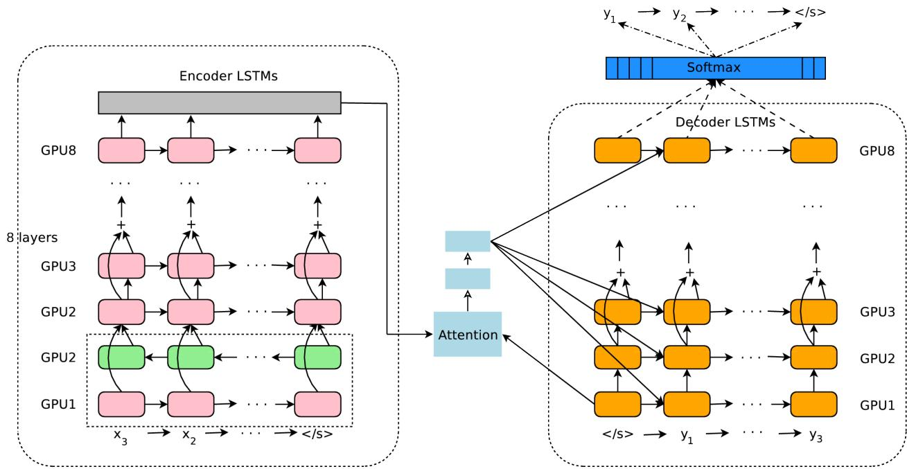
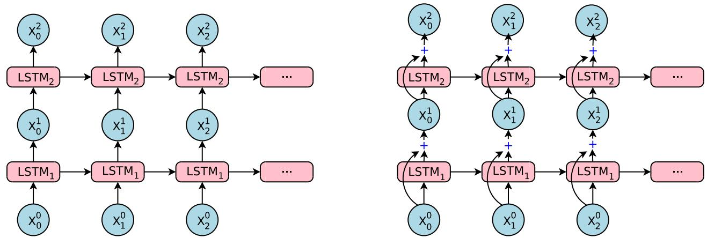
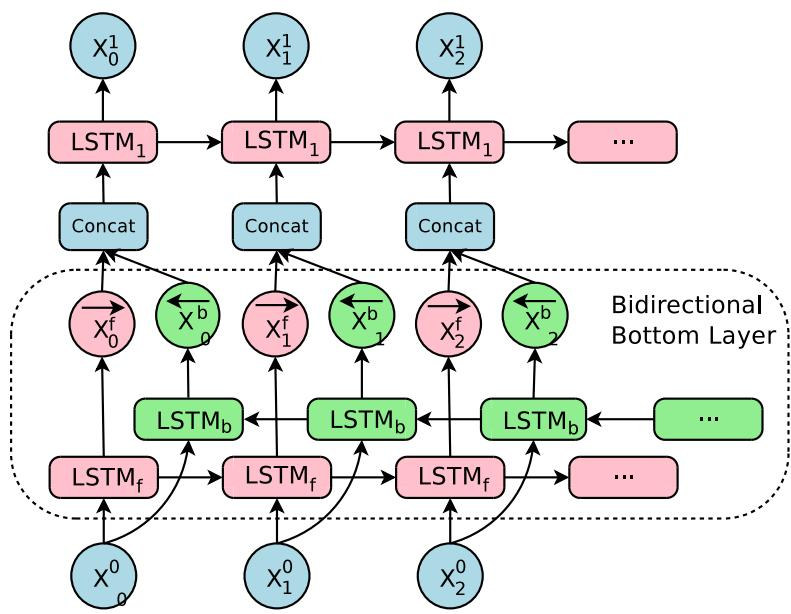
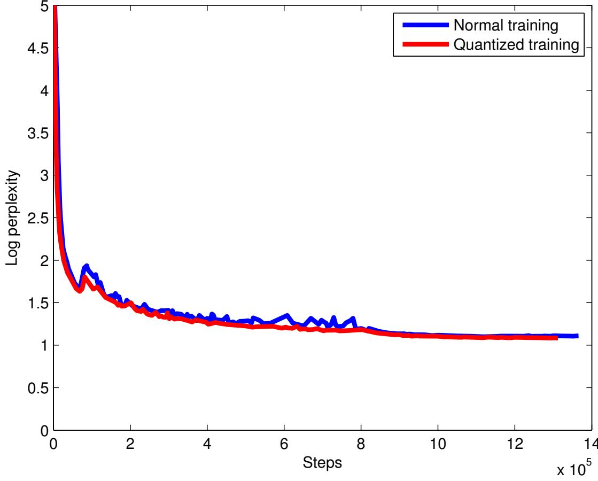
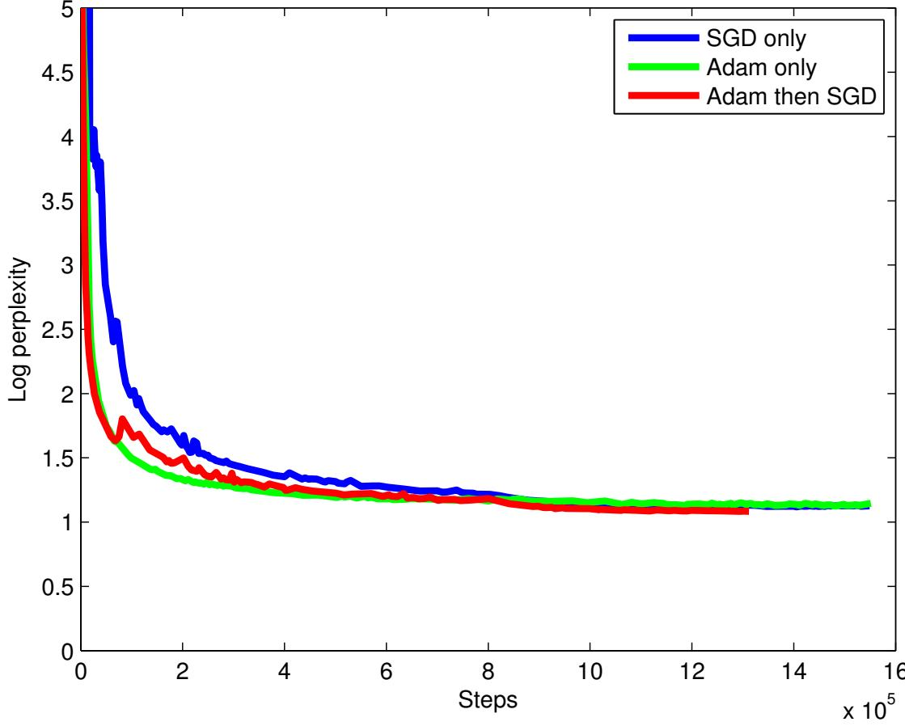
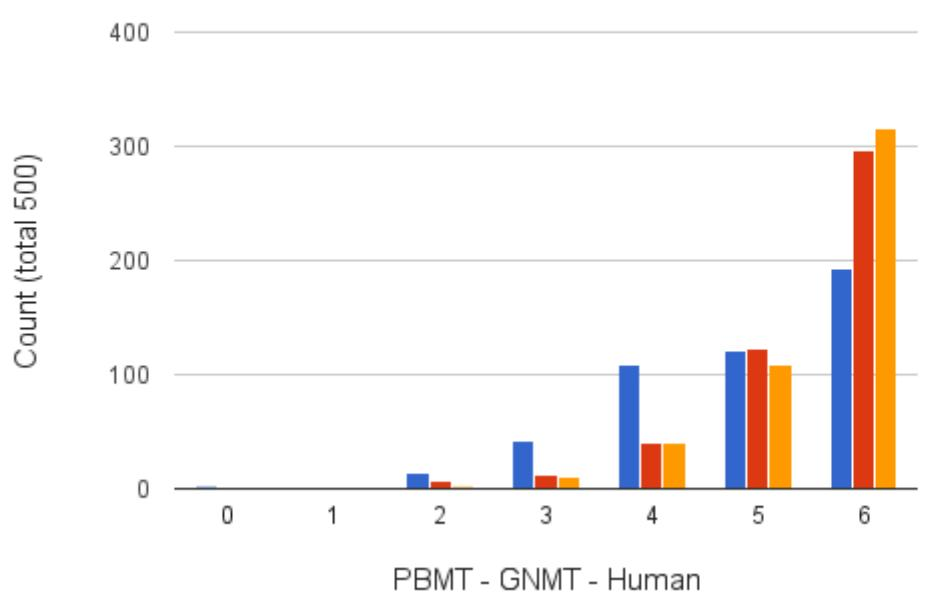

# Google’s Neural Machine Translation System: Bridging the Gap between Human and Machine Translation

Yonghui Wu, Mike Schuster, Zhifeng Chen, Quoc V. Le, Mohammad Norouzi yonghui,schuster,zhifengc,qvl,mnorouzi@google.com

Wolfgang Macherey, Maxim Krikun, Yuan Cao, Qin Gao, Klaus Macherey, Jeff Klingner, Apurva Shah, Melvin Johnson, Xiaobing Liu, Łukasz Kaiser, Stephan Gouws, Yoshikiyo Kato, Taku Kudo, Hideto Kazawa, Keith Stevens, George Kurian, Nishant Patil, Wei Wang, Cliff Young, Jason Smith, Jason Riesa, Alex Rudnick, Oriol Vinyals, Greg Corrado, Macduff Hughes, Jeffrey Dean

# Abstract

Neural Machine Translation (NMT) is an end-to-end learning approach for automated translation, with the potential to overcome many of the weaknesses of conventional phrase-based translation systems. Unfortunately, NMT systems are known to be computationally expensive both in training and in translation inference – sometimes prohibitively so in the case of very large data sets and large models. Several authors have also charged that NMT systems lack robustness, particularly when input sentences contain rare words. These issues have hindered NMT’s use in practical deployments and services, where both accuracy and speed are essential. In this work, we present GNMT, Google’s Neural Machine Translation system, which attempts to address many of these issues. Our model consists of a deep LSTM network with 8 encoder and 8 decoder layers using residual connections as well as attention connections from the decoder network to the encoder. To improve parallelism and therefore decrease training time, our attention mechanism connects the bottom layer of the decoder to the top layer of the encoder. To accelerate the final translation speed, we employ low-precision arithmetic during inference computations. To improve handling of rare words, we divide words into a limited set of common sub-word units (“wordpieces”) for both input and output. This method provides a good balance between the flexibility of “character”-delimited models and the efficiency of “word”-delimited models, naturally handles translation of rare words, and ultimately improves the overall accuracy of the system. Our beam search technique employs a length-normalization procedure and uses a coverage penalty, which encourages generation of an output sentence that is most likely to cover all the words in the source sentence. To directly optimize the translation BLEU scores, we consider refining the models by using reinforcement learning, but we found that the improvement in the BLEU scores did not reflect in the human evaluation. On the WMT’14 English-to-French and English-to-German benchmarks, GNMT achieves competitive results to state-of-the-art. Using a human side-by-side evaluation on a set of isolated simple sentences, it reduces translation errors by an average of $6 0 \%$ compared to Google’s phrase-based production system.

# 1 Introduction

Neural Machine Translation (NMT) [41, 2] has recently been introduced as a promising approach with the potential of addressing many shortcomings of traditional machine translation systems. The strength of NMT lies in its ability to learn directly, in an end-to-end fashion, the mapping from input text to associated output text. Its architecture typically consists of two recurrent neural networks (RNNs), one to consume the input text sequence and one to generate translated output text. NMT is often accompanied by an attention mechanism [2] which helps it cope effectively with long input sequences.

An advantage of Neural Machine Translation is that it sidesteps many brittle design choices in traditional phrase-based machine translation [26]. In practice, however, NMT systems used to be worse in accuracy than phrase-based translation systems, especially when training on very large-scale datasets as used for the very best publicly available translation systems. Three inherent weaknesses of Neural Machine Translation are responsible for this gap: its slower training and inference speed, ineffectiveness in dealing with rare words, and sometimes failure to translate all words in the source sentence. Firstly, it generally takes a considerable amount of time and computational resources to train an NMT system on a large-scale translation dataset, thus slowing the rate of experimental turnaround time and innovation. For inference they are generally much slower than phrase-based systems due to the large number of parameters used. Secondly, NMT lacks robustness in translating rare words. Though this can be addressed in principle by training a “copy model” to mimic a traditional alignment model [31], or by using the attention mechanism to copy rare words [37], these approaches are both unreliable at scale, since the quality of the alignments varies across languages, and the latent alignments produced by the attention mechanism are unstable when the network is deep. Also, simple copying may not always be the best strategy to cope with rare words, for example when a transliteration is more appropriate. Finally, NMT systems sometimes produce output sentences that do not translate all parts of the input sentence – in other words, they fail to completely “cover” the input, which can result in surprising translations.

This work presents the design and implementation of GNMT, a production NMT system at Google, that aims to provide solutions to the above problems. In our implementation, the recurrent networks are Long Short-Term Memory (LSTM) RNNs [23, 17]. Our LSTM RNNs have 8 layers, with residual connections between layers to encourage gradient flow [21]. For parallelism, we connect the attention from the bottom layer of the decoder network to the top layer of the encoder network. To improve inference time, we employ low-precision arithmetic for inference, which is further accelerated by special hardware (Google’s Tensor Processing Unit, or TPU). To effectively deal with rare words, we use sub-word units (also known as “wordpieces”) [35] for inputs and outputs in our system. Using wordpieces gives a good balance between the flexibility of single characters and the efficiency of full words for decoding, and also sidesteps the need for special treatment of unknown words. Our beam search technique includes a length normalization procedure to deal efficiently with the problem of comparing hypotheses of different lengths during decoding, and a coverage penalty to encourage the model to translate all of the provided input.

Our implementation is robust, and performs well on a range of datasets across many pairs of languages without the need for language-specific adjustments. Using the same implementation, we are able to achieve results comparable to or better than previous state-of-the-art systems on standard benchmarks, while delivering great improvements over Google’s phrase-based production translation system. Specifically, on WMT’14 English-to-French, our single model scores 38.95 BLEU, an improvement of 7.5 BLEU from a single model without an external alignment model reported in [31] and an improvement of 1.2 BLEU from a single model without an external alignment model reported in [45]. Our single model is also comparable to a single model in [45], while not making use of any alignment model as being used in [45]. Likewise on WMT’14 English-to-German, our single model scores 24.17 BLEU, which is 3.4 BLEU better than a previous competitive baseline [6]. On production data, our implementation is even more effective. Human evaluations show that GNMT has reduced translation errors by 60% compared to our previous phrase-based system on many pairs of languages: English French, English Spanish, and English Chinese. Additional experiments suggest the quality of the resulting translation system gets closer to that of average human translators.

# 2 Related Work

Statistical Machine Translation (SMT) has been the dominant translation paradigm for decades [3, 4, 5]. Practical implementations of SMT are generally phrase-based systems (PBMT) which translate sequences of words or phrases where the lengths may differ [26].

Even prior to the advent of direct Neural Machine Translation, neural networks have been used as a component within SMT systems with some success. Perhaps one of the most notable attempts involved the use of a joint language model to learn phrase representations [13] which yielded an impressive improvement when combined with phrase-based translation. This approach, however, still makes use of phrase-based translation systems at its core, and therefore inherits their shortcomings. Other proposed approaches for learning phrase representations [7] or learning end-to-end translation with neural networks [24] offered encouraging hints, but ultimately delivered worse overall accuracy compared to standard phrase-based systems.

The concept of end-to-end learning for machine translation has been attempted in the past (e.g., [8]) with limited success. Following seminal papers in the area [41, 2], NMT translation quality has crept closer to the level of phrase-based translation systems for common research benchmarks. Perhaps the first successful attempt at surpassing phrase-based translation was described in [31]. On WMT’14 English-to-French, this system achieved a 0.5 BLEU improvement compared to a state-of-the-art phrase-based system.

Since then, many novel techniques have been proposed to further improve NMT: using an attention mechanism to deal with rare words [37], a mechanism to model translation coverage [42], multi-task and semi-supervised training to incorporate more data [14, 29], a character decoder [9], a character encoder [11], subword units [38] also to deal with rare word outputs, different kinds of attention mechanisms [30], and sentence-level loss minimization [39, 34]. While the translation accuracy of these systems has been encouraging, systematic comparison with large scale, production quality phrase-based translation systems has been lacking.

# 3 Model Architecture

Our model (see Figure 1) follows the common sequence-to-sequence learning framework [41] with attention [2]. It has three components: an encoder network, a decoder network, and an attention network. The encoder transforms a source sentence into a list of vectors, one vector per input symbol. Given this list of vectors, the decoder produces one symbol at a time, until the special end-of-sentence symbol (EOS) is produced. The encoder and decoder are connected through an attention module which allows the decoder to focus on different regions of the source sentence during the course of decoding.

For notation, we use bold lower case to denote vectors (e.g., $\mathbf { v } , \mathbf { o } _ { \mathbf { i } }$ ), bold upper case to represent matrices (e.g., $\mathbf { U } , \mathbf { W }$ ), cursive upper case to represent sets (e.g., $\mathcal { V } , \mathcal { T } .$ ), capital letters to represent sequences (e.g. $X$ , $Y$ ), and lower case to represent individual symbols in a sequence, (e.g., $x _ { 1 }$ , $x _ { 2 }$ ).

Let $( X , Y )$ be a source and target sentence pair. Let $X = x _ { 1 } , x _ { 2 } , x _ { 3 } , . . . , x _ { M }$ be the sequence of $M$ symbols in the source sentence and let $Y = y _ { 1 } , y _ { 2 } , y _ { 3 } , . . . , y _ { N }$ be the sequence of $N$ symbols in the target sentence. The encoder is simply a function of the following form:

$$
\mathbf { x _ { 1 } } , \mathbf { x _ { 2 } } , . . . , \mathbf { x _ { M } } = E n c o d e r R N N ( x _ { 1 } , x _ { 2 } , x _ { 3 } , . . . , x _ { M } )
$$

In this equation, $\mathbf { x _ { 1 } } , \mathbf { x _ { 2 } } , . . . , \mathbf { x _ { M } }$ is a list of fixed size vectors. The number of members in the list is the same as the number of symbols in the source sentence ( $M$ in this example). Using the chain rule the conditional probability of the sequence $P ( { Y \vert } X )$ can be decomposed as:

$$
\begin{array} { l } { { \displaystyle P ( Y | X ) = P ( Y | { \bf x _ { 1 } } , { \bf x _ { 2 } } , { \bf x _ { 3 } } , . . . , { \bf x _ { M } } ) } \ ~ } \\ { { \displaystyle ~ = \prod _ { i = 1 } ^ { N } P ( y _ { i } | y _ { 0 } , y _ { 1 } , y _ { 2 } , . . . , y _ { i - 1 } ; { \bf x _ { 1 } } , { \bf x _ { 2 } } , { \bf x _ { 3 } } , . . . , { \bf x _ { M } } ) } \ ~ } \end{array}
$$

where $y _ { 0 }$ is a special “beginning of sentence” symbol that is prepended to every target sentence.

During inference we calculate the probability of the next symbol given the source sentence encoding and the decoded target sequence so far:

$$
P ( y _ { i } | y _ { 0 } , y _ { 1 } , y _ { 2 } , y _ { 3 } , . . . , y _ { i - 1 } ; \mathbf { x _ { 1 } } , \mathbf { x _ { 2 } } , \mathbf { x _ { 3 } } , . . . , \mathbf { x _ { M } } )
$$

Our decoder is implemented as a combination of an RNN network and a softmax layer. The decoder RNN network produces a hidden state $\mathbf { y _ { i } }$ for the next symbol to be predicted, which then goes through the softmax layer to generate a probability distribution over candidate output symbols.

In our experiments we found that for NMT systems to achieve good accuracy, both the encoder and decoder RNNs have to be deep enough to capture subtle irregularities in the source and target languages. This observation is similar to previous observations that deep LSTMs significantly outperform shallow LSTMs [41]. In that work, each additional layer reduced perplexity by nearly $1 0 \%$ . Similar to [31], we use a deep stacked Long Short Term Memory (LSTM) [23] network for both the encoder RNN and the decoder RNN.

Our attention module is similar to [2]. More specifically, let $\mathbf { y } _ { i - 1 }$ be the decoder-RNN output from the past decoding time step (in our implementation, we use the output from the bottom decoder layer). Attention context $\mathbf { a } _ { i }$ for the current time step is computed according to the following formulas:

  
Figure 1: The model architecture of GNMT, Google’s Neural Machine Translation system. On the left is the encoder network, on the right is the decoder network, in the middle is the attention module. The bottom encoder layer is bi-directional: the pink nodes gather information from left to right while the green nodes gather information from right to left. The other layers of the encoder are uni-directional. Residual connections start from the layer third from the bottom in the encoder and decoder. The model is partitioned into multiple GPUs to speed up training. In our setup, we have 8 encoder LSTM layers (1 bi-directional layer and 7 uni-directional layers), and 8 decoder layers. With this setting, one model replica is partitioned 8-ways and is placed on 8 different GPUs typically belonging to one host machine. During training, the bottom bi-directional encoder layers compute in parallel first. Once both finish, the uni-directional encoder layers can start computing, each on a separate GPU. To retain as much parallelism as possible during running the decoder layers, we use the bottom decoder layer output only for obtaining recurrent attention context, which is sent directly to all the remaining decoder layers. The softmax layer is also partitioned and placed on multiple GPUs. Depending on the output vocabulary size we either have them run on the same GPUs as the encoder and decoder networks, or have them run on a separate set of dedicated GPUs.

$$
\begin{array} { l } { { s _ { t } } = A t t e n t i o n F u n c t i o n ( { \bf y } _ { i - 1 } , { \bf x } _ { t } ) \quad \forall t , \quad 1 \leq t \leq M } \\ { \displaystyle p _ { t } = \exp ( s _ { t } ) / \sum _ { t = 1 } ^ { M } \exp ( s _ { t } ) \qquad \forall t , \quad 1 \leq t \leq M } \\ { \displaystyle { { \bf a } _ { i } } = \sum _ { t = 1 } ^ { M } p _ { t } . { \bf x } _ { t } } \end{array}
$$

where AttentionF unction in our implementation is a feed forward network with one hidden layer.

# 3.1 Residual Connections

As mentioned above, deep stacked LSTMs often give better accuracy over shallower models. However, simply stacking more layers of LSTM works only to a certain number of layers, beyond which the network becomes too slow and difficult to train, likely due to exploding and vanishing gradient problems [33, 22]. In our experience with large-scale translation tasks, simple stacked LSTM layers work well up to 4 layers, barely with 6 layers, and very poorly beyond 8 layers.

  
Figure 2: The difference between normal stacked LSTM and our stacked LSTM with residual connections. On the left: simple stacked LSTM layers [41]. On the right: our implementation of stacked LSTM layers with residual connections. With residual connections, input to the bottom LSTM layer ( ${ \bf x _ { i } ^ { 0 } }$ ’s to $\mathrm { L S T M _ { 1 } }$ ) is element-wise added to the output from the bottom layer ( $\mathbf { x _ { i } ^ { 1 } }$ ’s). This sum is then fed to the top LSTM layer (LSTM $^ 2$ ) as the new input.

Motivated by the idea of modeling differences between an intermediate layer’s output and the targets, which has shown to work well for many projects in the past [16, 21, 40], we introduce residual connections among the LSTM layers in a stack (see Figure 2). More concretely, let LSTM and LSTM be the $i$ -th and $( i + 1 )$ -th LSTM layers in a stack, whose parameters are $\mathbf { W } ^ { i }$ and $\mathbf { W } ^ { i + 1 }$ respectively. At the $t$ -th time step, for the stacked LSTM without residual connections, we have:

$$
\begin{array} { r l } & { \mathbf { c } _ { t } ^ { i } , \mathbf { m } _ { t } ^ { i } = \mathrm { L S T M } _ { i } ( \mathbf { c } _ { t - 1 } ^ { i } , \mathbf { m } _ { t - 1 } ^ { i } , \mathbf { x } _ { t } ^ { i - 1 } ; \mathbf { W } ^ { i } ) } \\ & { \qquad \mathbf { x } _ { t } ^ { i } = \mathbf { m } _ { t } ^ { i } } \\ & { \qquad \mathbf { c } _ { t } ^ { i + 1 } , \mathbf { m } _ { t } ^ { i + 1 } = \mathrm { L S T M } _ { i + 1 } ( \mathbf { c } _ { t - 1 } ^ { i + 1 } , \mathbf { m } _ { t - 1 } ^ { i + 1 } , \mathbf { x } _ { t } ^ { i } ; \mathbf { W } ^ { i + 1 } ) } \end{array}
$$

where $\mathbf { x } _ { t } ^ { i }$ is the input to LSTM at time step $t$ , and $\mathbf { m } _ { t } ^ { i }$ and $\mathbf { c } _ { t } ^ { i }$ are the hidden states and memory states of $\textit { \textbf { \textbf { \textit { \textbf { \ i } } } } }$   
LSTM at time step $t$ , respectively. $\cdot \ i$

With residual connections between LSTM $\textit { \textbf { - } } i$ and LSTM $_ { i + 1 }$ , the above equations become:

$$
\begin{array} { r } { \mathbf { c } _ { t } ^ { i } , \mathbf { m } _ { t } ^ { i } = \mathrm { L S T M } _ { i } ( \mathbf { c } _ { t - 1 } ^ { i } , \mathbf { m } _ { t - 1 } ^ { i } , \mathbf { x } _ { t } ^ { i - 1 } ; \mathbf { W } ^ { i } ) } \\ { \mathbf { x } _ { t } ^ { i } = \mathbf { m } _ { t } ^ { i } + \mathbf { x } _ { t } ^ { i - 1 } \qquad } \\ { \mathbf { c } _ { t } ^ { i + 1 } , \mathbf { m } _ { t } ^ { i + 1 } = \mathrm { L S T M } _ { i + 1 } ( \mathbf { c } _ { t - 1 } ^ { i + 1 } , \mathbf { m } _ { t - 1 } ^ { i + 1 } , \mathbf { x } _ { t } ^ { i } ; \mathbf { W } ^ { i + 1 } ) } \end{array}
$$

Residual connections greatly improve the gradient flow in the backward pass, which allows us to train very deep encoder and decoder networks. In most of our experiments, we use 8 LSTM layers for the encoder and decoder, though residual connections can allow us to train substantially deeper networks (similar to what was observed in [45]).

# 3.2 Bi-directional Encoder for First Layer

For translation systems, the information required to translate certain words on the output side can appear anywhere on the source side. Often the source side information is approximately left-to-right, similar to the target side, but depending on the language pair the information for a particular output word can be distributed and even be split up in certain regions of the input side.

To have the best possible context at each point in the encoder network it makes sense to use a bi-directional RNN [36] for the encoder, which was also used in [2]. To allow for maximum possible parallelization during computation (to be discussed in more detail in section 3.3), bi-directional connections are only used for the bottom encoder layer – all other encoder layers are uni-directional. Figure 3 illustrates our use of bi-directional LSTMs at the bottom encoder layer. The layer LSTM $f$ processes the source sentence from left to right, while the layer LSTM $^ { b }$ processes the source sentence from right to left. Outputs from LSTM $f$ $( \overrightarrow { \mathbf { x _ { t } ^ { f } } }$ ) and LSTM $^ { b }$ $( \mathbf { \dot { x } _ { t } ^ { b } }$ ) are first concatenated and then fed to the next layer LSTM $\bot$ .

  
Figure 3: The structure of bi-directional connections in the first layer of the encoder. LSTM layer LSTM $f$ processes information from left to right, while LSTM layer LSTM $^ { b }$ processes information from right to left. Output from LSTM $f$ and LSTM $^ { b }$ are first concatenated and then fed to the next LSTM layer LSTM $\bot$ .

# 3.3 Model Parallelism

Due to the complexity of our model, we make use of both model parallelism and data parallelism to speed up training. Data parallelism is straightforward: we train $n$ model replicas concurrently using a Downpour SGD algorithm [12]. The $n$ replicas all share one copy of model parameters, with each replica asynchronously updating the parameters using a combination of Adam [25] and SGD algorithms. In our experiments, $n$ is often around 10. Each replica works on a mini-batch of $m$ sentence pairs at a time, which is often 128 in our experiments.

In addition to data parallelism, model parallelism is used to improve the speed of the gradient computation on each replica. The encoder and decoder networks are partitioned along the depth dimension and are placed on multiple GPUs, effectively running each layer on a different GPU. Since all but the first encoder layer are uni-directional, layer $i + 1$ can start its computation before layer $i$ is fully finished, which improves training speed. The softmax layer is also partitioned, with each partition responsible for a subset of symbols in the output vocabulary. Figure 1 shows more details of how partitioning is done.

Model parallelism places certain constraints on the model architectures we can use. For example, we cannot afford to have bi-directional LSTM layers for all the encoder layers, since doing so would reduce parallelism among subsequent layers, as each layer would have to wait until both forward and backward directions of the previous layer have finished. This would effectively constrain us to make use of only 2 GPUs in parallel (one for the forward direction and one for the backward direction). For the attention portion of the model, we chose to align the bottom decoder output to the top encoder output to maximize parallelism when running the decoder network. Had we aligned the top decoder layer to the top encoder layer, we would have removed all parallelism in the decoder network and would not benefit from using more than one GPU for decoding.

# 4 Segmentation Approaches

Neural Machine Translation models often operate with fixed word vocabularies even though translation is fundamentally an open vocabulary problem (names, numbers, dates etc.). There are two broad categories of approaches to address the translation of out-of-vocabulary (OOV) words. One approach is to simply copy rare words from source to target (as most rare words are names or numbers where the correct translation is just a copy), either based on the attention model [37], using an external alignment model [31], or even using a more complicated special purpose pointing network [18]. Another broad category of approaches is to use sub-word units, e.g., chararacters [10], mixed word/characters [28], or more intelligent sub-words [38].

# 4.1 Wordpiece Model

Our most successful approach falls into the second category (sub-word units), and we adopt the wordpiece model (WPM) implementation initially developed to solve a Japanese/Korean segmentation problem for the Google speech recognition system [35]. This approach is completely data-driven and guaranteed to generate a deterministic segmentation for any possible sequence of characters. It is similar to the method used in [38] to deal with rare words in Neural Machine Translation.

For processing arbitrary words, we first break words into wordpieces given a trained wordpiece model. Special word boundary symbols are added before training of the model such that the original word sequence can be recovered from the wordpiece sequence without ambiguity. At decoding time, the model first produces a wordpiece sequence, which is then converted into the corresponding word sequence.

Here is an example of a word sequence and the corresponding wordpiece sequence:

• Word: Jet makers feud over seat width with big orders at stake • wordpieces: $\_ \mathrm { J }$ et _makers _fe ud _over _seat _width _with _big _orders _at _stake

In the above example, the word “Jet” is broken into two wordpieces “_J” and “et”, and the word “feud” is broken into two wordpieces “_fe” and “ud”. The other words remain as single wordpieces. “_” is a special character added to mark the beginning of a word.

The wordpiece model is generated using a data-driven approach to maximize the language-model likelihood of the training data, given an evolving word definition. Given a training corpus and a number of desired tokens $D$ , the optimization problem is to select $D$ wordpieces such that the resulting corpus is minimal in the number of wordpieces when segmented according to the chosen wordpiece model. Our greedy algorithm to this optimization problem is similar to [38] and is described in more detail in [35]. Compared to the original implementation used in [35], we use a special symbol only at the beginning of the words and not at both ends. We also cut the number of basic characters to a manageable number depending on the data (roughly 500 for Western languages, more for Asian languages) and map the rest to a special unknown character to avoid polluting the given wordpiece vocabulary with very rare characters. We find that using a total vocabulary of between 8k and 32k wordpieces achieves both good accuracy (BLEU scores) and fast decoding speed across all pairs of language pairs we have tried.

As mentioned above, in translation it often makes sense to copy rare entity names or numbers directly from the source to the target. To facilitate this type of direct copying, we always use a shared wordpiece model for both the source language and target language. Using this approach, it is guaranteed that the same string in source and target sentence will be segmented in exactly the same way, making it easier for the system to learn to copy these tokens.

Wordpieces achieve a balance between the flexibility of characters and efficiency of words. We also find that our models get better overall BLEU scores when using wordpieces – possibly due to the fact that our models now deal efficiently with an essentially infinite vocabulary without resorting to characters only. The latter would make the average lengths of the input and output sequences much longer, and therefore would require more computation.

# 4.2 Mixed Word/Character Model

A second approach we use is the mixed word/character model. As in a word model, we keep a fixed-size word vocabulary. However, unlike in a conventional word model where OOV words are collapsed into a single UNK symbol, we convert OOV words into the sequence of its constituent characters. Special prefixes are prepended to the characters, to 1) show the location of the characters in a word, and 2) to distinguish them from normal in-vocabulary characters. There are three prefixes: $\mathrm { < B > , < M > }$ , and $\tt { < E > }$ , indicating beginning of the word, middle of the word and end of the word, respectively. For example, let’s assume the word Miki is not in the vocabulary. It will be preprocessed into a sequence of special tokens: <B>M <M>i <M>k <E>i. The process is done on both the source and the target sentences. During decoding, the output may also contain sequences of special tokens. With the prefixes, it is trivial to reverse the tokenization to the original words as part of a post-processing step.

# 5 Training Criteria

Given a dataset of parallel text containing N input-output sequence pairs, denoted D ≡ (X(i), Y ∗(i))	Ni=1 standard maximum-likelihood training aims at maximizing the sum of log probabilities of the ground-truth outputs given the corresponding inputs,

$$
\mathcal { O } _ { \mathrm { M L } } ( \pmb { \theta } ) = \sum _ { i = 1 } ^ { N } \log P _ { \pmb { \theta } } ( Y ^ { * ( i ) } \mid X ^ { ( i ) } ) ~ .
$$

The main problem with this objective is that it does not reflect the task reward function as measured by the BLEU score in translation. Further, this objective does not explicitly encourage a ranking among incorrect output sequences – where outputs with higher BLEU scores should still obtain higher probabilities under the model – since incorrect outputs are never observed during training. In other words, using maximum-likelihood training only, the model will not learn to be robust to errors made during decoding since they are never observed, which is quite a mismatch between the training and testing procedure.

Several recent papers [34, 39, 32] have considered different ways of incorporating the task reward into optimization of neural sequence-to-sequence models. In this work, we also attempt to refine a model pretrained on the maximum likelihood objective to directly optimize for the task reward. We show that, even on large datasets, refinement of state-of-the-art maximum-likelihood models using task reward improves the results considerably.

We consider model refinement using the expected reward objective (also used in [34]), which can be expressed as

$$
\mathcal { O } _ { \mathrm { R L } } ( \theta ) = \sum _ { i = 1 } ^ { N } \sum _ { Y \in \mathcal { Y } } P _ { \theta } ( Y \mid X ^ { ( i ) } ) ~ r ( Y , Y ^ { * ( i ) } ) .
$$

Here, $r ( Y , Y ^ { * ( i ) } )$ denotes the per-sentence score, and we are computing an expectation over all of the output sentences $Y$ , up to a certain length.

The BLEU score has some undesirable properties when used for single sentences, as it was designed to be a corpus measure. We therefore use a slightly different score for our RL experiments which we call the “GLEU score”. For the GLEU score, we record all sub-sequences of 1, 2, 3 or 4 tokens in output and target sequence (n-grams). We then compute a recall, which is the ratio of the number of matching n-grams to the number of total n-grams in the target (ground truth) sequence, and a precision, which is the ratio of the number of matching n-grams to the number of total n-grams in the generated output sequence. Then GLEU score is simply the minimum of recall and precision. This GLEU score’s range is always between 0 (no matches) and 1 (all match) and it is symmetrical when switching output and target. According to our experiments, GLEU score correlates quite well with the BLEU metric on a corpus level but does not have its drawbacks for our per sentence reward objective.

As is common practice in reinforcement learning, we subtract the mean reward from $r ( Y , Y ^ { * ( i ) } )$ in equation 8. The mean is estimated to be the sample mean of $m$ sequences drawn independently from distribution $P _ { \theta } ( Y \mid X ^ { ( i ) } )$ . In our implementation, $m$ is set to be 15. To further stabilize training, we optimize a linear combination of ML (equation 7) and RL (equation 8) objectives as follows:

$$
\mathcal { O } _ { \mathrm { M i x e d } } ( \pmb { \theta } ) = \alpha \ast \mathcal { O } _ { \mathrm { M L } } ( \pmb { \theta } ) + \mathcal { O } _ { \mathrm { R L } } ( \pmb { \theta } )
$$

$\alpha$ in our implementation is typically set to be 0.017.

In our setup, we first train a model using the maximum likelihood objective (equation 7) until convergence. We then refine this model using a mixed maximum likelihood and expected reward objective (equation 9), until BLEU score on a development set is no longer improving. The second step is optional.

# 6 Quantizable Model and Quantized Inference

One of the main challenges in deploying our Neural Machine Translation model to our interactive production translation service is that it is computationally intensive at inference, making low latency translation difficult, and high volume deployment computationally expensive. Quantized inference using reduced precision arithmetic is one technique that can significantly reduce the cost of inference for these models, often providing efficiency improvements on the same computational devices. For example, in [43], it is demonstrated that a convolutional neural network model can be sped up by a factor of 4-6 with minimal loss on classification accuracy on the ILSVRC-12 benchmark. In [27], it is demonstrated that neural network model weights can be quantized to only three states, -1, $0$ , and $+ 1$ .

Many of those previous studies [19, 20, 43, 27] however mostly focus on CNN models with relatively few layers. Deep LSTMs with long sequences pose a novel challenge in that quantization errors can be significantly amplified after many unrolled steps or after going through a deep LSTM stack.

In this section, we present our approach to speed up inference with quantized arithmetic. Our solution is tailored towards the hardware options available at Google. To reduce quantization errors, additional constraints are added to our model during training so that it is quantizable with minimal impact on the output of the model. That is, once a model is trained with these additional constraints, it can be subsequently quantized without loss to translation quality. Our experimental results suggest that those additional constraints do not hurt model convergence nor the quality of a model once it has converged.

Recall from equation 6 that in an LSTM stack with residual connections there are two accumulators: $\mathbf { c } _ { t } ^ { i }$ along the time axis and $\mathbf { x } _ { t } ^ { i }$ along the depth axis. In theory, both of the accumulators are unbounded, but in practice, we noticed their values remain quite small. For quantized inference, we explicitly constrain the values of these accumulators to be within $[ - \delta , \delta ]$ to guarantee a certain range that can be used for quantization later. The forward computation of an LSTM stack with residual connections is modified to the following:

$$
\begin{array} { r l } & { \mathbf { c } _ { t } ^ { \prime \prime } , \mathbf { m } _ { t } ^ { i } = \mathrm { L S T M } _ { i } ( \mathbf { c } _ { t - 1 } ^ { i } , \mathbf { m } _ { t - 1 } ^ { i } , \mathbf { x } _ { t } ^ { i - 1 } ; \mathbf { W } ^ { i } ) } \\ & { \qquad \mathbf { c } _ { t } ^ { i } = \operatorname* { m a x } ( - \delta , \operatorname* { m i n } ( \delta , \mathbf { c } _ { t } ^ { \prime } ) ) } \\ & { \qquad \mathbf { x } _ { t } ^ { \prime i } = \mathbf { m } _ { t } ^ { i } + \mathbf { x } _ { t } ^ { i - 1 } } \\ & { \qquad \mathbf { x } _ { t } ^ { i } = \operatorname* { m a x } ( - \delta , \operatorname* { m i n } ( \delta , \mathbf { x } _ { t } ^ { \prime i } ) ) } \\ & { \qquad \mathbf { c } _ { t } ^ { \prime i + 1 } , \mathbf { m } _ { t } ^ { i + 1 } = \mathrm { L S T M } _ { i + 1 } ( \mathbf { c } _ { t - 1 } ^ { i + 1 } , \mathbf { m } _ { t - 1 } ^ { i + 1 } , \mathbf { x } _ { t } ^ { i } ; \mathbf { W } ^ { i + 1 } ) } \\ & { \qquad \mathbf { c } _ { t } ^ { i + 1 } = \operatorname* { m a x } ( - \delta , \operatorname* { m i n } ( \delta , \mathbf { c } _ { t } ^ { \prime i + 1 } ) ) } \end{array}
$$

Let us expand LSTM $\boldsymbol { \cdot } \boldsymbol { \imath }$ in equation 10 to include the internal gating logic. For brevity, we drop all the superscripts $_ i$ .

$$
\begin{array} { r l } & { \mathbf { W } = [ \mathbf { W } _ { 1 } , \mathbf { W } _ { 2 } , \mathbf { W } _ { 3 } , \mathbf { W } _ { 4 } , \mathbf { W } _ { 5 } , \mathbf { W } _ { 6 } , \mathbf { W } _ { 7 } , \mathbf { W } _ { 8 } ] } \\ & { \mathbf { i } _ { t } = \mathrm { s i g m o i d } ( \mathbf { W } _ { 1 } \mathbf { x } _ { t } + \mathbf { W } _ { 2 } \mathbf { m } _ { t } ) } \\ & { \mathbf { i } _ { t } ^ { \prime } = \mathrm { t a n h } ( \mathbf { W } _ { 3 } \mathbf { x } _ { t } + \mathbf { W } _ { 4 } \mathbf { m } _ { t } ) } \\ & { \mathbf { f } _ { t } = \mathrm { s i g m o i d } ( \mathbf { W } _ { 5 } \mathbf { x } _ { t } + \mathbf { W } _ { 6 } \mathbf { m } _ { t } ) } \\ & { \mathbf { o } _ { t } = \mathrm { s i g m o i d } ( \mathbf { W } _ { 7 } \mathbf { x } _ { t } + \mathbf { W } _ { 8 } \mathbf { m } _ { t } ) } \\ & { \mathbf { c } _ { t } = \mathbf { c } _ { t - 1 } \odot \mathbf { f } _ { t } + \mathbf { i } _ { t } ^ { \prime } \odot \mathbf { i } _ { t } } \\ & { \mathbf { m } _ { t } = \mathbf { c } _ { t } \odot \mathbf { o } _ { t } } \end{array}
$$

When doing quantized inference, we replace all the floating point operations in equations 10 and 11 with fixed-point integer operations with either 8-bit or 16-bit resolution. The weight matrix $\mathbf { W }$ above is represented using an 8-bit integer matrix WQ and a float vector $\mathbf { s }$ , as shown below:

$$
\begin{array} { c } { \mathbf { s } _ { i } = \operatorname* { m a x } ( \mathrm { a b s } ( \mathbf { W } [ i , : ] ) ) } \\ { \mathbf { W Q } [ i , j ] = \operatorname { r o u n d } ( \mathbf { W } [ i , j ] / \mathbf { s } _ { i } \times 1 2 7 . 0 ) } \end{array}
$$

All accumulator values ( $\mathbf { c } _ { t } ^ { i }$ and $\mathbf { x } _ { t } ^ { \ i }$ ) are represented using 16-bit integers representing the range $[ - \delta , \delta ]$ . All matrix multiplications (e.g., $\mathbf { W } _ { 1 } \mathbf { x } _ { t }$ , $\mathbf { W } _ { 2 } \mathbf { m } _ { t }$ , etc.) in equation 11 are done using 8-bit integer multiplication accumulated into larger accumulators. All other operations, including all the activations (sigmoid, tanh) and elementwise operations $( \odot , + )$ are done using 16-bit integer operations.

We now turn our attention to the log-linear softmax layer. During training, given the decoder RNN network output $\mathbf { y _ { t } }$ , we compute the probability vector $\mathbf { p _ { t } }$ over all candidate output symbols as follows:

$$
\begin{array} { r l } & { \mathbf { v _ { t } } = \mathbf { W _ { s } } * \mathbf { y _ { t } } } \\ & { \mathbf { v _ { t } ^ { \prime } } = \operatorname* { m a x } ( - \gamma , \operatorname* { m i n } ( \gamma , \mathbf { v _ { t } } ) ) } \\ & { \mathbf { p _ { t } } = s o f t m a x ( \mathbf { v _ { t } ^ { \prime } } ) } \end{array}
$$

In equation 13, $\mathbf { W _ { s } }$ is the weight matrix for the linear layer, which has the same number of rows as the number of symbols in the target vocabulary with each row corresponding to one unique target symbol. $\mathbf { v }$ represents the raw logits, which are first clipped to be between $- \gamma$ and $\gamma$ and then normalized into a probability vector $\mathbf { p }$ . Input $\mathbf { y _ { t } }$ is guaranteed to be between $- \delta$ and $\delta$ due to the quantization scheme we applied to the decoder RNN. The clipping range $\gamma$ for the logits $\mathbf { v }$ is determined empirically, and in our case, it is set to 25. In quantized inference, the weight matrix $\mathbf { W _ { s } }$ is quantized into 8 bits as in equation 12, and the matrix multiplication is done using 8 bit arithmetic. The calculations within the sof tmax function and the attention model are not quantized during inference.

It is worth emphasizing that during training of the model we use full-precision floating point numbers. The only constraints we add to the model during training are the clipping of the RNN accumulator values into $[ - \delta , \delta ]$ and softmax logits into $[ - \gamma , \gamma ]$ . $\gamma$ is fixed to be at 25.0, while the value for $\delta$ is gradually annealed from a generous bound of $\delta = 8 . 0$ at the beginning of training, to a rather stringent bound of $\delta = 1 . 0$ towards the end of training. At inference time, $\delta$ is fixed at 1.0. Those additional constraints do not degrade model convergence nor the decoding quality of the model when it has converged. In Figure 4, we compare the loss vs. steps for an unconstrained model (the blue curve) and a constrained model (the red curve) on WMT’14 English-to-French. We can see that the loss for the constrained model is slightly better, possibly due to regularization roles those constraints play.

Our solution strikes a good balance between efficiency and accuracy. Since the computationally expensive operations (the matrix multiplications) are done using 8-bit integer operations, our quantized inference is quite efficient. Also, since error-sensitive accumulator values are stored using 16-bit integers, our solution is very accurate and is robust to quantization errors.

In Table 1 we compare the inference speed and quality when decoding the WMT’14 English-to-French development set (a concatenation of newstest2012 and newstest2013 test sets for a total of 6003 sentences) on

  
Figure 4: Log perplexity vs. steps for normal (non-quantized) training and quantization-aware training on WMT’14 English to French during maximum likelihood training. Notice the training losses are similar, with the quantization-aware loss being slightly better. Our conjecture for quantization-aware training being slightly better is that the clipping constraints act as additional regularization which improves the model quality.

CPU, GPU and Google’s Tensor Processing Unit (TPU) respectively.1 The model used here for comparison is trained with quantization constraints on the ML objective only (i.e., without reinforcement learning based model refinement). When the model is decoded on CPU and GPU, it is not quantized and all operations are done using full-precision floats. When it is decoded on TPU, certain operations, such as embedding lookup and attention module, remain on the CPU, and all other quantized operations are off-loaded to the TPU. In all cases, decoding is done on a single machine with two Intel Haswell CPUs, which consists in total of 88 CPU cores (hyperthreads). The machine is equipped with an NVIDIA GPU (Tesla k80) for the experiment with GPU or a single Google TPU for the experiment with TPU.

Table 1 shows that decoding using reduced precision arithmetics on the TPU suffers a very minimal loss of 0.0072 on log perplexity, and no loss on BLEU at all. This result matches previous work reporting that quantizing convolutional neural network models can retain most of the model quality.

Table 1 also shows that decoding our model on CPU is actually 2.3 times faster than on GPU. Firstly, our dual-CPUs host machine offers a theoretical peak FLOP performance which is more than two thirds that of the GPU. Secondly, the beam search algorithm forces the decoder to incur a non-trivial amount of data transfer between the host and the GPU at every decoding step. Hence, our current decoder implementation is not fully utilizing the computation capacities that a GPU can theoretically offer during inference.

Finally, Table 1 shows that decoding on TPUs is 3.4 times faster than decoding on CPUs, demonstrating that quantized arithmetics is much faster on TPUs than both CPUs or GPUs.

Table 1: Model inference on CPU, GPU and TPU. The model used here for comparison is trained with the ML objective only with quantization constraints. Results are obtained by decoding the WMT En Fr development set on CPU, GPU and TPU respectively.   

<table><tr><td></td><td>BLEU</td><td>Log Perplexity</td><td>Decoding time (s)</td></tr><tr><td>CPU</td><td>31.20</td><td>1.4553</td><td>1322</td></tr><tr><td>GPU</td><td>31.20</td><td>1.4553</td><td>3028</td></tr><tr><td>TPU</td><td>31.21</td><td>1.4626</td><td>384</td></tr></table>

Unless otherwise noted, we always train and evaluate quantized models in our experiments. Because there is little difference from a quality perspective between a model decoded on CPUs and one decoded on TPUs, we use CPUs to decode for model evaluation during training and experimentation and use TPUs to serve production traffic.

# 7 Decoder

We use beam search during decoding to find the sequence $Y$ that maximizes a score function $s ( Y , X )$ given a trained model. We introduce two important refinements to the pure max-probability based beam search algorithm: a coverage penalty [42] and length normalization. With length normalization, we aim to account for the fact that we have to compare hypotheses of different length. Without some form of length-normalization regular beam search will favor shorter results over longer ones on average since a negative log-probability is added at each step, yielding lower (more negative) scores for longer sentences. We first tried to simply divide by the length to normalize. We then improved on that original heuristic by dividing by lengthα, with $0 < \alpha < 1$ where $\alpha$ is optimized on a development set ( $\alpha \in \lfloor 0 . 6 - 0 . 7 \rfloor$ was usually found to be best). Eventually we designed the empirically-better scoring function below, which also includes a coverage penalty to favor translations that fully cover the source sentence according to the attention module.

More concretely, the scoring function $s ( Y , X )$ that we employ to rank candidate translations is defined as follows:

$$
\begin{array} { l } { { \displaystyle s ( Y , X ) = \log ( P ( Y | X ) ) / l p ( Y ) + c p ( X ; Y ) } } \\ { { \displaystyle l p ( Y ) = \frac { ( 5 + | Y | ) ^ { \alpha } } { ( 5 + 1 ) ^ { \alpha } } } } \\ { { \displaystyle c p ( X ; Y ) = \beta * \sum _ { i = 1 } ^ { | X | } \log ( \operatorname* { m i n } ( \sum _ { j = 1 } ^ { | Y | } p _ { i , j } , 1 . 0 ) ) , } } \end{array}
$$

(equatand th where $p _ { i , j }$ is the attention probability of the 4), over $\textstyle \sum _ { i = 0 } ^ { | X | } p _ { i , j }$ is equal ty. When Paraand $j$ -th target word , $\alpha$ and ur de $\beta$ coode $y _ { j }$ on the rol the strength of the lealls back to pure beam s $i$ -th source word $x _ { i }$ . By construction th normalizationrch by probability. $\alpha = 0$ $\beta = 0$

During beam search, we typically keep 8-12 hypotheses but we find that using fewer (4 or 2) has only slight negative effects on BLEU scores. Besides pruning the number of considered hypotheses, two other forms of pruning are used. Firstly, at each step, we only consider tokens that have local scores that are not more than beamsize below the best token for this step. Secondly, after a normalized best score has been found according to equation 14, we prune all hypotheses that are more than beamsize below the best normalized score so far. The latter type of pruning only applies to full hypotheses because it compares scores in the normalized space, which is only available when a hypothesis ends. This latter form of pruning also has the effect that very quickly no more hypotheses will be generated once a sufficiently good hypothesis has been found, so the search will end quickly. The pruning speeds up search by $3 0 \% - 4 0 \%$ when run on CPUs compared to not pruning (where we simply stop decoding after a predetermined maximum output length of twice the source length). Typically we use $b e a m s i z e = 3 . 0$ , unless otherwise noted.

To improve throughput during decoding we can put many sentences (typically up to 35) of similar length into a batch and decode all of those in parallel to make use of available hardware optimized for parallel computations. In this case the beam search only finishes if all hypotheses for all sentences in the batch are out of beam, which is slightly less efficient theoretically, but in practice is of negligible additional computational cost.

<table><tr><td rowspan=3 colspan=2>BLEU</td><td rowspan=2 colspan=1></td><td></td><td></td><td></td><td></td><td></td><td></td></tr><tr><td rowspan=1 colspan=7>α</td></tr><tr><td rowspan=1 colspan=2>0.0</td><td rowspan=1 colspan=1>0.2</td><td rowspan=1 colspan=1>0.4</td><td rowspan=1 colspan=1>0.6</td><td rowspan=1 colspan=1>0.8</td><td rowspan=1 colspan=1>1.0</td></tr><tr><td rowspan=6 colspan=1>β</td><td rowspan=1 colspan=1>0.0</td><td rowspan=1 colspan=2>30.3</td><td rowspan=1 colspan=1>30.7</td><td rowspan=1 colspan=1>30.9</td><td rowspan=1 colspan=1>31.1</td><td rowspan=1 colspan=1>31.2</td><td rowspan=1 colspan=1>31.1</td></tr><tr><td rowspan=1 colspan=1>0.2</td><td rowspan=1 colspan=2>31.4</td><td rowspan=1 colspan=1>31.4</td><td rowspan=1 colspan=1>31.4</td><td rowspan=1 colspan=1>31.3</td><td rowspan=1 colspan=1>30.8</td><td rowspan=1 colspan=1>30.3</td></tr><tr><td rowspan=1 colspan=1>0.4</td><td rowspan=1 colspan=2>31.4</td><td rowspan=1 colspan=1>31.4</td><td rowspan=1 colspan=1>31.4</td><td rowspan=1 colspan=1>31.1</td><td rowspan=1 colspan=1>30.5</td><td rowspan=1 colspan=1>29.6</td></tr><tr><td rowspan=1 colspan=1>0.6</td><td rowspan=1 colspan=2>31.4</td><td rowspan=1 colspan=1>31.4</td><td rowspan=1 colspan=1>31.3</td><td rowspan=1 colspan=1>30.9</td><td rowspan=1 colspan=1>30.1</td><td rowspan=1 colspan=1>28.9</td></tr><tr><td rowspan=1 colspan=1>0.8</td><td rowspan=1 colspan=2>31.4</td><td rowspan=1 colspan=1>31.4</td><td rowspan=1 colspan=1>31.2</td><td rowspan=1 colspan=1>30.8</td><td rowspan=1 colspan=1>29.8</td><td rowspan=1 colspan=1>28.1</td></tr><tr><td rowspan=1 colspan=1>1.0</td><td rowspan=1 colspan=2>31.4</td><td rowspan=1 colspan=1>31.3</td><td rowspan=1 colspan=1>31.2</td><td rowspan=1 colspan=1>30.6</td><td rowspan=1 colspan=1>29.4</td><td rowspan=1 colspan=1>27.2</td></tr></table>

Table 2: WMT’14 En Fr BLEU score with respect to different values of $\alpha$ and $\beta$ . The model in this experiment trained using ML without RL refinement. A single WMT En Fr model achieves a BLEU score of 30.3 on the development set when the beam search scoring function is purely based on the sequence probability (i.e., both $\alpha$ and $\beta$ are $0$ ). Slightly larger $\alpha$ and $\beta$ values improve BLEU score by up to +1.1 ( $\alpha = 0 . 2 , \beta = 0 . 2$ ), with a wide range of $\alpha$ and $\beta$ values giving results very close to the best BLEU scores.

Table 2 shows the impact of $\alpha$ and $\beta$ on the BLEU score when decoding the WMT’14 English-to-French development set. The model used here for experiments is trained using the ML objective only (without RL refinement). As can be seen from the results, having some length normalization and coverage penalty improves BLEU score considerably (from 30.3 to 31.4).

We find that length normalization ( $\alpha$ ) and coverage penalty ( $\beta$ ) are less effective for models with RL refinement. Table 3 summarizes our results. This is understandable, as during RL refinement, the models already learn to pay attention to the full source sentence to not under-translate or over-translate, which would result in a penalty on the BLEU (or GLEU) scores.

<table><tr><td rowspan=4 colspan=2>BLEU</td><td></td><td></td><td></td><td></td><td></td><td></td><td></td></tr><tr><td rowspan=2 colspan=7>α</td></tr><tr><td rowspan=1 colspan=1></td></tr><tr><td rowspan=1 colspan=2>0.0</td><td rowspan=1 colspan=1>0.2</td><td rowspan=1 colspan=1>0.4</td><td rowspan=1 colspan=1>0.6</td><td rowspan=1 colspan=1>0.8</td><td rowspan=1 colspan=1>1.0</td></tr><tr><td rowspan=6 colspan=1>β</td><td rowspan=1 colspan=1>0.0</td><td rowspan=1 colspan=2>0.320</td><td rowspan=1 colspan=1>0.321</td><td rowspan=1 colspan=1>0.322</td><td rowspan=1 colspan=1>0.322</td><td rowspan=1 colspan=1>0.322</td><td rowspan=1 colspan=1>0.322</td></tr><tr><td rowspan=1 colspan=1>0.2</td><td rowspan=1 colspan=2>0.322</td><td rowspan=1 colspan=1>0.322</td><td rowspan=1 colspan=1>0.322</td><td rowspan=1 colspan=1>0.322</td><td rowspan=1 colspan=1>0.321</td><td rowspan=1 colspan=1>0.321</td></tr><tr><td rowspan=1 colspan=1>0.4</td><td rowspan=1 colspan=2>0.322</td><td rowspan=1 colspan=1>0.322</td><td rowspan=1 colspan=1>0.322</td><td rowspan=1 colspan=1>0.321</td><td rowspan=1 colspan=1>0.321</td><td rowspan=1 colspan=1>0.316</td></tr><tr><td rowspan=1 colspan=1>0.6</td><td rowspan=1 colspan=2>0.322</td><td rowspan=1 colspan=1>0.322</td><td rowspan=1 colspan=1>0.321</td><td rowspan=1 colspan=1>0.321</td><td rowspan=1 colspan=1>0.319</td><td rowspan=1 colspan=1>0.309</td></tr><tr><td rowspan=1 colspan=1>0.8</td><td rowspan=1 colspan=2>0.322</td><td rowspan=1 colspan=1>0.322</td><td rowspan=1 colspan=1>0.321</td><td rowspan=1 colspan=1>0.321</td><td rowspan=1 colspan=1>0.316</td><td rowspan=1 colspan=1>0.302</td></tr><tr><td rowspan=1 colspan=1>1.0</td><td rowspan=1 colspan=2>0.322</td><td rowspan=1 colspan=1>0.321</td><td rowspan=1 colspan=1>0.321</td><td rowspan=1 colspan=1>0.320</td><td rowspan=1 colspan=1>0.313</td><td rowspan=1 colspan=1>0.295</td></tr></table>

Table 3: WMT En Fr BLEU score with respect to different values of $\alpha$ and $\beta$ . The model used here is trained using ML, then refined with RL. Compared to the results in Table 2, coverage penalty and length normalization appear to be less effective for models after RL-based model refinements. Results are obtained on the development set.

We found that the optimal $\alpha$ and $\beta$ vary slightly for different models. Based on tuning results using internal Google datasets, we use $\alpha = 0 . 2$ and $\beta = 0 . 2$ in our experiments, unless noted otherwise.

# 8 Experiments and Results

In this section, we present our experimental results on two publicly available corpora used extensively as benchmarks for Neural Machine Translation systems: WMT’14 English-to-French (WMT En Fr) and English-to-German (WMT En De). On these two datasets, we benchmark GNMT models with word-based, character-based, and wordpiece-based vocabularies. We also present the improved accuracy of our models after fine-tuning with RL and model ensembling. Our main objective with these datasets is to show the contributions of various components in our implementation, in particular the wordpiece model, RL model refinement, and model ensembling.

In addition to testing on publicly available corpora, we also test GNMT on Google’s translation production corpora, which are two to three decimal orders of magnitudes bigger than the WMT corpora for a given language pair. We compare the accuracy of our model against human accuracy and the best Phrase-Based Machine Translation (PBMT) production system for Google Translate.

In all experiments, our models consist of 8 encoder layers and 8 decoder layers. (Since the bottom encoder layer is actually bi-directional, in total there are 9 logically distinct LSTM passes in the encoder.) The attention network is a simple feedforward network with one hidden layer with 1024 nodes. All of the models use 1024 LSTM nodes per encoder and decoder layers.

# 8.1 Datasets

We evaluate our model on the WMT En Fr dataset, the WMT En De dataset, as well as many Googleinternal production datasets. On WMT En Fr, the training set contains 36M sentence pairs. On WMT En De, the training set contains 5M sentence pairs. In both cases, we use newstest2014 as the test sets to compare against previous work [31, 37, 45]. The combination of newstest2012 and newstest2013 is used as the development set.

In addition to WMT, we also evaluate our model on some Google-internal datasets representing a wider spectrum of languages with distinct linguistic properties: English French, English Spanish and English Chinese.

# 8.2 Evaluation Metrics

We evaluate our models using the standard BLEU score metric. To be comparable to previous work [41, 31, 45], we report tokenized BLEU score as computed by the multi-bleu.pl script, downloaded from the public implementation of Moses (on Github), which is also used in [31].

As is well-known, BLEU score does not fully capture the quality of a translation. For that reason we also carry out side-by-side (SxS) evaluations where we have human raters evaluate and compare the quality of two translations presented side by side for a given source sentence. Side-by-side scores range from 0 to 6, with a score of 0 meaning “completely nonsense translation”, and a score of 6 meaning “perfect translation: the meaning of the translation is completely consistent with the source, and the grammar is correct”. A translation is given a score of 4 if “the sentence retains most of the meaning of the source sentence, but may have some grammar mistakes”, and a translation is given a score of 2 if “the sentence preserves some of the meaning of the source sentence but misses significant parts”. These scores are generated by human raters who are fluent in both languages and hence often capture translation quality better than BLEU scores.

# 8.3 Training Procedure

The models are trained by a system we implemented using TensorFlow[1]. The training setup follows the classic data parallelism paradigm. There are 12 replicas running concurrently on separate machines. Every replica updates the shared parameters asynchronously.

We initialize all trainable parameters uniformly between [-0.04, 0.04]. As is common wisdom in training RNN models, we apply gradient clipping (similar to [41]): all gradients are uniformly scaled down such that the norm of the modified gradients is no larger than a fixed constant, which is 5.0 in our case. If the norm of the original gradients is already smaller than or equal to the given threshold, then gradients are not changed.

For the first stage of maximum likelihood training (that is, to optimize for objective function 7), we use a combination of Adam [25] and simple SGD learning algorithms provided by the TensorFlow runtime system. We run Adam for the first 60k steps, after which we switch to simple SGD. Each step in training is a mini-batch of 128 examples.

We find that Adam accelerates training at the beginning, but Adam alone converges to a worse point than a combination of Adam first, followed by SGD (Figure 5). For the Adam part, we use a learning rate of

  
Figure 5: Log perplexity vs. steps for Adam, SGD and Adam-then-SGD on WMT En Fr during maximum likelihood training. Adam converges much faster than SGD at the beginning. Towards the end, however, Adam-then-SGD is gradually better. Notice the bump in the red curve (Adam-then-SGD) at around 60k steps where we switch from Adam to SGD. We suspect that this bump occurs due to different optimization trajectories of Adam vs. SGD. When we switch from Adam to SGD, the model first suffers a little, but is able to quickly recover afterwards.

0.0002, and for the SGD part, we use a learning rate of 0.5. We find that it is important to also anneal the learning rate after a certain number of total steps. For the WMT En Fr dataset, we begin to anneal the learning rate after 1.2M steps, after which we halve the learning rate every 200k steps for an additional 800k steps. On WMT En Fr, it takes around 6 days to train a basic model using 96 NVIDIA K80 GPUs.

Once a model is fully converged using the ML objective, we switch to RL based model refinement, i.e., we further optimize the objective function as in equation 9. We refine a model until the BLEU score does not change much on the development set. For this model refinement phase, we simply run the SGD optimization algorithm. The number of steps needed to refine a model varies from dataset to dataset. For WMT En Fr, it takes around 3 days to complete 400k steps.

To prevent overfitting, we apply dropout during training with a scheme similar to [44]. For the WMT En Fr and En De datasets, we set the dropout probability to be 0.2 and 0.3 respectively. Due to various technical reasons, dropout is only applied during the ML training phase, not during the RL refinement phase.

The exact hyper-parameters vary from dataset to dataset and from model to model. For the WMT En De dataset, since it is significantly smaller than the WMT En Fr dataset, we use a higher dropout probability, and also train smaller models for fewer steps overall. On the production data sets, we typically do not use dropout, and we train the models for more steps.

# 8.4 Evaluation after Maximum Likelihood Training

The models in our experiments are word-based, character-based, mixed word-character-based or several wordpiece models with varying vocabulary sizes.

For the word model, we selected the most frequent 212K source words as the source vocabulary and the most popular 80k target words as the target vocabulary. Words not in the source vocabulary or the target vocabulary (unknown words) are converted into special <first_char>_UNK_<last_char> symbols. Note, in this case, there is more than one UNK (e.g., our production word models have roughly 5000 different UNKs in this case). We then use the attention mechanism to copy a corresponding word from the source to replace these unknown words during decoding [37].

The mixed word-character model is similar to the word model, except the out-of-vocabulary (OOV) words are converted into sequences of characters with special delimiters around them as described in section 4.2 in more detail. In our experiments, the vocabulary size for the mixed word-character model is 32K. For the pure character model, we simply split all words into constituent characters, resulting typically in a few hundred basic characters (including special symbols appearing in the data). For the wordpiece models, we train 3 different models with vocabulary sizes of 8K, 16K, and 32K.

Table 4 summarizes our results on the WMT En Fr dataset. In this table, we also compare against other strong baselines without model ensembling. As can be seen from the table, “WPM-32K”, a wordpiece model with a shared source and target vocabulary of 32K wordpieces, performs well on this dataset and achieves the best quality as well as the fastest inference speed.

The pure character model (char input, char output) works surprisingly well on this task, not much worse than the best wordpiece models in BLEU score. However, these models are rather slow to train and slow to use as the sequences are much longer.

Our best model, WPM-32K, achieves a BLEU score of 38.95. Note that this BLEU score represents the averaged score of 8 models we trained. The maximum BLEU score of the 8 models is higher at 39.37. We point out that our models are completely self-contained, as opposed to previous models reported in [45], which depend on some external alignment models to achieve their best results. Also note that all our test set numbers were achieved by picking an optimal model on the development set which was then used to decode the test set.

Note that the timing numbers for this section are obtained on CPUs, not TPUs. We use here the same CPU machine as described above, and run the decoder with a batchsize of 16 sentences in parallel and a maximum of 4 concurrent hypotheses at any time per sentence. The time per sentence is the total decoding time divided by the number of respective sentences in the test set.

Table 4: Single model results on WMT En Fr (newstest2014)   
Similarly, the results of WMT En De are presented in Table 5. Again, we find that wordpiece models   

<table><tr><td>Model</td><td>BLEU</td><td>CPU decoding time per sentence (s)</td></tr><tr><td>Word</td><td>37.90</td><td>0.2226</td></tr><tr><td>Character</td><td>38.01</td><td>1.0530</td></tr><tr><td>WPM-8K</td><td>38.27</td><td>0.1919</td></tr><tr><td>WPM-16K</td><td>37.60</td><td>0.1874</td></tr><tr><td>WPM-32K</td><td>38.95</td><td>0.2118</td></tr><tr><td>Mixed Word/Character</td><td>38.39</td><td>0.2774</td></tr><tr><td>PBMT [15]</td><td>37.0</td><td></td></tr><tr><td>LSTM (6 layers) [31]</td><td>31.5</td><td></td></tr><tr><td>LSTM (6 layers + PosUnk) [31]</td><td>33.1</td><td></td></tr><tr><td>Deep-Att [45]</td><td>37.7</td><td></td></tr><tr><td>Deep-Att + PosUnk [45]</td><td>39.2</td><td></td></tr></table>

Table 5: Single model results on WMT En De (newstest2014)   

<table><tr><td>Model</td><td>BLEU</td><td>CPU decoding time pers sentence (s)</td></tr><tr><td>Word</td><td>23.12</td><td>0.2972</td></tr><tr><td>Character (512 nodes)</td><td>22.62</td><td>0.8011</td></tr><tr><td>WPM-8K</td><td>23.50</td><td>0.2079</td></tr><tr><td>WPM-16K</td><td>24.36</td><td>0.1931</td></tr><tr><td>WPM-32K</td><td>24.61</td><td>0.1882</td></tr><tr><td>Mixed Word/Character</td><td>24.17</td><td>0.3268</td></tr><tr><td>PBMT [6]</td><td>20.7</td><td></td></tr><tr><td>RNNSearch | [37]</td><td>16.5</td><td></td></tr><tr><td>RNNSearch-LV [37]</td><td>16.9</td><td></td></tr><tr><td>RNNSearch-LV [37]</td><td>16.9</td><td></td></tr><tr><td>Deep-Att [45]</td><td>20.6</td><td></td></tr></table>

WMT En De is considered a more difficult task than WMT En Fr as it has much less training data, and German, as a more morphologically rich language, needs a huge vocabulary for word models. Thus it is more advantageous to use wordpiece or mixed word/character models, which provide a gain of more than 2 BLEU points on top of the word model and about 4 BLEU points on top of previously reported results in [6, 45]. Our best model, WPM-32K, achieves a BLEU score of 24.61, which is averaged over 8 runs. Consistently, on the production corpora, wordpiece models tend to be better than other models both in terms of speed and accuracy.

# 8.5 Evaluation of RL-refined Models

The models trained in the previous section are optimized for log-likelihood of the next step prediction which may not correlate well with translation quality, as discussed in section 5. We use RL training to fine-tune sentence BLEU scores after normal maximum-likelihood training.

The results of RL fine-tuning on the best En→Fr and En→De models are presented in Table 6, which show that fine-tuning the models with RL can improve BLEU scores. On WMT En Fr, model refinement improves BLEU score by close to 1 point. On En De, RL-refinement slightly hurts the test performance even though we observe about 0.4 BLEU points improvement on the development set. The results presented in Table 6 are the average of 8 independent models. We also note that there is an overlap between the wins from the RL refinement and the decoder fine-tuning (i.e., the introduction of length normalization and coverage penalty). On a less fine-tuned decoder (e.g., if the decoder does beam search by log-probability only), the win from RL would have been bigger (as is evident from comparing results in Table 2 and Table 3).

Table 6: Single model test BLEU scores, averaged over 8 runs, on WMT En→Fr and En→De   

<table><tr><td>Dataset</td><td>Trained with log-likelihood Refined with RL</td><td></td></tr><tr><td>En→Fr</td><td>38.95</td><td>39.92</td></tr><tr><td>En→De</td><td>24.67</td><td>24.60</td></tr></table>

# 8.6 Model Ensemble and Human Evaluation

We ensemble 8 RL-refined models to obtain a state-of-the-art result of 41.16 BLEU points on the WMT En Fr dataset. Our results are reported in Table 7.

We ensemble 8 RL-refined models to obtain a state-of-the-art result of 26.30 BLEU points on the WMT En De dataset. Our results are reported in Table 8.

Finally, to better understand the quality of our models and the effect of RL refinement, we carried out a four-way side-by-side human evaluation to compare our NMT translations against the reference translations and the best phrase-based statistical machine translations. During the side-by-side comparison, humans are asked to rate four translations given a source sentence. The four translations are: 1) the best phrasebased translations as downloaded from http://matrix.statmt.org/systems/show/2065, 2) an ensemble of 8 ML-trained models, 3) an ensemble of 8 ML-trained and then RL-refined models, and 4) reference human translations as taken directly from newstest2014, Our results are presented in Table 9.

Table 7: Model ensemble results on WMT En Fr (newstest2014)   

<table><tr><td>Model</td><td>BLEU</td></tr><tr><td>WPM-32K (8 models)</td><td>40.35</td></tr><tr><td>RL-refined WPM-32K (8 models)</td><td>41.16</td></tr><tr><td>LSTM (6 layers) [31]</td><td>35.6</td></tr><tr><td>LSTM (6 layers + PosUnk) [31]</td><td>37.5</td></tr><tr><td>Deep-Att + PosUnk (8 models) [45]</td><td>40.4</td></tr></table>

Table 8: Model ensemble results on WMT En De (newstest2014). See Table 5 for a comparison against non-ensemble models.   

<table><tr><td>Model</td><td>BLEU</td></tr><tr><td>WPM-32K (8 models)</td><td>26.20</td></tr><tr><td>RL-refined WPM-32K (8 models)</td><td>26.30</td></tr></table>

Table 9: Human side-by-side evaluation scores of WMT En Fr models.   

<table><tr><td>Model</td><td>BLEU</td><td>Side-by-side averaged score</td></tr><tr><td>PBMT [15]</td><td>37.0</td><td>3.87</td></tr><tr><td>NMT before RL</td><td>40.35</td><td>4.46</td></tr><tr><td>NMT after RL</td><td>41.16</td><td>4.44</td></tr><tr><td>Human</td><td></td><td>4.82</td></tr></table>

The results show that even though RL refinement can achieve better BLEU scores, it barely improves the human impression of the translation quality. This could be due to a combination of factors including: 1) the relatively small sample size for the experiment (only 500 examples for side-by-side), 2) the improvement in BLEU score by RL is relatively small after model ensembling (0.81), which may be at a scale that human side-by-side evaluations are insensitive to, and 3) the possible mismatch between BLEU as a metric and real translation quality as perceived by human raters. Table 11 contains some example translations from PBMT, "NMT before RL" and "Human", along with the side-by-side scores that human raters assigned to each translation (some of which we disagree with, see the table caption).

# 8.7 Results on Production Data

We have carried out extensive experiments on many Google-internal production data sets. As the experiments above cast doubt on whether RL improves the real translation quality or simply the BLEU metric, RL-based model refinement is not used during these experiments. Given the larger volume of training data available in the Google corpora, dropout is also not needed in these experiments.

In this section we describe our experiments with human perception of the translation quality. We asked human raters to rate translations in a three-way side-by-side comparison. The three sides are from: 1) translations from the production phrase-based statistical translation system used by Google, 2) translations from our GNMT system, and 3) translations by humans fluent in both languages. Reported here in Table 10 are averaged rated scores for English French, English Spanish and English Chinese. All the GNMT models are wordpiece models, without model ensembling, and use a shared source and target vocabulary with 32K wordpieces. On each pair of languages, the evaluation data consist of 500 randomly sampled sentences from Wikipedia and news websites, and the corresponding human translations to the target language. The results show that our model reduces translation errors by more than $6 0 \%$ compared to the PBMT model on these major pairs of languages. A typical distribution of side-by-side scores is shown in Figure 6.

Table 10: Mean of side-by-side scores on production data   

<table><tr><td></td><td>PBMT</td><td>GNMT</td><td>Human</td><td>Relative Improvement</td></tr><tr><td>English → Spanish</td><td>4.885</td><td>5.428</td><td>5.504</td><td>87%</td></tr><tr><td>English → French</td><td>4.932</td><td>5.295</td><td>5.496</td><td>64%</td></tr><tr><td>English  Chinese</td><td>4.035</td><td>4.594</td><td>4.987</td><td>58%</td></tr><tr><td>Spanish → English</td><td>4.872</td><td>5.187</td><td>5.372</td><td>63%</td></tr><tr><td>French →→ English</td><td>5.046</td><td>5.343</td><td>5.404</td><td>83%</td></tr><tr><td>Chinese → English</td><td>3.694</td><td>4.263</td><td>4.636</td><td>60%</td></tr></table>

  
Figure 6: Histogram of side-by-side scores on 500 sampled sentences from Wikipedia and news websites for a typical language pair, here English Spanish (PBMT blue, GNMT red, Human orange). It can be seen that there is a wide distribution in scores, even for the human translation when rated by other humans, which shows how ambiguous the task is. It is clear that GNMT is much more accurate than PBMT.

As expected, on this metric the GNMT system improves also compared to the PBMT system. In some cases human and GNMT translations are nearly indistinguishable on the relatively simplistic and isolated sentences sampled from Wikipedia and news articles for this experiment. Note that we have observed that human raters, even though fluent in both languages, do not necessarily fully understand each randomly sampled sentence sufficiently and hence cannot necessarily generate the best possible translation or rate a given translation accurately. Also note that, although the scale for the scores goes from 0 (complete nonsense) to 6 (perfect translation) the human translations get an imperfect score of only around 5 in Table 10, which shows possible ambiguities in the translations and also possibly non-calibrated raters and translators with a varying level of proficiency.

Testing our GNMT system on particularly difficult translation cases and longer inputs than just single sentences is the subject of future work.

# 9 Conclusion

In this paper, we describe in detail the implementation of Google’s Neural Machine Translation (GNMT) system, including all the techniques that are critical to its accuracy, speed, and robustness. On the public WMT’14 translation benchmark, our system’s translation quality approaches or surpasses all currently published results. More importantly, we also show that our approach carries over to much larger production data sets, which have several orders of magnitude more data, to deliver high quality translations.

Our key findings are: 1) that wordpiece modeling effectively handles open vocabularies and the challenge of morphologically rich languages for translation quality and inference speed, 2) that a combination of model and data parallelism can be used to efficiently train state-of-the-art sequence-to-sequence NMT models in roughly a week, 3) that model quantization drastically accelerates translation inference, allowing the use of these large models in a deployed production environment, and 4) that many additional details like length-normalization, coverage penalties, and similar are essential to making NMT systems work well on real data.

Using human-rated side-by-side comparison as a metric, we show that our GNMT system approaches the accuracy achieved by average bilingual human translators on some of our test sets. In particular, compared to the previous phrase-based production system, this GNMT system delivers roughly a $6 0 \%$ reduction in translation errors on several popular language pairs.

# Acknowledgements

We would like to thank the entire Google Brain Team and Google Translate Team for their foundational contributions to this project.

# References

[1] Abadi, M., Barham, P., Chen, J., Chen, Z., Davis, A., Dean, J., Devin, M., Ghemawat, S., Irving, G., Isard, M., Kudlur, M., Levenberg, J., Monga, R., Moore, S., Murray, D. G., Steiner, B., Tucker, P., Vasudevan, V., Warden, P., Wicke, M., Yu, Y., and Zheng, X. Tensorflow: A system for large-scale machine learning. Tech. rep., Google Brain, 2016. arXiv preprint.   
[2] Bahdanau, D., Cho, K., and Bengio, Y. Neural machine translation by jointly learning to align and translate. In International Conference on Learning Representations (2015).   
[3] Brown, P., Cocke, J., Pietra, S. D., Pietra, V. D., Jelinek, F., Mercer, R., and Roossin, P. A statistical approach to language translation. In Proceedings of the 12th Conference on Computational Linguistics - Volume 1 (Stroudsburg, PA, USA, 1988), COLING ’88, Association for Computational Linguistics, pp. 71–76.   
[4] Brown, P. F., Cocke, J., Pietra, S. A. D., Pietra, V. J. D., Jelinek, F., Lafferty, J. D., Mercer, R. L., and Roossin, P. S. A statistical approach to machine translation. Computational linguistics 16, 2 (1990), 79–85.   
[5] Brown, P. F., Pietra, V. J. D., Pietra, S. A. D., and Mercer, R. L. The mathematics of statistical machine translation: Parameter estimation. Comput. Linguist. 19, 2 (June 1993), 263–311.   
[6] Buck, C., Heafield, K., and Van Ooyen, B. N-gram counts and language models from the common crawl. In LREC (2014), vol. 2, Citeseer, p. 4.   
[7] Cho, K., van Merrienboer, B., Gülçehre, Ç., Bougares, F., Schwenk, H., and Bengio, Y. Learning phrase representations using RNN encoder-decoder for statistical machine translation. In Conference on Empirical Methods in Natural Language Processing (2014).   
[8] Chrisman, L. Learning recursive distributed representations for holistic computation. Connection Science 3, 4 (1991), 345–366.

[9] Chung, J., Cho, K., and Bengio, Y. A character-level decoder without explicit segmentation for neural machine translation. arXiv preprint arXiv:1603.06147 (2016). [10] Chung, J., Cho, K., and Bengio, Y. A character-level decoder without explicit segmentation for neural machine translation. CoRR abs/1603.06147 (2016). [11] Costa-Jussà, M. R., and Fonollosa, J. A. R. Character-based neural machine translation. CoRR abs/1603.00810 (2016). [12] Dean, J., Corrado, G. S., Monga, R., Chen, K., Devin, M., Le, Q. V., Mao, M. Z., Ranzato, M., Senior, A., Tucker, P., Yang, K., and Ng, A. Y. Large scale distributed deep networks. In NIPS (2012). [13] Devlin, J., Zbib, R., Huang, Z., Lamar, T., Schwartz, R. M., and Makhoul, J. Fast and robust neural network joint models for statistical machine translation. In ACL (1) (2014), Citeseer, pp. 1370–1380. [14] Dong, D., Wu, H., He, W., Yu, D., and Wang, H. Multi-task learning for multiple language translation. In Proceedings of the 53rd Annual Meeting of the Association for Computational Linguistics (2015), pp. 1723–1732. [15] Durrani, N., Haddow, B., Koehn, P., and Heafield, K. Edinburgh’s phrase-based machine translation systems for WMT-14. In Proceedings of the Ninth Workshop on Statistical Machine Translation (2014), Association for Computational Linguistics Baltimore, MD, USA, pp. 97–104. [16] Fahlman, S. E., and Lebiere, C. The cascade-correlation learning architecture. In Advances in Neural Information Processing Systems 2 (1990), Morgan Kaufmann, pp. 524–532. [17] Gers, F. A., Schmidhuber, J., and Cummins, F. Learning to forget: Continual prediction with LSTM. Neural computation 12, 10 (2000), 2451–2471. [18] Gülçehre, Ç., Ahn, S., Nallapati, R., Zhou, B., and Bengio, Y. Pointing the unknown words. CoRR abs/1603.08148 (2016). [19] Gupta, S., Agrawal, A., Gopalakrishnan, K., and Narayanan, P. Deep learning with limited numerical precision. CoRR abs/1502.02551 (2015). [20] Han, S., Mao, H., and Dally, W. J. Deep compression: Compressing deep neural network with pruning, trained quantization and huffman coding. CoRR abs/1510.00149 (2015). [21] He, K., Zhang, X., Ren, S., and Sun, J. Deep residual learning for image recognition. In IEEE Conference on Computer Vision and Pattern Recognition (2015). [22] Hochreiter, S., Bengio, Y., Frasconi, P., and Schmidhuber, J. Gradient flow in recurrent nets: the difficulty of learning long-term dependencies, 2001. [23] Hochreiter, S., and Schmidhuber, J. Long short-term memory. Neural computation 9, 8 (1997), 1735–1780. [24] Kalchbrenner, N., and Blunsom, P. Recurrent continuous translation models. In Conference on Empirical Methods in Natural Language Processing (2013). [25] Kingma, D. P., and Ba, J. Adam: A method for stochastic optimization. CoRR abs/1412.6980 (2014). [26] Koehn, P., Och, F. J., and Marcu, D. Statistical phrase-based translation. In Proceedings of the 2003 Conference of the North American Chapter of the Association for Computational Linguistics (2003). [27] Li, F., and Liu, B. Ternary weight networks. CoRR abs/1605.04711 (2016).

[28] Luong, M., and Manning, C. D. Achieving open vocabulary neural machine translation with hybrid word-character models. CoRR abs/1604.00788 (2016).   
[29] Luong, M.-T., Le, Q. V., Sutskever, I., Vinyals, O., and Kaiser, L. Multi-task sequence to sequence learning. In International Conference on Learning Representations (2015).   
[30] Luong, M.-T., Pham, H., and Manning, C. D. Effective approaches to attention-based neural machine translation. In Conference on Empirical Methods in Natural Language Processing (2015).   
[31] Luong, M.-T., Sutskever, I., Le, Q. V., Vinyals, O., and Zaremba, W. Addressing the rare word problem in neural machine translation. In Proceedings of the 53rd Annual Meeting of the Association for Computational Linguistics and the 7th International Joint Conference on Natural Language Processing (2015).   
[32] Norouzi, M., Bengio, S., Chen, Z., Jaitly, N., Schuster, M., Wu, Y., and Schuurmans, D. Reward augmented maximum likelihood for neural structured prediction. In Neural Information Processing Systems (2016).   
[33] Pascanu, R., Mikolov, T., and Bengio, Y. Understanding the exploding gradient problem. CoRR abs/1211.5063 (2012).   
[34] Ranzato, M., Chopra, S., Auli, M., and Zaremba, W. Sequence level training with recurrent neural networks. In International Conference on Learning Representations (2015).   
[35] Schuster, M., and Nakajima, K. Japanese and Korean voice search. 2012 IEEE International Conference on Acoustics, Speech and Signal Processing (2012).   
[36] Schuster, M., and Paliwal, K. Bidirectional recurrent neural networks. IEEE Transactions on Signal Processing 45, 11 (Nov. 1997), 2673–2681.   
[37] Sébastien, J., Kyunghyun, C., Memisevic, R., and Bengio, Y. On using very large target vocabulary for neural machine translation. In Proceedings of the 53rd Annual Meeting of the Association for Computational Linguistics and the 7th International Joint Conference on Natural Language Processing (2015).   
[38] Sennrich, R., Haddow, B., and Birch, A. Neural machine translation of rare words with subword units. In Proceedings of the 54th Annual Meeting of the Association for Computational Linguistics (2016).   
[39] Shen, S., Cheng, Y., He, Z., He, W., Wu, H., Sun, M., and Liu, Y. Minimum risk training for neural machine translation. In Proceedings of the 54th Annual Meeting of the Association for Computational Linguistics (2016).   
[40] Srivastava, R. K., Greff, K., and Schmidhuber, J. Highway networks. CoRR abs/1505.00387 (2015).   
[41] Sutskever, I., Vinyals, O., and Le, Q. V. Sequence to sequence learning with neural networks. In Advances in Neural Information Processing Systems (2014), pp. 3104–3112.   
[42] Tu, Z., Lu, Z., Liu, Y., Liu, X., and Li, H. Coverage-based neural machine translation. In Proceedings of the 54th Annual Meeting of the Association for Computational Linguistics (2016).   
[43] Wu, J., Leng, C., Wang, Y., Hu, Q., and Cheng, J. Quantized convolutional neural networks for mobile devices. CoRR abs/1512.06473 (2015).   
[44] Zaremba, W., Sutskever, I., and Vinyals, O. Recurrent neural network regularization, 2014.   
[45] Zhou, J., Cao, Y., Wang, X., Li, P., and Xu, W. Deep recurrent models with fast-forward connections for neural machine translation. CoRR abs/1606.04199 (2016).

Table 11: Some example translations from PBMT [15], our GNMT system (the "NMT before RL", Table 9), and Human. Source and target sentences (human translations) are from the public benchmark WMT En Fr (newstest2014) data set. The right-hand column shows the human ratings on a scale of 0 (complete nonsense) to 6 (perfect translation). We disagree with some of the human ratings, e.g., the translation “Elle a été repéré trois jours plus tard par un promeneur de chien piégé dans la carrière” contains grammatical mistakes and changes semantics, and is still scored 6. We present it to illustrate the potential problems of the scoring process.   

<table><tr><td>Source</td><td>&quot;The reason Boeing are doing this is to cram more seats in to make their plane more competitive with our products,&quot; said Kevin Keniston, head of passenger comfort at Europe&#x27;s Airbus.</td></tr><tr><td>PBMT</td><td>&quot;La raison pour laquelle Boeing sont en train de faire, c&#x27;est de concentrer davantage de sièges pour prendre leur avion plus compétitive avec nos produits&quot;, a déclaré Kevin M. 3.0 Keniston, chef du confort des passagers de I&#x27;Airbus de I&#x27;Europe.</td></tr><tr><td>GNMT passagers chez Airbus.</td><td>&quot;La raison pour laquelle Boeing fait cela est de créer plus de sièges pour rendre son avion plus compétitif avec nos produits&quot;, a déclaré Kevin Keniston, chef du confort des 6.0</td></tr><tr><td>Human chez l&#x27;avionneur européen Airbus.</td><td>&quot;Boeing fait ça pour pouvoir caser plus de sièges et rendre ses avions plus compétitifs par rapports à nos produits&quot;, a déclaré Kevin Keniston, directeur de Confort Passager 6.0</td></tr><tr><td>Source IMF in Washington.&quot;</td><td>When asked about this, an official of the American administration replied: &quot;The United States is not conducting electronic surveilance aimed at ofices of the World Bank and</td></tr><tr><td>PBMT</td><td>Interrogé à ce sujet, un responsable de I&#x27;administration américaine a répondu : &quot;Les Etats-Unis n&#x27;est pas effectuer une surveillance électronique destiné aux bureaux de la 3.0 Banque mondiale et du FMI à Washington&quot;.</td></tr><tr><td>GNMT</td><td>Interrogé à ce sujet, un fonctionnaire de I&#x27;administration américaine a répondu: &quot;Les États-Unis n&#x27;effectuent pas de surveillance électronique à I&#x27;intention des bureaux de la 6.0 Banque mondiale et du FMI à Washington&quot;.</td></tr><tr><td>Human</td><td>Interrogé sur le sujet, un responsable de I&#x27;administration américaine a répondu: &quot;les Etats-Unis ne mènent pas de surveillance électronique visant les sièges de la Banque 6.0 mondiale et du FMI à Washington&quot;.</td></tr><tr><td>Source shule.</td><td>Martin told CNN that he asked Daley whether his then-boss knew about the potential</td></tr><tr><td>PBMT</td><td>Martin a déclaré à CNN qu&#x27;il a demandé Daley si son patron de I&#x27;époque connaissaient 2.0 le potentiel remaniement ministériel.</td></tr><tr><td>GNMT</td><td>Martin a dit à CNN qu&#x27;il avait demandé à Daley si son patron d&#x27;alors était au courant 6.0 du remaniement potentiel.</td></tr><tr><td>Human</td><td>Martin a dit sur CNN qu&#x27;il avait demandé à Daley si son patron d&#x27;alors était au 5.0 courant du remaniement éventuel.</td></tr><tr><td>Source</td><td>She was spotted three days later by a dog walker trapped in the quarry</td></tr><tr><td>PBMT GNMT</td><td>Elle a été repéré trois jours plus tard par un promeneur de chien piégé dans la carrière 6.0 Elle a été repérée trois jours plus tard par un traineau à chiens piégé dans la carrière. 2.0</td></tr><tr><td>Human</td><td>Elle a été repérée trois jours plus tard par une personne qui promenait son chien 5.0</td></tr><tr><td>coincée dans la carrière</td><td>Analysts believe the country is unlikely to slide back into full-blown confict, but recent</td></tr><tr><td>Source PBMT</td><td>events have unnerved foreign investors and locals. Les analystes estiment que le pays a peu de chances de retomber dans un conlit total, 5.0</td></tr><tr><td>GNMT</td><td>mais les événements récents ont inquiété les investisseurs étrangers et locaux. Selon les analystes, il est peu probable que le pays retombe dans un confit généralisé, mais les événements récents ont attiré des investisseurs étrangers et des habitants 2.0</td></tr><tr><td>locaux. Human</td><td>Les analystes pensent que le pays ne devrait pas retomber dans un confit ouvert, mais 5.0 les récents évènements ont ébranlé les investisseurs étrangers et la population locale.</td></tr></table>