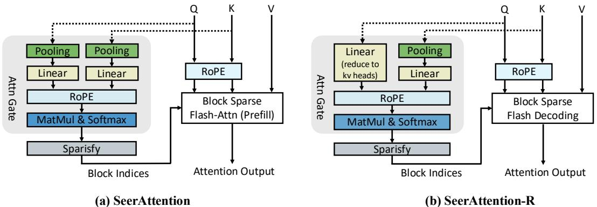
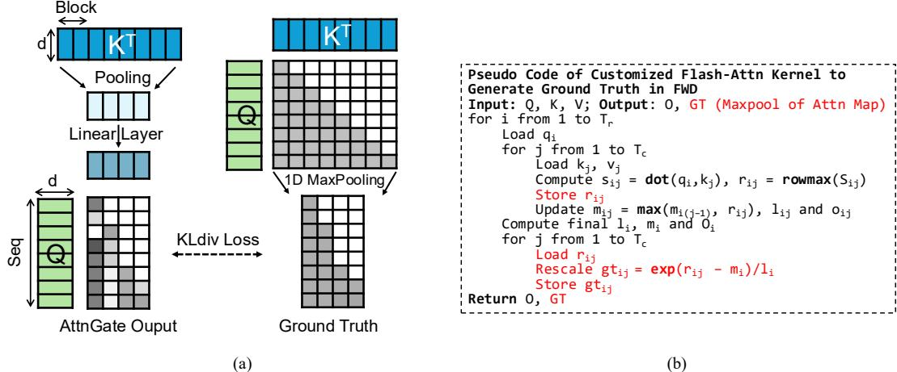
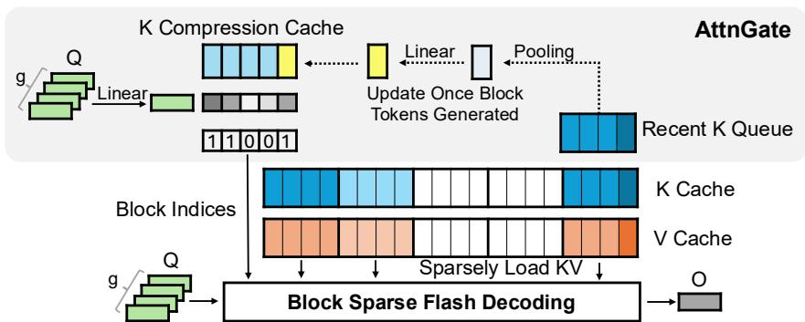
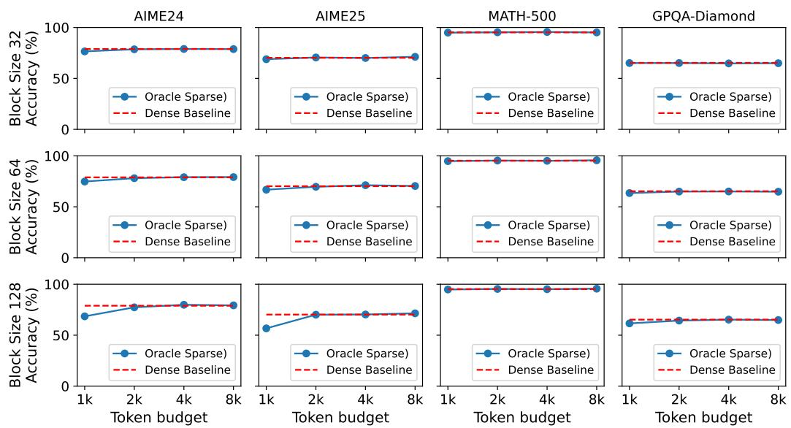
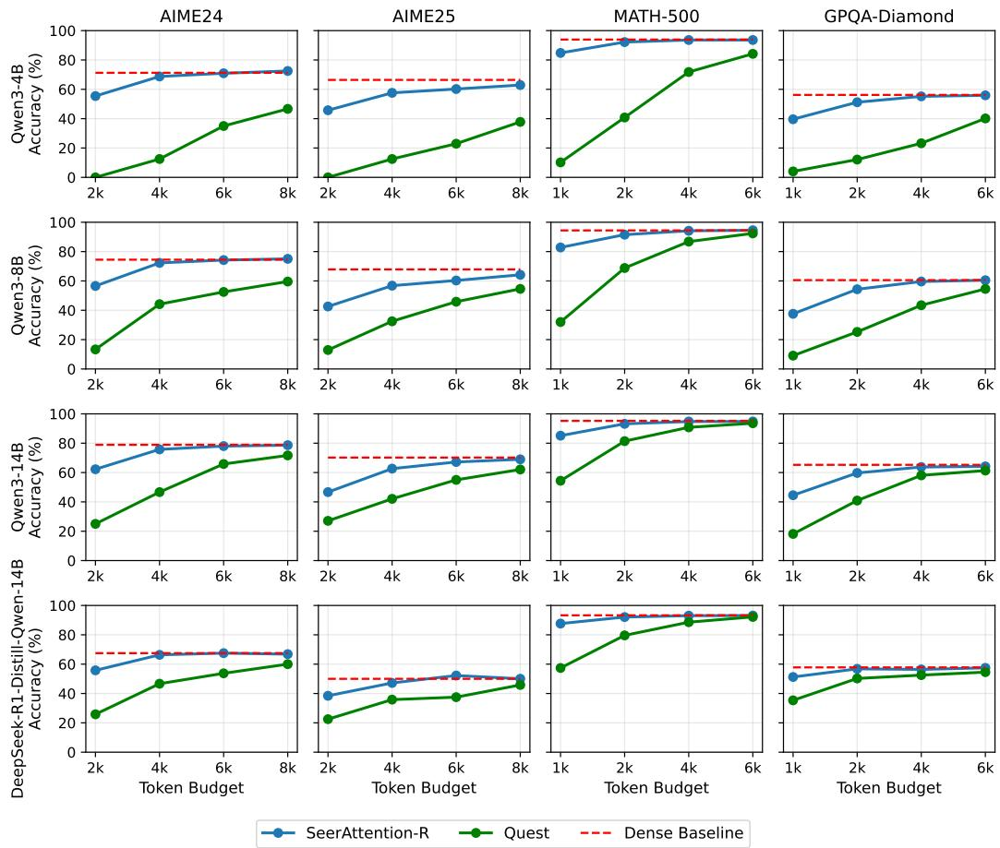
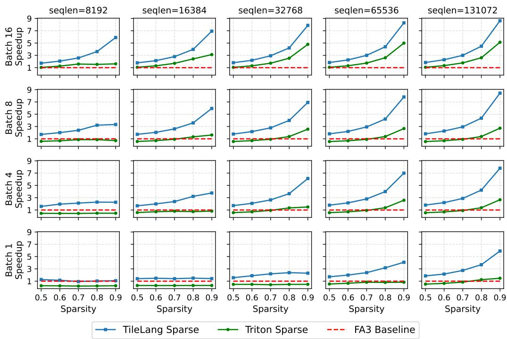
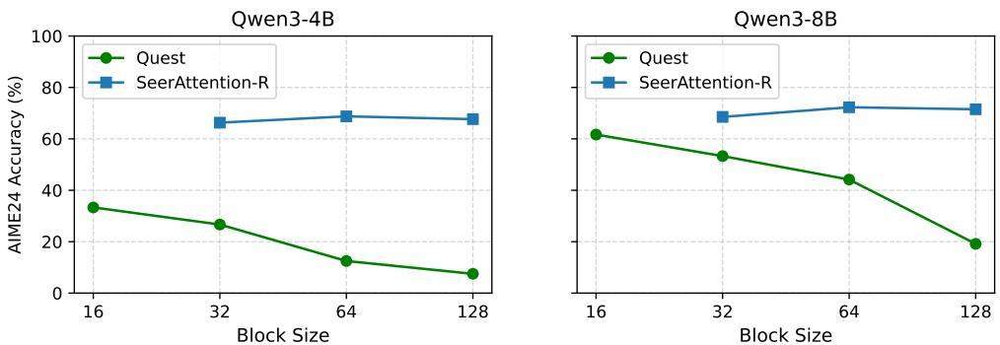
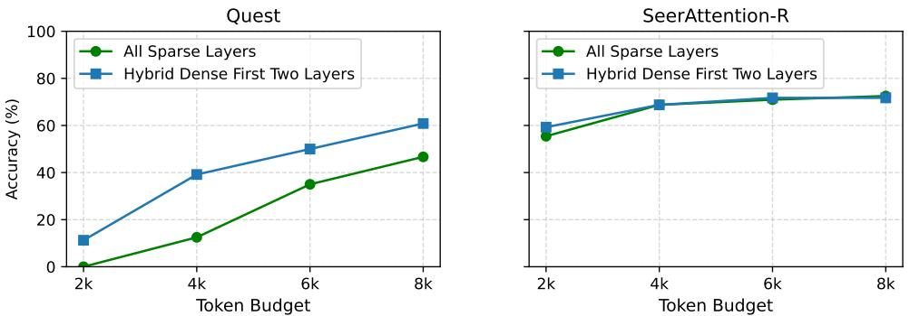
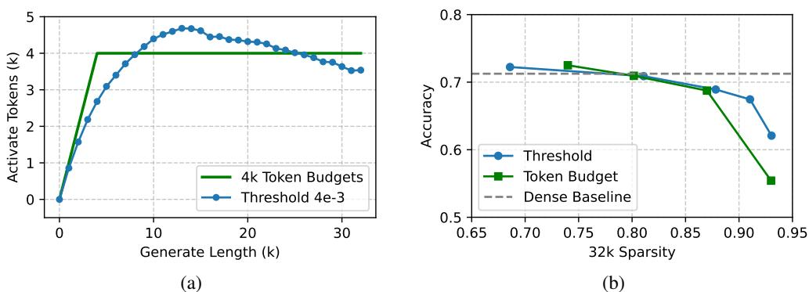

# SeerAttention-R: Sparse Attention Adaptation for Long Reasoning

Yizhao $\mathbf { G a o ^ { * 1 2 } }$ Shuming $\mathbf { G u o ^ { * 1 3 } }$ Shijie $\mathbf { C a o ^ { 1 \circ } }$ Yuqing Xia1   
Lei Wang14 Lingxiao $\mathbf { M } \mathbf { a } ^ { 1 }$ Yutao Sun15 Tianzhu Ye15   
Hayden Kwok-Hay $\mathbf { S _ { 0 } } ^ { 2 }$ Yu Hua3 Ting Cao1 Fan Yang1   
Yu Cheng14   
Li Dong1   
Mao Yang1

1 Microsoft Research 2 The University of Hong Kong 3 Huazhong University of Science and Technology 4 Peking University 5 Tsinghua University

# Abstract

We introduce SeerAttention-R, a sparse attention framework specifically tailored for the long decoding of reasoning models. Extended from SeerAttention, SeerAttention-R retains the design of learning attention sparsity through a selfdistilled gating mechanism, while removing query pooling to accommodate autoregressive decoding. With a lightweight plug-in gating, SeerAttention-R is flexible and can be easily integrated into existing pretrained model without modifying the original parameters. We demonstrate that SeerAttention-R, trained on just 0.4B tokens, maintains near-lossless reasoning accuracy with 4K token budget in AIME benchmark under large sparse attention block sizes (64/128). Using TileLang, we develop a highly optimized sparse decoding kernel that achieves near-theoretical speedups of up to $9 \mathbf { { X } }$ over FlashAttention-3 on H100 GPU at $90 \%$ sparsity. Code is available at: https://github.com/microsoft/SeerAttention.

# 1 Introduction

Recent reasoning-focused models such as OpenAI o1 [28], DeepSeek-R1 [23], and Qwen3 [66] demonstrate that models’ capabilities improve significantly through test-time scaling. By generating longer sequences during inference, these models are able to think and reason more effectively before producing an answer. Empirically, longer generations correlate with stronger reasoning performance. For instance, Qwen3-14B [66] outperforms DeepSeek-R1-Distill-Qwen-14B [23] while producing longer responses on average. Similarly, harder benchmarks such as AIME24 [48] require more tokens per generation than easier ones like MATH-500 [25].

However, deeper reasoning introduces increasing efficiency challenges. Due to the auto-regressive nature of decoding, later tokens must attend to a longer context, increasing compute and memory demands for the KV cache. As a result, the per-token generation cost grows linearly, while the overall generation cost increases quadratically.

Sparse attention offers a promising approach to addressing the long-sequence efficiency challenges. While it has been studied in general language modeling, its application to reasoning models, which require prolonged decoding, remains underexplored. Our experiment using oracle sparsity (Section 4.2) shows that attention in reasoning models is also inherently sparse, activating only a subset of important tokens is sufficient to maintain the model’s reasoning capability. The key challenge lies in effectively identifying and leveraging this intrinsic sparsity.

In this work, we extend SeerAttention [19] to SeerAttention-R, a sparse attention framework aimed to improve the long decoding efficiency of reasoning models. SeerAttention was originally designed to improve prefill efficiency by selectively activating important attention blocks through a lightweight, self-distilled attention gating mechanism at post-training time. SeerAttention-R retains the core design of self-ditilled attention sparsity and introduces modifications to support efficient decoding. Specifically, it removes sequence-level pooling of query to accommodate auto-regressive decoding and adopts a shared sparsity design aligned with Grouped Query Attention (GQA) to enhance hardware efficiency. SeerAttention-R can be integrated into any standard transformer-based pretrained model by adding the learnable gate to the attention layer, without fine-tuning original model parameters.

We apply SeerAttention-R to multiple reasoning-focused open-source models, including Qwen3-4B, 8B, 14B [66] and DeepSeek-R1-Distill-Qwen-14B [23], and evaluate them on several reasoning benchmarks: AIME24, AIME25 [48], MATH-500 [25], and GPQA-Diamond [50]. Since SeerAttention-R only requires training the gating module, the distillation is lightweight with just 0.4B tokens from OpenR1-MATH-220K [17] being sufficient. Across all models and tasks, SeerAttention-R consistently outperforms the Quest [57] baseline and maintains near-lossless accuracy under a 4k token budget. Notably, the accuracy gap further diminishes as model size increases. More importantly, this learnable approach enables more coarse-grained sparse attention (e.g., a block size of 64 or 128), which further reduces the overhead from sparse attention scheme and improve hardware efficiency.

We implement the block sparse flash decoding kernel using both TileLang [1] and Triton [59], and benchmark it on an H100 GPU with FlashAttention-3 (FA3) [51] as the baseline. Across a range of combination of sequence lengths, batch sizes, and sparsity levels, our TileLang-based kernel consistently outperforms both Triton and FA3. The gains are especially pronounced at large sequence lengths and batch sizes. For example, at batch size 16 and sequence length $\ge 3 2 \mathrm { k }$ , our TileLang kernel achieves near-theoretical speedups of up to $8 . 6 \times$ at $90 \%$ sparsity over the FA3 baseline, and delivers a $1 . 7 \times$ speedup compared to the Triton counterpart.

# 2 SeerAttention-R

# 2.1 A Recap of SeerAttention

  
Figure 1: SeerAttention (Sparse Prefill) and SeerAttention-R (Sparse Decode). In SeerAttention-R, no sequence dimension compression/pooling operation is applied in Query (Q). Given that modern architectures predominantly use GQA, a linear layer projects the Q from its original number of heads down to the number of KV heads, enabling shared sparsity selection in a GQA group.

SeerAttention [19] introduces self-distilled Attention Gate (AttnGate) that dynamically activates sparse blocks in attention computation for efficient long-context prefilling. Figure 1a shows the AttnGate architecture of SeerAttention, where $\mathbf { Q }$ , K tensors are both compressed (pooled) in the sequence dimension per block number of tokens. The compressed $\mathbf { Q }$ , K tensors are then passed through two newly added linear layers, which serve as learnable parameters in the AttnGate. With the following positional embedding, matrix-multiplication and softmax operation similar to standard attention, the AttnGate then generates the 2D block-level attention score estimation. Based on the output, we can selectively activate blocks with higher scores while skipping the rest.

In the distillation process, the AttnGate are trained to mimic the 2D block sparse distribution using the ground truth generated by the original pretrained model. This self-distillation training is efficient as the original model weights are frozen. In this way, it brings accurate sparse attention to pretrained full-attention models without costly fine-tuning or pre-training. Powered by customized block-sparse flash attention kernels, SeerAttention achieves supreme accuracy-efficiency tradeoff in downstream long-context benchmarks.

# 2.2 SeerAttention-R: AttnGate for Sparse Decoding

This work introduces SeerAttention-R, an extension of SeerAttention tailored for the long-decoding phase of reasoning models. The foremost difference of AttnGate design in SeerAttention-R is that it does not apply compression/pooling in the sequence dimension of $\mathbf { Q }$ to accommodate the token-by-token auto-regressive decoding process (shown in Figure 1b).

$$
\begin{array} { r l } & { \mathbf { Q } _ { \mathbf { g a t e } } = \mathrm { R o P E } \Big ( \mathbf { W } _ { \mathbf { g a t e } } ^ { \mathbf { q } } ~ \mathrm { r e s h a p e } \big ( \mathbf { Q } _ { \mathbf { n o p e } } , \lfloor \ldots , g \cdot d \rfloor \big ) \Big ) , } \\ & { \mathbf { K } _ { \mathbf { g a t e } } = \mathrm { R o P E } \Big ( \mathbf { W } _ { \mathbf { g a t e } } ^ { \mathbf { k } } ~ \mathrm { c o n c a t } \big [ \mathrm { P } _ { \operatorname* { m a x } } \big ( \mathbf { K } _ { \mathbf { n o p e } } \big ) , \mathrm { P } _ { \operatorname* { m i n } } \big ( \mathbf { K } _ { \mathbf { n o p e } } \big ) , \mathrm { P } _ { \mathrm { a v g } } \big ( \mathbf { K } _ { \mathbf { n o p e } } \big ) \big ] \Big ) , } \\ & { \qquad \mathbf { S } = \mathrm { s o f t m a x } \big ( \mathbf { Q } _ { \mathbf { g a t e } } ~ \mathbf { K } _ { \mathbf { g a t e } } \big ^ { \top } / \sqrt { d _ { g a t e } } \big ) . } \end{array}
$$

where, $\mathrm { P } _ { \mathrm { m a x } }$ , $\mathrm { \bf P } _ { \mathrm { m i n } }$ , and $\mathrm { P _ { a v g } }$ stand for Max, Min and Average Pooling in sequence dimension, and $g$ is the group size of GQA setting. $d$ and $d _ { g a t e }$ are the hidden dimension of the original model and AttnGate for each head, respectively. $\mathbf { S }$ is the output score of each block from AttnGate. The detailed design are discussed as follows.

Aggregation of Query Heads for Shared Sparsity in GQA Group Query Attention (GQA) [3] is widely used in LLMs to reduce KV cache size. In GQA, the query heads are organized into groups, and each group shares a key-value head. Recent sparse attention works SAAP [47] and NSA [71] show that using identical attention sparsity choices for all queries in a group can improve the efficiency while achieving similar or better performance. In SeerAttention-R, we follow this practice and use an linear layer in the $\mathbf { Q }$ branch of AttnGate to reduce each subgroup of queries to one single head. For example, with 32 query heads and 8 key-value heads (group size $g = 4$ ), there will be 8 sets of linear weights in shape $[ d _ { g a t e } , 4 \times d ]$ applying on each group of queries heads, resulting only 8 heads of $\mathbf { Q } _ { \mathbf { g a t e } }$ . Since we keep the number of heads untouched in $\mathbf { K }$ branch of AttnGate, the final output of AttnGate will be key-value heads, achieving a shared decision of sparsity in a group.

Pooling-based Compression of K We follow the practice of SeerAttention that uses pooling operations to compress the sequence dimension of K. The kernel and stride size of pooling are both equal to block size, which can also be understood as non-overlapping chunk-level pooling. To mitigate the potential information loss associated with pooling operations, we employ a composition of Max, Min, and Average pooling operations. The outputs from these pooling operations are concatenated prior to being fed into the subsequent linear layer, similar to SeerAttention. The intuition behind this approach is that Max and Min Pooling can effectively capture outlier values, while Average Pooling helps to keep the overall distribution intact.

Positional Embedding in AttnGate In line with SeerAttention, the decode AttnGate utilizes the pre-rope $\mathbf { Q }$ and $\mathbf { K }$ tensors as inputs and reapplies RoPE [53] within AttnGate. Given that the branch is compressed along the sequence dimension, the position index is assigned to the initial token of each block. In our experiment, we found that the use of positional embedding in AttnGate can consistently achieve better accuracy compared to the design without positional embedding.

# 2.3 Distillation/Training

Previous SeerAttention introduces AttnGate distillation method using the ground truth generate by LLM itself in the prefilling phase. The training process is efficient as only the AttnGate are trained. In SeerAttention-R, we extend this method to the decoding scenario by slightly changing the form of the ground truth. Figure 2 shows the overall diagram of the training process.

  
Figure 2: Training Diagram and Training Kernel of SeerAttention-R. (a) Self-distillation training of AttnGate in SeerAttention-R. It uses 1D maxpooled attention scores from original model as ground truth to train AttnGate. Query head reduction is not plotted in the diagram for simplicity. (2) Pseudo code of attention forward kernel for training that directly generates ground truth and attention output.

Ground Truth To train AttnGate for the auto-regressive decoding process, we need to adapt the ground truth generation method. Instead of performing 2D maxpooling of attention map in the prefill case, we only do column-wise 1D maxpooling shown in Figure 2a. This corresponds to the decoding AttnGate that does not compress in sequence dimension. Moreover, to accommodate the shared sparsity in GQA, the column-pooled attention map is further maxpooled within each query heads subgroup, resulting in a ground truth with key-value heads. Finally, the ground truth is normalized to summation 1. We then use the Kullback-Leibler divergence loss [30] to train AttnGate in the distillation process.

Efficiently Obtaining Ground Truth during Training Explicitly calculating the full attention√ map softmax $( \mathbf { Q K ^ { T } } / \sqrt { \mathbf { d } } )$ and then perform the block-level pooling can cost huge GPU memory due to the quadratic complexity. In SeerAttention-R, we also provide an efficient modification of FlashAttention-2 [14] kernel that directly generates the ground truth along with the attention output. This kernel largely reuses the intermediate results (e.g. block-level rowmax) in Flash-Attention and thus increases the efficiency of the distillation process. The pseudo code is shown in Figure 2b.

# 3 Inference of SeerAttention-R

  
Figure 3: Inference Diagram of SeerAttention-R. During inference, a K Compression Cache is used to cache the compressed key representation in AttnGate to speedup sparse block prediction. This K Compression Cache only updates once per block number of tokens is generated (block ${ = } 4$ in the plots for illustration). As a result, the last block of sequence is always selected to compensate when the compression cache has not been updated yet. $g$ is the group size of GQA.

# 3.1 Sparsify Methods: Token Budget vs Threshold

During training, the AttnGate output S are distilled to mimic the distribution of the block-wise attention maps from the original model in real-valued (floating-point) form. During inference, important key-value blocks can be selectively activated based on the predictions of AttnGate. In SeerAttention-R, we apply two sparsity methods to convert the soft AttnGate outputs into binary block masks (or block indices). The first method is the token budget approach, which is widely adopted in sparse attention methods. Given a fixed token budget, it is first translated into a block budget by dividing the token budget by the block size. The AttnGate outputs are then sorted using a Top-k kernel, where k corresponds to the block budget. While this method introduces an additional Top-k operation, it eliminates the need for a softmax operation in AttnGate. The second method is the threshold approach, which simply selects blocks whose scores exceed a given threshold. The threshold method is more self-adaptive as different heads may automatically infer different sparsity ratios. While these two methods involve different trade-offs between efficiency and accuracy, the token budget approach is better suited for direct comparisons with other methods.

# 3.2 K Compression Cache

Similar to KV cache, in SeerAttention-R, we use a $K$ Compression Cache to store the compressed representation of $\mathbf { K }$ (after pooling plus linear) to speedup AttnGate prediction. Thus, AttnGate does not need to recompute $K$ branch for past seen tokens. The update of K Compression Cache is consist of two phases. First, when the sequence length is not the multiplies of block size $b$ , the new entry of K Compression Cache may not be accurate. During this time, the last block is always activated to eliminate unnecessary accuracy loss. Second, as long as $b$ number of new tokens are generated, the most recent $b$ tokens will pass through the pooling and linear layer and update the K Compression Cache. In this way, the overhead of AttnGate can be minimized.

In practice, SeerAttention-R utilizes a relatively large block size $b$ , such as 64, which significantly reduces the overhead of the K Compression Cache. Specifically when $b = 6 4$ , the additional memory required for the K Compression Cache amounts to only 1/128 $( < 1 \% )$ of the original KV cache size. This minimal overhead makes it highly efficient. Moreover, it introduces the possibility of offloading the larger KV cache to CPU or other storage. During inference, only the activated blocks need to be retrieved and transferred back to GPU memory on demand. Alternatively, sparse attention computations can even be performed on heterogeneous resources, such as the CPU, further optimizing memory usage and enabling efficient handling of long-context decoding tasks.

# 3.3 Block Sparse Flash Decoding Kernel

To accelerate decoding under block-sparse attention, we design a specialized kernel that extends the FlashAttention decoding pattern to support dynamic block sparsity in the key/value memory. Our kernel adopts the grid scheduling strategy of flash decoding for GQA, using a three-dimensional launch space over (batch, heads_kv, num_split). This design supports concurrent computation across multiple query groups and key/value shards, maximizing block-level parallelism.

Our block sparse version of the decoding kernel takes the activated block indices from AttnGate (shape [batch, heads_kv, max_selected_blocks]), which encodes the selected key/value blocks for each group of query heads. During execution, the kernel only traverses the selected indices and thus skips invalid entries, avoiding unnecessary computation and memory access. To improve load/compute balancing across Streaming Multiprocessors (SMs), we partition the key/value blocks along the num_split dimension using max_selected_blocks rather than the total number of blocks. This strategy ensures a more uniform work distribution in the presence of sparsity-induced irregularity.

On H100 GPUs, our kernel leverages the wgmma instructions for better Tensor Core usage by padding the number of query head groups to 64. We implement the kernel using TileLang [1], which automatically applies computation optimizations like tiling [79], warp specialization and pipelining [12], and memory layout optimizations such as tensorization, rasterization and swizzling [61] based on the target architecture. Additionally, we provide a Triton-based implementation with the same scheduling strategy, allowing for comparative evaluation.

# 4 Experiments

# 4.1 Experiments Setup

Benchmarks, Models, and Baselines We evaluate SeerAttention-R on three math reasoning benchmarks: the American Invitational Mathematics Examination: AIME24, AIME25 [48], and MATH-500 [25], as well as GPQA-Diamond [50]. For model evaluation, we select four open-source pre-trained language models with strong reasoning capabilities: Qwen3-4B, 8B, 14B [66], and DeepSeek-R1-Distill-Qwen-14B [23]. All models are based on the standard Transformer architecture with Grouped Query Attention (GQA). We compare SeerAttention-R against standard full attention and Quest [57]. Quest is a training-free sparse attention algorithm applied during decoding, employing a query-aware key-value (KV) cache selection strategy. Specifically, Quest estimates the upper bound of attention scores within each KV block (or “page”) to select the most relevant blocks. By default, Quest uses a block size of 16, and keeps the first two layers fully dense to minimize error. In Section 4.3, we set the block size to 64 for both Quest and SeerAttention-R, and apply sparse attention to all layers to enable a direct comparison. We also conduct ablation studies to analyze the impact of varying block sizes (Section 5.1) and incorporating hybrid dense layers (Section 5.2). Note that SeerAttention-R enables shared sparsity selection within each GQA group, whereas Quest does not. Across all experiments, we set the max output length to 32,768 tokens. While Qwen3 series of models extends this length to 38,912 for AIME24 and AIME25 in their official report, we fix this output length to ensure consistency and fair comparison across all settings. For SeerAttention-R and the full attention baseline, we report average pass $@ 1$ accuracy over 64 samples for AIME24 and AIME25, 8 samples for MATH-500, and 16 samples for GPQA-Diamond.

Training Setup for SeerAttention-R To distill AttnGate, we use the OpenR1-MATH-220k [17] dataset for training. Importantly, only the AttnGate is trained, and the original model weights remain unchanged. Inputs are packed into sequences of up to 32k tokens with our variable-length Flash-Attention training kernel that also generates ground truth (Section 2.3). Training is performed with a global batch size of 16 for 800 steps on AMD $\mathbf { M } \mathbf { I } 3 0 0 \mathbf { x }$ GPUs, utilizing DeepSpeed ZeRO-2 optimization. We use AdamW optimizer and a learning rate of 1e-3 with cosine decay schedule.

  
4.2 Oracle Sparse Accuracy: How Sparse is Attention in Reasoning Models?   
Figure 4: Oracle Sparse Results of Qwen3-14B with block size 32, 64, 128.

In the first experiment, we aim to answer the question: How sparse is attention in reasoning models? To investigate this, we employ oracle block sparse selection, which utilizes the ground truth in SeerAttention-R training to select sparse key-value (KV) blocks. While this approach basically means compute attention twice and does not provide any speedup, it allows us to evaluate the accuracy upper bound achievable by SeerAttention-R under ideal sparse selection.

We evaluate Qwen3-14B with three different sparse block sizes: 32, 64, and 128. The token budgets range from 1k to $^ \mathrm { 8 k }$ . As shown in Figure 4, using oracle sparsity achieves lossless performance on all tasks when the token budgets reach 2k. For the more challenging AIME24 and AIME25 tasks, some accuracy degradation is observed with 1k token budget, particularly with the largest block size (128). However, this degradation is negligible when using block sizes of 32 or 64. These results indicate that attention sparsity exists in the reasoning process. Based on this, we select a block size of 64 as the default for SeerAttention-R.

# 4.3 Results of SeerAttention-R and Quest

  
Figure 5: Accuracy Results of Full Attention, SeerAttention-R, and Quest. The Quest sparse configuration is set to be the same as SeerAttention-R for fair comparison, which uses a block size of 64 and sparse attention in all layers.

Figure 5 shows the results of all the models and benchmarks of Full Attention baseline, SeerAttentionR and Quest. As mentioned above, we modify the configuration of Quest to be the same as SeerAttention-R (block size 64 and using sparse attention in all layers). We use token budgets from 2k, 4k, 6k, and 8k for AIME24 and AIME25, and 1k, 2k, 4k, and 6k for MATH-500 and GPQADiamond. This is mainly because the typical averaged reasoning length from different benchmark is not the same. For the more challenging AIME24 and AIME25, the averaged generated lengths of these models are around 11k-18k. While for the easier MATH-500 and GPQA, the averaged lengths are reduced to $4 \mathrm { k } { - } 9 \mathrm { k }$ . However, it is critical to note that across all combinations, the maximum generation lengths all reached the $3 2 \mathrm { k }$ token cap, underscoring the consistent demand for efficient long-context processing.

The results show that SeerAttention-R achieves consistently better performance compared to Quest. This trend holds true across every benchmark and computational budget, underscoring the robustness and effectiveness of SeerAttention-R. For the AIME24 benchmark, SeerAttention-R typically achieves lossless performance with 4k token budget on while the previous oracle sparse only requires 2k. This is within expectation as SeerAttention-R is only an approximation of ground truth with much less computation required. However, Quest fails achieve lossless accuracy even using $^ \mathrm { 8 k }$ token budgets under identical setting. For MATH-500 and GPQA-Diamond, the lossless token budgets reduce to $2 \mathrm { k }$ for SeerAttention-R while Quest requires around 8k to approach the full attention baseline.

A key trend observed across the results is the relationship between model scale and tolerance for sparse attention. Larger models, such as the 14B variants, exhibit greater robustness to the information loss inherent in sparsity compared to their 4B and 8B counterparts. This phenomenon is particularly pronounced for Quest, where the accuracy gap at lower budgets shrinks significantly as the model size increases. For SeerAttention-R, the effect is also present. The 14B models close the final gap to the dense baseline more easily than smaller models on challenging benchmarks like AIME25. This indicates that as reasoning models continue to scale, the viability of sparse attention methods increases.

In conclusion, the results demonstrate the superiority of SeerAttention-R’s self-distilled approach over the training-free heuristics of Quest, especially in the challenging large block size configuration. Previous work Lserve [67] also mentions the accuracy degradation of Quest over larger block sizes. They resolve this challenge by introducing Hierarchical Paging, a system approach that uses an additional level of block(page) abstraction called virtual logical page, which decouples the sparsity selection page size and physical page size. With SeerAttention-R, we can possibly simplify the sparse attention system design by using a larger block size.

# 4.4 Kernel Speedup

  
Figure 6: Kernel Speedup of our Block Sparse Flash-Decoding Kernel on H100 GPU. Our TileLang implementation of the kernel achieves higher speedup ratio compared to Triton implementation. For longer sequence length or larger batch size cases, the speedups approach the theoretical upper bound compared to FA3 basline.

This section evaluates our customized block sparse flash decoding kernel described in Section 3.3. We implement the kernel with both TileLang [1] and Triton and we use FlashAttention-3 (FA3) [51] as baseline. The experiments are run on Nvidia H100 GPU with different input sequence lengths (8k to 128k), batch sizes(1 to 16) and sparsity ratios (0.5 to 0.9). In terms of GQA setting, we use a setting of 64 attention heads with 8 key-value heads, and head dimension 128.

Figure 6 presents the detailed results. Each subplot corresponds to a specific combination of input sequence length (seqlen) and batch size (bs), with the $\mathbf { X }$ -axis showing different sparsity ratios and the y-axis indicating speedup. The TileLang implementation consistently outperforms the FA3 baseline and achieves greater speedup than the Triton implementation. In general, the sparse kernel delivers higher speedup when the input sequence length is longer or the batch size is larger. This is expected, as the decoding kernel is primarily I/O-bound. When the KV cache size is sufficient to saturate the bandwidth, such as when ${ \mathrm { b s } } { = } 1 6$ and seqlen $\ge 3 2 \mathrm { k }$ , our sparse kernel achieves near-theoretical speedup (up to $9 \times$ at 0.9 sparsity). Even for moderate KV cache sizes, e.g. $\scriptstyle \mathbf { b } \mathbf { s } = 4$ and seqlen $\mathbf { \varepsilon } = 3 2 \mathbf { k }$ , the kernel demonstrates significant speedup (up to $6 \times$ at 0.9 sparsity).

# 5 Ablation Studies

# 5.1 Block Size for Sparse Attention

  
Figure 7: AIME24 results using different block sizes with $4 \mathrm { k }$ token budget. SeerAttention-R achieves almost consistent performances on different block sizes. However, Quest gets lower accuracy when block size gets larger. Note that in this experiment, SeerAttention-R enables shared sparsity selection within each GQA group, whereas Quest does not.

The token block size for sparse attention is a critical factor that affects overall system performance. If the block size is too small, it incurs significant overhead in sparse block prediction, including increased computational cost and larger metadata requirements such as compression caches and block indices. While a larger block size can also potentially improve the utilization of GPUs.

Figure 7 presents AIME24 results on the Qwen3-4B and Qwen3-8B models across block sizes ranging from 16 to 128. By default, Quest uses a block size of 16. The results indicate that Quest’s performance decreases as the block size increases. However, SeerAttention-R achieves consistent accurate sparse block selection at different block sizes. Remarkably, this robustness lies under the assumption of the additional mask sharing in the GQA group dimension. We excluded a block size of 16 from our experiments due to its inefficiency during both training and inference. It often leads to out-of-memory errors because of the large intermediate attention maps generated during training.

# 5.2 Hybrid Dense Attention in the First Two Layers

Some post-training sparse attention algorithms employ hybrid dense attention in certain layers to mitigate accuracy loss. By default, Quest applies dense attention in its first two layers. However, for a fair comparison, we evaluate both Quest and SeerAttention-R using purely sparse attention across all layers in previous evaluation. This approach allows us to isolate and analyze the effects of sparse attention without the confounding influence of hybrid attention.

To further investigate the impact of hybrid dense attention, we conduct an ablation study using the Qwen3-4B model on the AIME24 benchmark with a block size of 64. As shown in Figure 8, incorporating hybrid dense attention in Quest yields a significant improvement in accuracy, whereas SeerAttention-R only sees marginal benefits. This difference may be due to the already accurate sparse prediction by SeerAttention-R in the first two layers, reducing the potential gains from hybridization.

  
Figure 8: AIME24 results of whether using dense attention in first two layers (Qwen3-4B).

# 5.3 Threshold VS Token Budgets

  
Figure 9: Threshold vs. Token Budget. Results are obtained using Qwen3-4B models on AIME24 benchmark. (a) Difference of activated tokens distribution of two methods. (b) Sparsity vs Accuracy tradeoff of two methods. Thresholds: 2e-3, 3e-3, 4e-3, 5e-3, 6e-3. Token Budget: 8k, 6k, 4k, 2k.

In SeerAttention-R, we employ two AttnGate sparsification strategies, threshold and token budget, to convert real-valued gate scores into discrete block selections. The token budget method offers an straightforward way to align sparsity and compare with different methods. However, the threshold method is extremely simple to implement and avoids the need of sorting. Figure 9a illustrates the distribution of activated tokens across varying sequence lengths using a threshold of 4e-3 and a token budget of 4K on the AIME24 benchmark with Qwen3-4B model. The token budget approach results in a strict piecewise linear activation pattern, whereas the threshold method yields a smoother, curved distribution. Figure 9b compares the sparsity–accuracy trade-offs of the two methods. The threshold method shows slightly better accuracy in high sparsity region.

# 5.4 Impact of Sparse Attention on Generate Length

We observed that using inaccurate sparse attention (too small budget or low recall) can increase output token lengths in reasoning tasks. Table 1 shows the AIME accuracy and reasoning length using Qwen3-8B model. The baseline accuracy of full attention and the generated length are 74.5 and $1 5 . 1 \mathrm { ~ k ~ }$ , respectively. We can see that Quest, and SeerAttention-R with $2 \mathrm { k }$ budget cases, all incur much longer reasoning paths compared to full attention. A similar phenomenon has been reported in quantization [43], where inaccurate quantization algorithms lead to longer reasoning paths. We believe this effect is universal across different post-training efficiency optimizations of reasoning model, as such methods can introduce errors that accumulate over the long reasoning chains.

Table 1: Qwen3-8B AIME24 Accuracy vs. Reasoning Length.   

<table><tr><td colspan="3"></td><td colspan="3">Token Budgets</td></tr><tr><td rowspan="2">Quest</td><td rowspan="2">Accuracy</td><td>2k</td><td>4k</td><td>6k</td><td>8k</td></tr><tr><td>13.3</td><td>44.2</td><td>52.5</td><td>59.6</td></tr><tr><td rowspan="2">SeerAttention-R</td><td>Gen. Length(k) Accuracy</td><td>30.0 56.6</td><td>22.9 72.3</td><td>19.6</td><td>17.2</td></tr><tr><td>Gen. Length(k)</td><td>19.8</td><td>16.3</td><td>74.2 15.3</td><td>75.1 15.1</td></tr></table>

These additional reasoning steps potentially undermine the original goal of improving efficiency. Therefore, an accurate sparse attention selection algorithm is crucial to mitigate this effect. Another promising approach to eliminate the accumulated errors is to use Rectified Sparse Attention [56], which periodically performs dense rectification of the KV cache.

# 5.5 Training Budget

Table 2: Training Budgets   

<table><tr><td>Training Tokens</td><td colspan="3">GPU Hours</td></tr><tr><td rowspan="2">0.4B</td><td>Qwen3-4B</td><td>Qwen3-8B</td><td>Qwen3-14B</td></tr><tr><td>10.9</td><td>12.2</td><td>18.6</td></tr></table>

As a lightweight distillation process where only the AttnGate parameters are trained, SeerAttention-R is also highly efficient in terms of training. In our experiments, we set the global batch size to 16 and trained for just 800 steps, utilizing DeepSpeed Stage 2 optimization on $\mathbf { M } \mathbf { I } 3 0 0 \mathbf { x }$ GPUs. Each data batch is packed to a sequence length of 32k with our custom variable-length FlashAttention forward kernel, as described in Section 2.3. Table 2 summarizes the GPU hours required for training models of various sizes. Notably, distilling an 8B model requires only 12 GPU hours, demonstrating the efficiency of our approach. Increasing the quantity, quality, and diversity of training data may lead to further improvements.

# 6 Limitation and Future Work

# 6.1 End-to-end Speedup

The current focus of this work is on the accuracy of sparse decoding and its kernel-level speedup, while leaving end-to-end system support and optimization for future work. Achieving significant endto-end speedup will require integration with state-of-the-art inference frameworks such as vllm [32], sglang [78] and Lserve [67], along with additional support for sparse kernels with PagedAttention. In addition, SeerAttention-R can possibly be combined with KV cache offloading technique similar to previous works [62, 42, 11, 24] to save GPU memory and only keep the K Compression Cache with AttnGate to dynamically control computation/communication.

# 6.2 Adaptive Sparsity Ratio

Determining the optimal sparsity ratio for attention is a non-trivial challenge. It involves a fundamental trade-off between accuracy and efficiency, and depends on multiple dynamic factors including the input length, task difficulty, and reasoning length. In general, easier tasks often allow for greater sparsity. However, for reasoning models, more difficult tasks tend to require longer reasoning steps, where attention computation only becomes a bottleneck for longer sequences. This apparent contradiction highlights the need for (1) a sufficiently precise sparsity selection algorithm and (2) automatic adaptation of sparsity ratios based on task complexity. One promising solution is to use Top-p (Nucleus sampling) in sparsity selection, which has previously been explored in Twilight [38] and MagicPIG [11]. Specifically, Twilight adopts a binary search algorithm to find the optimal threshold that satisfies Top-p.

# 6.3 Unify Sparse Prefill and Decoding

Supporting efficient sparse attention in both prefill and decoding is crucial for end-to-end acceleration in tasks such as autonomous agents and deep research, which involve repeated cycles of long-context prefill and decoding during multi-step reasoning. However, jointly enabling sparse prefill and decoding, while simultaneously preserving high accuracy and high efficiency, remains an important and active research challenge. Currently, SeerAttention and SeerAttention-R are trained separately, each with its own AttnGate design.

From an efficiency perspective, prefill benefits from high query-level parallelism, while autoregressive decoding lacks such parallelism. Prior work like NSA [71] chooses to discard query-level parallelism and only utilize the group dimension in GQA to enable identical sparse attention scheme in both prefill and decoding. This approach typically requires a larger group size in GQA to achieve better efficiency.

Another promising direction is to integrate techniques such as multi-token prediction [21, 41] or speculative decoding [34] into the sparse attention framework. These methods naturally introduce opportunities for query-level parallelism during decoding. While enhancing parallelism and efficiency, they offer a path toward unifying the gating mechanism across prefill and decoding, potentially eliminating the need for separate gating adapters as in SeerAttention and SeerAttention-R.

# 7 Related Works

# 7.1 Training-free vs. Training-based Sparse Attention

Sparsity in attention mechanisms has been widely observed in modern neural network architectures. To achieve significant computational speedup, it is essential to identify or predict the locations of non-zero (i.e., important) attention outputs prior to performing the actual attention operation. Research on sparse location identification has generally followed two main directions: training-free (pre-defined or heuristic) algorithms and training-based methods. Training-free approaches typically employ static patterns [63, 18, 64] or heuristic-based algorithms for sparse location identification [77, 57, 29, 67, 33, 11, 42, 36, 68, 27, 76, 65, 10]. These methods often rely on human observation or prior knowledge about sparsity, such as fixed patterns or specific head characteristics.

On the other hand, a different line of research focuses on training-based sparse attention methods to minimize the accuracy degradation from sparse attention. Early work in this area involved integrating various sparse attention patterns (e.g., local, global, and block attention) directly into the model architecture to reduce computational complexity [13, 6, 73]. More recently, methods such as NSA [71], MoBA [45], ACP [39], MiniCPM4 [58] have introduced dynamic sparse attention modules that are trained during LLM pre-training. These native sparse pre-trained models are able to perform sparse attention without incurring additional accuracy loss. Yet, SeerAttention offers a post-training, trainable approach in the middle ground. It learns the original sparsity patterns without modifying or fine-tuning the original model weights, thereby providing a flexible and efficient solution.

# 7.2 KV Cache Compression: A Sparse Attention Perspective

Optimizing the key-value (KV) cache is a crucial component for efficient LLM inference, as reducing the KV cache size directly translates to savings in I/O bandwidth and GPU memory consumption. Some of the methods involve permanent eviction of tokens in KV cache [20, 37, 74, 77, 44, 2, 9, 5], where tokens are chosen using given policies for removal. While this approach can significantly reduce memory usage, it poses potential risks of accuracy loss, as it is difficult to predict which tokens will be important for future generations. On the other hand, dynamic selection without permanent eviction [57, 75, 26, 10, 42, 27, 8, 24, 46] allows for tokens to be dynamically selected for attention at each step without irreversibly discarding them.

# 7.3 Other Efficient Attention Algorithms

Apart from sparse attention, efforts have also been devoted to developing efficient attention algorithms. Variations of Multi-head Attention [60], such as Grouped-Query Attention [3], Multi-Query Attention [52], Multi-head Latent Attention [40], as well as recent Grouped-Tied Attention and

Grouped Latent Attention [72], have been proposed to balance KV cache size, arithmetic intensity and model quality. In addition to modifying attention within a layer, approaches like YOCO [55] and CLA [7] explore cross-layer KV cache sharing to reduce KV cache sizes.

Linear attention represents another important research direction [31, 54, 4, 70, 22, 15, 49, 69]. These models facilitate efficient parallel training through chunk-wise parallelization and ensure constant memory usage during inference via recurrent computation. However, current pure linear attention models still struggle in some challenging long-context tasks, like retrieval or reasoning. In practice, hybrid architectures that combine linear attention with standard full attention have shown performance comparable to full attention models [16, 35].

# 8 Conclusion

This paper introduces SeerAttention-R, a lightweight and flexible sparse attention framework that accelerates long decoding in reasoning models. Functioning as a plug-in gating, SeerAttention-R integrates seamlessly into existing pretrained models without modifying the original parameters, requiring only a lightweight training phase for its new gating parameters. SeerAttention-R maintains near-lossless reasoning accuracy in a post-training setting, even with coarse-grained attention block sizes. The highly optimized sparse decoding kernel using TileLang achieves a near-theoretical speedup at high sparsity ratios.

# References

[1] TileLang. URL https://github.com/tile-ai/tilelang.   
[2] Muhammad Adnan, Akhil Arunkumar, Gaurav Jain, Prashant J Nair, Ilya Soloveychik, and Purushotham Kamath. Keyformer: Kv cache reduction through key tokens selection for efficient generative inference. Proceedings of Machine Learning and Systems, 6:114–127, 2024.   
[3] Joshua Ainslie, James Lee-Thorp, Michiel De Jong, Yury Zemlyanskiy, Federico Lebrón, and Sumit Sanghai. Gqa: Training generalized multi-query transformer models from multi-head checkpoints. arXiv preprint arXiv:2305.13245, 2023.   
[4] Maximilian Beck, Korbinian Pöppel, Markus Spanring, Andreas Auer, Oleksandra Prudnikova, Michael Kopp, Günter Klambauer, Johannes Brandstetter, and Sepp Hochreiter. xlstm: Extended long short-term memory. arXiv preprint arXiv:2405.04517, 2024.   
[5] Payman Behnam, Yaosheng Fu, Ritchie Zhao, Po-An Tsai, Zhiding Yu, and Alexey Tumanov. Rocketkv: Accelerating long-context llm inference via two-stage kv cache compression. arXiv preprint arXiv:2502.14051, 2025.   
[6] Iz Beltagy, Matthew E Peters, and Arman Cohan. Longformer: The long-document transformer. arXiv preprint arXiv:2004.05150, 2020.   
[7] William Brandon, Mayank Mishra, Aniruddha Nrusimha, Rameswar Panda, and Jonathan Ragan-Kelley. Reducing transformer key-value cache size with cross-layer attention. In The Thirty-eighth Annual Conference on Neural Information Processing Systems, 2024.   
[8] Zefan Cai, Wen Xiao, Hanshi Sun, Cheng Luo, Yikai Zhang, Ke Wan, Yucheng Li, Yeyang Zhou, Li-Wen Chang, Jiuxiang Gu, Zhen Dong, Anima Anandkumar, Abedelkadir Asi, and Junjie Hu. R-kv: Redundancy-aware kv cache compression for training-free reasoning models acceleration. arXiv preprint arXiv:2505.24133, 2025.   
[9] Guoxuan Chen, Han Shi, Jiawei Li, Yihang Gao, Xiaozhe Ren, Yimeng Chen, Xin Jiang, Zhenguo Li, Weiyang Liu, and Chao Huang. Sepllm: Accelerate large language models by compressing one segment into one separator. arXiv preprint arXiv:2412.12094, 2024.   
[10] Yaoqi Chen, Jinkai Zhang, Baotong Lu, Qianxi Zhang, Chengruidong Zhang, Jingjia Luo, Di Liu, Huiqiang Jiang, Qi Chen, Jing Liu, Bailu Ding, Xiao Yan, Jiawei Jiang, Chen Chen, Mingxing Zhang, Yuqing Yang, Fan Yang, and Mao Yang. Retroinfer: A vector-storage approach for scalable long-context llm inference, 2025. URL https://arxiv.org/abs/2505.02922.

[11] Zhuoming Chen, Ranajoy Sadhukhan, Zihao Ye, Yang Zhou, Jianyu Zhang, Niklas Nolte, Yuandong Tian, Matthijs Douze, Leon Bottou, Zhihao Jia, et al. Magicpig: Lsh sampling for efficient llm generation. arXiv preprint arXiv:2410.16179, 2024.

[12] Yu Cheng, Lei Wang, Yining Shi, Yuqing Xia, Lingxiao Ma, Jilong Xue, Yang Wang, Zhiwen Mo, Feiyang Chen, Fan Yang, Mao Yang, and Zhi Yang. PipeThreader: Software-defined pipelining for efficient dnn execution. In 19th USENIX Symposium on Operating Systems Design and Implementation (OSDI 25), 2025. URL https://www.usenix.org/conference/ osdi25/presentation/cheng.

[13] Rewon Child, Scott Gray, Alec Radford, and Ilya Sutskever. Generating long sequences with sparse transformers. arXiv preprint arXiv:1904.10509, 2019.

[14] Tri Dao. Flashattention-2: Faster attention with better parallelism and work partitioning. 2023. URL https://arxiv.org/abs/2307.08691.

[15] Tri Dao and Albert Gu. Transformers are ssms: Generalized models and efficient algorithms through structured state space duality. arXiv preprint arXiv:2405.21060, 2024.

[16] Xin Dong, Yonggan Fu, Shizhe Diao, Wonmin Byeon, Zijia Chen, Ameya Sunil Mahabaleshwarkar, Shih-Yang Liu, Matthijs Van Keirsbilck, Min-Hung Chen, Yoshi Suhara, et al. Hymba: A hybrid-head architecture for small language models. arXiv preprint arXiv:2411.13676, 2024.

[17] Hugging Face. Open r1: A fully open reproduction of deepseek-r1, January 2025. URL https://github.com/huggingface/open-r1.

[18] Tianyu Fu, Haofeng Huang, Xuefei Ning, Genghan Zhang, Boju Chen, Tianqi Wu, Hongyi Wang, Zixiao Huang, Shiyao Li, Shengen Yan, et al. Moa: Mixture of sparse attention for automatic large language model compression. arXiv preprint arXiv:2406.14909, 2024.

[19] Yizhao Gao, Zhichen Zeng, Dayou Du, Shijie Cao, Peiyuan Zhou, Jiaxing Qi, Junjie Lai, Hayden Kwok-Hay So, Ting Cao, Fan Yang, et al. Seerattention: Learning intrinsic sparse attention in your llms. arXiv preprint arXiv:2410.13276, 2024.

[20] Suyu Ge, Yunan Zhang, Liyuan Liu, Minjia Zhang, Jiawei Han, and Jianfeng Gao. Model tells you what to discard: Adaptive kv cache compression for llms. arXiv preprint arXiv:2310.01801, 2023.

[21] Fabian Gloeckle, Badr Youbi Idrissi, Baptiste Rozière, David Lopez-Paz, and Gabriel Synnaeve. Better & faster large language models via multi-token prediction. arXiv preprint arXiv:2404.19737, 2024.

[22] Albert Gu and Tri Dao. Mamba: Linear-time sequence modeling with selective state spaces. arXiv preprint arXiv:2312.00752, 2023.

[23] Daya Guo, Dejian Yang, Haowei Zhang, Junxiao Song, Ruoyu Zhang, Runxin Xu, Qihao Zhu, Shirong Ma, Peiyi Wang, Xiao Bi, et al. Deepseek-r1: Incentivizing reasoning capability in llms via reinforcement learning. arXiv preprint arXiv:2501.12948, 2025.

[24] Jitai Hao, Yuke Zhu, Tian Wang, Jun Yu, Xin Xin, Bo Zheng, Zhaochun Ren, and Sheng Guo. Omnikv: Dynamic context selection for efficient long-context llms. In The Thirteenth International Conference on Learning Representations, 2025.

[25] Dan Hendrycks, Collin Burns, Steven Basart, Andy Zou, Mantas Mazeika, Dawn Song, and Jacob Steinhardt. Measuring massive multitask language understanding. arXiv preprint arXiv:2009.03300, 2020.

[26] Coleman Hooper, Sehoon Kim, Hiva Mohammadzadeh, Monishwaran Maheswaran, June Paik, Michael W Mahoney, Kurt Keutzer, and Amir Gholami. Squeezed attention: Accelerating long context length llm inference. arXiv preprint arXiv:2411.09688, 2024.

[27] Junhao Hu, Wenrui Huang, Weidong Wang, Zhenwen Li, Tiancheng Hu, Zhixia Liu, Xusheng Chen, Tao Xie, and Yizhou Shan. Efficient long-decoding inference with reasoning-aware attention sparsity. arXiv preprint arXiv:2502.11147, 2025.

[28] Aaron Jaech, Adam Kalai, Adam Lerer, Adam Richardson, Ahmed El-Kishky, Aiden Low, Alec Helyar, Aleksander Madry, Alex Beutel, Alex Carney, et al. Openai o1 system card. arXiv preprint arXiv:2412.16720, 2024.

[29] Huiqiang Jiang, Yucheng Li, Chengruidong Zhang, Qianhui Wu, Xufang Luo, Surin Ahn, Zhenhua Han, Amir H Abdi, Dongsheng Li, Chin-Yew Lin, et al. Minference 1.0: Accelerating pre-filling for long-context llms via dynamic sparse attention. arXiv preprint arXiv:2407.02490, 2024.

[30] James M Joyce. Kullback-leibler divergence. In International encyclopedia of statistical science, pages 720–722. Springer, 2011.

[31] Angelos Katharopoulos, Apoorv Vyas, Nikolaos Pappas, and François Fleuret. Transformers are rnns: Fast autoregressive transformers with linear attention. In International conference on machine learning, pages 5156–5165. PMLR, 2020.

[32] Woosuk Kwon, Zhuohan Li, Siyuan Zhuang, Ying Sheng, Lianmin Zheng, Cody Hao Yu, Joseph E. Gonzalez, Hao Zhang, and Ion Stoica. Efficient memory management for large language model serving with pagedattention. In Proceedings of the ACM SIGOPS 29th Symposium on Operating Systems Principles, 2023.

[33] Xunhao Lai, Jianqiao Lu, Yao Luo, Yiyuan Ma, and Xun Zhou. Flexprefill: A contextaware sparse attention mechanism for efficient long-sequence inference. arXiv preprint arXiv:2502.20766, 2025.

[34] Yaniv Leviathan, Matan Kalman, and Yossi Matias. Fast inference from transformers via speculative decoding. In International Conference on Machine Learning, pages 19274–19286. PMLR, 2023.

[35] Aonian Li, Bangwei Gong, Bo Yang, Boji Shan, Chang Liu, Cheng Zhu, Chunhao Zhang, Congchao Guo, Da Chen, Dong Li, et al. Minimax-01: Scaling foundation models with lightning attention. arXiv preprint arXiv:2501.08313, 2025.

[36] Yucheng Li, Huiqiang Jiang, Qianhui Wu, Xufang Luo, Surin Ahn, Chengruidong Zhang, Amir H Abdi, Dongsheng Li, Jianfeng Gao, Yuqing Yang, et al. Scbench: A kv cache-centric analysis of long-context methods. arXiv preprint arXiv:2412.10319, 2024.

[37] Yuhong Li, Yingbing Huang, Bowen Yang, Bharat Venkitesh, Acyr Locatelli, Hanchen Ye, Tianle Cai, Patrick Lewis, and Deming Chen. Snapkv: Llm knows what you are looking for before generation. Advances in Neural Information Processing Systems, 37:22947–22970, 2024.

[38] Chaofan Lin, Jiaming Tang, Shuo Yang, Hanshuo Wang, Tian Tang, Boyu Tian, Ion Stoica, Song Han, and Mingyu Gao. Twilight: Adaptive attention sparsity with hierarchical top- $p$ pruning. arXiv preprint arXiv:2502.02770, 2025.

[39] Zhixuan Lin, Johan Obando-Ceron, Xu Owen He, and Aaron Courville. Adaptive computation pruning for the forgetting transformer. arXiv preprint arXiv:2504.06949, 2025.

[40] Aixin Liu, Bei Feng, Bin Wang, Bingxuan Wang, Bo Liu, Chenggang Zhao, Chengqi Dengr, Chong Ruan, Damai Dai, Daya Guo, et al. Deepseek-v2: A strong, economical, and efficient mixture-of-experts language model. arXiv preprint arXiv:2405.04434, 2024.

[41] Aixin Liu, Bei Feng, Bing Xue, Bingxuan Wang, Bochao Wu, Chengda Lu, Chenggang Zhao, Chengqi Deng, Chenyu Zhang, Chong Ruan, et al. Deepseek-v3 technical report. arXiv preprint arXiv:2412.19437, 2024.

[42] Di Liu, Meng Chen, Baotong Lu, Huiqiang Jiang, Zhenhua Han, Qianxi Zhang, Qi Chen, Chengruidong Zhang, Bailu Ding, Kai Zhang, et al. Retrievalattention: Accelerating longcontext llm inference via vector retrieval. arXiv preprint arXiv:2409.10516, 2024.

[43] Ruikang Liu, Yuxuan Sun, Manyi Zhang, Haoli Bai, Xianzhi Yu, Tiezheng Yu, Chun Yuan, and Lu Hou. Quantization hurts reasoning? an empirical study on quantized reasoning models. arXiv preprint arXiv:2504.04823, 2025.

[44] Zichang Liu, Aditya Desai, Fangshuo Liao, Weitao Wang, Victor Xie, Zhaozhuo Xu, Anastasios Kyrillidis, and Anshumali Shrivastava. Scissorhands: Exploiting the persistence of importance hypothesis for llm kv cache compression at test time. Advances in Neural Information Processing Systems, 36:52342–52364, 2023.

[45] Enzhe Lu, Zhejun Jiang, Jingyuan Liu, Yulun Du, Tao Jiang, Chao Hong, Shaowei Liu, Weiran He, Enming Yuan, Yuzhi Wang, Zhiqi Huang, Huan Yuan, Suting Xu, Xinran Xu, Guokun Lai, Yanru Chen, Huabin Zheng, Junjie Yan, Jianlin Su, Yuxin Wu, Yutao Zhang, Zhilin Yang, Xinyu Zhou, Mingxing Zhang, and Jiezhong Qiu. Moba: Mixture of block attention for long-context llms. arXiv preprint arXiv:2502.13189, 2025.

[46] Pierre-Emmanuel Mazaré, Gergely Szilvasy, Maria Lomeli, Francisco Massa, Naila Murray, Hervé Jégou, and Matthijs Douze. Inference-time sparse attention with asymmetric indexing. arXiv preprint arXiv:2502.08246, 2025.

[47] Pierre-Emmanuel Mazaré, Gergely Szilvasy, Maria Lomeli, Francisco Massa, Naila Murray, Hervé Jégou, and Matthijs Douze. Inference-time sparse attention with asymmetric indexing. arXiv preprint arXiv:2502.08246, 2025.

[48] Art of Problem Solving. Aime problems and solutions. https://artofproblemsolving. com/wiki/index.php/AIME_Problems_and_Solutions.

[49] Bo Peng, Eric Alcaide, Quentin Anthony, Alon Albalak, Samuel Arcadinho, Stella Biderman, Huanqi Cao, Xin Cheng, Michael Chung, Matteo Grella, et al. Rwkv: Reinventing rnns for the transformer era. arXiv preprint arXiv:2305.13048, 2023.

[50] David Rein, Betty Li Hou, Asa Cooper Stickland, Jackson Petty, Richard Yuanzhe Pang, Julien Dirani, Julian Michael, and Samuel R Bowman. Gpqa: A graduate-level google-proof q&a benchmark. In First Conference on Language Modeling, 2024.

[51] Jay Shah, Ganesh Bikshandi, Ying Zhang, Vijay Thakkar, Pradeep Ramani, and Tri Dao. Flashattention-3: Fast and accurate attention with asynchrony and low-precision. Advances in Neural Information Processing Systems, 37:68658–68685, 2024.

[52] Noam Shazeer. Fast transformer decoding: One write-head is all you need. arXiv preprint arXiv:1911.02150, 2019.

[53] Jianlin Su, Murtadha Ahmed, Yu Lu, Shengfeng Pan, Wen Bo, and Yunfeng Liu. Roformer: Enhanced transformer with rotary position embedding. Neurocomputing, 568:127063, 2024.

[54] Yutao Sun, Li Dong, Shaohan Huang, Shuming Ma, Yuqing Xia, Jilong Xue, Jianyong Wang, and Furu Wei. Retentive network: A successor to transformer for large language models. arXiv preprint arXiv:2307.08621, 2023.

[55] Yutao Sun, Li Dong, Yi Zhu, Shaohan Huang, Wenhui Wang, Shuming Ma, Quanlu Zhang, Jianyong Wang, and Furu Wei. You only cache once: Decoder-decoder architectures for language models. Advances in Neural Information Processing Systems, 37:7339–7361, 2024.

[56] Yutao Sun, Tianzhu Ye, Dong Li, Yuqing Xia, Jian Chen, Yizhao Gao, Shijie Cao, Jianyong Wang, and Furu Wei. Rectified sparse attention. arXiv preprint arXiv:2506.04108, 2025.

[57] Jiaming Tang, Yilong Zhao, Kan Zhu, Guangxuan Xiao, Baris Kasikci, and Song Han. Quest: Query-aware sparsity for efficient long-context llm inference. arXiv preprint arXiv:2406.10774, 2024.

[58] MiniCPM Team. Minicpm4: Ultra-efficient llms on end devices. 2025.

[59] Philippe Tillet, Hsiang-Tsung Kung, and David Cox. Triton: an intermediate language and compiler for tiled neural network computations. In Proceedings of the 3rd ACM SIGPLAN International Workshop on Machine Learning and Programming Languages, pages 10–19, 2019.

[60] Ashish Vaswani, Noam Shazeer, Niki Parmar, Jakob Uszkoreit, Llion Jones, Aidan N Gomez, Łukasz Kaiser, and Illia Polosukhin. Attention is all you need. Advances in neural information processing systems, 30, 2017.

[61] Lei Wang, Lingxiao Ma, Shijie Cao, Quanlu Zhang, Jilong Xue, Yining Shi, Ningxin Zheng, Ziming Miao, Fan Yang, Ting Cao, Yuqing Yang, and Mao Yang. Ladder: Enabling efficient low-precision deep learning computing through hardware-aware tensor transformation. In 18th USENIX Symposium on Operating Systems Design and Implementation (OSDI 24), pages 307–323, Santa Clara, CA, July 2024. USENIX Association. ISBN 978-1-939133-40-3. URL https://www.usenix.org/conference/osdi24/presentation/wang-lei.

[62] Chaojun Xiao, Pengle Zhang, Xu Han, Guangxuan Xiao, Yankai Lin, Zhengyan Zhang, Zhiyuan Liu, and Maosong Sun. Infllm: Training-free long-context extrapolation for llms with an efficient context memory. arXiv preprint arXiv:2402.04617, 2024.

[63] Guangxuan Xiao, Yuandong Tian, Beidi Chen, Song Han, and Mike Lewis. Efficient streaming language models with attention sinks. arXiv preprint arXiv:2309.17453, 2023.

[64] Guangxuan Xiao, Jiaming Tang, Jingwei Zuo, Junxian Guo, Shang Yang, Haotian Tang, Yao Fu, and Song Han. Duoattention: Efficient long-context llm inference with retrieval and streaming heads. arXiv preprint arXiv:2410.10819, 2024.

[65] Ruyi Xu, Guangxuan Xiao, Haofeng Huang, Junxian Guo, and Song Han. Xattention: Block sparse attention with antidiagonal scoring. arXiv preprint arXiv:2503.16428, 2025.

[66] An Yang, Anfeng Li, Baosong Yang, Beichen Zhang, Binyuan Hui, Bo Zheng, Bowen Yu, Chang Gao, Chengen Huang, Chenxu Lv, et al. Qwen3 technical report. arXiv preprint arXiv:2505.09388, 2025.

[67] Shang Yang, Junxian Guo, Haotian Tang, Qinghao Hu, Guangxuan Xiao, Jiaming Tang, Yujun Lin, Zhijian Liu, Yao Lu, and Song Han. Lserve: Efficient long-sequence llm serving with unified sparse attention. arXiv preprint arXiv:2502.14866, 2025.

[68] Shuo Yang, Ying Sheng, Joseph E Gonzalez, Ion Stoica, and Lianmin Zheng. Post-training sparse attention with double sparsity. arXiv preprint arXiv:2408.07092, 2024.

[69] Songlin Yang, Bailin Wang, Yikang Shen, Rameswar Panda, and Yoon Kim. Gated linear attention transformers with hardware-efficient training. arXiv preprint arXiv:2312.06635, 2023.

[70] Songlin Yang, Bailin Wang, Yu Zhang, Yikang Shen, and Yoon Kim. Parallelizing linear transformers with the delta rule over sequence length. arXiv preprint arXiv:2406.06484, 2024.

[71] Jingyang Yuan, Huazuo Gao, Damai Dai, Junyu Luo, Liang Zhao, Zhengyan Zhang, Zhenda Xie, YX Wei, Lean Wang, Zhiping Xiao, et al. Native sparse attention: Hardware-aligned and natively trainable sparse attention. arXiv preprint arXiv:2502.11089, 2025.

[72] Ted Zadouri, Hubert Strauss, and Tri Dao. Hardware-efficient attention for fast decoding. arXiv preprint arXiv:2505.21487, 2025.

[73] Manzil Zaheer, Guru Guruganesh, Kumar Avinava Dubey, Joshua Ainslie, Chris Alberti, Santiago Ontanon, Philip Pham, Anirudh Ravula, Qifan Wang, Li Yang, et al. Big bird: Transformers for longer sequences. Advances in neural information processing systems, 33: 17283–17297, 2020.

[74] Zihao Zeng, Bokai Lin, Tianqi Hou, Hao Zhang, and Zhijie Deng. In-context kv-cache eviction for llms via attention-gate. arXiv preprint arXiv:2410.12876, 2024.

[75] Hailin Zhang, Xiaodong Ji, Yilin Chen, Fangcheng Fu, Xupeng Miao, Xiaonan Nie, Weipeng Chen, and Bin Cui. Pqcache: Product quantization-based kvcache for long context llm inference. arXiv preprint arXiv:2407.12820, 2024.

[76] Jintao Zhang, Chendong Xiang, Haofeng Huang, Jia Wei, Haocheng Xi, Jun Zhu, and Jianfei Chen. Spargeattn: Accurate sparse attention accelerating any model inference. In International Conference on Machine Learning (ICML), 2025.

[77] Zhenyu Zhang, Ying Sheng, Tianyi Zhou, Tianlong Chen, Lianmin Zheng, Ruisi Cai, Zhao Song, Yuandong Tian, Christopher Re, Clark Barrett, Zhangyang Wang, and Beidi Chen. H2o: Heavy-hitter oracle for efficient generative inference of large language models. In Thirty-seventh Conference on Neural Information Processing Systems, 2023. URL https: //openreview.net/forum?id $\equiv$ RkRrPp7GKO.

[78] Lianmin Zheng, Liangsheng Yin, Zhiqiang Xie, Chuyue Livia Sun, Jeff Huang, Cody Hao Yu, Shiyi Cao, Christos Kozyrakis, Ion Stoica, Joseph E Gonzalez, et al. Sglang: Efficient execution of structured language model programs. Advances in Neural Information Processing Systems, 37:62557–62583, 2024.

[79] Hongyu Zhu, Ruofan Wu, Yijia Diao, Shanbin Ke, Haoyu Li, Chen Zhang, Jilong Xue, Lingxiao Ma, Yuqing Xia, Wei Cui, Fan Yang, Mao Yang, Lidong Zhou, Asaf Cidon, and Gennady Pekhimenko. ROLLER: Fast and efficient tensor compilation for deep learning. In 16th USENIX Symposium on Operating Systems Design and Implementation (OSDI 22), pages 233–248, Carlsbad, CA, July 2022. USENIX Association. ISBN 978-1-939133-28-1. URL https://www.usenix.org/conference/osdi22/presentation/zhu.