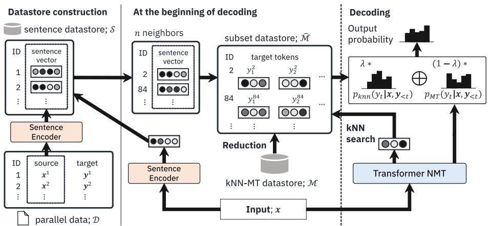
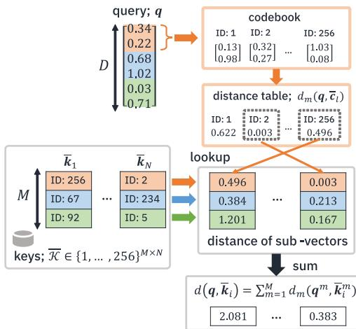
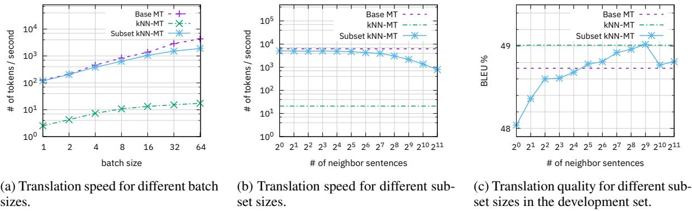

# Subset Retrieval Nearest Neighbor Machine Translation

Hiroyuki Deguchi1,2 Taro Watanabe1 Yusuke Matsui3 Masao Utiyama² Hideki Tanaka² Eiichiro Sumita² 1Nara Institute of Science and Technology 3The University of Tokyo 2National Institute of Information and Communications Technology {deguchi.hiroyuki.db0， taro}@is.naist.jp matsui@hal.t.u-tokyo.ac.jp {mutiyama， hideki.tanaka， eiichiro.sumita}@nict.go.jp

# Abstract

$k$ -nearest-neighbor machine translation (kNNMT) (Khandelwal et al., 2021) boosts the translation performance of trained neural machine translation (NMT) models by incorporating example-search into the decoding algorithm. However, decoding is seriously timeconsuming, i.e., roughly 100 to 1,000 times slower than standard NMT, because neighbor tokens are retrieved from all target tokens of parallel data in each timestep. In this paper, we propose "Subset $k \mathrm { N N - M T } ^ { \prime }$ , which improves the decoding speed of $k \mathrm { N N - M T }$ by two methods: (1) retrieving neighbor target tokens from a subset that is the set of neighbor sentences of the input sentence, not from all sentences, and (2) efficient distance computation technique that is suitable for subset neighbor search using a look-up table. Our subset kNNMT achieved a speed-up of up to 132.2 times and an improvement in BLEU score of up to 1.6 compared with $k \mathrm { N N - M T }$ in the WMT'19 De-En translation task and the domain adaptation tasks in De-En and En-Ja.

# 1 Introduction

Neural machine translation (NMT) (Sutskever et al., 2014; Bahdanau et al., 2015; Luong et al., 2015; Wu et al., 2016; Vaswani et al., 2017) has achieved state-of-the-art performance and become the focus of many studies. Recently, $k \mathbf { N N } .$ MT (Khandelwal et al., 2021) has been proposed, which addresses the problem of performance degradation in out-of-domain data by incorporating example-search into the decoding algorithm. kNN-MT stores translation examples as a set of key-value pairs called "datastore'" and retrieves $k$ -nearest-neighbor target tokens in decoding. The method improves the translation performance of NMT models without additional training. However, decoding is seriously timeconsuming, i.e., roughly 100 to 1,000 times slower than standard NMT, because neighbor tokens are retrieved from all target tokens of parallel data in each timestep. In particular, in a realistic opendomain setting, kNN-MT may be significantly slower because it needs to retrieve neighbor tokens from a large datastore that covers various domains.

We propose “Subset $k \mathrm { N N - M T ^ { \prime } }$ , which improves the decoding speed of $k \mathrm { N N - M T }$ by two methods: (1) retrieving neighbor target tokens from a subset that is the set of neighbor sentences of the input sentence, not from all sentences, and (2) efficient distance computation technique that is suitable for subset neighbor search using a lookup table. When retrieving neighbor sentences for a given input, we can employ arbitrary sentence representations, e.g., pre-trained neural encoders or TF-IDF vectors, to reduce the $k \mathbf { N N }$ search space. When retrieving target tokens in each decoding step, the search space in subset $k \mathrm { N N - M T }$ varies depending on the input sentence; therefore, the clustering-based search methods used in the original kNN-MT cannot be used. For this purpose, we use asymmetric distance computation (ADC) (Jé- gou et al., 2011) in subset neighbor search.

Our subset $k \mathrm { N N - M T }$ achieved a speed-up of up to 132.2 times and an improvement in BLEU score of up to 1.6 compared with $k \mathrm { N N - M T }$ in the WMT'19 German-to-English general domain translation task and the domain adaptation tasks in German-to-English and English-to-Japanese with open-domain settings.

# 2 kNN-MT

$k \mathrm { N N - M T }$ (Khandelwal et al., 2021) retrieves the $k$ -nearest-neighbor target tokens in each timestep, computes the kNN probability from the distances of retrieved tokens, and interpolates the probability with the model prediction probability. The method consists of two steps: (1) datastore creation, which creates key-value translation memory, and (2) generation, which calculates an output probability according to the nearest neighbors of the cached translation memory.

  
Figure 1: Overview of our subset kNN-MT.

Datastore Construction A typical NMT model is composed of an encoder that encodes a source sentence $\textbf { \em x } ~ = ~ ( x _ { 1 } , x _ { 2 } , \ldots , x _ { | \pmb { x } | } ) ~ \in ~ \mathcal { V } _ { X } ^ { | \pmb { x } | }$ and a decoder that generates target tokens $\begin{array} { r l } { \mathbf { \nabla } \mathbf { \mathbf { \nabla } } \mathbf { \mathbf { \cdot } } \mathbf { \nabla } \mathbf { \nabla } \mathbf { \mathbf { \cdot } } } & { { } = \mathbf { \nabla } } \end{array}$ $( y _ { 1 } , y _ { 2 } , \dotsc , y _ { | \pmb { y } | } ) \in \mathcal { V } _ { Y } ^ { | \pmb { y } | }$ where $| x |$ and $| y |$ are the lengths of sentences $_ { \pmb { x } }$ and $\textbf {  { y } }$ , respectively, and $\nu _ { X }$ and $\mathcal { V } _ { Y }$ are the vocabularies of the source language and target language, respectively. The $t$ -th target token $y _ { t }$ is generated according to its output probability $P ( y _ { t } | \mathbf x , y _ { < t } )$ over the target vocabulary, calculated from the source sentence $_ { \pmb { x } }$ and generated target tokens $\scriptstyle { \pmb { y } } _ { < t }$ . $k \mathrm { N N - M T }$ stores pairs of $D$ 」 dimensional vectors and tokens in a datastore, represented as key-value memory $\mathcal { M } \subseteq \mathbb { R } ^ { D } \times \bar { \mathcal { V } _ { Y } }$ . The key $\mathbf { \Psi } ( \in \mathbb { R } ^ { D } )$ is an intermediate representation of the fi nal decoder layer obtained by teacher forcing a parallel sentence pair $( { \pmb x } , { \pmb y } )$ to the NMT model, and the value is a ground-truth target token $y _ { t }$ . The datastore is formally defi ned as follows:

ties, $p _ { k \mathrm { N N } }$ and $p _ { \mathrm { M T } }$ , as follows:

$\mathcal { M } = \{ ( f ( \pmb { x } , \pmb { y } _ { < t } ) , y _ { t } ) \ | \ ( \pmb { x } , \pmb { y } ) \in \mathcal { D } , 1 \leq t \leq | \pmb { y } | \} ,$ (1) heeD is parall ata an $f : \mathcal { V } _ { X } ^ { | x | } \times \mathcal { V } _ { Y } ^ { t - 1 } \to$ $\mathbb { R } ^ { D }$ is a function that returns the $D$ -dimensional intermediate representation of the final decoder layer from the source sentence and generated target tokens. In our model, as in (Khandelwal et al., 2021), the key is the intermediate representation before it is passed to the final feed-forward network.

Generation During decoding, $k \mathrm { N N - M T }$ generates output probabilities by computing the linear interpolation between the $k \mathbf { N N }$ and MT probabili

$$
\begin{array} { r } { P ( y _ { t } | \pmb { x } , \pmb { y } _ { < t } ) = \lambda p _ { k \mathrm { N N } } ( y _ { t } | \pmb { x } , \pmb { y } _ { < t } ) \qquad } \\ { + ( 1 - \lambda ) p _ { \mathrm { M T } } ( y _ { t } | \pmb { x } , \pmb { y } _ { < t } ) , } \end{array}
$$

where $\lambda$ is a hyperparameter for weighting the $k \mathbf { N N }$ probability. Let $f ( { \pmb x } , { \pmb y } _ { < t } )$ be the query vector at timestep $t$ . The top $i$ -th key and value in the $k$ -nearest-neighbor are $\pmb { k } _ { i } \in \mathbb { R } ^ { \bar { D } }$ and $v _ { i } \in \mathcal V _ { Y }$ , respectively. Then $p _ { k \mathrm { N N } }$ is defined as follows:

$$
\begin{array} { l } { p _ { k \mathrm { N N } } ( y _ { t } | \boldsymbol { x } , \boldsymbol { y } _ { < t } ) } \\ { \displaystyle \propto \sum _ { i = 1 } ^ { k } \mathbb { I } _ { y _ { t } = v _ { i } } \exp \bigg ( \frac { - \| \boldsymbol { k } _ { i } - \boldsymbol { f } ( \boldsymbol { x } , \boldsymbol { y } _ { < t } ) \| _ { 2 } ^ { 2 } } { \tau } \bigg ) , } \end{array}
$$

where $\tau$ is the temperature for $p _ { k \mathrm { N N } }$ , and we set $\tau = 1 0 0$ . Note that this $k \mathbf { N N }$ search is seriously time-consuming1 (Khandelwal et al., 2021).

# 3 Proposed Model: Subset kNN-MT

Our Subset kNN-MT (Figure 1) drastically accelerates vanilla $k \mathrm { N N - M T }$ by reducing the $k \mathbf { N N }$ search space by using sentence information (Section 3.1) and efficiently computing the distance between a query and key by performing table lookup (Section 3.2).

# 3.1 Subset Retrieval

Sentence Datastore Construction In our method, we construct a sentence datastore that stores pairs comprising a source sentence vector

  
Figure 2: Distance computation using asymmetric distance computation (ADC).

and a target sentence. Concretely, a sentence datastore $s$ is defi ned as follows:

$$
S = \{ ( h ( { \pmb x } ) , { \pmb y } ) \mid ( { \pmb x } , { \pmb y } ) \in { \mathcal { D } } \} ,
$$

where $h : \mathcal { V } _ { X } ^ { | { \pmb x } | } \  \ \mathbb { R } ^ { D ^ { \prime } }$ represents a sentence encoder, which is a function that returns a $D ^ { \prime }$ 」 dimensional vector representation of a source sentence.

Decoding At the beginning of decoding, the model retrieves the $n$ -nearest-neighbor sentences of the given input sentence from the sentence datastore $\boldsymbol { \mathcal { S } }$ . Let $\hat { \hat { S } } \subset \mathcal { S }$ be the subset comprising $n$ - nearest-neighbor sentences. The nearest neighbor search space for target tokens in $k \mathrm { N N - M T }$ is then drastically reduced by constructing the datastore corresponding to $\hat { S }$ as follows:

$$
\begin{array} { c } { \hat { \mathcal { M } } = \{ ( f ( \boldsymbol { x } , \boldsymbol { y } _ { < t } ) , \boldsymbol { y } _ { t } ) \ | } \\ { ( h ( \boldsymbol { x } ) , \boldsymbol { y } ) \in \hat { \mathcal { S } } , 1 \leq t \leq | \boldsymbol { y } | \} , } \end{array}
$$

where $\hat { \mathcal { M } } \subset \mathcal { M }$ is the reduced datastore for the translation examples coming from the $n$ -nearestneighbor sentences. During decoding, the model uses the same algorithm as $k \mathrm { N N - M T }$ except that $\hat { \mathcal { M } }$ is used as the datastore instead of $\mathcal { M }$ . The proposed method reduces the size of the nearest neighbor search space for the target tokens from $| \mathcal D |$ to $n \left( \ll | \mathcal { D } | \right)$ sentences.

# 3.2 Efficient Distance Computation Using Lookup Table

Subset kNN-MT retrieves the $k$ -nearest-neighbor target tokens by an efficient distance computation method that uses a look-up table. In the original $k \mathrm { N N - M T }$ , inverted file index (IVF) is used for retrieving $k \mathbf { N N }$ tokens. IVF divides the search space into $N _ { \mathrm { l i s t } }$ clusters and retrieves tokens from the neighbor clusters. In contrast, in subset $k \mathbf { N N } .$ . MT, the search space varies dynamically depending on the input sentence. Therefore, clusteringbased search methods cannot be used; instead, it is necessary to calculate the distance for each key in the subset. For this purpose, we use asymmetric distance computation (ADC) (Jégou et al., 2011) instead of the usual distance computation between floating-point vectors. In ADC, the number of table lookup is linearly proportional to the number of keys $N$ in the subset. Therefore, it is not suitable for searching in large datastore $\mathcal { M }$ , but in a small subset $\hat { \mathcal { M } }$ , the search is faster than the direct calculation of the L2 distance.

Product Quantization (PQ) The kNN-MT datastore $\mathcal { M }$ may become too large because it stores high-dimensional intermediate representations of all target tokens of parallel data. For instance, the WMT'19 German-to-English parallel data, which is used in our experiments, contains 862M tokens on the target side. Therefore, if vectors were stored directly, the datastore would occupy $3 . 2 ~ \mathrm { T i B }$ when a 1024-dimensional vector as a key 2, and this would be hard to load into RAM. To solve this memory problem, product quantization (PQ) (Jégou et al., 2011) is used in both $k { \bf N N } -$ MT and our subset $k \mathrm { N N - M T }$ , which includes both source sentence and target token search.

PQ splits a $D$ -dimensional vector into $M$ subvectors and quantizes for each $\textstyle { \frac { D } { M } }$ -dimensional sub-vector. Codebooks are learned by $\mathbf { k }$ -means clustering of key vectors in each subspace. It is computed iteratively by: (1) assigning the code of a key to its nearest neighbor centroid (2) and updating the centroid of keys assigned to the code. The $m$ -th sub-space's codebook ${ \mathcal { C } } ^ { m }$ is formulated as follows:

$$
\boldsymbol { \mathcal { C } } ^ { m } = \{ \boldsymbol { c } _ { 1 } ^ { m } , \ldots , \boldsymbol { c } _ { L } ^ { m } \} , \ \boldsymbol { c } _ { l } ^ { m } \in \mathbb { R } ^ { \frac { D } { M } } .
$$

In this work, each codebook size is set to $L = 2 5 6$ . A vector $\pmb q \in \mathbb { R } ^ { D }$ is quantized and its code vector $\bar { \pmb q }$ is calculated as follows:

$$
\bar { \pmb q } = [ \bar { q } ^ { 1 } , \dots , \bar { q } ^ { M } ] ^ { \top } \in \{ 1 , \dots , L \} ^ { M } ,
$$

$$
\bar { q } ^ { m } = \underset { l } { \operatorname { a r g m i n } } \| \pmb { q } ^ { m } - \pmb { c } _ { l } ^ { m } \| _ { 2 } ^ { 2 } , \ \pmb { q } ^ { m } \in \mathbb { R } ^ { \frac { D } { M } } .
$$

Asymmetric Distance Computation (ADC) Our method efficiently computes the distance between a query vector and quantized key vectors using ADC (Jégou et al., 2011) (Figure 2). ADC computes the distance between a query vector $q ~ \in ~ \mathbb { R } ^ { D }$ and $N$ key codes ${ \bar { \cal K } } ~ = ~ \{ { \bar { k } } _ { i } \} _ { i = 1 } ^ { N } ~ \subseteq$ $\{ 1 , \dots , L \} ^ { M }$ . First, the distance look-up table $A ^ { m } \in \mathbb { R } ^ { L }$ is computed by calculating the distance between a query $\pmb q ^ { m }$ and the codes $\pmb { c } _ { l } ^ { m } \in \mathcal { C } ^ { m }$ in each sub-space $m$ , as follows:

$$
A _ { l } ^ { m } = \| \pmb { q } ^ { m } - \pmb { c } _ { l } ^ { m } \| _ { 2 } ^ { 2 } .
$$

Second, the distance between a query and each key $d ( \pmb q , \bar { \pmb k } _ { i } )$ is obtained by looking up the distance table as follows:

$$
d ( \pmb { q } , \bar { \pmb { k } } _ { i } ) = \sum _ { m = 1 } ^ { M } d _ { m } ( \pmb { q } ^ { m } , \bar { \pmb { k } } _ { i } ^ { m } ) = \sum _ { m = 1 } ^ { M } A _ { \bar { k } _ { i } ^ { m } } ^ { m } .
$$

A look-up table in each subspace, $A ^ { m } \in \mathbb { R } ^ { L }$ , consists of the distance between a query and codes. The number of codes in each subspace is $L$ and a distance is a scalar; therefore, $A ^ { m }$ has $L$ distances. And the table look-up key is the code of a key itself, i.e., if the $m$ -th subspace's code of a key is 5, ADC looks-up $A _ { 5 } ^ { m }$ . By using ADC, the distance is computed only once3 (Equation 9) and does not decode PQ codes into $D$ -dimensional key vectors; therefore, it can compute the distance while keeping the key in the quantization code, and the $k$ -nearest-neighbor tokens are efficiently retrieved from $\hat { \mathcal { M } }$ .

# 3.3 Sentence Encoder

In our subset $k \mathrm { N N - M T }$ , a variety of sentence encoder models can be employed. The more similar sentences extracted from $\mathcal { M }$ , the more likely the subset $\hat { \mathcal { M } }$ comprises the target tokens that are useful for translation. Hence, we need sentence encoders that compute vector representations whose distances are close for similar sentences.

In this work, we employ two types of representations: neural and non-neural. We can employ pre-trained neural sentence encoders. while they require to support the source language, we expect that the retrieved sentences are more similar than other encoders because we can use models that have been trained to minimize the vector distance between similar sentences (Reimers and Gurevych, 2019). An NMT encoder can also be used as a sentence encoder by applying average pooling to its intermediate representations. This does not require any external resources, but it is not trained from the supervision of sentence representations. Alternatively, we can also use nonneural models like TF-IDF. However, it is not clear whether TF-IDF based similarity is suitable for our method. This is because even if sentences with close surface expressions are retrieved, they do not necessarily have similar meanings and may not yield the candidate tokens needed for translation.

# 4 Experiments

# 4.1 Setup

We compared the translation quality and speed of our subset $k \mathrm { N N - M T }$ with those of the conventional $k \mathrm { N N - M T }$ in open-domain settings that assume a domain of an input sentence is unknown. The translation quality was measured by sacreBLEU (Post, 2018) and COMET (Rei et al., 2020). The speed was evaluated on a single NVIDIA V100 GPU. We varied the batch size settings: either 12,000 tokens $\left( \mathrm { B } _ { \infty } \right)$ , to simulate the document translation scenario, or a single sentence $\left( \mathbf { B } _ { 1 } \right)$ ,to simulate the online translation scenario. The beam size was set to 5, and the length penalty was set to 1.0.

$k$ -Nearest-Neighbor Search In $k \mathrm { N N - M T }$ ，we set the number of nearest neighbor tokens to $\begin{array} { r l r } { k } & { { } = } & { 1 6 } \end{array}$ . We used FAIss (Johnson et al., 2019) to retrieve the $k \mathbf { N N }$ tokens in $k \mathrm { N N - M T }$ and for neighbor sentence search in subset $k { \bf N N } -$ MT. The subset search and ADC were implemented in PyToRCH. We use approximate distance computed from quantized keys instead of full-precision keys in Equation 3, following the original $k \mathrm { N N - M T }$ (Khandelwal et al., 2021) implementation. The kNN-MT datastore and our sentence datastore used IVF and optimized PQ (OPQ) (Ge et al., 2014). OPQ rotates vectors to minimize the quantization error of PQ. The subset $k \mathrm { N N - M T }$ datastore is not applied clustering since we need to extract subset tokens. In this datastore, the 1024-dimensional vector representation, i.e., $D \ = \ 1 0 2 4$ , was reduced in dimensionality to 256-dimensions by principal component analysis (PCA), and these vectors were then quantized by PQ. At search time, a query vector is pre-transformed to 256-dimensions by multiplying the PCA matrix, and then the $k \mathbf { N N }$ target tokens are searched by ADC. The subset of a datastore can be loaded into GPU memory since it is significantly smaller than the original $k \mathbf { N N } -$ MT datastore, so we retrieved $k$ -nearest-neighbor tokens from a subset on a GPU.

Sentence Encoder We compared 4 different sentence encoders: LaBSE, AvgEnc, TF-IDF, and BM25. LaBSE (Feng et al., 2022) is a pre-trained sentence encoder, fi ne-tuned from multilingual BERT. AvgEnc is an average pooled encoder hidden vector of the Transformer NMT model, which is also used for translation. TF-IDF (Jones, 1972) and BM25 (Jones et al., 2000) compute vectors weighted the important words in a sentence. We used the raw count of tokens as the term frequency and applied add-one smoothing to calculate the inverse document frequency, where a sentence was regarded as a document. We set $k _ { 1 } = 2 . 0 , b =$ 0.75 in BM25 (Jones et al., 2000). Both TF-IDF and BM25 vectors were normalized by their L2- norm and their dimensionality was reduced to 256- dimensions by singular value decomposition.

# 4.2  In-Domain Translation

We evaluated the translation quality and speed of subset $k \mathrm { N N - M T }$ in the WMT'19 De-En translation task (newstest2019; 2,000 sentences) and compared them with the kNN-MT baselines (Khandelwal et al., 2021; Meng et al., 2022). We used a trained Transformer big implemented in FAIRsEQ (Ott et al., 2019) as the base MT model. We constructed the datastore from the parallel data of the WMT' 19 De-En news translation task with subword lengths of 250 or less and a sentence length ratio of 1.5 or less between the source and target sentences. The datastore contained 862.6M target tokens obtained from 29.5M sentence pairs. The subset size was set to $n = 5 1 2$ .

Table 1 shows our experimental results. In the table, "tok/s" denotes the number of tokens generated per second. The table shows that, although $k \mathrm { N N - M T }$ improves 0.9 BLEU point from the base MT without additional training, the decoding speed is 326.1 times and 51.7 times slower with the $\scriptstyle \mathbf { B } _ { \infty }$ and ${ \bf B } _ { 1 }$ settings, respectively. In contrast, our subset kNN-MT ( $h$ : LaBSE) is 111.8 times (with $\scriptstyle \mathbf { B } _ { \infty }$ ) and 47.4 times (with ${ \bf B } _ { 1 }$ ) faster than $k \mathrm { N N - M T }$ with no degradation in the BLEU score. Subset $k \mathrm { N N - M T }$ (h: AvgEnc) achieved speed-ups of 92.7 times (with $\scriptstyle \mathbf { B } _ { \infty }$ ) and 38.9 times (with ${ \bf B } _ { 1 }$ ) with a slight quality degradation $( - 0 . 2$ BLEU and $- 0 . 0 5$ COMET), despite using no external models. We also evaluated our subset $k { \bf N N } -$ MT when using non-neural sentence encoders ( $\mathit { h }$ TF-IDF, BM25). The results show that both TFIDF and BM25 can generate translations with almost the same BLEU score and speed as neural sentence encoders. In summary, this experiment showed that our subset $k \mathrm { N N - M T }$ is two orders of magnitude faster than $k \mathrm { N N - M T }$ and has the same translation performance.

Table 1: Results of translation quality and decoding speed in the WMT'19 De-En translation task. $^ { \ast } h$ :" shows the type of sentence encoder used.   

<table><tr><td colspan="4"></td><td colspan="2">↑tok/s</td></tr><tr><td>Model</td><td>↑BLEU</td><td>↑COMET</td><td>B∞</td><td></td><td>B1</td></tr><tr><td>Base MT</td><td>39.2</td><td>84.56</td><td>6375.2</td><td></td><td>129.14</td></tr><tr><td>kNN-MT</td><td>40.1</td><td>84.73</td><td>19.6</td><td></td><td>2.5</td></tr><tr><td>Fast kNN-MT</td><td>40.3</td><td>84.70</td><td></td><td>286.9</td><td>27.1</td></tr><tr><td colspan="4">Ours: Subset kNN-MT</td><td></td><td></td></tr><tr><td>h: LaBSE</td><td>40.1</td><td>84.66</td><td>2191.4</td><td></td><td>118.4</td></tr><tr><td>h: AvgEnc</td><td>39.9</td><td>84.68</td><td>1816.8</td><td></td><td>97.3</td></tr><tr><td>h: TF-IDF</td><td>40.0</td><td>84.63</td><td></td><td>2199.1</td><td>113.0</td></tr><tr><td>h: BM25</td><td>40.0</td><td>84.60</td><td></td><td>1903.9</td><td>108.4</td></tr></table>

# 4.3 Domain Adaptation

German-to-English We evaluated subset kNNMT on out-of-domain translation in the IT, Koran, Law, Medical, and Subtitles domains (Koehn and Knowles, 2017; Aharoni and Goldberg, 2020) with open-domain settings. The datastore was constructed from parallel data by merging all target domains and the general domain (WMT'19 De-En) assuming that the domain of the input sentences is unknown. The datastore contained $8 9 5 . 9 \mathrm { M }$ tokens obtained from $3 0 . 8 \mathbf { M }$ sentence pairs. The NMT model is the same as that used in Section 4.2 trained from WMT'19 De-En. The subset size was set to $n = 2 5 6$ , and the batch size was set to 12,000 tokens.

Table 2 shows the results. Compared with base MT, kNN-MT improves the translation performance in all domains but the decoding speed is much slower. In contrast, our subset $k { \bf N N } -$ MT generates translations faster than $k \mathrm { N N - M T }$ However, in the domain adaptation task, there are differences in translation quality between those using neural sentence encoders and those using non-neural sentence encoders. The table shows that the use of non-neural sentence encoders (TFIDF and BM25) causes drop in translation quality, whereas the use of neural sentence encoders (LaBSE and AvgEnc) do not. In addition, compared with $k \mathrm { N N - M T }$ ,our subset $k \mathrm { N N - M T }$ with neural encoders achieves an improvement of up to 1.6 BLEU points on some datasets. In summary, these results show that neural sentence encoders are effective in retrieving domain-specifi c nearest neighbor sentences from a large datastore.

Table 2: Results of out-of-domain translation with open-domain setings. The speed is evaluated with $\scriptstyle \mathbf { B } _ { \infty }$ . Bold scores show the best translation performance in each domain. The COMET scores are listed in the appendix due to space limitations.   

<table><tr><td></td><td colspan="2">IT</td><td colspan="2">Koran</td><td colspan="2">Law</td><td colspan="2">Medical</td><td colspan="2">Subtitles</td></tr><tr><td>Model</td><td>BLEU</td><td>tok/s</td><td>BLEU</td><td>tok/s</td><td>BLEU</td><td>tok/s</td><td>BLEU</td><td>tok/s</td><td>BLEU</td><td>tok/s</td></tr><tr><td>Base MT</td><td>38.7</td><td>4433.2</td><td>17.1</td><td>5295.0</td><td>46.1</td><td>4294.0</td><td>42.1</td><td>4392.1</td><td>29.4</td><td>6310.5</td></tr><tr><td>kNN-MT</td><td>41.0</td><td>22.3</td><td>19.5</td><td>19.3</td><td>52.6</td><td>18.6</td><td>48.2</td><td>19.8</td><td>29.6</td><td>30.3</td></tr><tr><td colspan="9">Subset kNN-MT</td><td></td></tr><tr><td>h: LaBSE</td><td>41.9</td><td>2362.2</td><td>20.1</td><td>2551.3</td><td>53.6</td><td>2258.0</td><td>49.8</td><td>2328.3</td><td>29.9</td><td>3058.4</td></tr><tr><td>h: AvgEnc</td><td>41.9</td><td>2197.8</td><td>19.9</td><td>2318.4</td><td>53.2</td><td>1878.8</td><td>49.2</td><td>2059.9</td><td>30.0</td><td>3113.0</td></tr><tr><td>h: TF-IDF</td><td>40.0</td><td>2289.0</td><td>19.3</td><td>2489.5</td><td>51.4</td><td>2264.3</td><td>47.5</td><td>2326.6</td><td>29.3</td><td>2574.4</td></tr><tr><td>h: BM25</td><td>40.0</td><td>1582.4</td><td>19.1</td><td>2089.5</td><td>50.8</td><td>1946.3</td><td>47.4</td><td>1835.6</td><td>29.4</td><td>1567.7</td></tr></table>

English-to-Japanese We also evaluated our model on English-to-Japanese translation. We used a pre-trained Transformer big model trained from JParaCrawl v3 (Morishita et al., 2022) and evaluated its performance on Asian Scientific Paper Excerpt Corpus (ASPEC) (Nakazawa et al., 2016) and Kyoto Free Translation Task (KFTT; created from Wikipedia's Kyoto articles) (Neubig, 2011). The datastore was constructed from parallel data by merging ASPEC, KFTT, and the general domain (JParaCrawl v3). Note that ASPEC contains 3M sentence pairs, but we used only the first 2M pairs for the datastore to remove noisy data, following Neubig (2014). The datastore contained 735.9M tokens obtained from 24.4M sentence pairs. The subset size was set to $n = 5 1 2$ and the batch size was set to 12,000 tokens.

Table 3 shows the results. These show that kNN-MT improves out-of-domain translation performance compared with base MT on other language pairs other than German-to-English. On English-to-Japanese, subset $k \mathrm { N N - M T }$ improves the decoding speed, but subset $k \mathrm { N N - M T }$ with TFIDF and BM25 degrades the translation quality compared with kNN-MT. However, subset $k \mathbf { N N } .$ . MT still achieves higher BLEU scores than base MT without any additional training steps, and it is two orders of magnitude faster than $k \mathrm { N N - M T }$

In summary, subset $k \mathrm { N N - M T }$ can achieve better translation performance than base MT in exchange for a small slowdown in open-domain settings.

# 5 Discussion

# 5.1 Case Study: Effects of Subset Search

Translation examples in the medical domain are shown in Table 4 and the search results of the top3 nearest neighbor sentences are shown in Table 5. In the table, the subset $k \mathrm { N N - M T }$ results are obtained using a LaBSE encoder. Table 4 shows that subset $k \mathrm { N N - M T }$ correctly generates the medical term “Co-administration'". The results of the nearest neighbor sentence search (Table 5) show that "Co-administration" is included in the subset. In detail, there are 30 cases of "Co-administration'" and no case of "A joint use'" in the whole subset consisting of $k ~ = ~ 2 5 6$ neighbor sentences. Base MT and kNN-MT have the subwords of "Coadministration" in the candidates; however, the subwords of “"A joint use" have higher scores. Table 6 shows the negative log-likelihood (NLL) of the first three tokens and their average for each model. The second token of subset $k \mathbf { N N - M T }$ “- " (hyphen), has a significantly lower NLL than the other tokens. The number of "joint' and "- " in the subset were 0 and 101, respectively, and the $k$ -nearest-neighbor tokens were all "-" in subset $k \mathrm { N N - M T }$ . Therefore, the NLL was low because $p _ { k \mathrm { N N } } ( \stackrel {   } { - } ^ {  } ) ~ = ~ 1 . 0$ , so the joint probability of a beam that generates the sequence "Coadministration'" is higher than $^ { 6 6 } _ { \mathrm { \Delta } }$ joint use".

In summary, the proposed method can retrieve more appropriate words by searching a subset that consists only of neighboring cases.

Table 3: Results of out-of-domain translation in English-to-Japanese. The speed is evaluated with $\scriptstyle \mathbf { B } _ { \infty }$   

<table><tr><td></td><td colspan="3">ASPEC</td><td colspan="3">KFTT</td></tr><tr><td>Model</td><td>BLEU</td><td>COMET</td><td>tok/s</td><td>BLEU</td><td>COMET</td><td>tok/s</td></tr><tr><td>Base MT</td><td>26.7</td><td>88.55</td><td>5541.6</td><td>20.3</td><td>83.52</td><td>3714.4</td></tr><tr><td>kNN-MT</td><td>32.8</td><td>89.13</td><td>23.5</td><td>27.8</td><td>85.32</td><td>28.0</td></tr><tr><td colspan="7">Subset kNN-MT</td></tr><tr><td>h: LaBSE</td><td>32.5</td><td>88.77</td><td>2031.8</td><td>25.8</td><td>84.11</td><td>1436.6</td></tr><tr><td>h: AvgEnc</td><td>32.4</td><td>88.75</td><td>1775.6</td><td>26.4</td><td>84.45</td><td>1471.3</td></tr><tr><td>h: TF-IDF</td><td>29.5</td><td>88.24</td><td>1763.9</td><td>22.3</td><td>82.37</td><td>1559.3</td></tr><tr><td>h: BM25</td><td>29.4</td><td>88.04</td><td>1810.7</td><td>21.8</td><td>82.21</td><td>1533.8</td></tr></table>

Table 4: Translation examples in the medical domain.   

<table><tr><td>Input</td><td>Eine gemeinsame Anwendung von Nifedipin und Rifampicin ist daher kontraindiziert.</td></tr><tr><td>Reference</td><td>Co-administration of nifedipine with ri- fampicin is therefore contra-indicated.</td></tr><tr><td>Base MT</td><td>A joint use of nifedipine and rifampicin is therefore contraindicated.</td></tr><tr><td>kNN-MT</td><td>A joint use of nifedipine and rifampicin is therefore contraindicated.</td></tr><tr><td>Subset</td><td>Co-administration of nifedipine and rifampicin</td></tr><tr><td>kNN-MT</td><td>is therefore contraindicated.</td></tr></table>

Table 5: Top-3 neighbor sentences of our subset $k \mathbf { N N } .$ - MT in Table 4. "S-" and "T-" denote the top- $n$ neighbor source sentences and their translations, respectively.   

<table><tr><td>S-1</td><td>Die gemeinsame Anwendung von Ciprofloxacin und Tizanidin ist kontraindiziert.</td></tr><tr><td>S-2</td><td>Rifampicin und Nilotinib sollten nicht gleichzeitig angewendet werden.</td></tr><tr><td>S-3</td><td>Die gleichzeitige Anwendung von Ribavirin und Di- danosin wird nicht empfohlen.</td></tr><tr><td>T-1</td><td>Co-administration of ciprofloxacin and tizanidine is contra-indicated.</td></tr><tr><td>T-2</td><td>Rifampicin and nilotinib should not be used concomi- tantly.</td></tr><tr><td>T-3</td><td>Co-administration of ribavirin and didanosine is not recommended.</td></tr></table>

# 5.2 Diversity of Subset Sentences

We hypothesize that the noise introduced by sentence encoders causes the difference in accuracy. In this section, we investigate whether a better sentence encoder would reduce the noise injected into the subset. In particular, we investigated the relationship between vocabulary diversity in the subset and translation quality in the medical domain. Because an output sentence is affected by the subset, we measured the unique token ratio of both source and target languages in the subset as the diversity as follows:

Table 6: Negative log-likelihood (NLL) of the first three tokens and their average in the case of Table 4. Note that a smaller NLL means a larger probability.   

<table><tr><td>timestep t</td><td>Base MT</td><td>kNN-MT</td><td>Subset kNN-MT</td></tr><tr><td>1</td><td>A: 0.80</td><td>A:1.26</td><td>Co: 1.49</td></tr><tr><td>2</td><td>joint: 1.18</td><td>joint: 1.12</td><td>- (hyphen): 0.05</td></tr><tr><td>3</td><td>use: 0.83</td><td>use: 0.42</td><td>administration: 0.59</td></tr><tr><td>Avg</td><td>0.94</td><td>0.93</td><td>0.71</td></tr></table>

Table 7: BLEU score and unique token ratio in the subset obtained by each sentence encoder in the medical domain.   

<table><tr><td colspan="2"></td><td colspan="2">unique ratio %</td></tr><tr><td>Model h</td><td>BLEU</td><td>source</td><td>target</td></tr><tr><td>LaBSE</td><td>49.8</td><td>19.6</td><td>18.5</td></tr><tr><td>AvgEnc</td><td>49.2</td><td>20.4</td><td>19.2</td></tr><tr><td>TF-IDF</td><td>47.5</td><td>33.3</td><td>32.3</td></tr><tr><td>BM25</td><td>47.4</td><td>34.2</td><td>32.9</td></tr></table>

Table 7 shows the BLEU score and unique token ratio for the various sentence encoders, in which “"source" and "target" indicate the diversity of the neighbor sentences on the source-side and target-side, respectively. The results show that the more diverse the source-side is, the more diverse the target-side is. It also shows that the less diversity in the vocabulary of both the source and target languages in the subset, the higher BLEU score.

We also investigated the relationship between sentence encoder representation and BLEU scores. We found that using a model more accurately represents sentence similarity improves the BLEU score. In particular, we evaluated translation quality when noise was injected into the subset by retrieving $n$ sentences from outside the nearest neighbor. Table 8 shows the results of various $n$ -selection methods when LaBSE was used as the sentence encoder. In the table, "Top' indicates the $n$ -nearest-neighbor sentences, "Bottom of $2 n '$ the $n$ furthest sentences of $2 n$ neighbor sentences, and "Random of $2 n ^ { \prime \prime } n$ sentences randomly selected from $2 n$ neighbor sentences. The "Bottom of $2 n ^ { \prime }$ and "Random of $2 n '$ have higher diversity than the Top" on both the source- and target-sides, and the BLEU scores are correspondingly lower. These experiments showed that a sentence encoder that calculates similarity appropriately can reduce noise and prevent the degradation of translation performance because the subset consists only of similar sentences.

Table 8: BLEU score and unique token ratio in the subset obtained by different $n$ -selection methods in the medical domain.   

<table><tr><td></td><td></td><td colspan="2">unique ratio %</td></tr><tr><td>n-selection</td><td>BLEU</td><td>source</td><td>target</td></tr><tr><td>Top</td><td>49.8</td><td>19.6</td><td>18.5</td></tr><tr><td>Bottom of 2n</td><td>47.7</td><td>21.7</td><td>20.3</td></tr><tr><td>Random of 2n</td><td>44.9</td><td>22.7</td><td>21.1</td></tr></table>

Table 9: Efficiency of ADC in WMT' 19 De-En.   

<table><tr><td colspan="3">↑tok/s (B∞)</td></tr><tr><td>Model h</td><td>w/ADC</td><td>w/o ADC</td></tr><tr><td>LaBSE</td><td>2191.4</td><td>446.4 (×0.20)</td></tr><tr><td>AvgEnc</td><td>1816.8</td><td>365.1 (×0.20)</td></tr><tr><td>TF-IDF</td><td>2199.1</td><td>531.0 (×0.24)</td></tr><tr><td>BM25</td><td>1903.9</td><td>471.6 (×0.25)</td></tr></table>

# 5.3 Analysis of Decoding Speed

Efficiency of ADC Subset $k \mathrm { N N - M T }$ computes the distance between a query vector and key vectors using ADC as described in Section 3.2. The efficiency of ADC in WMT'19 De-En is demonstrated in Table 9. The results show that "w/ ADC" is roughly 4 to 5 times faster than "w/o ADC".

Effect of Parallelization The method and implementation of our subset kNN-MT are designed for parallel computing. We measured the translation speed for different batch sizes in WMT' 19 De-En. Figure 3(a) shows that subset $k \mathrm { N N - M T }$ (h: LaBSE) is two orders of magnitude faster than kNN-MT even when the batch size is increased.

Subset Size We measured the translation speed for different subset sizes, i.e., the number of $n$ 」 nearest-neighbor sentences in WMT'19 De-En. Figure 3 (b) shows the translation speed of subset $k \mathrm { N N - M T }$ (h: LaBSE). Subset $k \mathrm { N N - M T }$ is two orders of magnitude faster than kNN-MT even when the subset size is increased. The results also show that the speed becomes slower from $n = 2 5 6$ compared with base MT. We also found that $7 1 . 7 \%$ of the time was spent searching for the $k \mathbf { N N }$ tokens from the subset when $n = 2 0 4 8$ . Although ADC lookup search is slow for a large datastore, it is fast for $k \mathbf { N N }$ search when the subset size $n$ is not large (Matsui et al., 2018), e.g., $n = 5 1 2$ .

Figure 3(c) shows the results for translation quality on the development set (newstest2018). The results show that a larger $n$ improves BLEU up to $n = 5 1 2$ , but decreases for greater values of $n$ . In terms of both the translation quality and translation speed, we set $n = 5 1 2$ for WMT'19 De-En.

# 6 Related Work

The first type of example-based machine translation method was analogy-based machine translation (Nagao, 1984). Zhang et al. (2018); Gu et al. (2018) incorporated example-based methods into NMT models, which retrieve examples according to edit distance. Bulte and Tezcan (2019) and $\mathrm { X u }$ et al. (2020) concatenated an input sentence and translations of sentences similar to it. Both $k { \bf N N } -$ MT and subset $k \mathrm { N N - M T }$ retrieve $k \mathbf { N N }$ tokens according to the distance of intermediate representations and interpolate the output probability.

To improve the decoding speed of $k \mathrm { N N - M T }$ fast $k \mathrm { N N - M T }$ (Meng et al., 2022) constructs additional datastores for each source token, and reduces the $k \mathbf { N N }$ search space using their datastores and word alignment. Subset kNN-MT requires a sentence datastore that is smaller than source token datastores and does not require word alignment. Martins et al. (2022) decreased the number of query times by retrieving chunked text; their model led to a speed-up of up to 4 times, compared with $k \mathrm { N N - M T }$ . In contrast, subset kNN-MT reduces the search space. Dai et al. (2023) reduced the $k \mathbf { N N }$ search space by retrieving the neighbor sentences of the input sentence. They searched for neighboring sentences by BM25 scores with ElasticSearch4, so our subset kNN-MT with BM25 can be regarded as an approximation of their method. They also proposed "adaptive lambda", which dynamically computes the weights of the lambda of linear interpolation in Equation 2 from the distance between the query and the nearest neighbor key vectors. However, adaptive lambda requires an exact distance and cannot employ datastore quantization and the ADC lookup. To improve the translation performance of kNN-MT, Zheng et al. (2021) computed the weighted average of $k \mathbf { N N }$ probabilities $p _ { k \mathrm { N N } }$ over multiple values of $k$ . Each weight is predicted by "meta- $k$ network", trained to minimize cross-entropy in the training data. For the other tasks, $k \mathrm { N N - L M }$ (Khandelwal et al., 2020), Efficient $k \mathrm { N N - L M }$ (He et al., 2021), and RETRO (Borgeaud et al., 2022) used $k \mathbf { N N }$ search for language modeling (LM). Our subset search method cannot be applied to LM because the entire input cannot be obtained.

  
Figure 3: Translation speed for different batch sizes, and subset sizes and translation quality for different subse sizes in WMT'19 De-En.

In the fi eld of $k \mathbf { N N }$ search, Matsui et al. (2018) allowed search in dynamically created subsets, whereas conventional search methods assume only full search. Subset $k \mathrm { N N - M T }$ retrieves $k \mathbf { N N }$ tokens from a subset depending on a given input. In our subset kNN-MT, the decoding speed is slow when the subset size $n$ is large. The bottleneck is the lookup in the distance table, and this can be improved by efficient look-up methods that uses SIMD (André et al., 2015; Matsui et al., 2022).

# 7 Conclusion

In this paper, we proposed "Subset kNN-MT", which improves the decoding speed of $k \mathrm { N N - M T }$ by two methods: (1) retrieving neighbor tokens from only the neighbor sentences of the input sentence, not from all sentences, and (2) efficient distance computation technique that is suitable for subset neighbor search using a look-up table. Our subset kNN-MT achieved a speed-up of up to 132.2 times and an improvement in BLEU of up to 1.6 compared with $k \mathrm { N N - M T }$ in the WMT'19 De-En translation task and the domain adaptation tasks in De-En and En-Ja. For future work, we would like to apply our method to other tasks.

# Limitations

This study focuses only on improving the speed of $k \mathrm { N N - M T }$ during decoding; other problems with kNN-MT remain. For example, it still demands large amounts of memory and disk space for the target token datastore. In addition, our subset $k \mathrm { N N - M T }$ requires to construct a sentence datastore; therefore, the memory and disk requirements are increased. For example, the quantized target token datastore has 52GB $( | \mathcal { M } | = 8 6 2 , 6 4 8 , 4 2 2$ and our sentence datastore has 2GB $\begin{array} { r l } { ( | S | } & { { } = } \end{array}$ 29,540,337) in the experiment of WMT'19 De-En (Section 4.2). Although subset $k \mathrm { N N - M T }$ is faster than the original $k \mathrm { N N - M T }$ in inference, datastore construction is still time-consuming. The decoding latency of our subset $k \mathrm { N N - M T }$ is still several times slower than base MT for large batch sizes. The experiments reported in this paper evaluated the inference speed of the proposed method on a single computer and single run only; the amount of speed improvement may differ when different computer architectures are used.

# Ethical Consideration

We construct both $k \mathrm { N N - M T }$ and subset $k \mathrm { N N - M T }$ datastores from open datasets; therefore, if their datasets have toxic text, $k \mathrm { N N - M T }$ and our subset kNN-MT may have the risk of generating toxic contents.

# Acknowledgements

This work was partially supported by JSPS KAKENHI Grant Number JP22J1127 and JP22KJ2286.

# References

Roee Aharoni and Yoav Goldberg. 2020. Unsupervised domain clusters in pretrained language models. In Proceedings of the 58th Annual Meeting of the Association for Computational Linguistics, pages 7747– 7763, Online. Association for Computational Linguistics.

Fabien André, Anne-Marie Kermarrec, and Nicolas Le Scouarnec. 2015. Cache locality is not enough: High-performance nearest neighbor search with product quantization fast scan. Proc. VLDB Endow., 9(4):288–299.

Dzmitry Bahdanau, Kyunghyun Cho, and Yoshua Bengio. 2015. Neural machine translation by jointly learning to align and translate. In 3rd International Conference on Learning Representations, ICLR 2015, San Dieg0, CA, USA, May 7-9, 2015, Conference Track Proceedings.

Sebastian Borgeaud, Arthur Mensch, Jordan Hoffmann, Trevor Cai, Eliza Rutherford, Katie Millican, George Bm Van Den Driessche, Jean-Baptiste Lespiau, Bogdan Damoc, Aidan Clark, Diego De Las Casas, Aurelia Guy, Jacob Menick, Roman Ring, Tom Hennigan, Saffron Huang, Loren Maggiore, Chris Jones, Albin Cassirer, Andy Brock, Michela Paganini, Geoffrey Irving, Oriol Vinyals, Simon Osindero, Karen Simonyan, Jack Rae, Erich Elsen, and Laurent Sifre. 2022. Improving language models by retrieving from trillions of tokens. In Proceedings of the 39th International Conference on Machine Learning, volume 162 of Proceedings of Machine Learning Research, pages 2206–2240. PMLR.

Bram Bulte and Arda Tezcan. 2019. Neural fuzzy repair: Integrating fuzzy matches into neural machine translation. In Proceedings of the 57th Annual Meeting of the Association for Computational Linguistics, pages 1800–1809, Florence, Italy. Association for Computational Linguistics.

Yuhan Dai, Zhirui Zhang, Qiuzhi Liu, Qu Cui, Weihua Li, Yichao Du, and Tong Xu. 2023. Simple and scalable nearest neighbor machine translation. In The Eleventh International Conference on Learning Representations.

Fangxiaoyu Feng, Yinfei Yang, Daniel Cer, Naveen Arivazhagan, and Wei Wang. 2022. Languageagnostic BERT sentence embedding. In Proceedings of the 6Oth Annual Meeting of the Association for Computational Linguistics (Volume 1: Long Papers), pages 878–891, Dublin, Ireland. Association for Computational Linguistics.

Tiezheng Ge, Kaiming He, Qifa Ke, and Jian Sun. 2014. Optimized product quantization. IEEE Transactions on Pattern Analysis and Machine Intelligence, 36(4):744–755.

J Gu, Y Wang, K Cho, and V O K Li. 2018. Search engine guided neural machine translation. AAAI.

Junxian He, Graham Neubig, and Taylor BergKirkpatrick. 2021. Efficient nearest neighbor language models. In Proceedings of the 2021 Conference on Empirical Methods in Natural Language Processing, pages 5703–5714, Online and Punta Cana, Dominican Republic. Association for Computational Linguistics.

Hervé Jégou, Matthijs Douze, and Cordelia Schmid. 2011.  Product quantization for nearest neighbor search. IEEE Transactions on Pattern Analysis and Machine Intelligence, 33(1):117–128.

Jeff Johnson, Matthijs Douze, and Hervé Jégou. 2019. Billion-scale similarity search with GPUs. IEEE Transactions on Big Data, 7(3):535–547.

K Sparck Jones, Steve Walker, and Stephen E. Robertson. 2000. A probabilistic model of information retrieval: development and comparative experiments: Part 2. Information processing & management, 36(6):809–840.

Karen Sparck Jones. 1972. A statistical interpretation of term specificity and its application in retrieval. Journal of documentation.

Urvashi Khandelwal, Angela Fan, Dan Jurafsky, Luke Zettlemoyer, and Mike Lewis. 2021. Nearest neighbor machine translation. In International Conference on Learning Representations (ICLR).

Urvashi Khandelwal, Omer Levy, Dan Jurafsky, Luke Zettlemoyer, and Mike Lewis. 2020. Generalization through memorization: Nearest neighbor language models. In International Conference on Learning Representations.

Philipp Koehn and Rebecca Knowles. 2017. Six challenges for neural machine translation. In Proceedings of the First Workshop on Neural Machine Translation, pages 28–39, Vancouver. Association for Computational Linguistics.

Thang Luong, Hieu Pham, and Christopher D. Manning. 2015. Effective approaches to attention-based neural machine translation. In Proceedings of the 2015 Conference on Empirical Methods in Natural Language Processing, pages 1412–1421, Lisbon, Portugal. Association for Computational Linguistics.

Pedro Henrique Martins, Zita Marinho, and André FT Martins. 2022. Chunk-based nearest neighbor machine translation. In Proceedings of the 2022 Conference on Empirical Methods in Natural Language Processing, pages 4228–4245, Abu Dhabi, United Arab Emirates.

Yusuke Matsui, Ryota Hinami, and Shin'ichi Satoh. 2018. Reconfigurable inverted index. In ACM International Conference on Multimedia (ACMMM), pages 1715–1723.

Yusuke Matsui, Yoshiki Imaizumi, Naoya Miyamoto, and Naoki Yoshifuji. 2022. Arm 4-bit pq: Simdbased acceleration for approximate nearest neighbor search on arm. In ICASSP 2022 - 2022 IEEE International Conference on Acoustics, Speech and Signal Processing (ICASSP), pages 2080–2084.

Yuxian Meng, Xiaoya Li, Xiayu Zheng, Fei Wu, Xiaofei Sun, Tianwei Zhang, and Jiwei Li. 2022. Fast nearest neighbor machine translation. In Findings of the Association for Computational Linguistics: ACL 2022, pages 555–565, Dublin, Ireland. Association for Computational Linguistics.

Makoto Morishita, Katsuki Chousa, Jun Suzuki, and Masaaki Nagata. 2022. JParaCrawl v3.0: A largescale English-Japanese parallel corpus. In Proceedings of the Thirteenth Language Resources and Evaluation Conference, pages 6704–6710, Marseille, France. European Language Resources Association.

Makoto Nagao. 1984. A framework of a mechanical translation between japanese and english by analogy principle. In Proc. of the International NATO Symposium on Artificial and Human Intelligence, pages 173–180.

Toshiaki Nakazawa, Manabu Yaguchi, Kiyotaka Uchimoto, Masao Utiyama, Eiichiro Sumita, Sadao Kurohashi, and Hitoshi Isahara. 2016. ASPEC: Asian scientific paper excerpt corpus. In Proceedings of the Tenth International Conference on Language Resources and Evaluation (LREC'16), pages 2204–2208, Portorož, Slovenia. European Language Resources Association (ELRA).

Graham Neubig. 2011. The Kyoto free translation task. http://www.phontron.com/kftt.

Graham Neubig. 2014. Forest-to-string SMT for Asian language translation: NAIST at WAT 2014. In Proceedings of the 1st Workshop on Asian Translation (WAT2014), pages 20–25, Tokyo, Japan. Workshop on Asian Translation.

Myle Ott, Sergey Edunov, Alexei Baevski, Angela Fan, Sam Gross, Nathan Ng, David Grangier, and Michael Auli. 2019. fairseq: A fast, extensible toolkit for sequence modeling. In Proceedings of the 2019 Conference of the North American Chapter of the Association for Computational Linguistics (Demonstrations), pages 48–53, Minneapolis, Minnesota. Association for Computational Linguistics.

Matt Post. 2018. A call for clarity in reporting BLEU scores. In Proceedings of the Third Conference on Machine Translation: Research Papers, pages 186– 191, Brussels, Belgium. Association for Computational Linguistics.

Ricardo Rei, Craig Stewart, Ana C Farinha, and Alon Lavie. 2020. COMET: A neural framework for MT evaluation. In Proceedings of the 2020 Conference on Empirical Methods in Natural Language Processing (EMNLP), pages 2685–2702, Online. Association for Computational Linguistics.

Nils Reimers and Iryna Gurevych. 2019. SentenceBERT: Sentence embeddings using Siamese BERTnetworks. In Proceedings of the 2019 Conference on Empirical Methods in Natural Language Processing and the 9th International Joint Conference on Natural Language Processing (EMNLP-IJCNLP), pages 3982–3992, Hong Kong, China. Association for Computational Linguistics.

Ilya Sutskever, Oriol Vinyals, and Quoc V. Le. 2014. Sequence to sequence learning with neural networks. In Proceedings of the 27th International Conference on Neural Information Processing Systems - Volume 2, NIPS'14, page 3104–3112, Cambridge, MA, USA. MIT Press.

Ashish Vaswani, Noam Shazeer, Niki Parmar, Jakob Uszkoreit, Llion Jones, Aidan N Gomez, Lukasz Kaiser, and Ilia Polosukhin. 2017. Attention is all you need. In I Guyon, U V Luxburg, S Bengio, H Wallach, R Fergus, S Vishwanathan, and R Garnett, editors, Advances in Neural Information Processing Systems 30, pages 5998–6008. Curran Associates, Inc.

Yonghui Wu, Mike Schuster, Zhifeng Chen, Quoc V. Le, Mohammad Norouzi, Wolfgang Macherey, Maxim Krikun, Yuan Cao, Qin Gao, Klaus Macherey, Jeff Klingner, Apurva Shah, Melvin Johnson, Xiaobing Liu, Lukasz Kaiser, Stephan Gouws, Yoshikiyo Kato, Taku Kudo, Hideto Kazawa, Keith Stevens, George Kurian, Nishant Patil, Wei Wang, Cliff Young, Jason Smith, Jason Riesa, Alex Rudnick, Oriol Vinyals, Greg Corrado, Macduff Hughes, and Jeffrey Dean. 2016. Google's neural machine translation system: Bridging the gap between human and machine translation. CoRR, abs/1609.08144.

Jitao Xu, Josep Crego, and Jean Senellart. 2020. Boosting neural machine translation with similar translations. In Proceedings of the 58th Annual Meeting of the Association for Computational Linguistics, pages 1580–1590, Online. Association for Computational Linguistics.

Jingyi Zhang, Masao Utiyama, Eiichro Sumita, Graham Neubig, and Satoshi Nakamura. 2018. Guiding neural machine translation with retrieved translation pieces. In Proceedings of the 2018 Conference of the North American Chapter of the Association for Computational Linguistics: Human Language Technologies, Volume I (Long Papers), pages 1325–1335, New Orleans, Louisiana. Association for Computational Linguistics.

Xin Zheng, Zhirui Zhang, Junliang Guo, Shujian Huang, Boxing Chen, Weihua Luo, and Jiajun Chen. 2021. Adaptive nearest neighbor machine translation. In Proceedings of the 59th Annual Meeting of the Association for Computational Linguistics and the 1lth International Joint Conference on Natural Language Processing (Volume 2: Short Papers), pages 368–374, Online. Association for Computational Linguistics.

# A Datasets, Tools, Models

Datasets Parallel data of the WMT'19 De-En translation task can be used for research purposes as described in https ://www.statmt .org/ wmtl9/translation-task.html.The five domain adaptation datasets in De-En can be used for research purposes as described in the paper (Aharoni and Goldberg, 2020). ASPEC can be used for research purposes as described in https://jipsti.jst.go.jp/ a spec /. KFTT is licensed by Creative Commons Attribution-Share-Alike License 3.0.

Tools FAIRsEQ and FAIss are MIT-licensed.

Models We used the following pre-trained NMT models implemented in FAIRsEQ.

• De-En: https://dl. fbaipublicfiles.com/fairseq/ models/wmt19.de-en.ffn8192. tar.gz   
• En-Ja: http://www.kecl.ntt. co.jp/icl/lirg/jparacrawl/ release/3.0/pretrained_models/ en-ja/big.tar.gz

The De-En model is included in FAIRsEQ and it is MIT-licensed. The Ja-En model is licensed by Nippon Telegraph and Telephone Corporation (NTT) for research use only as described in http://www.kecl.ntt .co.jp/ icl/lirg/jparacrawl/.

We used the pre-trained LaBSE model licensed by Apache-2.0.

# B Pseudo Code for ADC lookup

Algorithm 1 shows the pseudo code for the ADC lookup described in Section 3.2. The function COMPUTE_DIsTANCEs calculates the squared Euclidean distances between a query vector and each quantized key vector by looking up the distance table.

# C Tuning of the Subset Size in Domain Adaptation

Section 5.3 showed that $n = 2 5 6$ and 512 are in balance between speed and quality. To tune the

# Algorithm 1 ADC lookup

# Require:

query; q ∈ RD quantized keys; $\bar { \mathcal { K } } = \{ \bar { k } _ { i } \} _ { i = 1 } ^ { N } \subseteq \{ 1 , \dots , L \} ^ { M }$ codebook; ${ \mathcal { C } } = \{ { \mathcal { C } } ^ { 1 } , \ldots , { \mathcal { C } } ^ { M } \} _ { }$ where $\mathcal { C } ^ { m } = \{ c _ { l } ^ { m } \} _ { l = 1 } ^ { L } \subseteq \mathbb { R } ^ { \frac { D } { M } }$

# Ensure:

distances; $\mathbf { \boldsymbol { d } } \in \mathbb { R } ^ { N }$   
1: function COMPUTE_DIsTANCES $( \mathbf { \boldsymbol { q } } , \bar { K } , \mathcal { C } )$   
2: for $m = 1 , \ldots , M$ do   
3: for $l = 1 , \ldots , L$ do   
4: $A _ { l } ^ { m } \gets \| \pmb { q } ^ { m } - \pmb { c } _ { l } ^ { m } \| _ { 2 } ^ { 2 }$   
5: end for   
6: end for   
7: for $\begin{array} { l } { i = 1 , \ldots , N { \bf d o } } \\ { d _ { i }  \sum _ { m = 1 } ^ { M } A _ { \overline { { k } } _ { i } ^ { m } } ^ { m } } \end{array}$   
8:   
9: end for   
10: return $\textbf { \em d }$   
11: end function

<table><tr><td>n</td><td>IT</td><td>Koran</td><td>Law</td><td>Medical</td><td>Subtitles</td><td>Avg.</td></tr><tr><td>256</td><td>40.5</td><td>19.7</td><td>53.3</td><td>48.6</td><td>29.5</td><td>38.3</td></tr><tr><td>512</td><td>40.0</td><td>19.7</td><td>53.4</td><td>48.3</td><td>29.9</td><td>38.1</td></tr></table>

Table 10: Results of the German-to-English domain adaptation translation on the development set.

subset size $n$ in the domain adaptation task, we evaluated for $n \ : = \ : 2 5 6$ and 512 on the development set of each domain, and the choice of $n$ was judged by the averaged BLEU. Table 10 and 11 show the results of the domain adaptation translation on each development set. We tuned the subset size by using LaBSE for the sentence encoder. Finally, we chose $n \ = \ 2 5 6$ for the German-toEnglish and $n = 5 1 2$ for the English-to-Japanese domain adaptation tasks.

# D Details of Translation Quality

We evaluated all experiments by BLEU, COMET, and chrF scores.

Table 12, 13, and 14 show the results of the WMT'19 De-En translation task, the domain adaptation task in De-En, and En-Ja, respectively. Note that Table 13 only shows COMET and chrF scores and the BLEU scores are shown in Table 2 due to space limitations.

# E Details of kNN Indexes.

The details of the $k \mathbf { N N }$ indexes are shown in Table 15.

Table 11: Results of the English-to-Japanese domain adaptation translation on the development set.   

<table><tr><td>n</td><td>ASPEC</td><td>KFTT</td><td>Avg.</td></tr><tr><td>256</td><td>31.7</td><td>24.5</td><td>28.1</td></tr><tr><td>512</td><td>32.0</td><td>25.5</td><td>28.8</td></tr></table>

<table><tr><td>Model</td><td>↑BLEU</td><td>↑chrF</td><td>↑COMET</td></tr><tr><td>Base MT</td><td>39.2</td><td>63.7</td><td>84.56</td></tr><tr><td>kNN-MT</td><td>40.1</td><td>64.2</td><td>84.73</td></tr><tr><td>Fast kNN-MT (Meng et al., 2022)</td><td>40.3</td><td>64.6</td><td>84.70</td></tr><tr><td>Ours: Subset kNN-MT</td><td></td><td></td><td></td></tr><tr><td>h: LaBSE</td><td>40.1</td><td>64.1</td><td>84.66</td></tr><tr><td>h: AvgEnc</td><td>39.9</td><td>64.0</td><td>84.68</td></tr><tr><td>h: TF-IDF</td><td>40.0</td><td>64.2</td><td>84.63</td></tr><tr><td>h: BM25</td><td>40.0</td><td>63.9</td><td>84.60</td></tr></table>

Table 12: Details of translation quality in the WMT'19 De-En translation task.' $h$ :" shows the type of sentence encoder used.

# F Domain Adaptation with Closed Domain Settings

We carried out the German-to-English domain adaptation experiments faithful to the original kNN-MT settings. In this experiment, the datastore for each domain was created only from the parallel data of the target domain, assuming a scenario where the domain of the input sentences is known. Note that the general domain data, i.e., the training data of the WMT' 19 De-En translation task, is not included in the datastores.

Table 16 shows the German-to-English domain adaptation translation results in closed-domain settings. The original $k \mathrm { N N - M T }$ is faster than that of open-domain settings because the datastore is smaller; however, our subset $k \mathrm { N N - M T }$ is still 10 times faster than the original kNN-MT.

<table><tr><td></td><td colspan="2">IT</td><td colspan="2">Koran</td><td colspan="2">Law</td><td colspan="2">Medical</td><td colspan="2">Subtitles</td></tr><tr><td>Model</td><td>COMET</td><td>chrF</td><td>COMET</td><td>chrF</td><td>COMET</td><td>chrF</td><td>COMET</td><td>chrF</td><td>COMET</td><td>chrF</td></tr><tr><td>Base MT</td><td>83.09</td><td>58.9</td><td>72.50</td><td>40.0</td><td>85.79</td><td>66.2</td><td>83.31</td><td>61.6</td><td>79.85</td><td>48.6</td></tr><tr><td>kNN-MT</td><td>83.93</td><td>60.6</td><td>73.33</td><td>41.9</td><td>86.83</td><td>70.4</td><td>84.63</td><td>65.4</td><td>79.98</td><td>48.7</td></tr><tr><td colspan="9">Subset kNN-MT</td><td></td></tr><tr><td>h: LaBSE</td><td>84.17</td><td>60.7</td><td>73.43</td><td>42.3</td><td>86.82</td><td>70.9</td><td>84.60</td><td>66.4</td><td>79.82</td><td>48.7</td></tr><tr><td>h: AvgEnc</td><td>84.23</td><td>60.9</td><td>73.40</td><td>42.2</td><td>86.84</td><td>70.7</td><td>84.75</td><td>66.1</td><td>79.83</td><td>48.6</td></tr><tr><td>h: TF-IDF</td><td>81.70</td><td>59.2</td><td>72.65</td><td>41.4</td><td>85.96</td><td>69.2</td><td>83.38</td><td>64.6</td><td>79.50</td><td>48.3</td></tr><tr><td>h: BM25</td><td>81.16</td><td>58.9</td><td>72.60</td><td>41.3</td><td>85.79</td><td>68.6</td><td>83.17</td><td>64.4</td><td>79.35</td><td>48.1</td></tr></table>

Table 13: COMET and chrF scores in the German-to-English domain adaptation. BLEU scores are shown in Table 2.

Table 14: Details of translation quality in the English-to-Japanese domain adaptation.   

<table><tr><td></td><td colspan="3">ASPEC</td><td colspan="3">KFTT</td></tr><tr><td>Model</td><td>BLEU</td><td>COMET</td><td>chrF</td><td>BLEU</td><td>COMET</td><td>chrF</td></tr><tr><td>Base MT</td><td>26.7</td><td>88.55</td><td>37.6</td><td>20.3</td><td>83.52</td><td>28.0</td></tr><tr><td>kNN-MT</td><td>32.8</td><td>89.13</td><td>41.5</td><td>27.8</td><td>85.32</td><td>33.9</td></tr><tr><td colspan="7">Subset kNN-MT</td></tr><tr><td>h: LaBSE</td><td>32.5</td><td>88.77</td><td>40.6</td><td>25.8</td><td>84.11</td><td>32.0</td></tr><tr><td>h: AvgEnc</td><td>32.4</td><td>88.75</td><td>40.5</td><td>26.4</td><td>84.45</td><td>32.1</td></tr><tr><td>h: TF-IDF</td><td>29.5</td><td>88.24</td><td>38.5</td><td>22.3</td><td>82.37</td><td>28.6</td></tr><tr><td>h: BM25</td><td>29.4</td><td>88.04</td><td>38.4</td><td>21.8</td><td>82.21</td><td>28.2</td></tr></table>

Table 15: Details of $k \mathbf { N N }$ indexes. “DS" indicates“Datastore".   

<table><tr><td rowspan="2"></td><td>kNN-MT</td><td colspan="2">Subset kNN-MT</td></tr><tr><td>DS; M</td><td>Sentence DS; S</td><td>DS; M</td></tr><tr><td>Search Method</td><td>IVF</td><td>IVF</td><td>Linear ADC look-up</td></tr><tr><td>Vector Transform</td><td>OPQ (Ge et al., 2014)</td><td>OPQ (Ge et al., 2014)</td><td>PCA:</td></tr><tr><td># of PQ Sub-vectors; M</td><td>64</td><td>64</td><td>1024 → 256 dim 64</td></tr><tr><td># of Centroids; Nist</td><td>131,072</td><td>32,768</td><td></td></tr><tr><td># of Probed Clusters</td><td>64 clusters</td><td>64 clusters</td><td></td></tr><tr><td>Size of Search Target</td><td>∑y∈D |y|</td><td>|D|</td><td>∑(h(x),y)∈ξ |y|</td></tr></table>

<table><tr><td></td><td colspan="2">IT</td><td colspan="2">Koran</td><td colspan="2">Law</td><td colspan="2">Medical</td><td colspan="2">Subtitles</td></tr><tr><td>Model</td><td>BLEU</td><td>tok/s</td><td>BLEU</td><td>tok/s</td><td>BLEU</td><td>tok/s</td><td>BLEU</td><td>tok/s</td><td>BLEU</td><td>tok/s</td></tr><tr><td>Base MT</td><td>38.7</td><td>4433.2</td><td>17.1</td><td>5295.0</td><td>46.1</td><td>4294.0</td><td>42.1</td><td>4392.1</td><td>29.4</td><td>6310.5</td></tr><tr><td>kNN-MT</td><td>43.2</td><td>143.9</td><td>21.6</td><td>146.8</td><td>54.1</td><td>142.2</td><td>49.7</td><td>144.0</td><td>30.9</td><td>142.3</td></tr><tr><td colspan="9">Subset kNN-MT</td><td></td></tr><tr><td>h: LaBSE</td><td>42.8</td><td>2232.7</td><td>21.2</td><td>2737.0</td><td>54.5</td><td>2175.6</td><td>50.2</td><td>2287.3</td><td>30.5</td><td>3554.6</td></tr><tr><td>h: AvgEnc</td><td>42.6</td><td>2423.3</td><td>20.7</td><td>2754.4</td><td>54.1</td><td>2259.5</td><td>50.0</td><td>2348.9</td><td>30.3</td><td>3569.7</td></tr><tr><td>h: TF-IDF</td><td>42.1</td><td>2464.1</td><td>20.7</td><td>3426.9</td><td>54.0</td><td>2137.0</td><td>49.8</td><td>2526.4</td><td>29.8</td><td>3916.0</td></tr><tr><td>h: BM25</td><td>42.7</td><td>2519.9</td><td>20.4</td><td>3370.1</td><td>53.8</td><td>2152.6</td><td>49.8</td><td>2510.5</td><td>29.9</td><td>3723.2</td></tr></table>

Table 16: Results of out-of-domain translation with closed-domain settings. The speed is evaluated with $\scriptstyle \mathbf { B } _ { \infty }$

# A For every submission:

1 A1. Did you describe the limitations of your work? After Conclusion ("Limitations" section)

Í A2. Did you discuss any potential risks of your work? After Limitations ("Ethical Consideration" section)

{ A3. Do the abstract and introduction summarize the paper's main claims? Section 1

I A4. Have you used AI writing assistants when working on this paper? We use tools that only assist with language: deepl, grammarly.

# B  Did you use or create scientific artifacts?

Section 4

B1. Did you cite the creators of artifacts you used? Section 4

1 B2. Did you discuss the license or terms for use and /or distribution of any artifacts? Appendix (Section A: Dataset, Tools, Models)

B3. Did you discussif your use of existing artifact(s) was consistent with their intended use, provided that it was specified? For the artifacts you create, do you specify intended use and whether that is compatible with the original access conditions (in particular, derivatives of data accessed for research purposes should not be used outside of research contexts)? Appendix (Section A: Datasets, Tools, Models)

B4. Did you discuss the steps taken to check whether the data that was collected / used contains any information that names or uniquely identif es individual people or offensive content, and the steps taken to protect / anonymize it? We noted in the Ethical Consideration section that our used data may contain toxic contents.

1 B5. Did you provide documentation of the artifacts, e.g. coverage of domains, languages, and linguistic phenomena, demographic groups represented, etc.? Section 4

B6. Did you report relevant statistics like the number of examples, details of train / test / dev splits, etc. for the data that you used / created? Even for commonly-used benchmark datasets, include the number of examples in train / validation / test splits, as these provide necessary context for a reader to understand experimental results. For example, small differences in accuracy on large test sets may be signifi cant, while on small test sets they may not be.   
Section 4

# C  Did you run computational experiments?

Section 4 and 5

C1. Did you report the number of parameters in the models used, the total computational budget (e.g., GPU hours), and computing infrastructure used? Section 4

C2. Did you discuss the experimental setup, including hyperparameter search and best-found hyperparameter values? Section 4 and 5

C3. Did you report descriptive statistics about your results (e.. eror bars around results, summary statistics from sets of experiments), and is it transparent whether you are reporting the max, mean, etc. or just a single run? We report the experimental results of just a single run and that is noted in Limitations section.

C4. If you used existing packages (e.g., for preprocessing, for normalization, or for evaluation), did you report the implementation, model, and parameter settings used (e.g. NLTK, Spacy, ROUGE, etc.)? Section 4

D  Did you use human annotators (e.g., crowdworkers) or research with human participants? Left blank.

D1. Did you report the full text of instructions given to participants, including e.g., screenshots, disclaimers of any risks to participants or annotators, etc.? No response.

D2. Did you report information about how you recruited (e.g., crowdsourcing platform, students) and paid participants, and discuss if such payment is adequate given the participants' demographic (e.g., country of residence)? No response.

D3. Did you discuss whether and how consent was obtained from people whose data you're using/curating? For example, if you collected data via crowdsourcing, did your instructions to crowdworkers explain how the data would be used? No response.

D4. Was the data collection protocol approved (or determined exempt) by an ethics review board? No response.

D5. Did you report the basic demographic and geographic characteristics of the annotator population that is the source of the data? No response.