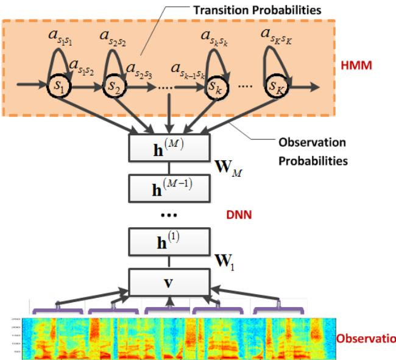
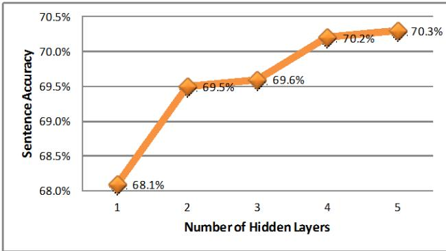

# Context-Dependent Pre-trained Deep Neural Networks for Large Vocabulary Speech Recognition

George E. Dahl, Student Member, IEEE, Dong Yu, Senior Member, IEEE, Li Deng, Fellow, IEEE, and Alex Acero, Fellow, IEEE

Abstract—We propose a novel context-dependent (CD) model for large vocabulary speech recognition (LVSR) that leverages recent advances in using deep belief networks for phone recognition. We describe a pre-trained deep neural network hidden Markov model (DNN-HMM) hybrid architecture that trains the DNN to produce a distribution over senones (tied triphone states) as its output. The deep belief network pre-training algorithm is a robust and often helpful way to initialize deep neural networks generatively that can aid in optimization and reduce generalization error. We illustrate the key components of our model, describe the procedure for applying CD-DNN-HMMs to LVSR, and analyze the effects of various modeling choices on performance. Experiments on a challenging business search dataset demonstrate that CD-DNN-HMMs can significantly outperform the conventional context-dependent Gaussian mixture model (GMM)-HMMs, with an absolute sentence accuracy improvement of $5 . 8 \%$ and $9 . 2 \%$ (or relative error reduction of $1 6 . 0 \%$ and $2 3 . 2 \%$ ) over the CD-GMM-HMMs trained using the minimum phone error rate (MPE) and maximum likelihood (ML) criteria, respectively.

Index Terms—Speech recognition, deep belief network, context-dependent phone, LVSR, DNN-HMM, ANN-HMM

# I. INTRODUCTION

CRFs [21], [22], and segmental CRFs [23]). Despite these advances, the elusive goal of human level accuracy in realworld conditions requires continued, vibrant research.

Recently, a major advance has been made in training densely connected, directed belief nets with many hidden layers. The resulting deep belief nets learn a hierarchy of nonlinear feature detectors that can capture complex statistical patterns in data. The deep belief net training algorithm suggested in [24] first initializes the weights of each layer individually in a purely unsupervised1 way and then fine-tunes the entire network using labeled data. This semi-supervised approach using deep models has proved effective in a number of applications, including coding and classification for speech, audio, text, and image data ( [25]–[29]). These advances triggered interest in developing acoustic models based on pretrained neural networks and other deep learning techniques for ASR. For example, context-independent pre-trained, deep neural network HMM hybrid architectures have recently been proposed for phone recognition [30]–[32] and have achieved very competitive performance. Using pre-training to initialize the weights of a deep neural network has two main potential benefits that have been discussed in the literature. In [33], evidence was presented that is consistent with viewing pretraining as a peculiar sort of data-dependent regularizer whose effect on generalization error does not diminish with more data, even when the dataset is so vast that training cases are never repeated. The regularization effect from using information in the distribution of inputs can allow highly expressive models to be trained on comparably small quantities of labeled data. Additionally, [34], [33], and others have also reported experimental evidence consistent with pre-training aiding the subsequent optimization, typically performed by stochastic gradient descent. Thus, pre-trained neural networks often also achieve lower training error than neural networks that are not pre-trained (although this effect can often be confounded by the use of early stopping). These effects are especially pronounced in deep autoencoders.

E VEN after decades of research and many successfullydeployed commercial products, the performance of aunarios lags behind human level performance (e.g., [2], [3]). There have been some notable recent advances in discriminative training (see an overview in [4]; e.g., maximum mutual information (MMI) estimation [5], minimum classification error (MCE) training [6], [7], and minimum phone error (MPE) training [8], [9]), in large-margin techniques (such as large margin estimation [10], [11], large margin hidden Markov model (HMM) [12], large-margin MCE [13]–[16], and boosted MMI [17]), as well as in novel acoustic models (such as conditional random fields (CRFs) [18]–[20], hidden

Copyright (c) 2010 IEEE. Personal use of this material is permitted. However, permission to use this material for any other purposes must be obtained from the IEEE by sending a request to pubs-permissions@ieee.org.

Manuscript received September 5, 2010. This manuscript greatly extends the work presented at ICASSP 2011 [1]. G. E. Dahl is affiliated with the University of Toronto. He contributed   
to this work while working as an intern at Microsoft Research (email:   
gdahl@cs.toronto.edu). D. Yu is with the Speech Research Group, Microsoft Research, One   
Microsoft Way, Redmond, WA, 98034 USA (corresponding author, phone:   
+1-425-707-9282, fax: +1-425-936-7329, e-mail: dongyu $@$ microsoft.com). L. Deng is with the Speech Research Group, Microsoft Research, One   
Microsoft Way, Redmond, WA, 98034 USA (email: deng@microsoft.com). A. Acero is with the Speech Research Group, Microsoft Research, One   
Microsoft Way, Redmond, WA, 98034 USA (email: alexac@microsoft.com).

Deep belief network pre-training was the first pre-training method to be widely studied, although many other techniques now exist in the literature (e.g. [35]). After [34] showed that deep auto-encoders could be trained effectively using deep belief net pre-training, there was a resurgence of interest in using deeper neural networks for applications. Although less pathological deep architectures than deep autoencoders can in some cases be trained without pre-training, for many problems and model architectures, researchers have reported pre-training to be helpful (even in some cases for large single hidden layer neural networks trained on massive datasets, as in [28]). We view the various unsupervised pre-training techniques as convenient and robust ways to help train neural networks with many hidden layers that are generally helpful, rarely hurtful, and sometimes essential.

In this paper, we propose a novel acoustic model, a hybrid between a pre-trained, deep neural network (DNN) and a context-dependent (CD) hidden Markov model. The pretraining algorithm we use is the deep belief network (DBN) pre-training algorithm of [24], but we will denote our model with the abbreviation DNN-HMM to help distinguish it from a dynamic Bayes net (which we will not abreviate in this article) and to make it clear that we abandon the deep belief network once pre-training is complete and only retain and continue training the recognition weights. CD-DNN-HMMs combine the representational power of deep neural networks and the sequential modeling ability of context-dependent hidden Markov models (HMMs). In this paper, we illustrate the key ingredients of the model, describe the procedure to learn the CD-DNN-HMMs’ parameters, analyze how various important design choices affect the recognition performance, and demonstrate that CD-DNN-HMMs can significantly outperform strong discriminatively-trained context-dependent Gaussian mixture model hidden Markov model (CD-GMM-HMM) baselines on the challenging business search dataset of [36], collected under actual usage conditions. To our best knowledge, this is the first time DNN-HMMs, which are formerly only used for phone recognition, are successfully applied to large vocabulary speech recognition (LVSR) problems.

# A. Previous work using neural network acoustic models

The combination of artificial neural networks (ANNs) and HMMs as an alternative paradigm for ASR started between the end of 1980s and the beginning of the 1990s. A variety of different architectures and training algorithms have been proposed in the literature (see the comprehensive survey in [37]). Among these techniques, the ones most relevant to this work are those that use the ANNs to estimate the HMM stateposterior probabilities [38]–[45], which have been referred to as ANN-HMM hybrid models in the literature. In these ANNHMM hybrid architectures, each output unit of the ANN is trained to estimate the posterior probability of a continuous density HMMs’ state given the acoustic observations. ANNHMM hybrid models were seen as a promising technique for LVSR in the mid-1990s. In addition to their inherently discriminative nature, ANN-HMMs have two additional advantages: the training can be performed using the embedded Viterbi algorithm and the decoding is generally quite efficient.

Most early work (e.g., [39] [38]) on the hybrid approach used context-independent phone states as labels for ANN training and considered small vocabulary tasks. ANN-HMMs were later extended to model context-dependent phones and were applied to mid-vocabulary and some large vocabulary ASR tasks (e.g. in [45], which also employed recurrent neural architectures). However, in earlier work on context dependent ANN-HMM hybrid architectures [46], the posterior probability of the context-dependent phone was modeled as either

$$
p ( s _ { i } , c _ { j } | \mathbf { x } _ { t } ) = p ( s _ { i } | x _ { t } ) p ( c _ { i } | s _ { j } , \mathbf { x } _ { t } )
$$

or

$$
\begin{array} { r } { p ( s _ { i } , c _ { j } | \mathbf { x } _ { t } ) = p ( c _ { i } | x _ { t } ) p ( s _ { i } | c _ { j } , \mathbf { x } _ { t } ) , } \end{array}
$$

where $\mathbf { x } _ { t }$ is the acoustic observation at time $t , \ c _ { j }$ is one of the clustered context classes $C = \{ c _ { 1 } , \cdots , c _ { J } \}$ , $s _ { i }$ is either a context-independent phone or a state in a context-independent phone. ANNs were used to estimate $p ( s _ { i } | \mathbf { x } _ { t } )$ and $p ( c _ { i } | s _ { j } , \mathbf { x } _ { t } )$ (alternatively $p ( c _ { i } | \mathbf { x } _ { t } )$ and $p ( s _ { i } | c _ { j } , \mathbf { x } _ { t } ) )$ . Note that although these types of context-dependent ANN-HMMs outperformed GMM-HMMs for some tasks, the improvements were small.

These earlier hybrid attempts had some important limitations. For example, using only backpropagation to train the ANN makes it challenging (although not impossible) to exploit more than two hidden layers well and the contextdependent model described above does not take advantage of the numerous effective techniques developed for GMMHMMs. Around 1999, the desire to use HMM advances from the speech research community directly without developing replacement techniques and tools contributed to a shift from using neural nets to predict phonetic states to using neural nets to augment features for later use in a conventional GMMHMM recognizer (e.g., [47]). In this work, however, we do not take that approach, but instead we try to improve the earlier hybrid approaches by replacing more traditional neural nets with deeper, pre-trained neural nets and by using the senones [48] (tied triphone states) of a GMM-HMM tri-phone model as the output units of the neural network, in line with stateof-the-art HMM systems.

Although this work uses the hybrid approach, as alluded to above, much recent work using neural networks in acoustic modeling uses the so-called TANDEM approach, first proposed in [49]. The TANDEM approach augments the input to a GMM-HMM system with features derived from the suitably transformed output of one or more neural networks, typically trained to produce distributions over monophone targets. In a similar vein, [50] uses features derived from an earlier “bottle-neck” hidden layer instead of using the neural network outputs directly. Many recent papers (e.g. [51]–[54]) train neural networks on LVSR datasets (often in excess of 1000 hours of data) and use variants of these approaches, either augmenting the input to a GMM-HMM system with features based on the neural network outputs or some earlier hidden layer. Although a neural network nominally containing three hidden layers (the largest number of layers investigated in [55]) might be used to create bottle-neck features, if the feature layer is the middle hidden layer then the resulting features are only produced by an encoder with a single hidden layer.

Neural networks for producing bottle-neck features are very similar architecturally to autoencoders since both typically have a small code layer. Deeper neural networks, especially deeper autoencoders, are known to be difficult to train with backpropagation alone. For example, [34] reports in one experiment that they are unable to get results nearly so good as those possible with deep belief network pre-training when training a deep (the encoder and decoder in their architecture both had three hidden layers) autoencoder with a nonlinear conjugate gradient algorithm. Both [56] and [57] investigate why training deep feed-forward neural networks can often be easier with some form of pre-training or a sophisticated optimizer of the sort used in [58].

Since the time of the early hybrid architectures, the vector processing capabilities of modern GPUs and the advent of more effective training algorithms for deep neural nets have made much more powerful architectures feasible. Much previous hybrid ANN-HMM work focused on context-independent or rudimentary context-dependent phone models and small to mid-vocabulary tasks (with notable exceptions such as [45]), possibly masking some of the potential advantages of the ANN-HMM hybrid approach. Additionally, GMM-HMM training is much easier to parallelize in a computer cluster setting, which historically gave such systems a significant advantage in scalability. Also, since speaker and environment adaptation is generally easier for GMM-HMM systems, the GMM-HMM approach has been the dominant one in the past two decades for speech recognition. That being said, if we consider the wider use of neural networks in acoustic modeling beyond the hybrid approach, neural network feature extraction is an important component of many state-of-the-art acoustic models.

# B. Introduction to the DNN-HMM approach

The primary contributions of this work are the development of a context-dependent, pre-trained, deep neural network HMM hybrid acoustic model (CD-DNN-HMM); a description of our recipe for applying this sort of model to LVSR problems; and an analysis of our results which show substantial improvements in recognition accuracy for a difficult LVSR task over discriminatively-trained pure CD-GMM-HMM systems. Our work differs from earlier context-dependent ANNHMMs [42] [41] in two key respects. First, we used deeper, more expressive neural network architectures and thus employed the unsupervised DBN pre-training algorithm to make sure training would be effective. Second, we used posterior probabilities of senones (tied triphone HMM states) [48] as the output of the neural network, instead of the combination of context-independent phone and context class used previously in hybrid architectures. This second difference also distinguishes our work from earlier uses of DNN-HMM hybrids for phone recognition [30]–[32], [59]. Note that [59], which also appears in this issue, is the context-independent version of our approach and builds the foundation for our work. The work in this paper focuses on context-dependent DNN-HMMs using posterior probabilities of senones as network outputs and can be successfully applied to large vocabulary tasks. Training the neural network to predict a distribution over senones causes more bits of information to be present in the neural network training labels. It also incorporates context-dependence into the neural network outputs (which, since we are not using a Tandem approach, lets us use a decoder based on triphone HMMs), and it may have additional benefits. Our evaluation was done on LVSR instead of phoneme recognition tasks as was the case in [30]–[32], [59]. It represents the first large vocabulary application of a pre-trained, deep neural network approach. Our results show that our CD-DNN-HMM system provides dramatic improvements over a discriminatively trained CD-GMM-HMM baseline.

The remainder of this paper is organized as follows. In section II we briefly introduce restricted Boltzmann machines (RBMs) and deep belief nets, and outline the general pretraining strategy we use. In section III, we describe the basic ideas, the key properties, and the training and decoding strategies of our CD-DNN-HMMs. In section IV we analyze experimental results on a $6 5 \mathrm { K } +$ vocabulary business search dataset collected from the Bing mobile voice search application (formerly known as Live Search for mobile [36], [60]) under real usage scenarios. Section $\mathrm { v }$ offers conclusions and directions for future work.

# II. DEEP BELIEF NETWORKS

Deep belief networks (DBNs) are probabilistic generative models with multiple layers of stochastic hidden units above a single bottom layer of observed variables that represent a data vector. DBNs have undirected connections between the top two layers and directed connections to all other layers from the layer above. There is an efficient unsupervised algorithm, first described in [24], for learning the connection weights in a DBN that is equivalent to training each adjacent pair of layers as an restricted Boltzmann machine (RBM). There is also a fast, approximate, bottom-up inference algorithm to infer the states of all hidden units conditioned on a data vector. After the unsupervised, or pre-training phase, Hinton et al. [24] used the up-down algorithm to optimize all of the DBN weights jointly. During this fine-tuning phase, a supervised objective function could also be optimized.

In this work, we use the DBN weights resulting from the unsupervised pre-training algorithm to initialize the weights of a deep, but otherwise standard, feed-forward neural network and then simply use the backpropagation algorithm [61] to fine-tune the network weights with respect to a supervised criterion. Pre-training followed by stochastic gradient descent is our method of choice for training deep neural networks because it often outperforms random initialization for the deeper architectures we are interested in training and provides results very robust to the initial random seed. The generative model learned during pre-training helps prevent overfitting, even when using models with very high capacity and can aid in the subsequent optimization of the recognition weights.

Although empirical results ultimately are the best reason for the use of a technique, our motivation for even trying to find and apply deeper models that might be capable of learning rich, distributed representations of their input is also based on formal and informal arguments by other researchers in the machine learning community. As argued in [62] and [63], insufficiently deep architectures can require an exponential blow-up in the number of computational elements needed to represent certain functions satisfactorily. Thus one primary motivation for using deeper models such as neural networks with many layers is that they have the potential to be much more representationally efficient for some problems than shallower models like GMMs. Furthermore, GMMs as used in speech recognition typically have a large number of Gaussians with independently parameterized means which may result in those Gaussians being highly localized and thus may result in such models only performing local generalization. In effect, such a GMM would partition the input space into regions each modeled by a single Gaussian. [64] proved that constant leaf decision trees require a number of training cases exponential in their input dimensionality to learn certain rapidly varying functions. [64] also makes more general and less formal arguments that models that create a single hard or soft partitioning of the input space and use separately parameterized simple models for each region are doomed to have similar generalization issues when trained on rapidly varying functions. In a related vein, [65] also proves an analogous “curse of rapidly-varying functions” for a large class of local kernel machines that include both supervised learning algorithms (e.g., SVMs with Gaussian kernels) and many semi-supervised algorithms and unsupervised manifold learning algorithms. It is our fear that functions important for solving difficult perceptual tasks in domains such as computer vision and computer audition will have a componential structure that makes them vary rapidly even though there is perhaps only a comparatively small number of factors that cause these variations. Although it remains to be seen to what extent these arguments about architectural depth and local generalization apply to speech recognition, one of our hopes in this work is to demonstrate that replacing GMMs with deeper models can reduce recognition error in a difficult LVSR task, even if we are unable to show that our proposed system performs well because of some sort of avoidance of the potential issues we discuss above.

where the normalization factor $\begin{array} { r } { Z = \sum _ { \mathbf { v } , \mathbf { h } } e ^ { - E ( \mathbf { v } , \mathbf { h } ) } } \end{array}$ is known as the partition function.

The lack of direct connections within each layer enables us to derive simple exact expressions for $P ( \mathbf { v } | \mathbf { h } )$ and $P ( \mathbf { h } | \mathbf { v } )$ , since the visible units are conditionally independent given the hidden unit states and vice versa. We perform this derivation for $P ( \mathbf { h } | \mathbf { v } )$ below. We will refer to the term in (3) dependent on $h _ { i }$ as $\gamma _ { i } ( \mathbf { v } , h _ { i } ) = - ( c _ { i } + \mathbf { v } ^ { \mathrm { T } } \mathbf { W } _ { * , i } ) h _ { i }$ , with $\mathbf { W } _ { * , i }$ denoting the ith column of W. Starting with the definition of $P ( \mathbf { h } | \mathbf { v } )$ , we obtain (see [62] for another version of this derivation along with other useful ones):

$$
\begin{array} { r l } { P ( \mathbf { h } ) \dot { v } = } &  \frac { e ^ { - \mathbf { h } \cdot \mathbf { v } } \cdot \mathbf { h } ^ { \mathrm { i n } } }  \sum _ { k = 0 } ^ { N } - \sum _ { k = 0 } ^ { N } - \sum _ { k = 0 } ^ { N } - \sum _ { k = 0 } ^ { N } - \sum _ { k = 0 } ^ { N } - \sum _ { k = 0 } ^ { N } - \sum _ { k = 0 } ^ { N } - \sum _ { k = 0 } ^ { N } - \sum _ { k = 0 } ^ { N } - \sum _ { k = 0 } ^ { N } - \sum _ { k = 0 } ^ { N } - \sum _ { k = 0 } ^ { N } - \sum _ { k = 0 } ^ { N } - \sum _ { k = 0 } ^ { N } - \sum _ { k = 0 } ^ { N } - \sum _ { k = 0 } ^ { N } - \sum _ { k = 0 } ^ { N } - \sum _ { k = 0 } ^ { N } - \sum _ { k = 0 } ^ { N } - \sum _ { k = 0 } ^ { N } - \sum _ { k = 0 } ^ { N } - \sum _ { k = 0 } ^ { N } - \sum _ { k = 0 } ^ { N } - \sum _ { k = 0 } ^ { N } - \sum _ { k = 0 } ^ { N } - \sum _ { k = 0 } ^ { N } - \sum _ { k = 0 } ^ { N } - \sum _ { k = 0 } ^ { N } - \sum _ { k = 0 } ^ { N } - \sum _ { k = 0 } ^ { N } - \sum _ { k = 0 } ^ { N } - \sum _ { k = 0 } ^ { N } - \sum _ { k = 0 } ^ { N } - \sum _ { k = 0 } ^ { N } - \sum _ { k = 0 } ^ { N } - \sum _ { k = 0 } ^ { N } - \sum _ { k = 0 } ^ { N } - \sum _ { k = 0 } ^ { N } - \sum _ { k = 0 } ^ { N } - \sum _ { k = 0 } ^ { N } - \sum _ { k = 0 } ^ { N } - \sum _ { k = 0 } ^ { N } - \sum _ { k = 0 } ^ { N } - \sum _ { k = 0 } ^ { N } - \sum _ { k = 0 } ^ { N } - \sum _  k =  \end{array}
$$

Since the $h _ { i } \in \{ 0 , 1 \}$ , the sum in the denominator of equation (5) has only two terms and thus

# A. Restricted Boltzmann Machines

Restricted Boltzmann Machines (RBMs) [66] are a type of undirected graphical model constructed from a layer of binary stochastic hidden units and a layer of stochastic visible units that, for the purposes of this work, will either be Bernoulli or Gaussian distributed conditional on the hidden units. The visible and hidden units form a bipartite graph with no visiblevisible or hidden-hidden connections. For concreteness, we will assume the visible units are binary for the moment (we always assume binary hidden units in this work) and describe how we deal with real-valued speech data at the end of this section. An RBM assigns an energy to every configuration of visible and hidden state vectors, denoted $\mathbf { v }$ and h respectively, according to:

$$
E ( \mathbf { v } , \mathbf { h } ) = - \mathbf { b } ^ { \mathrm { { T } } } \mathbf { v } - \mathbf { c } ^ { \mathrm { { T } } } \mathbf { h } - \mathbf { v } ^ { \mathrm { { T } } } \mathbf { W } \mathbf { h } ,
$$

where $\mathbf { W }$ is the matrix of visible/hidden connection weights, $\mathbf { b }$ is a visible unit bias, and $\mathbf { c }$ is a hidden unit bias. The probability of any particular setting of the visible and hidden units is given in terms of the energy of that configuration by:

$$
P ( \mathbf { v , h } ) = \frac { e ^ { - E ( \mathbf { v , h } ) } } { Z } ,
$$

$$
\begin{array} { c } { P ( h _ { i } = 1 | \mathbf { v } ) = \frac { e ^ { - \gamma _ { i } ( \mathbf { v } , 1 ) } } { e ^ { - \gamma _ { i } ( \mathbf { v } , 1 ) } + e ^ { - \gamma _ { i } ( \mathbf { v } , 0 ) } } } \\ { = \sigma ( c _ { i } + \mathbf { v } ^ { \mathrm { T } } \mathbf { W } _ { * , i } ) , } \end{array}
$$

yielding

$$
P ( \mathbf { h } = \mathbf { 1 } | \mathbf { v } ) = \sigma ( \mathbf { c } + \mathbf { v } ^ { \mathrm { T } } \mathbf { W } ) ,
$$

where $\sigma$ denotes the (elementwise) logistic sigmoid, $\sigma ( x ) =$ $( 1 + e ^ { - x } ) ^ { - 1 }$ . For the binary visible unit case to which we restrict ourselves to at the moment, a completely symmetric derivation lets us obtain

$$
P ( \mathbf { v } = \mathbf { 1 } | \mathbf { h } ) = \sigma ( \mathbf { b } + \mathbf { h } ^ { \mathrm { T } } \mathbf { W } ^ { \mathrm { T } } ) .
$$

The form of (7) is what allows us to use the weights of an RBM to initialize a feed-forward neural network with sigmoidal hidden units because we can equate the inference for RBM hidden units with forward propagation in a neural network.

Before writing an expression for the log probability assigned by an RBM to some visible vector $\mathbf { v }$ , it is convenient to define a quantity known as the free energy:

$$
F ( \mathbf { v } ) = - \log \left( \sum _ { \mathbf { h } } e ^ { - E ( \mathbf { v , h } ) } \right) .
$$

Using $F ( \mathbf { v } )$ , we can write the per-training-case log likelihood as

$$
\ell ( \theta ) = - F ( { \mathbf v } ) - \log \left( \sum _ { \nu } e ^ { - F ( \nu ) } \right) ,
$$

with $\theta$ denoting the model parameters.

To train an RBM, we perform stochastic gradient descent on the negative log likelihood. In the experiments in this work, we use the following expression for the $t + 1 \mathrm { s t }$ weight update for some typical model parameter $w _ { i j }$ :

$$
\Delta w _ { i j } ( t + 1 ) = m \Delta w _ { i j } ( t ) - \alpha \frac { \partial \ell } { \partial w _ { i j } } ,
$$

where $\alpha$ is the learning rate/step size and $m$ is the “momentum” factor used to smooth out the weight updates. Unlike in a GMM, in an RBM the gradient of the log likelihood of the data is not feasible to compute exactly. The general form of the derivative of the log likelihood of the data is:

$$
- \frac { \partial \ell ( \theta ) } { \partial \theta } = \langle \frac { \partial E } { \partial \theta } \rangle _ { d a t a } - \langle \frac { \partial E } { \partial \theta } \rangle _ { m o d e l }
$$

In particular, for the visible-hidden weight updates we have:

$$
- \frac { \partial \ell ( \theta ) } { \partial w _ { i j } } = \langle v _ { i } h _ { j } \rangle _ { d a t a } - \langle v _ { i } h _ { j } \rangle _ { m o d e l }
$$

The first expectation, $\langle v _ { i } h _ { j } \rangle _ { d a t a }$ , is the frequency with which the visible unit $v _ { i }$ and the hidden unit $h _ { j }$ are on together in the training set and $\langle v _ { i } h _ { j } \rangle _ { m o d e l }$ is that same expectation under the distribution defined by the model. Unfortunately, the term $\langle . \rangle _ { m o d e l }$ takes exponential time to compute exactly, so we are forced to use an approximation. Since RBMs are in the intersection between Boltzmann machines and product of experts models, they can be trained using contrastive divergence as described in [67]. The one-step contrastive divergence approximation for the gradient w.r.t. the visible-hidden weights is:

$$
- \frac { \partial \ell ( \theta ) } { \partial w _ { i j } } \approx \langle v _ { i } h _ { j } \rangle _ { d a t a } - \langle v _ { i } h _ { j } \rangle _ { 1 }
$$

where $\langle . \rangle _ { 1 }$ denotes the expectation over one-step reconstructions. In other words, an expectation computed with samples generated by running the Gibbs sampler (defined using equations (7) and (8)) initialized at the data for one full step. Similar update rules for the other model parameters are easy to derive by simply replacing $\begin{array} { r } { \frac { \partial E } { \partial w _ { i j } } = v _ { i } \bar { h } _ { j } } \end{array}$ in equation (11) with the appropriate partial derivative of the energy function (or by creating a hidden unit and a visible unit both with the constant activation of one to derive the updates for the biases).

Although RBMs with the energy function of equation (3) are suitable for binary data, in speech recognition the acoustic input is typically represented with real-valued feature vectors. The Gaussian-Bernoulli restricted Boltzmann machine (GRBM) only requires a slight modification of equation (3) (see [68] for a generalization of RBMs to any distribution in the exponential family). The GRBM energy function we use in this work is given by:

$$
E ( { \mathbf v } , { \mathbf h } ) = \frac { 1 } { 2 } ( { \mathbf v } - { \mathbf b } ) ^ { \mathrm { T } } ( { \mathbf v } - { \mathbf b } ) - { \mathbf c } ^ { \mathrm { T } } { \mathbf h } - { \mathbf v } ^ { \mathrm { T } } { \mathbf W } { \mathbf h } ,
$$

Note that equation 12 implicitly assumes that the visible units have a diagonal covariance Gaussian noise model with a variance of 1 on each dimension. In the GRBM case, equation (7) does not change, but equation (8) becomes:

$$
P ( \mathbf { v } | \mathbf { h } ) = \mathcal { N } ( \mathbf { v } ; \mathbf { b } + \mathbf { h } ^ { \mathrm { T } } \mathbf { W } ^ { \mathrm { T } } , I ) ,
$$

where $I$ is the appropriate identity matrix. However, when actually training a GRBM and creating a reconstruction, we never actually sample from the distribution above; we simply set the visible units to be equal to their means. The only difference between our training procedure for GRBMs using the energy function in equation 12 and binary RBMs using the energy function in equation 3 is how the reconstructions are generated, all positive and negative statistics used for gradients are the same.

# B. Deep Belief Network Pre-training

Now that we have described using contrastive divergence to train an RBM and the two types of RBMs we use in this work, we will discuss how to perform deep belief network pretraining. Once we have trained an RBM on data, we can use the RBM to re-represent our data. For each data vector, $\mathbf { v }$ , we use equation (7) to compute a vector of hidden unit activation probabilities h. We use these hidden activation probabilities as training data for a new RBM. Thus each set of RBM weights can be used to extract features from the output of the previous layer. Once we stop training RBMs, we have the initial values for all the weights of the hidden layers of a neural net with a number of hidden layers equal to the number of RBMs we trained. With pre-training complete, we add a randomly initialized softmax output layer and use backpropagation to fine-tune all the weights in the network discriminatively. Since only the supervised fine-tuning phase requires labeled data, we can potentially leverage a large quantity of unlabeled data during pre-training, although this capability is not yet important for our LVSR experiments [69] due to the abundance of weakly supervised data.

# III. CD-DNN-HMM

Hidden Markov models (HMMs) have been the dominant technique for LVSR for at least two decades. An HMM is a generative model in which the observable acoustic features are assumed to be generated from a hidden Markov process that transitions between states $\boldsymbol { S } = \{ \boldsymbol { s } _ { 1 } , \cdots , \boldsymbol { s } _ { K } \}$ . The key parameters in the HMM are the initial state probability distribution $\pi = \{ p ( q _ { 0 } = s _ { i } ) \}$ , where $q _ { t }$ is the state at time $t$ ; the transition probabilities $a _ { i j } = p ( q _ { t } = s _ { j } | q _ { t - 1 } = s _ { i } )$ ; and a model to estimate the observation probabilities $p ( \mathbf { x } _ { t } | s _ { i } )$ .

In conventional HMMs used for ASR, the observation probabilities are modeled using GMMs. These GMM-HMMs are typically trained to maximize the likelihood of generating the observed features. Recently, discriminative training strategies such as MMI [5], MCE [6], [7], MPE [8], [9], and large-margin techniques [10]–[17] have been proposed. The potential of these discriminative techniques, however, is restricted by the limitations of the GMM emission distribution model. The recently proposed CRF [18]–[20] and HCRF [21], [22] models use log-linear models to replace GMM-HMMs. These models typically use manually designed features and have been shown to be equivalent to the GMM-HMM [20] in their modeling ability if only the first and second order statistics are used as the features.

# A. Architecture of CD-DNN-HMMs

Figure 1 illustrates the architecture of our proposed CDDNN-HMMs. The foundation of the hybrid approach is the use of a forced alignment to obtain a frame level labeling for training the ANN. The key difference between the CD-DNNHMM architecture and earlier ANN-HMM hybrid architectures (and context-independent DNN-HMMs) is that we model senones as the DNN output units directly. The idea of using senones as the modeling unit has been proposed in [22] where the posterior probabilities of senones were estimated using deep-structured conditional random fields (CRFs) and only one audio frame was used as the input of the posterior probability estimator. This change offers two primary advantages. First, we can implement a CD-DNN-HMM system with only minimal modifications to an existing CD-GMM-HMM system, as we will show in section III-B. Second, any improvements in modeling units that are incorporated into the CD-GMM-HMM baseline system, such as cross-word triphone models, will be accessible to the DNN through the use of the shared training labels.

If DNNs can be trained to better predict senones, then CDDNN-HMMs can achieve better recognition accuracy than tri-phone GMM-HMMs. More precisely, in our CD-DNNHMMs, the decoded word sequence $\hat { w }$ is determined as

$$
\hat { w } = \underset { w } { \mathrm { a r g m a x } } p ( w | \mathbf x ) = \underset { w } { \mathrm { a r g m a x } } p ( \mathbf x | w ) p ( w ) / p ( \mathbf x )
$$

where $p ( w )$ is the language model (LM) probability, and

$$
\begin{array} { l } { { \displaystyle p ( { \bf x } | w ) = \sum _ { q } p ( { \bf x } , q | w ) p ( q | w ) } \ ~ } \\ { { \displaystyle } } \\ { { \displaystyle \cong \operatorname* { m a x } \pi ( q _ { 0 } ) \prod _ { t = 1 } ^ { T } a _ { q _ { t - 1 } q _ { t } } \prod _ { t = 0 } ^ { T } p ( { \bf x } _ { t } | q _ { t } ) } } \end{array}
$$

is the acoustic model (AM) probability. Note that the observation probability is:

$$
p ( \mathbf { x } _ { t } | q _ { t } ) = p ( q _ { t } | \mathbf { x } _ { t } ) p ( \mathbf { x } _ { t } ) / p ( q _ { t } ) ,
$$

where $p ( q _ { t } | \mathbf { x } _ { t } )$ is the state (senone) posterior probability estimated from the DNN, $p ( q _ { t } )$ is the prior probability of each state (senone) estimated from the training set, and $p ( \mathbf { x } _ { t } )$ is independent of the word sequence and thus can be ignored. Although dividing by the prior probability $p ( q _ { t } )$ (called scaled likelihood estimation by [38], [40], [41]) may not give improved recognition accuracy under some conditions, we have found it to be very important in alleviating the label bias problem, especially when the training utterances contain long silence segments.

  
Fig. 1. Diagram of our hybrid architecture employing a deep neural network. The HMM models the sequential property of the speech signal, and the DNN models the scaled observation likelihood of all the senones (tied tri-phone states). The same DNN is replicated over different points in time.

# B. Training Procedure of CD-DNN-HMMs

CD-DNN-HMMs can be trained using the embedded Viterbi algorithm. The main steps involved are summarized in Algorithm 1, which takes advantage of the triphone tying structures and the HMMs of the CD-GMM-HMM system. Note that the logical triphone HMMs that are effectively equivalent are clustered and represented by a physical triphone (i.e., several logical triphones are mapped to the same physical triphone). Each physical triphone has several (typically 3) states which are tied and represented by senones. Each senone is given a senoneid as the label to fine-tune the DNN. The state2id mapping maps each physical triphone state to the corresponding senoneid.

To support the training and decoding of CD-DNN-HMMs, we needed to develop a series of tools, the most important of which were: 1) the tool to convert the CD-GMM-HMMs to CD-DNN-HMMs, 2) the tool to do forced alignment using CD-DNN-HMMs, and 3) the CD-DNN-HMM decoder. We have found that it is relatively easy to develop these tools by modifying the corresponding HTK tools if the format of the CD-DNN-HMM model files is wisely specified.

In our specific implementation, each senone in the CDDNN-HMM is identified as a (pseudo) single Gaussian whose dimension equals the total number of senones. The variance (precision) of the Gaussian is irrelevant, so it can be set to any positive value (e.g., always set to 1). The value of the first dimension of each senone’s mean is set to the corresponding senoneid determined in Step 2 in Algorithm 1. The values of other dimensions are not important and can be set to any value such as 0. Using this trick, evaluating each senone is equivalent to a table lookup of the features (log-likelihood) produced by the DNN with the index indicated by the senoneid.

# Algorithm 1 Main Steps to Train CD-DNN-HMMs

1: Train a best tied-state CD-GMM-HMM system where state tying is determined based on the data-driven decision tree. Denote the CD-GMM-HMM gmm-hmm.   
2: Parse gmm-hmm and give each senone name an ordered senoneid starting from 0. The senoneid will be served as the training label for DNN fine-tuning.   
3: Parse gmm-hmm and generate a mapping from each physical tri-phone state (e.g., b-ah+t.s2) to the corresponding senoneid. Denote this mapping state2id.   
4: Convert gmm-hmm to the corresponding CD-DNNHMM dnn-hmm1 by borrowing the tri-phone and senone structure as well as the transition probabilities from gmm-hmm.   
5: Pre-train each layer in the DNN bottom-up layer by layer and call the result ptdnn.   
6: Use gmm-hmm to generate a state-level alignment on the training set. Denote the alignment align-raw.   
7: Convert align-raw to align where each physical triphone state is converted to senoneid.   
8: Use the senoneid associated with each frame in align to fine-tune the DBN using back-propagation or other approaches, starting from ptdnn. Denote the DBN dnn.   
9: Estimate the prior probability $p ( s _ { i } ) ~ = ~ n ( s _ { i } ) / n$ , where $n ( s _ { i } )$ is the number of frames associated with senone $s _ { i }$ in align and $n$ is the total number of frames.   
10: Re-estimate the transition probabilities using dnn and dnn-hmm1 to maximize the likelihood of observing the features. Denote the new CD-DNN-HMM dnn-hmm2.   
11: Exit if no recognition accuracy improvement is observed in the development set; Otherwise use dnn and dnn-hmm2 to generate a new state-level alignment align-raw on the training set and go to Step 7.

# IV. EXPERIMENTAL RESULTS

To evaluate the proposed CD-DNN-HMMs and to understand the effect of different decisions made at each step of CD-DNN-HMM training, we have conducted a series of experiments on a business search dataset collected from the Bing mobile voice search application (formerly known as Live Search for mobile [36] [60]) – a real-world large-vocabulary spontaneous speech recognition task. In this section, we report our experimental setup and results, demonstrate the efficacy of the proposed approach, and analyze the training and decoding time.

# A. Dataset Description

The Bing mobile voice search application allows users to do US-wide business and web search from their mobile phones via voice. The business search dataset used in our experiments was collected under real usage scenarios in 2008, at which time the application was restricted to do location and business lookup. All audio files collected were sampled at $8 \ \mathrm { k H z }$ and encoded with the GSM codec. Some examples of typical queries in the dataset are “Mc-Donalds,” “Denny’s restaurant,” and “oak ridge church.” This is a challenging task since the dataset contains all kinds of variations: noise, music, sidespeech, accents, sloppy pronunciation, hesitation, repetition, interruption, and different audio channels.

TABLE I INFORMATION ON THE BUSINESS SEARCH DATASET   

<table><tr><td rowspan=1 colspan=1></td><td rowspan=1 colspan=1>Hours</td><td rowspan=1 colspan=1>Number of Utterances</td></tr><tr><td rowspan=1 colspan=1>Training Set</td><td rowspan=1 colspan=1>24</td><td rowspan=1 colspan=1>32,057</td></tr><tr><td rowspan=1 colspan=1>Development Set</td><td rowspan=1 colspan=1>6.5</td><td rowspan=1 colspan=1>8,777</td></tr><tr><td rowspan=1 colspan=1>Test Set</td><td rowspan=1 colspan=1>9.5</td><td rowspan=1 colspan=1>12,758</td></tr></table>

The dataset was split into a training set, a development set, and a test set. To simulate the real data collection and training procedure, and to avoid having overlap between training, development, and test sets, the dataset was split based on the time stamp of the queries. All queries in the training set were collected before those in the development set, which were in turn collected before those in the test set. For the sake of easy comparisons, we have used the public lexicon from Carnegie Mellon University. The normalized nationwide language model (LM) used in the evaluation contains 65K word unigrams, 3.2 million word bi-grams, and 1.5 million word tri-grams, and was trained using the data feed and collected query logs; the perplexity is 117.

Table I summarizes the number of utterances and total duration of audio files (in hours) in the training, development, and test sets. All 24 hours of training data included in the training set are manually transcribed. We used 24 hours of training data in this study since it lets us run more experiments (training our CD-DNN-HMM systems is time consuming compared to training CD-GMM-HMMs).

Performance on this task was evaluated using sentence accuracy (SA) instead of word accuracy for a variety of reasons. In order to compare our results with [70], we would need to compute sentence accuracy anyway. The average sentence length is 2.1 tokens, so sentences are typically quite short. Also, the users care most about whether they can find the business or location they seek in the fewest attempts. They typically will repeat what they have said if one of the words is mis-recognized. Additionally, there is significant inconsistency in spelling that makes using sentence accuracy more convenient. For example, “Mc-Donalds” sometime is spelled as “McDonalds,” “Walmart” sometimes is spelled as “Wal-mart”, and “7-eleven” sometimes is spelled as “7 eleven” or “seveneleven”. For these reasons, when calculating sentence accuracy we concatenate all the words in the utterance and remove hyphens and apostrophes before comparing the recognition outputs with the references so that we can remove some of the effects caused by the LM and poor text normalization and focus on the AM. The sentence out-of-vocabulary rate (OOV) using the 65K vocabulary LM is $6 \%$ on both the development and test sets. In other words, the best possible SA we can achieve is $94 \%$ using this setup.

# B. CD-GMM-HMM Baseline Systems

To compare our proposed CD-DNN-HMM model with standard discriminatively trained, GMM-based systems, we have trained clustered cross-word triphone GMM-HMMs with maximum likelihood (ML), maximum mutual information (MMI), and minimum phone error (MPE) criteria. The 39-dim features used in the experiments include the 13-dim static Melfrequency cepstral coefficient (MFCC) (with C0 replaced with energy) and its first and second derivatives. The features were pre-processed with the cepstral mean normalization (CMN) algorithm.

TABLE IITHE CD-GMM-HMM BASELINE RESULTS  

<table><tr><td rowspan=1 colspan=1>Criterion</td><td rowspan=1 colspan=1>Dev Accuracy</td><td rowspan=1 colspan=1>Test Accuracy</td></tr><tr><td rowspan=1 colspan=1>ML</td><td rowspan=1 colspan=1>62.9%</td><td rowspan=1 colspan=1>60.4%</td></tr><tr><td rowspan=1 colspan=1>MMI</td><td rowspan=1 colspan=1>65.1%</td><td rowspan=1 colspan=1>62.8%</td></tr><tr><td rowspan=1 colspan=1>MPE</td><td rowspan=1 colspan=1>65.5%</td><td rowspan=1 colspan=1>63.8%</td></tr></table>

We optimized the baseline systems by tuning the tying structures, number of senones, and Gaussian splitting strategies on the development set. The performance of the best CD-GMMHMM configuration is summarized in table II. All systems reported in II have 53K logical and 2K physical tri-phones with 761 shared states (senones), each of which is a GMM with 24 mixture components. Note that our ML baseline of $6 0 . 4 \%$ trained using 24 hours of data is only $2 . 5 \%$ worse than the $6 2 . 9 \%$ obtained in [70], even though the latter used 130 hours of manually transcribed data and about 2000 hours of userclick confirmed data $90 \%$ accuracy). This small difference in accuracy indicates that the baseline we compare with in this paper is not weak. Since we did not personally obtain the result from [70], there may be other differences between our setup and the one used in [70] in addition to the larger training set.

The discriminative training of the CD-GMM-HMM was carried out using the HTK.2 The lattices were generated using HDecode3 and, when generating the lattices, the weak word unigram LM estimated from the training transcription was used. As shown in table II, the MPE-trained CD-GMM-HMM outperformed both the ML- and MMI-trained CD-GMMHMM with a sentence accuracy of $6 5 . 5 \%$ and $6 3 . 8 \%$ on the development and test sets respectively.

TABLE IIIPERFORMANCE OF SINGLE HIDDEN LAYER MODELS USING MONOPHONEAND TRIPHONE HMM ALIGNMENT LABELS  

<table><tr><td rowspan=1 colspan=1>Alignment</td><td rowspan=1 colspan=1># Hidden Units</td><td rowspan=1 colspan=1>Label</td><td rowspan=1 colspan=1>Dev Accuracy</td></tr><tr><td rowspan=1 colspan=1>Monophone</td><td rowspan=1 colspan=1>1.5K</td><td rowspan=1 colspan=1>Monophone State</td><td rowspan=1 colspan=1>55.5%</td></tr><tr><td rowspan=1 colspan=1>Triphone</td><td rowspan=1 colspan=1>1.5K</td><td rowspan=1 colspan=1>Monophone State</td><td rowspan=1 colspan=1>59.1%</td></tr></table>

# C. CD-DNN-HMM Results and Analysis

Many decisions need to be made when training CD-DNNHMMs. In this sub-section, we will examine how these choices affect recognition accuracy. In particular, we will empirically compare the performance difference between using a monophone alignment and a tri-phone alignment, using monophone state labels and tri-phone senone labels, using 1.5K and 2K hidden units in each layer, using an ANN-HMM and a DNNHMM, and tuning and not tuning the transition probabilities. For all experiments reported below, we have used 11 frames (5-1-5) of MFCCs as the input features of the DNNs, following [30] and [31]. During pre-training we used a learning rate of 0.004 for all layers. For fine-tuning, we used a learning rate of 0.08 for the first 6 epochs and a learning rate of 0.002 for the last 6 epochs. In all our experiments, we averaged updates over minibatchs of 256 training cases before applying them. To all weight updates, we added a “momentum” term of 0.9 times the previous update (see equation 9). We selected the values of these hyperparameters by hand, based on preliminary single hidden layer experiments so it may be possible to obtain even better performance with the deeper models using a more exhaustive hyperparameter search.

TABLE IVCOMPARISON OF CONTEXT-INDEPENDENT MONOPHONE STATE LABELSAND CONTEXT-DEPENDENT TRIPHONE SENONE LABELS  

<table><tr><td rowspan=1 colspan=1># HiddenLayers</td><td rowspan=1 colspan=1># HiddenUnits</td><td rowspan=1 colspan=1>LabelType</td><td rowspan=1 colspan=1>DevAccuracy</td></tr><tr><td rowspan=1 colspan=1>1</td><td rowspan=1 colspan=1>2K</td><td rowspan=1 colspan=1>Monophone States</td><td rowspan=1 colspan=1>59.3%</td></tr><tr><td rowspan=1 colspan=1>1</td><td rowspan=1 colspan=1>2K</td><td rowspan=1 colspan=1>Triphone Senones</td><td rowspan=1 colspan=1>68.1%</td></tr><tr><td rowspan=1 colspan=1>3</td><td rowspan=1 colspan=1>2K</td><td rowspan=1 colspan=1>Monophone States</td><td rowspan=1 colspan=1>64.2%</td></tr><tr><td rowspan=1 colspan=1>3</td><td rowspan=1 colspan=1>2K</td><td rowspan=1 colspan=1>Triphone Senones</td><td rowspan=1 colspan=1>69.6%</td></tr></table>

Our first experiment used an alignment generated from a monophone GMM-HMM and used the monophone states as the DNN training labels. Such a setup only achieved $5 5 . 5 \%$ sentence accuracy on the development set if a single 1.5K hidden layer is used, as shown in table III. Switching to an alignment generated from an ML-trained triphone GMMHMM, but still using monophone states as labels for the DNN, increased accuracy to $5 9 . 1 \%$ .

The performance can be further improved to $5 9 . 3 \%$ if we use 2K instead of 1.5K hidden units, as shown in table IV. However, an even larger performance improvement occurred when we used triphone senones as the DNN training labels, which yields $6 8 . 1 \%$ sentence accuracy on the development set, even with only one hidden layer. Note that this accuracy is already $2 . 6 \%$ higher than the $6 5 . 5 \%$ achieved using the MPEtrained CD-GMM-HMMs. The accuracy increased to $6 9 . 6 \%$ when three hidden layers were used. Table IV shows that models trained using senone labels perform much better than those trained using monophone state labels when either one or three hidden layers were used. Using senone labels has been the single largest source of improvement of all the design decisions we analyzed.

An obvious question to ask is whether the pre-training step in the DNN is truly necessary or helpful. To answer this question, we compared CD-DNN-HMMs with and without pre-training in table V. As expected, if only one hidden layer was used, systems with and without pre-training have comparable performance. However, when two hidden layers were used, the accuracy of $6 9 . 6 \%$ obtained with pre-training applied noticeably surpassed the accuracy of $6 8 . 2 \%$ obtained without pre-training on the development set. The pre-trained two layer model had a frame-level misclassification rate of $3 1 . 1 3 \%$ , whereas the un-pre-trained two layer model had a frame-level misclassification rate of $3 2 . 8 3 \%$ . The cross entropy loss per case of the two hidden layer models was 1.73 and 1.18 bits, respectively. Our general anecdotal experience (built in part from other speech datasets) has been that pre-training on acoustic data never hurts the frame-level error of models we try and can be especially helpful when using very large models. Even the largest models we use in this work are comparable in size to ones used on TIMIT by [30], even though we use a much larger dataset here. We hope to use much larger models still in the future and make better use of the regularization effect of generative pre-training. That being said, the pretraining phase seems to give a clear improvement in the two hidden layer experiment we describe in table V.

TABLE V CONTEXT-DEPENDENT MODELS WITH AND WITHOUT PRE-TRAINING   

<table><tr><td rowspan=1 colspan=1>ModelType</td><td rowspan=1 colspan=1># HiddenLayers</td><td rowspan=1 colspan=1># HiddenUnits</td><td rowspan=1 colspan=1>DevAccuracy</td></tr><tr><td rowspan=1 colspan=1>without pre-training</td><td rowspan=1 colspan=1>1</td><td rowspan=1 colspan=1>2K</td><td rowspan=1 colspan=1>68.0%</td></tr><tr><td rowspan=1 colspan=1>without pre-training</td><td rowspan=1 colspan=1>2</td><td rowspan=1 colspan=1>2K</td><td rowspan=1 colspan=1>68.2%</td></tr><tr><td rowspan=1 colspan=1>with pre-training</td><td rowspan=1 colspan=1>1</td><td rowspan=1 colspan=1>2K</td><td rowspan=1 colspan=1>68.1%</td></tr><tr><td rowspan=1 colspan=1>with pre-training</td><td rowspan=1 colspan=1>2</td><td rowspan=1 colspan=1>2K</td><td rowspan=1 colspan=1>69.5%</td></tr></table>

Figure 2 demonstrates how the sentence accuracy improves as more layers are added in the CD-DNN-HMM. When three hidden layers were used, the accuracy increased to $6 9 . 6 \%$ . The accuracy further improved to $7 0 . 2 \%$ with four hidden layers and $7 0 . 3 \%$ with five hidden layers. Overall, using the five hidden-layer models provides us with a $2 . 2 \%$ accuracy improvement over the single hidden-layer system when the same alignment is used. Although it is possible that using even more than five hidden layers would continue to improve the accuracy, we expect any such gains to be modest at best, so we restricted ourselves to at most five hidden layers in the rest of this work.

In order to demonstrate the efficiency of parameterization enjoyed by deeper neural networks, we have also trained a single hidden layer neural network with 16K hidden units, a number chosen to guarantee that the weights required a little more space to store than the weights for our 5 hidden layer models. We were able to obtain an accuracy of $6 8 . 6 \%$ on the development set, which is slightly more than the 2K hidden unit single layer result of $6 8 . 1 \%$ in figure 2, but well below even the two layer result of $6 9 . 5 \%$ (let alone the five layer result of $7 0 . 3 \%$ ).

Table VI shows our results after the main steps of Algorithm 1. All systems in table VI use a DNN with five hidden layers of 2K units each and senone labels. As we have shown in table III, using a better alignment to generate training labels for the DNN can improve the accuracy. This observation is also confirmed in table VI. Using alignments generated with MPEtrained CD-GMM-HMMs, we can obtain $7 0 . 7 \%$ and $6 8 . 8 \%$ accuracies on the development and test sets, respectively.

  
Fig. 2. The relationship between the recognition accuracy and the number of layers. Context-dependent models with 2K hidden units per layer were used to obtain the results.

TABLE VI EFFECTS OF ALIGNMENT AND TRANSITION PROBABILITY TUNING ON BEST DNN ARCHITECTURE   

<table><tr><td rowspan=1 colspan=1>Alignment</td><td rowspan=1 colspan=1>Tune Trans.</td><td rowspan=1 colspan=1>Dev Acc</td><td rowspan=1 colspan=1>Test Acc</td></tr><tr><td rowspan=1 colspan=1>from1 CD-GMM-HMM ML</td><td rowspan=1 colspan=1>n0</td><td rowspan=1 colspan=1>70.3%</td><td rowspan=1 colspan=1>68.4%</td></tr><tr><td rowspan=1 colspan=1>fromCD-GMM-HMM MPE</td><td rowspan=1 colspan=1>no</td><td rowspan=1 colspan=1>70.7%</td><td rowspan=1 colspan=1>68.8%</td></tr><tr><td rowspan=1 colspan=1>from1 CD-GMM-HMM MPE</td><td rowspan=1 colspan=1>yes</td><td rowspan=1 colspan=1>71.0%</td><td rowspan=1 colspan=1>69.0%</td></tr><tr><td rowspan=1 colspan=1>fromCD-DNN-HMM</td><td rowspan=1 colspan=1>no</td><td rowspan=1 colspan=1>71.7%</td><td rowspan=1 colspan=1>69.6%</td></tr><tr><td rowspan=1 colspan=1>fromCD-DNN-HMM</td><td rowspan=1 colspan=1>yes</td><td rowspan=1 colspan=1>71.8%</td><td rowspan=1 colspan=1>69.6%</td></tr></table>

These results are $0 . 4 \%$ higher than those we achieved using the ML CD-GMM-HMM alignments.

Table VI also demonstrates that tuning the transition probabilities in the CD-DNN-HMMs also seems to help slightly. Tuning the transition probabilities comes with another benefit. When we use transition probabilities directly borrowed from the CD-GMM-HMMs, the best decoding performance usually was obtained when the AM weight was set to 2. However, after tuning the transition probabilities, we no longer need to tune the AM weights.

Once we have trained our best CD-DNN-HMM using a CDGMM-HMM alignment, we can use the CD-DNN-HMM to generate an even better alignment. Table VI shows that the accuracies on the development and test sets can be increased to $7 1 . 7 \%$ and $6 9 . 6 \%$ , respectively, from $7 1 . 0 \%$ and $6 9 . 0 \%$ , which were obtained using dnn-hmm1. Tuning the transition probabilities again only marginally improves the performance. Overall, our proposed CD-DNN-HMMs obtained $6 9 . 6 \%$ accuracy on the test set, which is $5 . 8 \%$ (or $9 . 2 \%$ ) higher than those obtained using the MPE (or ML)-trained CD-GMM-HMMs. This improvement translates to a $1 6 . 0 \%$ (or $2 3 . 2 \%$ ) relative error rate reduction over the MPE (or ML)-trained CD-GMMHMMs and is statistically significant at significant level of $1 \%$ according to McNemar’s test.

# D. Training and Decoding Time

We have just shown that CD-DNN-HMMs substantially outperform CD-GMM-HMMs in terms of recognition accuracy on our task. A natural question to ask is whether the gain was obtained at a significantly higher computational cost for training and decoding.

TABLE VII SUMMARY OF TRAINING TIME USING 24 HOURS OF TRAINING DATA AND 2K HIDDEN UNITS PER LAYER   

<table><tr><td rowspan=1 colspan=1>Type</td><td rowspan=1 colspan=1># of Layers</td><td rowspan=1 colspan=1>Time Per Epoch</td><td rowspan=1 colspan=1># of Epochs</td></tr><tr><td rowspan=1 colspan=1>Pre-train</td><td rowspan=1 colspan=1>1</td><td rowspan=1 colspan=1>0.2h</td><td rowspan=1 colspan=1>50</td></tr><tr><td rowspan=1 colspan=1>Pre-train</td><td rowspan=1 colspan=1>2</td><td rowspan=1 colspan=1>0.5h</td><td rowspan=1 colspan=1>20</td></tr><tr><td rowspan=1 colspan=1>Pre-train</td><td rowspan=1 colspan=1>3</td><td rowspan=1 colspan=1>0.6h</td><td rowspan=1 colspan=1>20</td></tr><tr><td rowspan=1 colspan=1>Pre-train</td><td rowspan=1 colspan=1>4</td><td rowspan=1 colspan=1>0.7 h</td><td rowspan=1 colspan=1>20</td></tr><tr><td rowspan=1 colspan=1>Pre-train</td><td rowspan=1 colspan=1>5</td><td rowspan=1 colspan=1>0.8 h</td><td rowspan=1 colspan=1>20</td></tr><tr><td rowspan=1 colspan=1>Fine-tune</td><td rowspan=1 colspan=1>4</td><td rowspan=1 colspan=1>1.2 h</td><td rowspan=1 colspan=1>12</td></tr><tr><td rowspan=1 colspan=1>Fine-tune</td><td rowspan=1 colspan=1>5</td><td rowspan=1 colspan=1>1.4 h</td><td rowspan=1 colspan=1>12</td></tr></table>

Table VII summarizes the DNN training time using 24 hours of training data, 2K hidden units, and 11 frames of MFCCs as input features. The time recorded in the table is based on a trainer written in Python. The training was carried out on a Dell Precision T3500 workstation, which is a quad core computer with a CPU clock speed of 2.66GHz, 8MB of L3 CPU cache, and 12GB of 1066MHz DDR3 SDRAM. The training also used an NVIDIA Tesla C1060 general purpose graphical processing unit (GPGPU), which contains 4GB of GDDR3 RAM and 240 processing cores. We used the CUDAMat library [71] to perform matrix operations on the GPU from our Python code.

From table VII we can observe that to train a five-layer CDDNN-HMM, pre-training takes about $0 . 2 \times 5 0 + 0 . 5 \times 2 0 + 0 . 6 \times$ $2 0 + 0 . 7 \times 2 0 + 0 . 8 \times 2 0 = 6 2$ hours. Fine-tuning takes about $1 . 4 \times 1 2 = 1 6 . 8$ hours. To achieve the best result reported in this paper, we have to run two passes of fine-tuning, one with the MPE CD-GMM-HMM alignment, and one with the CD-DNN-HMM alignment. The total fine-tuning time is thus $1 6 . 8 \times 2 = 3 3 . 6$ hours. To train the system, we also need to spend time to normalize the MFCC features to allow each to have zero-mean and unit-variance, and to generate alignments. However, these tasks can be easily parallelized and the time spent on them is very small compared to the DNN training time. The total time spent to train the system from scratch is about four days. We have observed that using a GPU speeds up training by about a factor of 30 faster than just using the CPU in our setup. Without using a GPU, it would take about three months to train the best system.

The bottleneck in the training process is the mini-batch stochastic gradient descend (SGD) algorithm used to train the DNNs. SGD is inherently sequential and is difficult to parallelize across machines. So far SGD with a GPU is the best training strategy for CD-DNN-HMMs since the GPU at least can exploit the parallelism in the layered DNN structure.

When more training data is available, the time spent on each epoch increases. However, fewer epochs will be needed when more training data is available. We speculate that using a strategy similar to our current one described in this paper, it should be possible to train an effective CD-DNN-HMM system that exploits 2000 hours of training data in about 50 days (using a single GPU).

While training is considerably more expensive than for CD-GMM-HMM systems, decoding is still very efficient. Table VIII summarizes the decoding time on our four and five-layer 2K hidden unit CD-DNN-HMM systems with and without using GPUs. Note that in our implementation, the search is always done using CPUs. It takes only 0.58 and 0.67 times real time to decode with four and five-layer CDDNN-HMMs, respectively, without using GPUs. Using a GPU reduces decoding time to 0.17 times real time, at which point DNN computations no longer dominate. For reference, our baseline CD-GMM-HMM system decodes in 0.54 times real time.

TABLE VIII SUMMARY OF DECODING TIME   

<table><tr><td rowspan=1 colspan=1>ProcessingUnit</td><td rowspan=1 colspan=1># ofLayers</td><td rowspan=1 colspan=1>DNN TimePer Frame</td><td rowspan=1 colspan=1>Search TimePer Frame</td><td rowspan=1 colspan=1>Real-timeFactor</td></tr><tr><td rowspan=1 colspan=1>CPU</td><td rowspan=1 colspan=1>4</td><td rowspan=1 colspan=1>4.3 ms</td><td rowspan=1 colspan=1>1.5 ms</td><td rowspan=1 colspan=1>0.58</td></tr><tr><td rowspan=1 colspan=1>GPU</td><td rowspan=1 colspan=1>4</td><td rowspan=1 colspan=1>0.16 ms</td><td rowspan=1 colspan=1>1.5 ms</td><td rowspan=1 colspan=1>0.17</td></tr><tr><td rowspan=1 colspan=1>CPU</td><td rowspan=1 colspan=1>5</td><td rowspan=1 colspan=1>5.2 ms</td><td rowspan=1 colspan=1>1.5 ms</td><td rowspan=1 colspan=1>0.67</td></tr><tr><td rowspan=1 colspan=1>GPU</td><td rowspan=1 colspan=1>5</td><td rowspan=1 colspan=1>0.20 ms</td><td rowspan=1 colspan=1>1.5 ms</td><td rowspan=1 colspan=1>0.17</td></tr></table>

# V. CONCLUSION AND FUTURE WORK

We have described a context-dependent DNN-HMM model for LVSR that achieves substantially better results than strong, discriminatively trained CD-GMM-HMM baselines on a challenging business search dataset. Although our experiments show that CD-DNN-HMMs provide dramatic improvements in recognition accuracy, training CD-DNN-HMMs is quite expensive compared to training CD-GMM-HMMs (although on a similar scale as other neural-network-based acoustic models and certainly feasible for large datasets, if one can afford weeks of training time). This is primarily because the CD-DNN-HMM training algorithms we have discussed are not easy to parallelize across computers and need to be carried out on a single GPU machine. That being said, decoding in CDDNN-HMMs is very efficient so test time is not an issue in real-world applications.

We believe our work on CD-DNN-HMMs is only the first step towards a more powerful acoustic model for LVSR; many issues remain to be resolved. Here are a few we view as particularly important. First, although CD-DNN-HMM training is asymptotically quite scalable, in practice it is quite challenging to train CD-DNN-HMMs on tens of thousands of hours of data. To achieve this level of practical scalability, we must parallelize training not just at the matrix arithmetic level. Finding new ways to parallelize training may require a better theoretical understanding of deep learning. Second, we must find highly effective speaker and environment adaptation algorithms for DNN-HMMs, ideally ones that are completely unsupervised and integrated with the pre-training phase. Inspiration for such algorithms may come from the ANN-HMM literature (e.g. [72], [73]) or the many successful adaptation techniques developed in the past decades for GMM-HMMs (e.g., MLLR [74], MAP [75], joint compensation of distortions [76], variable parameter HMMs [77]). Third, the training in this study used the embedded Viterbi algorithm, which is not optimal. We believe additional improvement may be achieved by optimizing an objective function based on the full sequence, as we have already demonstrated on the TIMIT dataset with some success [31]. In addition, we view the treatment of the time dimension of speech by DNN-HMM and GMM-HMMs alike as a very crude way of dealing with the intricate temporal properties of speech. The weaknesses in how HMMs deal with the temporal dimension of speech inputs have been analyzed in detail in [78]–[81]. There is a vast space to explore in the deep learning framework using the insights gained from temporalcentric generative modeling research in neural networks and in speech (e.g., [2], [47], [82], [83]). Finally, although Gaussian RBMs can learn an initial distributed representation of their input, they still produce a diagonal covariance Gaussian for the conditional distribution over the input space given the latent state (as diagonal covariance GMMs also do). A more powerful first layer model, namely the mean-covariance restricted Boltzmann machine [84] significantly enhanced the performance of context-independent DNN-HMMs for phone recognition in [32]. We therefore view applying similar models to LVSR as an enticing area of future work.

# ACKNOWLEDGMENT

The authors would like to thank Dr. Patrick Nguyen at Microsoft Research for preparing the dataset, providing the MLtrained CD-GMM-HMM baseline, and engaging in valuable discussions. Thanks also go to Dr. Chaojun Liu at Microsoft Corporation speech product team for his assistance in getting the discriminatively-trained CD-GMM-HMM baselines, Dr. Jasha Droppo at Microsoft Research for his parallel computing support, Prof. Geoff Hinton at University of Toronto for advice and encouragement of this work, and Prof. Nelson Morgan at University of California-Berkeley for discussions on prior work on ANN-HMM approaches.

# REFERENCES

[1] G. Dahl, D. Yu, L. Deng, and A. Acero, “Large vocabulary continuous speech recognition with context-dependent DBN-HMMs,” in Proc. ICASSP, 2011.   
[2] J. M. Baker, L. Deng, J. Glass, S. Khudanpur, C. Lee, N. Morgan, and D. O’Shaugnessy, “Research developments and directions in speech recognition and understanding, part 1,” IEEE Signal Processing Magazine, vol. 26, no. 3, pp. 75–80, 2009.   
[3] ——, “Research developments and directions in speech recognition and understanding, part 2,” IEEE Signal Processing Magazine, vol. 26, no. 4, pp. 78–85, 2009.   
[4] X. He, L. Deng, and W. Chou, “Discriminative learning in sequential pattern recognition — a unifying review for optimization-oriented speech recognition,” IEEE Signal Processing Magazine, vol. 25, no. 5, pp. 14– 36, 2008.   
[5] S. Kapadia, V. Valtchev, and S. J. Young, “MMI training for continuous phoneme recognition on the TIMIT database,” in Proc. ICASSP, vol. 2, 1993, pp. 491–494.   
[6] B. H. Juang, W. Chou, and C. H. Lee, “Minimum classification error rate methods for speech recognition,” IEEE Transactions on Speech and Audio Processing, vol. 5, no. 3, pp. 257–265, 1997.   
[7] E. McDermott, T. Hazen, J. L. Roux, A. Nakamura, and S. Katagiri, “Discriminative training for large vocabulary speech recognition using minimum classification error,” IEEE Transactions on Speech and Audio Processing, vol. 15, no. 1, pp. 203–223, 2007.   
[8] D. Povey and P. Woodland, “Minimum phone error and i-smoothing for improved discriminative training,” in Proc. ICASSP, 2002, pp. 105–108.   
[9] D. Povey, “Discriminative training for large vocabulary speech recognition,” Ph.D. dissertation, Cambridge University Engineering Dept, 2003.   
[10] X. Li, H. Jiang, and C. Liu, “Large margin HMMs for speech recognition,” in Proc. ICASSP, 2005, pp. 513–516.   
[11] H. Jiang and X. Li, “Incorporating training errors for large margin HMMs under semi-definite programming framework,” in Proc. ICASSP, vol. 4, 2007, pp. 629–632.   
[12] F. Sha and L. Saul, “Large margin gaussian mixture modeling for phonetic classification and recognition,” in Proc. ICASSP, 2006, pp. 265–268.   
[13] D. Yu, L. Deng, X. He, and A. Acero, “Use of incrementally regulated discriminative margins in MCE training for speech recognition,” in Proc. ICSLP, 2006, pp. 2418–2421.   
[14] D. Yu and L. Deng, “Large-margin discriminative training of hidden Markov models for speech recognition,” in Proc. ICSC, 2007, pp. 429– 436.   
[15] D. Yu, L. Deng, X. He, and A. Acero, “Large-margin minimum classification error training for large-scale speech recognition tasks,” in Proc. ICASSP, vol. 4, 2007, pp. 1137–1140.   
[16] , “Large-margin minimum classification error training a theoretical risk minimization perspective,” Computer Speech and Language, vol. 22, no. 4, pp. 415–429, 2008.   
[17] D. Povey, D. Kanevsky, B. Kingsbury, B. Ramabhadran, G. Saon, and K. Visweswariah, “Boosted MMI for model and feature space discriminative training,” in Proc. ICASSP, 2008, pp. 4057–4060.   
[18] Y. Hifny and S. Renals, “Speech recognition using augmented conditional random fields,” IEEE Transactions on Audio, Speech & Language Processing, vol. 17, no. 2, pp. 354–365, 2009.   
[19] J. Morris and E. Fosler-Lussier, “Combining phonetic attributes using conditional random fields,” in Proc. Interspeech, 2006, pp. 597–600.   
[20] G. Heigold, “A log-linear discriminative modeling framework for speech recognition,” PhD Thesis, Aachen, Germany, 2010.   
[21] A. Gunawardana, M. Mahajan, A. Acero, and J. C. Platt, “Hidden conditional random fields for phone classification,” in Proc. Interspeech, 2005, pp. 1117–1120.   
[22] D. Yu and L. Deng, “Deep-structured hidden conditional random fields for phonetic recognition,” in Proc. Interspeech, 2010, pp. 2986–2989.   
[23] G. Zweig and P. Nguyen, “A segmental conditional random field toolkit for speech recognition,” in Proc. Interspeech, 2010.   
[24] G. E. Hinton, S. Osindero, and Y. Teh, “A fast learning algorithm for deep belief nets,” Neural Computation, vol. 18, pp. 1527–1554, 2006.   
[25] V. Nair and G. Hinton, “3-d object recognition with deep belief nets.” in Advances in Neural Information Processing Systems 22, 2009, pp. 1339–1347.   
[26] R. Salakhutdinov and G. Hinton, “Semantic Hashing,” in SIGIR workshop on Information Retrieval and applications of Graphical Models, 2007.   
[27] R. Collobert and J. Weston, “A unified architecture for natural language processing: deep neural networks with multitask learning,” in Proceedings of the 25th international conference on Machine learning, ser. ICML ’08. New York, NY, USA: ACM, 2008, pp. 160–167.   
[28] V. Mnih and G. Hinton, “Learning to detect roads in high-resolution aerial images,” in Proceedings of the 11th European Conference on Computer Vision (ECCV), September 2010.   
[29] K. Jarrett, K. Kavukcuoglu, M. Ranzato, and Y. LeCun, “What is the best multi-stage architecture for object recognition?” in Proc. International Conference on Computer Vision (ICCV’09). IEEE, 2009.   
[30] A. Mohamed, G. E. Dahl, and G. E. Hinton, “Deep belief networks for phone recognition,” in NIPS Workshop on Deep Learning for Speech Recognition and Related Applications, 2009.   
[31] A. Mohamed, D. Yu, and L. Deng, “Investigation of full-sequence training of deep belief networks for speech recognition,” in Proc. Interspeech, 2010, pp. 2846–2849.   
[32] G. E. Dahl, M. Ranzato, A. Mohamed, and G. E. Hinton, “Phone recognition with the mean-covariance restricted Boltzmann machine,” in Advances in Neural Information Processing Systems 23, J. Lafferty, C. K. I. Williams, J. Shawe-Taylor, R. Zemel, and A. Culotta, Eds., 2010, pp. 469–477.   
[33] D. Erhan, A. Courville, Y. Bengio, and P. Vincent, “Why does unsupervised pre-training help deep learning?” in Proceedings of AISTATS 2010, vol. 9, May 2010, pp. 201–208.   
[34] G. Hinton and R. Salakhutdinov, “Reducing the dimensionality of data with neural networks,” Science, vol. 313, no. 5786, pp. 504 – 507, 2006.   
[35] P. Vincent, H. Larochelle, Y. Bengio, and P.-A. Manzagol, “Extracting and composing robust features with denoising autoencoders,” in Proceedings of the Twenty-fifth International Conference on Machine Learning (ICML 2008), W. W. Cohen, A. McCallum, and S. T. Roweis, Eds., 2008, pp. 1096–1103.   
[36] A. Acero, N. Bernstein, R. Chambers, Y. Ju, X. Li, J. Odell, P. Nguyen, O. Scholtz, and G. Zweig, “Live search for mobile: Web services by voice on the cellphone,” in Proc. ICASSP, 2008, pp. 5256–5259.   
[37] E. Trentin and M. Gori, “A survey of hybrid ANN/HMM models for automatic speech recognition,” Neurocomputing, vol. 37, pp. 91–126, 2001.   
[38] H. Boulard and N. Morgan, “Continuous speech recognition by connectionist statistical methods,” IEEE Transactions on Neural Networks, vol. 4, no. 6, pp. 893–909, 1993.   
[39] N. Morgan and H. Bourlard, “Continuous speech recognition using multilayer perceptrons with hidden Markov models,” in Proc. ICASSP, 1990, pp. 413–416.   
[40] H. Bourlard and N. Morgan, Connectionist Speech Recognition: A Hybrid Approach, ser. The Kluwer International Series in Engineering and Computer Science. Boston, MA: Kluwer Academic Publishers, 1994, vol. 247.   
[41] S. Renals, N. Morgan, H. Boulard, M. Cohen, and H. Franco, “Connectionist probability estimators in HMM speech recognition,” IEEE Transactions on Speech and Audio Processing, vol. 2, no. 1, pp. 161– 174, 1994.   
[42] H. Franco, M. Cohen, N. Morgan, D. Rumelhart, and V. Abrash, “Context-dependent connectionist probability estimation in a hybrid hidden Markov model-neural net speech recognition system,” Computer Speech and Language, vol. 8, pp. 211–222, 1994.   
[43] J. Hennebert, C. Ris, H. Bourlard, S. Renals, and N. Morgan, “Estimation of global posteriors and forward-backward training of hybrid HMM/ANN systems,” in Proc. EUROSPEECH, vol. 4, 1997, pp. 1951– 1954.   
[44] Y. Yan, M. Fanty, and R. Cole, “Speech recognition using neural networks with forward-backward probability generated targets,” in Proc. ICASSP, 1997, pp. 3241–3244.   
[45] A. J. Robinson, G. D. Cook, D. P. W. Ellis, E. Fosler-Lussier, S. J. Renals, and D. A. G. Williams, “Connectionist speech recognition of broadcast news,” Speech Communication, vol. 37, pp. 27–45, May 2002.   
[46] H. Bourlard, N. Morgan, C. Wooters, and S. Renals, “CDNN: A context-dependent neural network for continuous speech recognition,” in Proc. IEEE International Conference on Acoustics, Speech and Signal Processing (ICASSP), San Francisco, 1992, pp. 349–352.   
[47] N. Morgan, Q. Zhu, A. Stolcke, K. Sonmez, S. Sivadas, T. Shinozaki, M. Ostendorf, P. Jain, H. Hermansky, D. Ellis, G. Doddington, B. Chen, O. Cetin, H. Bourlard, and M. Athineos, “Pushing the envelope - aside,” IEEE Signal Processing Magazine, vol. 22, no. 5, pp. 81–88, 2005.   
[48] M. Hwang and X. Huang, “Shared-distribution hidden Markov models for speech recognition,” IEEE Transactions on Speech and Audio Processing, vol. 1, no. 4, pp. 414–420, 1993.   
[49] H. Hermansky, D. P. W. Ellis, and S. Sharma, “Tandem connectionist feature extraction for conventional HMM systems,” Acoustics, Speech, and Signal Processing, IEEE International Conference on, vol. 3, pp. 1635–1638, 2000.   
[50] F. Grezl, M. Karafi ´ at, S. Kont ´ ar, and J. ´ Cernock ˇ y, “Probabilistic and ´ bottle-neck features for LVCSR of meetings,” in Proc. IEEE International Conference on Acoustics, Speech and Signal Processing (ICASSP 2007). IEEE Signal Processing Society, 2007, pp. 757–760.   
[51] F. Valente, M. M. Doss, C. Plahl, S. Ravuri, and W. Wang, “A comparative large scale study of MLP features for mandarin ASR,” in Interspeech 2010, Brisbane, Australia, Sep. 2010, pp. 2630–2633.   
[52] Q. Zhu, A. Stolcke, B. Y. Chen, and N. Morgan, “Using MLP features in SRI’s conversational speech recognition system,” in Proc. Interspeech, 2005, pp. 2141–2144.   
[53] P. Fousek, L. Lamel, and J.-L. Gauvain, “Transcribing broadcast data using MLP features,” in Proc. Interspeech, 2008, pp. 1433–1436.   
[54] D. Vergyri, A. Mandal, W. Wang, A. Stolcke, J. Zheng, M. Graciarena, D. Rybach, C. Gollan, R. Schluter, K. Kirchhoff, A. Faria, and ¨ N. Morgan, “Development of the SRI/Nightingale Arabic ASR system,” in Interspeech, Brisbane, Australia, Sep. 2008, pp. 1437–1440.   
[55] F. Grezl and P. Fousek, “Optimizing bottle-neck features for LVCSR,” in ´ Proc. ICASSP. IEEE Signal Processing Society, 2008, pp. 4729–4732.   
[56] Y. Bengio and X. Glorot, “Understanding the difficulty of training deep feedforward neural networks,” in Proceedings of AISTATS 2010, vol. 9, May 2010, pp. 249–256.   
[57] D. Erhan, P.-A. Manzagol, Y. Bengio, S. Bengio, and P. Vincent, “The difficulty of training deep architectures and the effect of unsupervised pre-training,” in Proceedings of the Twelfth International Conference on Artificial Intelligence and Statistics (AISTATS 2009), 2009, pp. 153–160.   
[58] J. Martens, “Deep learning via hessian-free optimization,” in Proceedings of the 27th International Conference on Machine Learning (ICML10), J. Furnkranz and T. Joachims, Eds. Haifa, Israel: Omnipress, June ¨ 2010, pp. 735–742.   
[59] A. Mohamed, G. E. Dahl, and G. E. Hinton, “Acoustic modeling using deep belief networks,” IEEE Trans. on Audio, Speech, and Language Processing, 2011.   
[60] D. Yu, Y. C. Ju, Y. Y. Wang, G. Zweig, and A. Acero, “Automated directory assistance system - from theory to practice,” in Proc. Interspeech, 2007, pp. 2709–2711.   
[61] D. E. Rumelhart, G. E. Hinton, and R. J. Williams, “Learning representations by back-propagating errors,” Nature, vol. 323, no. 6088, pp. 533–536, 1986.   
[62] Y. Bengio, “Learning deep architectures for AI,” Foundations and Trends in Machine Learning, vol. 2, no. 1, pp. 1–127, 2009.   
[63] Y. Bengio and Y. LeCun, “Scaling learning algorithms towards AI,” in Large-Scale Kernel Machines, L. Bottou, O. Chapelle, D. DeCoste, and J. Weston, Eds. MIT Press, 2007.   
[64] Y. Bengio, O. Delalleau, and C. Simard, “Decision trees do not generalize to new variations,” Computational Intelligence, vol. 26, no. 4, pp. 449–467, Nov. 2010.   
[65] Y. Bengio, O. Delalleau, and N. Le Roux, “The curse of highly variable functions for local kernel machines,” in Advances in Neural Information Processing Systems 18, Y. Weiss, B. Scholkopf, and J. Platt, Eds. ¨ Cambridge, MA: MIT Press, 2006, pp. 107–114.   
[66] P. Smolensky, “Information processing in dynamical systems: foundations of harmony theory,” Parallel distributed processing, vol. 1, pp. 194–281, 1986.   
[67] G. E. Hinton, “Training products of experts by minimizing contrastive divergence,” Neural Computation, vol. 14, pp. 1771–1800, 2002.   
[68] M. Welling, M. Rosen-Zvi, and G. E. Hinton, “Exponential family harmoniums with an application to information retrieval,” in Advances in Neural Information Processing Systems 17, 2004.   
[69] D. Yu, L. Deng, and G. Dahl, “Roles of pre-training and fine-tuning in context-dependent DBN-HMMs for real-world speech recognition,” in Proc. NIPS 2010 Workshop on Deep Learning and Unsupervised Feature Learning, 2010.   
[70] G. Zweig and P. Nguyen, “A segmental CRF approach to large vocabulary continuous speech recognition,” in Proc. ASRU, 2009, pp. 152–155.   
[71] V. Mnih, “Cudamat: a CUDA-based matrix class for python,” Department of Computer Science, University of Toronto, Tech. Rep. UTML TR 2009-004, November 2009.   
[72] J. Neto, L. Almeida, M. Hochberg, C. Martins, L. Nunes, S. Renals, and T. Robinson, “Speaker adaptation for hybrid HMM–ANN continuous speech recogniton system,” in Proc. Eurospeech, 1995, pp. 2171–2174.   
[73] J. P. Neto, C. Martins, and L. B. Almeida, “Speaker-adaptation in a hybrid HMM-MLP recognizer,” in Proc. IEEE International Conference on Acoustics, Speech and Signal Processing, 1996, pp. 3382–3385.   
[74] M. J. F. Gales and P. C. Woodland, “Mean and variance adaptation within the MLLR framework,” Computer Speech and Language, vol. 10, pp. 249–264, 1996.   
[75] C. Lee and Q. Huo, “On adaptive decision rules and decision parameter adaptation for automatic speech recognition,” in Proc. of the IEEE, vol. 88, no. 8, 2000, pp. 1241–1269.   
[76] J. Li, L. Deng, D. Yu, Y. Gong, and A. Acero, “A unified framework of HMM adaptation with joint compensation of additive and convolutive distortions,” Computer Speech and Language, vol. 23, pp. 389–405, 2009.   
[77] D. Yu, L. Deng, Y. Gong, and A. Acero, “A novel framework and training algorithm for variable-parameter hidden Markov models,” IEEE Transactions on Audio, Speech & Language Processing, vol. 17, no. 7, pp. 1348–1360, 2009.   
[78] J. Bridle, L. Deng, J. Picone, H. Richards, J. Ma, T. Kamm, M. Schuster, S. Pike, and R. Regan, “An investigation of segmental hidden dynamic models of speech coarticulation for automatic speech recognition,” Report of the 1998 Workshop on Language Engineering, The Johns Hopkins University, pp. 1–61, 1998. [Online]. Available: http://www.clsp.jhu.edu/ws98/projects/dynamic/presentations/finalhtml   
[79] L. Deng, “A dynamic, feature-based approach to the interface between phonology and phonetics for speech modeling and recognition,” Speech Communication, vol. 24, no. 4, pp. 299–323, 1998.   
[80] L. Deng, D. Yu, and A. Acero, “Structured speech modeling,” IEEE Trans. Audio, Speech and Langauge Proc., vol. 14, no. 5, pp. 1492– 1504, 2006.   
[81] , “A bidirectional target filtering model of speech coarticulation: Two-stage implementation for phonetic recognition,” IEEE Trans. Audio, Speech and Langauge Proc., vol. 14, no. 1, pp. 256–265, 2006.   
[82] I. Sutskever, G. Hinton, and G. Taylor, “The recurrent temporal restricted Boltzmann machine,” Proc. NIPS, 2009.   
[83] L. Deng, “Computational models for speech production,” in Computational Models of Speech Pattern Processing, (NATO ASI Series), Springer, pp. 199–213, 1999.

[84] M. Ranzato and G. Hinton, “Modeling pixel means and covariances using factorized third-order Boltzmann machines,” in Proc. of Computer Vision and Pattern Recognition Conference (CVPR 2010), 2010, pp. 2551–2558.

Li Deng (F) received the Bachelor degree from the University of Science and Technology of China and the Ph.D. degree from the University of WisconsinMadison. He joined Dept. Electrical and Computer Engineering, University of Waterloo, Ontario, Canada in 1989 as an Assistant Professor, where he became a Full Professor with tenure in 1996. From 1992 to 1993, he conducted sabbatical research at Laboratory for Computer Science, Massachusetts Institute of Technology, Cambridge, Mass, and from 1997-1998, at ATR Interpreting Telecommunications

George E. Dahl received a B.A. in computer science, with highest honors, from Swarthmore College and an M.Sc. from the University of Toronto, where he is currently completing a Ph.D. with a research focus in statistical machine learning. His current main research interest is in training models that learn many levels of rich, distributed representations from large quantities of perceptual and linguistic data.

Research Laboratories, Kyoto, Japan. In 1999, he joined Microsoft Research, Redmond, WA as a Senior Researcher, where he is currently a Principal Researcher. Since 2000, he has also been an Affiliate Professor in the Department of Electrical Engineering at University of Washington, Seattle, teaching the graduate course of Computer Speech Processing. His current (and past) research activities include automatic speech and speaker recognition, spoken language identification and understanding, speech-to-speech translation, machine translation, language modeling, statistical methods and machine learning, neural information processing, deep-structured learning, machine intelligence, audio and acoustic signal processing, statistical signal processing and digital communication, human speech production and perception, acoustic phonetics, auditory speech processing, auditory physiology and modeling, noise robust speech processing, speech synthesis and enhancement, multimedia signal processing, and multimodal human-computer interaction. In these areas, he has published over 300 refereed papers in leading journals and conferences, 3 books, 15 book chapters, and has given keynotes, tutorials, and lectures worldwide. He is elected by ISCA (International Speech Communication Association) as its Distinguished Lecturer 2010-2011. He has been granted over 40 US or international patents in acoustics/audio, speech/language technology, and other fields of signal processing. He received awards/honors bestowed by IEEE, ISCA, ASA, Microsoft, and other organizations.

He is a Fellow of the Acoustical Society of America, and a Fellow of the IEEE. He serves on the Board of Governors of the IEEE Signal Processing Society (2008-2010), and as Editor-in-Chief for the IEEE Signal Processing Magazine (SPM, 2009-2011), which ranks consistently among the top journals with the highest citation impact.

Dong Yu (M97 SM06) joined Microsoft Corporation in 1998 and Microsoft Speech Research Group in 2002, where he is a researcher. He holds a Ph.D. degree in computer science from University of Idaho, an MS degree in computer science from Indiana University at Bloomington, an MS degree in electrical engineering from Chinese Academy of Sciences, and a BS degree (with honor) in electrical engineering from Zhejiang University (China). His current research interests include speech processing, robust speech recognition, discriminative training, spoken dialog system, voice search technology, machine learning, and pattern recognition. He has published more than 70 papers in these areas and is the inventor/coinventor of more than 40 granted/pending patents.

Dr. Dong Yu is a senior member of IEEE, a member of ACM, and a member of ISCA. He is currently serving as an associate editor of IEEE signal processing magazine and was the lead guest editor of IEEE transactions on audio, speech, and language processing - special issue on deep learning for speech and language processing. He is also serving as a guest professor at University of Science and Technology of China.

Alex Acero (F) received a M.S. degree from the Polytechnic University of Madrid, Madrid, Spain, in 1985, a M.S. degree from Rice University, Houston, TX, in 1987, and a Ph.D. degree from Carnegie Mellon University, Pittsburgh, PA, in 1990, all in Electrical Engineering. Dr. Acero worked in Apple Computers Advanced Technology Group in 1990- 1991. In 1992, he joined Telefonica $\mathrm { I } { + } \mathrm { D }$ , Madrid, Spain, as Manager of the speech technology group. Since 1994 he has been with Microsoft Research, Redmond, WA, where he is presently a Research

Area Manager directing an organization with 70 engineers conducting research in audio, speech, multimedia, communication, natural language, and information retrieval. He is also an affiliate Professor of Electrical Engineering at the University of Washington, Seattle. Dr. Acero is author of the books ”Acoustical and Environmental Robustness in Automatic Speech Recognition” (Kluwer, 1993) and ”Spoken Language Processing” (Prentice Hall, 2001), has written invited chapters in 4 edited books and 200 technical papers. He holds 53 US patents.

Dr. Acero is a Fellow of IEEE. He has served the IEEE Signal Processing Society as Vice President Technical Directions (2007-2009), 2006 Distinguished Lecturer, member of the Board of Governors (2004-2005), Associate Editor for IEEE SIGNAL PROCESSING LETTERS (2003-2005) and IEEE TRANSACTIONS OF AUDIO, SPEECH AND LANGUAGE PROCESSING (2005-2007), and member of the editorial board of IEEE JOURNAL OF SELECTED TOPICS IN SIGNAL PROCESSING (2006- 2008) and IEEE SIGNAL PROCEESING MAGAZINE (2008-2010). He also served as member (19962000) and Chair (2000-2002) of the Speech Technical Committee of the IEEE Signal Processing Society. He was Publications Chair of ICASSP98, Sponsorship Chair of the 1999 IEEE Workshop on Automatic Speech Recognition and Understanding, and General Co-Chair of the 2001 IEEE Workshop on Automatic Speech Recognition and Understanding.