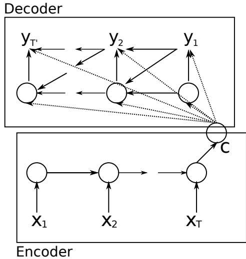
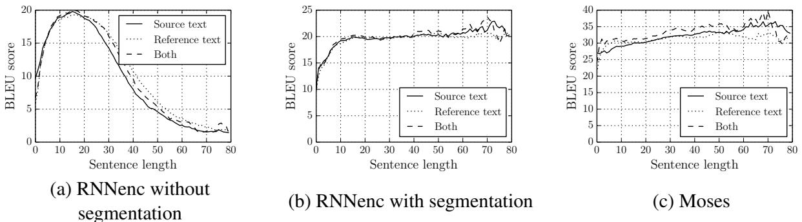
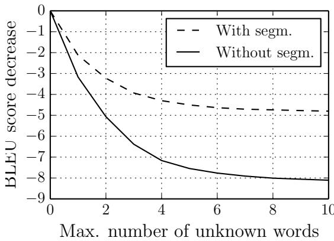

# Overcoming the Curse of Sentence Length for Neural Machine Translation using Automatic Segmentation

Jean Pouget-Abadie\* Ecole Polytechnique, France

Dzmitry Bahdanau \* Jacobs University Bremen, Germany

Bart van Merrienboer Kyunghyun Cho Université de Montréal, Canada

Yoshua Bengio Université de Montréal, Canada CIFAR Senior Fellow

# Abstract

The authors of (Cho et al., 2014a) have shown that the recently introduced neural network translation systems suffer from a significant drop in translation quality when translating long sentences, unlike existing phrase-based translation systems. In this paper, we propose a way to address this issue by automatically segmenting an input sentence into phrases that can be easily translated by the neural network translation model. Once each segment has been independently translated by the neural machine translation model, the translated clauses are concatenated to form a final translation. Empirical results show a significant improvement in translation quality for long sentences.

# 1 Introduction

Up to now, most research efforts in statistical machine translation (SMT) research have relied on the use of a phrase-based system as suggested in (Koehn et al., 2003). Recently, however, an entirely new, neural network based approach has been proposed by several research groups (Kalchbrenner and Blunsom, 2013; Sutskever et al., 2014; Cho et al., 2014b), showing promising results, both as a standalone system or as an additional component in the existing phrase-based system. In this neural network based approach, an encoder 'encodes' a variable-length input sentence into a fixed-length vector and a decoder 'decodes' a variable-length target sentence from the fixedlength encoded vector.

works well with short sentences (e.g. $\lessapprox 2 0$ words), but has difficulty with long sentences (e.g. $\gtrapprox 2 0$ words), and particularly with sentences that are longer than those used for training. Training on long sentences is diffi cult because few available training corpora include sufficiently many long sentences, and because the computational overhead of each update iteration in training is linearly correlated with the length of training sentences. Additionally, by the nature of encoding a variablelength sentence into a fi xed-size vector representation, the neural network may fail to encode all the important details.

It has been observed in (Sutskever et al., 2014), (Kalchbrenner and Blunsom, 2013) and (Cho et al., 2014a) that this neural network approach

In this paper, hence, we propose to translate sentences piece-wise. We segment an input sentence into a number of short clauses that can be confi - dently translated by the model. We show empirically that this approach improves translation quality of long sentences, compared to using a neural network to translate a whole sentence without segmentation.

# 2 Background: RNN Encoder-Decoder for Translation

The RNN Encoder-Decoder (RNNenc) model is a recent implementation of the encoder-decoder approach, proposed independently in (Cho et al., 2014b) and in (Sutskever et al., 2014). It consists of two RNNs, acting respectively as encoder and decoder.

The encoder of the RNNenc reads each word in a source sentence one by one while maintaining a hidden state. The hidden state computed at the end of the source sentence then summarizes the whole input sentence. Formally, given an input sentence $\mathbf x = \left( x _ { 1 } , \cdots , x _ { T _ { x } } \right)$ , the encoder computes

$$
h _ { t } = f \left( x _ { t } , h _ { t - 1 } \right) ,
$$

where $f$ is a nonlinear function computing the next hidden state given the previous one and the current input word.

  
Figure 1: An illustration of the RNN EncoderDecoder. Reprinted from (Cho et al., 2014b).

From the last hidden state of the encoder, we compute a context vector c on which the decoder will be conditioned:

$$
\mathbf { c } = g ( h _ { T _ { x } } ) ,
$$

where $g$ may simply be a linear affine transformation of $h _ { T _ { x } }$ .

The decoder, on the other hand, generates each target word at a time, until the end-of-sentence symbol is generated. It generates a word at a time given the context vector (from the encoder), a previous hidden state (of the decoder) and the word generated at the last step. More formally, the decoder computes at each time its hidden state by

$$
s _ { t } = f \left( y _ { t - 1 } , s _ { t - 1 } , \mathbf { c } \right) .
$$

With the newly computed hidden state, the decoder outputs the probability distribution over all possible target words by:

$$
\begin{array} { r } { p ( f _ { t , j } = 1 \mid f _ { t - 1 } , \ldots , f _ { 1 } , \mathbf { c } ) = \qquad } \\ { \exp \left( \mathbf { w } _ { j } \mathbf { h } _ { \langle t \rangle } \right) \qquad } \\ { \sum _ { j ^ { \prime } = 1 } ^ { K } \exp \left( \mathbf { w } _ { j ^ { \prime } } \mathbf { h } _ { \langle t \rangle } \right) , } \end{array}
$$

where $f _ { t , j }$ is the indicator variable for the $j$ -th word in the target vocabulary at time $t$ and only a single indicator variable is on $( = 1 )$ each time.

See Fig. 1 for the graphical illustration of the RNNenc.

The RNNenc in (Cho et al., 2014b) uses a special hidden unit that adaptively forgets or remembers the previous hidden state such that the activation of ahidden unit $h _ { j } ^ { \langle t \rangle }$ a time $t$ is computed

$$
h _ { j } ^ { \langle t \rangle } = z _ { j } h _ { j } ^ { \langle t - 1 \rangle } + ( 1 - z _ { j } ) \tilde { h } _ { j } ^ { \langle t \rangle } ,
$$

where

$$
\begin{array} { r l } & { \tilde { h } _ { j } ^ { \langle t \rangle } = f \left( [ \mathbf { W } \mathbf { x } ] _ { j } + \left[ \mathbf { U } \left( \mathbf { r } \odot \mathbf { h } _ { \langle t - 1 \rangle } \right) \right] \right) , } \\ & { \quad z _ { j } = \sigma \left( [ \mathbf { W } _ { z } \mathbf { x } ] _ { j } + \left[ \mathbf { U } _ { z } \mathbf { h } _ { \langle t - 1 \rangle } \right] _ { j } \right) , } \\ & { \quad r _ { j } = \sigma \left( [ \mathbf { W } _ { r } \mathbf { x } ] _ { j } + \left[ \mathbf { U } _ { r } \mathbf { h } _ { \langle t - 1 \rangle } \right] _ { j } \right) . } \end{array}
$$

$z _ { j }$ and $r _ { j }$ are respectively the update and reset gates. $\odot$ is an element-wise multiplication. In the remaining of this paper, we always assume that this hidden unit is used in the RNNenc.

Although the model in (Cho et al., 2014b) was originally trained on phrase pairs, it is straightforward to train the same model with a bilingual, parallel corpus consisting of sentence pairs as has been done in (Sutskever et al., 2014). In the remainder of this paper, we use the RNNenc trained on English–French sentence pairs (Cho et al., 2014a).

# 3 Automatic Segmentation and Translation

One hypothesis explaining the difficulty encountered by the RNNenc model when translating long sentences is that a plain, fixed-length vector lacks the capacity to encode a long sentence. When encoding a long input sentence, the encoder may lose track of all the subtleties in the sentence. Consequently, the decoder has difficulties recovering the correct translation from the encoded representation. One solution would be to build a larger model with a larger representation vector to increase the capacity of the model at the price of higher computational cost.

In this section, however, we propose to segment an input sentence such that each segmented clause can be easily translated by the RNN EncoderDecoder. In other words, we wish to find a segmentation that maximizes the total confidence score which is a sum of the confidence scores of the phrases in the segmentation. Once the confidence score is defined, the problem of fi nding the best segmentation can be formulated as an integer programming problem.

Let $\mathbf { e } = ( e _ { 1 } , \cdots , e _ { n } )$ be a source sentence composed of words $e _ { k }$ . We denote a phrase, which is a subsequence of $\mathbf { e }$ , with ${ \bf e } _ { i j } = ( e _ { i } , \cdot \cdot \cdot , e _ { j } )$ .

We use the RNN Encoder-Decoder to measure how confidently we can translate a subsequence ${ \bf e } _ { i j }$ by considering the log-probability $\log p ( \mathbf { f } ^ { k } \mid$ ${ \bf e } _ { i j }$ ) of a candidate translation $\mathbf { f } ^ { k }$ generated by the model. In addition to the log-probability, we also use the log-probability $\log p ( \mathbf { e } _ { i j } \mid \mathbf { f } ^ { k } )$ from a reverse RNN Encoder-Decoder (translating from a target language to source language). With these two probabilities, we defi ne the confidence score of a phrase pair $( \mathbf { e } _ { i j } , \mathbf { f } ^ { k } )$ as:

$$
c ( \mathbf { e } _ { i j } , \mathbf { f } ^ { k } ) = { \frac { \log p ( \mathbf { f } ^ { k } \mid \mathbf { e } _ { i j } ) + \log q ( \mathbf { e } _ { i j } \mid \mathbf { f } ^ { k } ) } { 2 \left| \log ( j - i + 1 ) \right| } } ,
$$

where the denominator penalizes a short segment whose probability is known to be overestimated by an RNN (Graves, 2013).

The confidence score of a source phrase only is then defi ned as

$$
c _ { i j } = \operatorname* { m a x } _ { k } c ( \mathbf { e } _ { i j } , \mathbf { f } _ { k } ) .
$$

We use an approximate beam search to search for the candidate translations $\mathbf { f } ^ { k }$ of ${ \bf e } _ { i j }$ , that maximize log-likelihood $\log p ( \mathbf { f } ^ { k } | \mathbf { e } _ { i j } )$ (Graves et al., 2013; Boulanger-Lewandowski et al., 2013).

Let $x _ { i j }$ be an indicator variable equal to 1 if we include a phrase ${ \bf e } _ { i j }$ in the segmentation, and otherwise, 0. We can rewrite the segmentation problem as the optimization of the following objective function:

$$
\begin{array} { l l } { \displaystyle \operatorname* { m a x } _ { \mathbf { x } } \quad } & { \displaystyle \sum _ { i \leq j } c _ { i j } x _ { i j } = \mathbf { x } \cdot \mathbf { c } } \\ { \mathrm { s u b j e c t ~ t o } \quad } & { \forall k , n _ { k } = 1 } \end{array}
$$

$\begin{array} { l c l } { { n _ { k } } } & { { = } } & { { \displaystyle \sum _ { i , j } x _ { i j } { \bf 1 } _ { i \le k \le j } } } \end{array}$ is the number of source phrases chosen in the segmentation containing word $e _ { k }$ .

The constraint in Eq. (4) states that for each word $\mathbf { e } _ { k }$ in the sentence one and only one of the source phrases contains this word, $( { \bf e } _ { i j } ) _ { i \leq k \leq j }$ , is included in the segmentation. The constraint matrix is totally unimodular making this integer programming problem solvable in polynomial time.

Let $S _ { j } ^ { k }$ be the first index of the $k$ -th segment counting from the last phrase of the optimal segmentation of subsequence $\mathbf { e } _ { 1 j }$ [] $( S _ { j } : = S _ { j } ^ { 1 } )$ , and $s _ { j }$ be the corresponding score of this segmentation - $s _ { 0 } : = 0 \}$ ). Then, the following relations hold:

$$
\begin{array} { r l r } & { s _ { j } = \underset { 1 \leq i \leq j } { \operatorname* { m a x } } ( c _ { i j } + s _ { i - 1 } ) , } & { \forall j \geq 1 } \\ & { S _ { j } = \underset { 1 \leq i \leq j } { \operatorname* { m a x } } ( c _ { i j } + s _ { i - 1 } ) , } & { \forall j \geq 1 } \end{array}
$$

With Eq. (5) we can evaluate $s _ { j }$ incrementally. With the evaluated $s _ { j }$ 's, we can compute $S _ { j }$ as well (Eq. (6)). By the definition of $S _ { j } ^ { k }$ we find the optimal segmentation by decomposing ${ \bf e } _ { 1 n }$ into ${ \mathbf e } _ { S _ { n } ^ { \overline { { k } } } , S _ { n } ^ { \overline { { k } } - 1 } - 1 } , \cdot \cdot \cdot , { \mathbf e } _ { S _ { n } ^ { 2 } , S _ { n } ^ { 1 } - 1 } , { \mathbf e } _ { S _ { n } ^ { 1 } , n }$ $\overline { { k } }$ index of the first one in the sequence $S _ { n } ^ { k }$ . This approach described above requires quadratic time with respect to sentence length.

# 3.1 Issues and Discussion

The proposed segmentation approach does not avoid the problem of reordering clauses. Unless the source and target languages follow roughly the same order, such as in English to French translations, a simple concatenation of translated clauses will not necessarily be grammatically correct.

Despite the lack of long-distance reordering1 in the current approach, we find nonetheless signifi - cant gains in the translation performance of neural machine translation. A mechanism to reorder the obtained clause translations is, however, an important future research question.

Another issue at the heart of any purely neural machine translation is the limited model vocabulary size for both source and target languages. As shown in (Cho et al., 2014a), translation quality drops considerably with just a few unknown words present in the input sentence. Interestingly enough, the proposed segmentation approach appears to be more robust to the presence of unknown words (see Sec. 5). One intuition is that the segmentation leads to multiple short clauses with less unknown words, which leads to more stable translation of each clause by the neural translation model.

Finally, the proposed approach is computationally expensive as it requires scoring all the subphrases of an input sentence. However, the scoring process can be easily sped up by scoring phrases in parallel, since each phrase can be scored independently. Another way to speed up the segmentation, other than parallelization, would be to use an existing parser to segment a sentence into a set of clauses.

  
Figure 2: The BLEU scores achieved by (a) the RNNenc without segmentation, (b) the RNNenc with the penalized reverse confidence score, and (c) the phrase-based translation system Moses on a newstest12–14.

# 4 Experiment Settings

# 4.1 Dataset

We evaluate the proposed approach on the task of English-to-French translation. We use a bilingual, parallel corpus of 348M words selected by the method of (Axelrod et al., 2011) from a combination of Europarl (61M), news commentary (5.5M), UN (421M) and two crawled corpora of 90M and 780M words respectively.2 The performance of our models was tested on news-test2012, news-test2013, and news-test2014. When comparing with the phrase-based SMT system Moses (Koehn et al., 2007), the first two were used as a development set for tuning Moses while news-test2014 was used as our test set.

To train the neural network models, we use only the sentence pairs in the parallel corpus, where both English and French sentences are at most 30 words long. Furthermore, we limit our vocabulary size to the $3 0 { , } 0 0 0 \ \mathrm { m o s t }$ frequent words for both English and French. All other words are considered unknown and mapped to a special token ([UNK]).

In both neural network training and automatic segmentation, we do not incorporate any domainspecific knowledge, except when tokenizing the original text data.

# 4.2 Models and Approaches

We compare the proposed segmentation-based translation scheme against the same neural network model translations without segmentation. The neural machine translation is done by an RNN Encoder-Decoder (RNNenc) (Cho et al., 2014b) trained to maximize the conditional probability of a French translation given an English sentence. Once the RNNenc is trained, an approximate beam-search is used to find possible translations with high likelihood.3

This RNNenc is used for the proposed segmentation-based approach together with another RNNenc trained to translate from French to English. The two RNNenc's are used in the proposed segmentation algorithm to compute the confidence score of each phrase (See Eqs. (2)–(3)).

We also compare with the translations of a conventional phrase-based machine translation system, which we expect to be more robust when translating long sentences.

# 5 Results and Analysis

# 5.1 Validity of the Automatic Segmentation

We validate the proposed segmentation algorithm described in Sec. 3 by comparing against two baseline segmentation approaches. The first one randomly segments an input sentence such that the distribution of the lengths of random segments has its mean and variance identical to those of the segments produced by our algorithm. The second approach follows the proposed algorithm, however, using a uniform random confidence score.

From Table 1 we can clearly see that the pro

<table><tr><td>Model</td><td>Test set</td></tr><tr><td>No segmentation</td><td>13.15</td></tr><tr><td>Random segmentation</td><td>16.60</td></tr><tr><td>Random confidence score</td><td>16.76</td></tr><tr><td>Proposed segmentation</td><td>20.86</td></tr></table>

Table 1: BLEU score computed on news-test2014 for two control experiments. Random segmentation refers to randomly segmenting a sentence so that the mean and variance of the segment lengths corresponded to the ones our best segmentation method. Random confidence score refers to segmenting a sentence with randomly generated confidence score for each segment.

posed segmentation algorithm results in significantly better performance. One interesting phenomenon is that any random segmentation was better than the direct translation without any segmentation. This indirectly agrees well with the previous finding in (Cho et al., 2014a) that the neural machine translation suffers from long sentences.

# 5.2 Importance of Using an Inverse Model

  
Figure 3: BLEU score loss vs. maximum number of unknown words in source and target sentence when translating with the RNNenc model with and without segmentation.   
Table 2: BLEU scores computed on the development and test sets. See the text for the description of each approach. Moses refers to the scores by the conventional phrase-based translation system. The top five rows consider all sentences of each data set, whilst the bottom five rows includes only sentences with no unknown words

The proposed confidence score averages the scores of a translation model $p ( f \mid e )$ and an inverse translation model $p ( e \mid f )$ and penalizes for short phrases. However, it is possible to use alternate defi nitions of confi dence score. For instance, one may use only the 'direct' translation model or varying penalties for phrase lengths.

In this section, we test three different confi dence score:

$p ( f \mid e )$ Using a single translation model $p ( f \mid e ) + p ( e \mid f )$ Using both direct and reverse translation models without the short phrase penalty

$p ( f \mid e ) + p ( e \mid f ) \left( \mid f \right)$ p) Using both direct and reverse translation models together with the short phrase penalty

The results in Table 2 clearly show the importance of using both translation and inverse translation models. Furthermore, we were able to get the best performance by incorporating the short phrase penalty (the denominator in Eq. (2)). From here on, thus, we only use the original formulation of the confidence score which uses the both models and the penalty.

5.3 Quantitative and Qualitative Analysis   

<table><tr><td></td><td>Model</td><td>Dev</td><td>Test</td></tr><tr><td>W</td><td>RNNenc p(f | e) p(f | e) + p(e | ) p(f | e) + p(e | f ) (p) Moses RNNenc</td><td>13.15 12.49 18.82 19.39 30.64</td><td>13.92 13.57 20.10 20.86 33.30</td></tr><tr><td>YNN oN</td><td>p(f | e) p(f | e) + p(e | f ) p(f | e) + p(e | f ) (p) Moses</td><td>21.01 20.94 23.05 23.93 32.77</td><td>23.45 22.62 24.63 26.46 35.63</td></tr></table>

As expected, translation with the proposed approach helps significantly with translating long sentences (see Fig. 2). We observe that translation performance does not drop for sentences of lengths greater than those used to train the RNNenc ( $\leq 3 0$ words).

Similarly, in Fig. 3 we observe that translation quality of the proposed approach is more robust to the presence of unknown words. We suspect that the existence of many unknown words make it harder for the RNNenc to extract the meaning of the sentence clearly, while this is avoided with the proposed segmentation approach as it effectively allows the RNNenc to deal with a less number of unknown words.

Table 3: Sample translations with the RNNenc model taken from the test set along with the source sentences and the reference translations.   

<table><tr><td colspan="1" rowspan="1"></td><td colspan="1" rowspan="1">the turn of the century , the weight of the average American 40- to 49-year-old male increasedby 10 per cent , according to U.S. Health Department Data .</td></tr><tr><td colspan="1" rowspan="1">Segmentation</td><td colspan="1" rowspan="1">[I Between the early 1970s , when the Boeing 747 jumbo defined modern long-haul travel ,][ and the turn of the century , the weight of the average American 40- to 49-year-old male] [increased by 10 per cent , according to U.S. Health Department Data .J]</td></tr><tr><td colspan="1" rowspan="1">Reference</td><td colspan="1" rowspan="1">Entre le début des années 1970 , lorsque le jumbo 747 de Boeing a défini le voyage long-courriermoderne , et le tournant du siècle , le poids de I' Américain moyen de 40 à 49 ans a augmentéde 10 % , selon les données du département américain de la Santé</td></tr><tr><td colspan="1" rowspan="1">Withsegmentation</td><td colspan="1" rowspan="1">Entre les années 70 , lorsque le Boeing Boeing a défini le transport de voyageurs modernes ; etla fi n du siècle , le poids de la moyenne américaine moyenne à I' égard des hommes a augmentéde 10 % , conformément aux données fournies par le U.S. Department of Health Aff airs .</td></tr><tr><td colspan="1" rowspan="1">Withoutsegmentation</td><td colspan="1" rowspan="1">Entre les années 1970 , lorsque les avions de service Boeing ont dépassé le prix du travail , letaux moyen était de 40 %.</td></tr><tr><td colspan="1" rowspan="1"></td><td></td></tr><tr><td colspan="1" rowspan="1">Source</td><td colspan="1" rowspan="1">During his arrest Ditta picked up his wallet and tried to remove several credit cards but theywere all seized and a hair sample was taken fom him.</td></tr><tr><td colspan="1" rowspan="1">Segmentation</td><td colspan="1" rowspan="1">[During his arrest Ditta] [picked up his wallet and tried to remove several credit cards but theywere all seized and] [a hair sample was taken from him.]]</td></tr><tr><td colspan="1" rowspan="1">Reference</td><td colspan="1" rowspan="1">Au cours de son arrestation , Ditta a ramassé son portefeuille et a tenté de retirer plusieurs cartesde crédit , mais elles ont toutes été saisies et on lui a prélevé un échantillon de cheveux .</td></tr><tr><td colspan="1" rowspan="1">Withsegmentation</td><td colspan="1" rowspan="1">Pendant son arrestation J' ai utilisé son portefeuille et a essayé de retirer plusieurs cartes decrédit mais toutes les pièces ont été saisies et un échantillon de cheveux a été enlevé.</td></tr><tr><td colspan="1" rowspan="1">Withoutsegmentation</td><td colspan="1" rowspan="1">Lors de son arrestation il a tenté de récupérer plusieurs cartes de crédit mais il a été saisi de tousles coups et des blessures.</td></tr><tr><td colspan="1" rowspan="1"></td><td></td></tr><tr><td colspan="1" rowspan="1">Source</td><td colspan="1" rowspan="1">"We can now move forwards and focus on the future and on the 90 % of assets that make up areally good bank, and on building a great bank for our clients and the United Kingdom,"' newdirector general, Ross McEwan, said to the press</td></tr><tr><td colspan="1" rowspan="1">Segmentation</td><td colspan="1" rowspan="1">[I"We can now move forwards and focus on the future] [and] [on the 90 % of assets that makeup a really good bank, and on building] [a great bank for our clients and the United Kingdom,"][new director general, Ross McEwan, said to the press.]]</td></tr><tr><td colspan="1" rowspan="1">Reference</td><td colspan="1" rowspan="1">'Nous pouvons maintenant aller de 1'avant , nous préoccuper de 1'avenir et des 90 % des actifsqui constituent une banque vraiment bonne et construire une grande banque pour la clientèle etpour le Royaume Uni", a dit le nouveau directeur général Ross McEwan à la presse .</td></tr><tr><td colspan="1" rowspan="1">Withsegmentation</td><td colspan="1" rowspan="1">'"Nous pouvons maintenant passer à I'avenir et se concentrer sur l avenir ou sur les 90 % d actifsqui constituent une bonne banque et sur la construction une grande banque de nos clients et duRoyaume-Uni"' Le nouveau directeur général Ross Ross a dit que la presse.</td></tr><tr><td colspan="1" rowspan="1">Withoutsegmentation</td><td colspan="1" rowspan="1">"Nus pvs inennt aser  udir es  t ee en place e bnue oapour la nouvelle banque et le directeur général" a souligné le journaliste.</td></tr><tr><td colspan="1" rowspan="1"></td><td></td></tr><tr><td colspan="1" rowspan="1">Source</td><td colspan="1" rowspan="1">There are several beautiful flashes - the creation of images has always been one of Chouinard'sstrong points - like the hair that is ruffed or the black fabric that extends the lines.</td></tr><tr><td colspan="1" rowspan="1">Segmentation</td><td colspan="1" rowspan="1">[[There are several beautiful flashes - the creation of images has always been one of Chouinard'sstrong points -] [like the hair that is ruffled or the black fabric that extends the lines.]]</td></tr><tr><td colspan="1" rowspan="1">Reference</td><td colspan="1" rowspan="1">Il y a quelques beaux flashs - la création d'images a toujours été une force chez Chouinard -comme ces ch eveux qui s'ébouriffent ou ces tissus noirs qui allongent les lignes .</td></tr><tr><td colspan="1" rowspan="1">Withsegmentation</td><td colspan="1" rowspan="1">Il existe plusieurs belles images - la création d images a toujours été I un de ses points forts .comme les cheveux comme le vernis ou le tissu noir qui étend les lignes.</td></tr><tr><td colspan="1" rowspan="1">Withoutsegmentation</td><td colspan="1" rowspan="1">Il existe plusieurs points forts : la création d images est toujours 1 un des points forts .</td></tr><tr><td colspan="1" rowspan="1"></td><td></td></tr><tr><td colspan="1" rowspan="1">Source</td><td colspan="1" rowspan="1">Without specifying the ilness she was suffering from, the star performer of 'Respect' confirmed to the media on 16 October that the side effects of a treatment she was receiving were 'difi cult'to deal with.</td></tr><tr><td colspan="1" rowspan="1">Segmentation</td><td colspan="1" rowspan="1">[Without specifying the illness she was suffering from, the star performer of 'Respect'] [con-firmed to the media on 16 October that the side effects of a treatment she was receiving were]['difficult' to deal with.]]</td></tr><tr><td colspan="1" rowspan="1">Reference</td><td colspan="1" rowspan="1">Sans préciser la maladie dont elle souffrait , la célèbre interprète de Respect avait affirmé auxmédias le 16 octobre que les effets secondaires d'un traitement qu'elle recevait étaient "dif-ciles'.</td></tr><tr><td colspan="1" rowspan="1">Withsegmentation</td><td colspan="1" rowspan="1">Sans préciser la maladie qu'elle souffrait la star de I' oeuvre' de 'respect'. Il a été confirméaux médias le 16 octobre que les effets secondaires d'un traitement ont éeté regus. "dif cile" detraiter .</td></tr><tr><td colspan="1" rowspan="1">Withoutsegmentation</td><td colspan="1" rowspan="1">Sans la précision de la maladie elle a eu 1'impression de "marquer le 16 avril' les effets d'un tel'traitement'.</td></tr><tr><td colspan="1" rowspan="1">Source</td><td colspan="1" rowspan="1">He nevertheless praised the Government for responding to his request for urgent assis-tance which he first raised with the Prime Minister at the beginning of May .</td></tr><tr><td colspan="1" rowspan="1">Segmentation</td><td colspan="1" rowspan="1">[He nevertheless praised the Government for responding to his request for urgent assis-tance which he first raised ] [with the Prime Minister at the beginning of May . ]</td></tr><tr><td colspan="1" rowspan="1">Reference</td><td colspan="1" rowspan="1">Il a néanmoins félicité le gouvernement pour avoir répondu à la demande d' aide urgentequ'il a présentée au Premier ministre début mai .</td></tr><tr><td colspan="1" rowspan="1">Withsegmentation</td><td colspan="1" rowspan="1">Il a néanmoins félicité le Gouvernement de répondre à sa demande d' aide urgente qu'ila soulevée . avec le Premier ministre début mai .</td></tr><tr><td colspan="1" rowspan="1">Withoutsegmentation</td><td colspan="1" rowspan="1">Il a néanmoins félicité le gouvernement de répondre à sa demande d' aide urgente qu'ila adressée au Premier Ministre début mai .</td></tr></table>

Table 4: An example where an incorrect segmentation negatively impacts fluency and punctuation.

In Table 3, we show the translations of randomly selected long sentences (40 or more words). Segmentation improves overall translation quality, agreeing well with our quantitative result. However, we can also observe a decrease in translation quality when an input sentence is not segmented into well-formed sentential clauses. Additionally, the concatenation of independently translated segments sometimes negatively impacts fluency, punctuation, and capitalization by the RNNenc model. Table 4 shows one such example.

# 6 Discussion and Conclusion

In this paper we propose an automatic segmentation solution to the 'curse of sentence length' in neural machine translation. By choosing an appropriate confidence score based on bidirectional translation models, we observed significant improvement in translation quality for long sentences.

Our investigation shows that the proposed segmentation-based translation is more robust to the presence of unknown words. However, since each segment is translated in isolation, a segmentation of an input sentence may negatively impact translation quality, especially the fluency of the translated sentence, the placement of punctuation marks and the capitalization of words.

An important research direction in the future is to investigate how to improve the quality of the translation obtained by concatenating translated segments.

# Acknowledgments

The authors would like to acknowledge the support of the following agencies for research funding and computing support: NSERC, Calcul Québec, Compute Canada, the Canada Research Chairs and CIFAR.

# References

Amittai Axelrod, Xiaodong He, and Jianfeng Gao. 2011. Domain adaptation via pseudo in-domain data selection. In Proceedings of the ACL Conference on Empirical Methods in Natural Language Processing (EMNLP), pages 355–362. Association for Computational Linguistics.

Nicolas Boulanger-Lewandowski, Yoshua Bengio, and Pascal Vincent. 2013. Audio chord recognition with recurrent neural networks. In ISMIR.

Kyunghyun Cho, Bart van Merrienboer, Dzmitry Bahdanau, and Yoshua Bengio. 2014a. On the properties of neural machine translation: EncoderDecoder approaches. In Eighth Workshop on Syntax, Semantics and Structure in Statistical Translation, October.

Kyunghyun Cho, Bart van Merrienboer, Caglar Gulcehre, Fethi Bougares, Holger Schwenk, and Yoshua Bengio. 2014b. Learning phrase representations using rnn encoder-decoder for statistical machine translation. In Proceedings of the Empiricial Methods in Natural Language Processing (EMNLP 2014), October. to appear.

A. Graves, A. Mohamed, and G. Hinton. 2013. Speech recognition with deep recurrent neural networks. ICASSP.

A. Graves. 2013. Generating sequences with recurrent neural networks. arXiv:1308.0850 [cs .NE], August.

Nal Kalchbrenner and Phil Blunsom. 2013. Two recurrent continuous translation models. In Proceedings of the ACL Conference on Empirical Methods in Natural Language Processing (EMNLP), pages 1700–1709. Association for Computational Linguistics.

Philipp Koehn, Franz Josef Och, and Daniel Marcu. 2003. Statistical phrase-based translation. In Proceedings of the 2003 Conference of the North American Chapter of the Association for Computational Linguistics on Human Language Technology - Volume 1, NAACL '03, pages 48–54, Stroudsburg, PA, USA. Association for Computational Linguistics.

Philipp Koehn, Hieu Hoang, Alexandra Birch, Chris Callison-Burch, Marcello Federico, Nicola Bertoldi, Brooke Cowan, Wade Shen, Christine Moran, Richard Zens, Chris Dyer, Ondrej Bojar, Alexandra Constantin, and Evan Herbst. 2007. Annual meeting of the association for computational linguistics (acl). Prague, Czech Republic. demonstration session.

Ilya Sutskever, Oriol Vinyals, and Quoc Le. 2014. Anonymized. In Anonymized. under review.