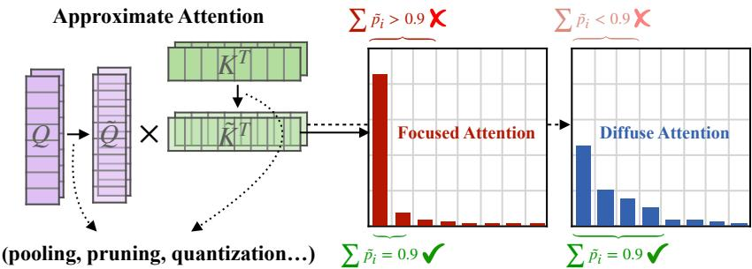
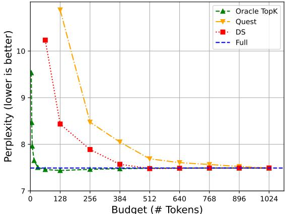
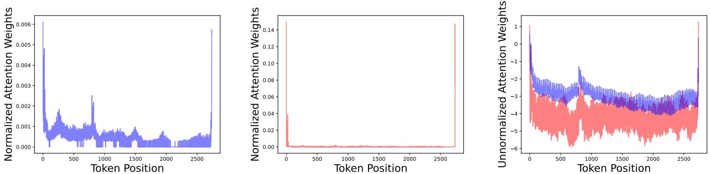
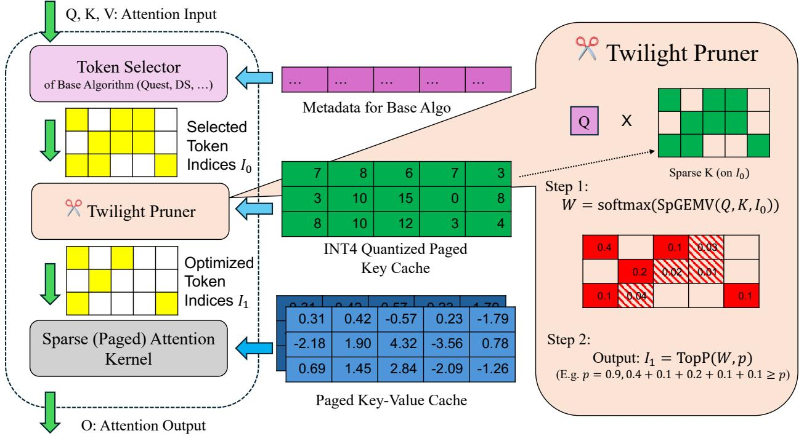
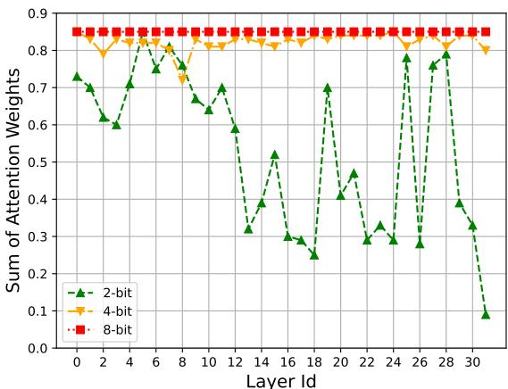
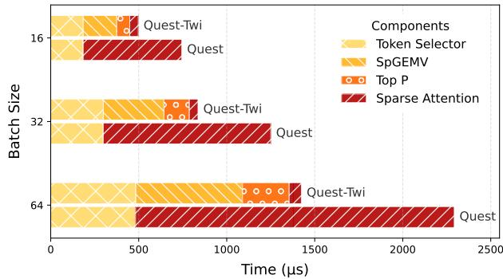
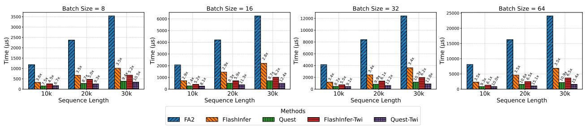
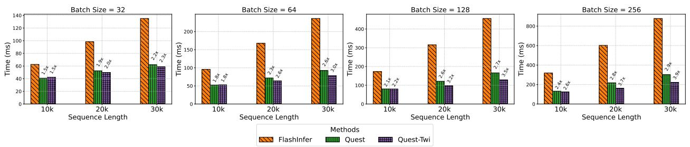

# Twilight: Adaptive Attention Sparsity with Hierarchical Top- $p$ Pruning

Chaofan Lin 1 Jiaming Tang 2 Shuo Yang 3 Hanshuo Wang 4 Tian Tang 1 Boyu Tian 1 Ion Stoica 3 Song Han 2 Mingyu Gao 1

# Abstract

Leveraging attention sparsity to accelerate longcontext large language models (LLMs) has been a hot research topic. However, current algorithms such as sparse attention or key-value (KV) cache compression tend to use a fixed budget, which presents a significant challenge during deployment because it fails to account for the dynamic nature of real-world scenarios, where the optimal balance between accuracy and efficiency can vary greatly. In this paper, we find that borrowing top- $p$ sampling (nucleus sampling) to sparse attention can surprisingly achieve adaptive budgeting. Based on this, we propose Twilight, a framework to bring adaptive sparsity to any existing sparse attention algorithm without sacrificing their accuracy. Empirical results show that Twilight can adaptively prune at most $98 \%$ of redundant tokens, leading to $1 5 . 4 \times$ acceleration in self-attention operations and $3 . 9 \times$ acceleration in end-to-end per token latency in long context LLM decoding.

reasoning. Consequently, the importance of long-context LLMs is increasing rapidly to meet the needs of these sophisticated applications.

Despite the transformative potential of long-context LLMs, they come with substantial computational and memory costs (Zhang et al., 2023; Tang et al., 2024b; Xiao et al., 2024), primarily driven by the attention mechanism. In the decoding stage, the latency is primarily attributed to memory bandwidth limitations, as the KV cache must be repeatedly loaded. This memory-bound nature of attention leads to increased latency since the KV cache sizes grow as the sequence becomes longer. Furthermore, the substantial size of the KV cache significantly increases GPU memory consumption, compounding the challenges of scaling long-context LLMs.

Large language models (LLMs) with long-context capabilities have revolutionized a wide array of natural language processing tasks, such as retrieval-based applications, document summarization (Bai et al., 2024), and code generation (Jain et al., 2024). The increasing availability of models supporting context windows up to 1M to 10M tokens (Yang et al., 2025; Team et al., 2024) highlights the growing potential of these advancements. For instance, video language models (VLMs) (Wang et al., 2024) that process video often require tens of thousands of tokens. Similarly, large reasoning models (DeepSeek-AI et al., 2025; Team et al., 2025), which are rapidly growing in popularity, frequently demand substantial token lengths to enable chain-of-thought (CoT)

# 1. Introduction

Previous research has extensively investigated the use of attention sparsity (KV cache sparsity) to accelerate longcontext inference, both during the prefilling and decoding stages. The core idea is to compute approximate attention on a subset of tokens, often referred to as “critical tokens" or “heavy hitters" (Zhang et al., 2023). In practical deployments of these algorithms, it is necessary to specify the number of selected tokens, denoted as $B$ , commonly referred to as the KV cache budget. A top- $k$ operation is required to identify the indices of the critical tokens that correspond to the top$B$ highest estimated scores. As previously mentioned, a smaller $B$ significantly reduces the I/O operations, while a larger $B$ retains more contextual information, thereby minimizing accuracy loss.

However, identifying the optimal values for $B$ where both accuracy and efficiency are optimized is inherently challenging due to two major reasons: (a) Saturation points are runtime dynamic. Previous works (Wu et al., 2024; Xiao et al., 2024) have demonstrated that some heads, referred to as retrieval heads, are trained to extract important information from long contexts, while others focus only on local information. As shown in Figure 1, the distribution of attention weights may vary across different attention heads. Some attention distributions concentrate on a small subset of tokens, which we refer to as focused attention. In contrast, some attention distributions are flatter, where many tokens have similar attention weights; we define this as diffuse attention. For focused attention, using a fixed token budget for Top- $k$ attention often leads to over-selection, as only a few tokens are sufficient to accumulate sufficient attention weights. Similarly, for diffuse attention, a fixed token budget can result in under-selection, as a larger number of tokens is necessary to ensure accurate attention modeling. (b) Current algorithms suffer from varying degrees of inefficiency. As shown in Figure 2, we observe that the saturation point is highly dependent on the specific algorithm, necessitating offline calibration to determine the appropriate budget for each algorithm individually. The actual algorithms, like Quest (Tang et al., 2024b) or DS (Yang et al., 2024c), have to over-select some tokens as the inevitable inaccuracy in estimating the importance of tokens comparing with oracle.

  
(a) Top- $k$ Sparsity (H2O, Quest, …) fixed $\bar { k }$ -token budget results in either over-selection or under-selection.   
(b) Top- $p$ Sparsity (Ours) dynamically adjusts the budget to accumulate sufficient attention weights.   
Figure 1. Comparison of Top- $k$ and Top- $p$ Sparsity in Approximate Attention. Approximate attention typically employs techniques such as pooling, channel pruning, and quantization to approximate the query $( \tilde { Q } )$ and $\ker ( \tilde { K } )$ , enabling the estimation of attention weights. These weights are then used to select important tokens for sparse attention. (a) Top- $k$ Sparsity, utilized by methods like H2O and Quest, relies on a fixed $k$ -token budget, which often results in over-selection $( \sum \tilde { p _ { i } } > 0 . 9 )$ or under-selection $( \sum \tilde { p _ { i } } < 0 . 9 )$ . (b) Our proposed Top- $p$ Sparsity dynamically adjusts the budget to accumulate sufficient attention weights $( \sum \tilde { p _ { i } } = 0 . 9 )$ ), enabling more efficient and adaptive sparse attention.

In this work, we reveal that top- $k$ methods exhibit issues similar to those previously encountered in LLM sampling. Drawing on this analogy, we introduce top- $p$ sampling into sparse attention to address the budget estimation problem. Our study demonstrates that top- $p$ can determine the KV cache budget in a more intrinsic and dynamic way compared to top- $k$ . Based on these observations, we built Twilight, a hierarchical KV cache pruning framework that enhances existing sparse attention algorithms with adaptive budgeting capabilities. Specifically, Twilight first lets the base algorithm to select a large subset of tokens using a conservative budget, and then further refines this subset by retaining only the top- $p$ tokens.

Evaluations are conducted in two aspects: accuracy and efficiency. First, we demonstrate that Twilight optimizes the base algorithms with nearly no accuracy loss on both midcontext benchmarks (GSM8K (Cobbe et al., 2021), COQA (Reddy et al., 2019), PG19 dataset (Rae et al., 2019)) and a comprehensive long-context benchmark, Longbench (Bai et al., 2024). Next, we show that Twilight accelerates full attention by up to $1 5 . 4 \times$ times and existing sparse attention methods, by up to $2 . 2 \times$ times, leading to a $3 . 9 \times$ end-to-end speedup. Our contributions are summarized as follows:

• We conduct an in-depth investigation into a significant issue in top- $k$ sparse attention: the difficulty in identifying the optimal budget (the saturation point). We propose using top- $p$ sampling to dynamically determine this point at runtime.   
• We introduce Twilight, a framework that can endow any existing sparse attention method with adaptive budgeting capabilities, thereby improving their efficiency and facilitating their deployment.   
• We evaluate Twilight in terms of both accuracy and efficiency, demonstrating an $1 5 . 4 \times$ speedup on selfattention.

# 2. Related Works

Sparse Attention. Sparse attention techniques aim to reduce the memory and computational burden of selfattention in long-context LLMs. H2O (Zhang et al., 2023), StreamingLLM (Xiao et al., 2023) and SnapKV (Li et al., 2024) evict non-critical tokens in a static, query- agnostic manner, which are often referred to as KV cache compression. In contract, SparQ (Ribar et al., 2023), Double Sparsity (Yang et al., 2024c) and Quest (Tang et al., 2024b) retain all tokens in GPU and select critical tokens to save loading. Recent works like RetrievalAttention (Liu et al., 2024) adopts advanced algorithm to better estimate the token criticality. However, these methods are all top- $k$ based, requiring configuring an appropriate budget beforehead, leading to over-selection or under-selection. In this paper, we focus on solving this problem via a more essential approach.

  
Figure 2. The relationship of budgets to perplexity on PG-19 dataset in different top- $k$ sparse attention methods.

Dynamic Budget. Recent studies have extensively demonstrated that the optimal budgets vary significantly across different layers (Cai et al., 2024; Yang et al., 2024a), attention heads (Feng et al., 2025; Xiao et al., 2024; Tang et al., 2024a), and prompts (tasks) (Zhou et al., 2024). These works tend to focus on only one aspect of the dynamism in attention mechanisms. However, in this paper, we point out that it is the different distributions of attention weights that are the root cause of this dynamism

Other KV Cache Optimizations Several alternative approaches focus on optimizing the KV cache beyond sparsification, including quantization (Hooper et al., 2024; Zirui Liu et al., 2023; Kang et al., 2024; Nawrot et al., 2024), linear attention (Wang et al., 2020; Katharopoulos et al., 2020), and memory-efficient attention mechanisms such as FlashAttention (Dao, 2024) and SageAttention (Zhang et al., 2025; 2024b). Our approach is orthogonal to these methods, as it focuses on adaptive KV cache pruning rather than compression, approximation, or memory-efficient computation, and can be combined with them for enhanced performance.

# 3. Bringing Top- $p$ Sampling to Sparse Attention

In this section, we formulate the current sparse attention methods and re-examine the root causes of the problems. We argue that to mathematically approximate the attention output, the goal is to select a minimal set of indices such that the sum of their attention scores meets a certain threshold. Therefore, we propose that top- $p$ sampling should be used instead of top- $k$ to filter out the critical tokens.

# 3.1. Problem Formulation

We start by formulating the sparse attention. Consider the attention computation during the decoding phase, where we have the query vector $Q \in \mathbb { R } ^ { 1 \times d }$ , and the key-value cache $K , V \in \mathbb { R } ^ { n \times d }$ . Here, $d$ denotes the head dimension, and $n$ represents the context length.

Definition 3.1 (Sparse Attention). Let $\mathcal { T }$ be the set of selected indices, the output of the sparse attention equals to

$$
\hat { O } = \operatorname { s o f t m a x } \bigg ( \frac { Q \cdot K ^ { T } } { \sqrt { d } } \bigg ) \Lambda _ { \mathcal { T } } V = W \Lambda _ { \mathcal { T } } V
$$

$$
\begin{array} { r } { \Lambda _ { \mathcal { T } } \in \mathbb { R } ^ { n \times n } , \Lambda _ { \mathcal { T } } [ i , j ] = \left\{ \begin{array} { l l } { 1 } & { \mathrm { i f } i = j \mathrm { ~ a n d ~ } i \in \mathcal { T } } \\ { 0 } & { \mathrm { o t h e r w i s e } } \end{array} \right. . } \end{array}
$$

To minimize the output error $\lVert O - \hat { O } \rVert$ , we need to carefully select the subset of tokens that are used in the sparse attention computation. However, directly optimizing this objective function without loading the full KV cache is challenging. Earlier research has shown that the distribution of $\mathrm { v }$ is relatively smooth (Zhao et al., 2024), which implies that the bound is relatively tight.

$$
\begin{array} { l } { \displaystyle \mathcal { L } = \| O - \hat { O } \| = \| W ( \Lambda _ { \mathcal { T } } - \mathbf { 1 } ^ { n \times n } ) V \| } \\ { \displaystyle \leq \| W ( \Lambda _ { \mathcal { T } } - \mathbf { 1 } ^ { n \times n } ) \| \cdot \| V \| } \end{array}
$$

Therefore, the objective becomes minimizing $\parallel W ( \Lambda _ { \mathcal { T } } -$ $\begin{array} { r } { \mathbf { 1 } _ { n \times n } ) \| = 1 - \sum _ { i \in \mathcal { T } } W [ i ] } \end{array}$ , which means selecting a subset of tokens that maximizes the sum of attention weights. If we fix the number of the subset, i.e. $| \mathcal { T } |$ , then we have the oracle top- $k$ attention:

Definition 3.2 (Oracle Top- $k$ Sparse Attention). Given the budget $B$ ,

$$
{ \mathcal { T } } = \arg \operatorname* { m a x } _ { { \mathcal { T } } } \sum _ { i = 1 } ^ { n } W \Lambda _ { { \mathcal { T } } } \ \mathrm { s . t . } \ | { \mathcal { T } } | = B
$$

The oracle top- $k$ attention serves as a theoretical upperbound of current sparse methods.

# 3.2. Rethink the Problem of Top- $k$

The Achilles’ heel of top- $k$ attention, as we described earlier, is the dilemma in determining a uniform budget $B$ . A larger $B$ leads to inefficiency, while a smaller $B$ results in accuracy loss. We find that this predicament is quite similar to the one encountered in the sampling phase of large language models (LLMs). During the sampling phase, the model samples the final output token from a predicted probability distribution. Nucleus sampling (Holtzman et al., 2019), or top- $p$ sampling, was proposed to address the problem that top- $k$ sampling cannot adapt to different next-word distributions.

  
Figure 3. Diverse distributions observed in attention weights. The leftmost image illustrates a "Flat" distribution (Diffuse Attention), where the weights are uniformly distributed. The middle image depicts a "Peaked" distribution (Focused Attention), where the weights are concentrated on the head and tail tokens. When overlaid, the differences between these distributions become readily apparent.

Motivated by this insight, we examine the distributions of attention weights more closely. Figure 3 displays two different types of attention weight distributions in real LLMs mentioned in Figure 1. In Equation 2, we demonstrated that the output error can be related to the sum of attention weights. It is straightforward to observe that, when comparing a flat distribution to a peaked one, a greater number of tokens must be selected in the flat distribution to reach the same cumulative threshold. Therefore, we argue that the core reason for budget dynamism is the dynamic nature of attention weight distributions at runtime. Drawing inspiration from top- $p$ sampling, we introduce top- $p$ sparse attention by directly apply threshold to the sum of attention weights.

Definition 3.3 (Oracle Top- $p$ Sparse Attention). Given the threshold $p$ ,

$$
\mathcal { T } = \arg \operatorname* { m i n } _ { \mathcal { T } } | \mathcal { T } | \quad \mathrm { s . t . } \ \sum _ { i = 1 } ^ { n } W \Lambda _ { \mathcal { T } } \geq p
$$

Comparing to top- $k$ , top- $p$ is advantageous because it provides a theoretical upperbound of error in Equation 2 by $( 1 - p ) \cdot \| V \|$ . Under this circumstance, top- $p$ reduces the budget as low as possible, making it both efficient and adaptive to different distributions.

# 4. Twilight

In the previous section, we demonstrated that top- $p$ attention can adaptively control the budget while ensuring that the sum of normalized attention weights meets a certain threshold $p$ . Our primary goal is to use top- $p$ to endow more existing algorithms with adaptive attention sparsity, rather than simply inventing another sparse attention, which is motivated by two main reasons: On one hand, despite their budget-related challenges, existing sparse algorithms have achieved significant success in current serving systems (Kwon et al., 2023; Zheng et al., 2023), thanks to their effective token selection strategies. These strategies can be readily reused and enhanced with adaptive sparsity. On the other hand, we anticipate that future sparse attention methods may still employ top- $k$ selection. By developing a general solution like ours, we aim to automatically equip these future methods with adaptive attention sparsity, thereby improving their efficiency and adaptability without requiring extensive redesign. Consequently, we initially positioned our system, Twilight, as an optimizer for existing algorithms.

However, deploying top- $p$ to different existing sparse attention algorithms faces majorly three challenges, both algorithm-wise and system-wise.

(C1) Not all algorithms are suitable for top- $p$ . Top- $p$ imposes strict constraints on the layout of attention weights. For example, simply replacing top- $k$ with top- $p$ in Quest (Tang et al., 2024b) would not work, as Quest performs max pooling on weights with a per-page layout (16 tokens per page). Additionally, some other methods (Yang et al., 2024b; Liu et al., 2024) do not use attention weights to select critical tokens at all.

(C2) It’s harder to estimate weights for top- $p$ than top$k$ . The precision requirement of top- $p$ is higher than that of top- $k$ , because the former requires a certain degree of numerical accuracy while the latter only demands ordinality. Table 1 provides a basic comparison of top- $k$ , top- $p$ , and full attention. The precision requirement of top- $p$ attention lies between the other two, which leads us to reconsider the appropriate precision choice for compressing the $K$ cache.

(C3) System-level optimizations are needed. Since our work is the first work introduce top- $p$ to attention weights, many algorithms need to be efficiently implemented in hardware, including efforts on both efficient parallel algorithm designs and efficient kernel optimizations.

In Section 4.1, we address C1 by proposing a unified pruning framework for sparse attention. In Section 4.2, we mitigate the runtime overhead of by efficient kernel implementations (top- $p$ , SpGEMV, Attention) and 4-bit quantization of

  
Figure 4. Architecture of Twilight. Twilight is built on certain existing algorithm and serves as its optimizer. It computes self-attention in three steps. First, Token Selector select critical tokens using the strategy of base algorithm under a relaxed budget. Then, Twilight Pruner prunes the selected token indices via top- $p$ thresholding. Finally, the optimized token indices are passed to Sparse Attention Kernel to perform attention computation.

Table 1. Comparing of different pruning methods on attention weights. "Normalize" indicates softmax.   

<table><tr><td>Methods</td><td>Efficiency</td><td>Precision Requirement</td><td>Output Accuracy</td><td>Need Normalize?</td></tr><tr><td>Top-k</td><td>High</td><td>Low</td><td>Median</td><td>×</td></tr><tr><td>Top-p</td><td>High</td><td>Median</td><td>High</td><td></td></tr><tr><td>Full Attn.</td><td>Low</td><td>High</td><td>High</td><td>$</td></tr></table>

$K$ cache, addressing C2 and C3. Lastly, in Section 4.3, we analyze the overhead of Twilight and discuss some topics.

# 4.1. Hierarchical Pruning with Select-then-Prune Architecture

Recall that existing algorithms face the challenge of choosing a proper budget: either over-selection or under-selection. To address this, we propose a two-step process. We first abstract the base algorithm into a black-box Token Selector, which uses some metadata to select a subset of critical tokens. And we allow the Token Selector to a conservative budget (e.g. $1 / 4$ sparsity), as we have a Pruner after that to further optimize the selected indices by pruning unimportant tokens. This hierarchical Select-then-Prune architecture is illustrated on the left side of Figure 4.

# 4.2. Efficient Kernel Implementation

# 4.2.1. EFFICIENT SPGEMV WITH 4-BIT QUANTIZATION OF KEY CACHE

As previously analyzed, the precision requirement of top- $p$ lies between top- $k$ and full attention. For top- $k$ , many works (Yang et al., 2024c; Zhang et al., 2024a) push the compression to a extreme low-bit (1-bit/2-bit). For full attention, SageAttention (Zhang et al., 2025) is proposed recently as a 8-bit accurate attention by smoothing $K$ and per-block quantization. In this work, we find 4-bit strikes a balance between accuracy and efficiency, making it the ideal choice to calculate estimated attention weights for top- $p$ . And we implement an efficient sparse GEMV (SpGEMV) kernel based on FlashInfer. We maintain an extra INT4 asymmetrically quantized $K$ cache in GPU as Figure 4 shows. The INT4 $K$ vectors are unpacked and dequantized in shared memory which reduces I/O between global memory and shared memory to at most $1 / 4$ , leading to a considerable end-to-end speedup.

# 4.2.2. EFFICIENT TOP- $p$ KERNEL VIA BINARY SEARCH

<table><tr><td>Algorithm 1 Top-p via Binary Search Input: Normalized attention weights W ∈ R BS × H × N</td><td></td></tr><tr><td>Threshold of TopP p, Hyper-parameter ∈ Output: Indices I, Mask M ∈ {0, 1} BS× H × N if s ≥ p then 1 = m; else r = m;</td><td rowspan="3"></td></tr><tr><td>Initialize: l = 0, r = max(W), m = (l + r)/2; repeat W0 = where(W &lt; m, 0.0, W); W1 = where(W ≤ l, INF, W );</td></tr><tr><td>W2 = where(W &gt; r, -INF, W); S = sum(Wo); I/ Compute the sum over current threshold m;</td></tr></table>

As we mentioned before, our top- $p$ method is motivated by the top- $p$ sampling, which also takes up a portion of decode latency. Therefore, our efficient kernel is modified from the top- $p$ sampling kernel from FlashInfer (Ye et al., 2025), a high performance kernel library for LLM serving.

A brute-force way to do top- $p$ sampling is to sort the elements by a descending order and accumulate them until the sum meets the threshold, which is quite inefficient in parallel hardwares like modern GPU. Our kernel adopts a parallel-friendly binary search algorithm as Algorithm 1.

# 4.3. Overhead Analysis and Discussion

Runtime Overhead. The runtime of Twilight-optimized algorithm consists of three parts according to the pipeline in Figure 4: $T _ { \mathrm { T o k e n 5 e l e c t o r } } + T _ { \mathrm { T w i g h t P r u n e r } } + T _ { \mathrm { S p a r s } }$ e Attention. Comparing to the baseline without Twilight, our method introduces an extra latency term $T _ { \mathrm { T w i g h t P r u n e r } }$ but reduces TSparse Attention because it further reduces its I/O. Our hierarchical architecture naturally fits the hierarchical sparsity, where the number of tokens gradually decreases as the precision increases. Suppose the Token Selector has a $\frac { 1 } { 1 6 }$ sparsity, then the theoretical speed up can be formulated as

$$
\frac { N / 1 6 + B _ { 0 } } { N / 1 6 + B _ { 0 } / 4 + B _ { 1 } }
$$

where $B _ { 0 } = | I _ { 0 } |$ is the budget of Token Selector, $B _ { 1 } = | I _ { 1 } |$ is the budget after pruned by Twilight. Suppose $B _ { 0 } \ =$ $N / 4 , B _ { 1 } = N / 6 4$ , then the speed up is approximately $2 \times$ Here we omit the overhead of top- $p$ since SpGEMV dominates the latency when $B _ { 0 } = N / 8 \sim N / 4$ .

  
Figure 5. Sum of normalized attention weights for selected tokens under different quantization bits, with $p = 0 . 8 5$ .

Integrate with Serving System. Since our system design naturally aligns with PagedAttention (Kwon et al., 2023), Twilight can be seamlessly integrated into popular serving systems like vLLM (Kwon et al., 2023) and SGLang (Zheng et al., 2023). Prefix sharing and multi-phase attention (Lin et al., 2024; Zheng et al., 2023; Zhu et al., 2024; Ye et al., 2024a;b) also become common techniques in modern serving systems, which also fit Twilight since we use paged-level or token-level sparse operations and can achieve flexible computation flow.

# 5. Evaluation

In this section, we will perform several experiments to demonstrate that equipping current SOTA sparse attention algorithms with Twilight improves their efficiency while preserving the accuracy.

# 5.1. Accuracy Evaluation

# 5.1.1. SETUP

Benchmarks and Models. We evaluate Twilight on two types of benchmarks: Longbench (Bai et al., 2024) for long context and three separate tests for short context $5 0 0 \sim 2 \mathrm { k }$ tokens), GSM8K (Cobbe et al., 2021), COQA (Reddy et al., 2019) and perplexity on PG19 dataset (Rae et al., 2019). We select three widely used models, Longchat-7B-v1.5-32k (Li et al., 2023), LLaMA2-7b-chat (Touvron et al., 2023) and LLaMA-3.1-8B-Instruct (Dubey et al., 2024) (128k context length), with two of them have the long context ability $\geq 3 2 \mathrm { k }$ , covering two mainstream attention implementations multi-head attention (MHA) and group query attention (GQA).

Baselines. We use two SOTA top- $k$ sparse attention methods Quest (Tang et al., 2024b) and DS (Yang et al., 2024c). The hyperparameter $p$ of Twilight is set to 0.95 for LLaMA 2/3 and 0.85 for Longchat. We do not apply any sparse methods to the first two layers as it is illustrated in baselines’ paper to ensure a fair comparison.

# 5.1.2. RESULTS ON LONGBENCH

We comprehensively evaluate Twilight’s long context ability on 12 different tasks chosen from Longbench, covering all task types, on two long context models. For each baseline, we choose four budget settings: 256, 1024, 4096, 8192 to observe the impact on budget, and a specially setting named "Twilight", means using Twilight pruner in this algorithm to dynamically determine the budget. In this case, the base algorithm uses a very conservative budget, 8192, in our case. We also equip Full with Twilight (i.e. The token selector is a trivial one which selects all tokens each time) for better comparison.

The full results are shown in Table 3 in Appendix A. In Longchat, the Twilight series outperforms its original version by up to $5 . 7 \%$ in score, while successfully pruning up to $98 \%$ of the redundant tokens over-selected by the base algorithm. In LLaMA-3.1-8b-Instruct, Twilight achieves almost zero accuracy loss $( < 1 \% )$ with a slight increase in budget usage. We hypothesize that this slight increase is due to the knowledge being more compressed in LLaMA-3.1.

# 5.1.3. RESULTS ON SHORT TASKS

Table 2. Evaluation on three short-context benchmarks.   

<table><tr><td>Methods</td><td>GSM8K(flexible/strict)↑</td><td>COQA(em/f1)↑</td><td>PG-19 Perplexity↓</td></tr><tr><td colspan="4">LLAMA-2-7B-CHAT</td></tr><tr><td>Full Cache</td><td>0.2290/0.2282</td><td>0.5935/0.7511</td><td>7.503</td></tr><tr><td>Quest</td><td>0.0114/0.0061</td><td>0.5150/0.6991</td><td>14.15</td></tr><tr><td>DS</td><td>0.1820/0.1812</td><td>0.6043/0.7632</td><td>7.622</td></tr><tr><td>Twilight</td><td>0.2153/0.2115</td><td>0.6088/0.7642</td><td>7.600</td></tr><tr><td colspan="4">LLAMA-3.1-8B-INSTRUCT</td></tr><tr><td>Full Cache</td><td>0.7726/0.7475</td><td>0.6363/0.7882</td><td>7.490</td></tr><tr><td>Quest</td><td>0.0773/0.0652</td><td>0.5310/0.7033</td><td>19.00</td></tr><tr><td>DS</td><td>0.3806/0.3609</td><td>0.6490/0.8003</td><td>10.23</td></tr><tr><td>Twilight</td><td>0.7771/0.7604</td><td>0.6325/0.7869</td><td>7.529</td></tr></table>

We then demonstrate that the Twilight pruner itself does not negatively impact performance on two zero-shot generation tasks: GSM8K and COQA using lm-harness framework (Gao et al., 2021), as well as one perplexity test in the PG19 data set. Since we are specifically evaluating the pruner, we do not integrate Twilight into the baseline models. All baselines use a budget of 64, which is comparable to the budget after Twilight’s pruning. The results in Table 2 show that Twilight outperforms Quest and DS by a significant margin, with nearly zero loss compared to full attention.

  
Figure 6. Time breakdown of self-attention. At batch size 64, Quest-Twi (Quest with Twilight) outperforms Quest without Twilight by approximate $2 \times$ .

# 5.2. Efficiency Evaluation

# 5.2.1. SETUP

Datasets. We evaluate the efficiency of Twilight on both the self-attention operator and the end-to-end decoding latency on a single A100 GPU. Since the budget is prompt (task)-related, our experiments are conducted on Longbench, from which we select three different types of tasks: Qasper (Dasigi et al., 2021) for QA, GovReport (Huang et al., 2021) for summarization, and LCC (Guo et al., 2023) for coding. We use prompts ranging from $1 0 \mathrm { k }$ to 30k tokens for evaluation. Given that Twilight is designed for deploying sparse attention in serving systems, we use batch inference in our experiments.

Baselines and Implementation Details. We compare our methods with the following baselines: PyTorch’s scaleddot-product-attention (SDPA), with FlashAttention2 (Dao, 2024) and Memory-Efficient Attention (Lefaudeux et al., 2022) as backends. FlashInfer (Ye et al., 2025), a highperformance kernel library for LLM serving. Quest, which achieves state-of-the-art latency performance among sparse attention methods. We integrate Twilight with both FlashInfer and Quest, resulting in FlashInfer-Twi and Quest-Twi. We modified the Quest kernels to support batch inference. We implemented Twilight using both CUDA and OpenAI Triton (Tillet et al., 2019), with the technical details described in Section 4.2.

# 5.2.2. SPEEDUP ON SELF-ATTENTION

We first evaluate the speedup on self-attention operator across different batch sizes and sequence length. As Figure 7 shows, FlashInfer-Twi and Quest-Twi achieve a speedup up to $6 . 5 \times$ and $1 5 . 4 \times$ separately comparing with FlashAttention2. Moreoever, they accelerates the base algorithm (FlashInfer and Quest) by $2 . 2 \times$ and $1 . 4 \times$ , separately.

  
Figure 7. Latency and speedup of self-attention at different sequence length and batch size.

  
Figure 8. Time-Per-Output-Token (TPOT) speedup in end-to-end serving scenario.

# 5.2.3. END-TO-END DECODING SPEEDUP

We conduct end-to-end inference evaluation with the similar settings, with the difference that the batch size ranges from 32 to 256, for a better simulation of serving scenario. Figure 8 tells that Quest-Twi achieves up to $3 . 9 \times$ decoding acceleration comparing with FlashInfer, with a $1 . 3 5 \times$ extra speedup comparing to Quest without Twilight.

# 5.3. Ablation Study

Selection of Quantization Bits. We previously argued that 4-bit quantization is suitable for estimating attention weights in Section 4.2. To empirically verify this, we examined the sum of real attention weights for 2-bit, 4-bit, and 8-bit quantizations. As shown in Figure 5, the sum of attention weights for 2-bit quantization drops significantly, while 4- bit and 8-bit quantizations maintain stability. Although 8-bit quantization can be used for attention computation (Zhang et al., 2025), it is overly precise for the purpose of top$p$ sampling. Considering the balance between estimation accuracy and computational efficiency, 4-bit quantization emerges as a good choice.

Time Breakdown for Twilight. Given Twilight’s hierarchical architecture, which comprises three distinct components, it is crucial to analyze the time breakdown. Figure 6 illustrates the time breakdown for different batch sizes in a 32k retrieval task. In this scenario, Quest employs a budget of 8192 (1/4 sparsity), while Twilight further prunes this budget down to 256. The breakdown aligns closely with the theoretical cost model we presented earlier, demonstrating that Twilight significantly reduces the time required for the sparse attention kernel while introducing some additional overheads.

# 6. Conclusion

In this paper, we first highlight that top- $k$ attention struggles to find an optimal budget due to the dynamic nature of attention weight distributions. We then introduce Twilight, a framework with hierarchical selector-optimizer architecture that leverages top- $p$ filtering to address this challenge. Empirical results demonstrate that Twilight can adaptively prune up to $98 \%$ of redundant tokens, resulting in a $1 5 . 4 \times$ acceleration in self-attention operations and a $3 . 9 \times$ reduction in end-to-end per-token latency. Comparing to the base algorithm it is applied to, Twilight offers an additional $2 \times$ speedup. Our work underscores the importance of adaptive attention sparsity, paving the way for future research on efficient sparse attention.

# References

Bai, Y., Lv, X., Zhang, J., Lyu, H., Tang, J., Huang, Z., Du, Z., Liu, X., Zeng, A., Hou, L., Dong, Y., Tang, J., and Li, J. LongBench: A bilingual, multitask benchmark for long context understanding. In Proceedings of the 62nd

Annual Meeting of the Association for Computational Linguistics (Volume 1: Long Papers), pp. 3119–3137, Bangkok, Thailand, August 2024. Association for Computational Linguistics. doi: 10.18653/v1/2024.acl-long. 172. URL https://aclanthology.org/2024. acl-long.172.

Cai, Z., Zhang, Y., Gao, B., Liu, Y., Liu, T., Lu, K., Xiong, W., Dong, Y., Chang, B., Hu, J., et al. Pyramidkv: Dynamic kv cache compression based on pyramidal information funneling. arXiv preprint arXiv:2406.02069, 2024.

Cobbe, K., Kosaraju, V., Bavarian, M., Chen, M., Jun, H., Kaiser, L., Plappert, M., Tworek, J., Hilton, J., Nakano, R., et al. Training verifiers to solve math word problems. arXiv preprint arXiv:2110.14168, 2021.

Dao, T. FlashAttention-2: Faster attention with better parallelism and work partitioning. In International Conference on Learning Representations (ICLR), 2024.

Dasigi, P., Lo, K., Beltagy, I., Cohan, A., Smith, N. A., and Gardner, M. A dataset of information-seeking questions and answers anchored in research papers. arXiv preprint arXiv:2105.03011, 2021.

DeepSeek-AI, Guo, D., Yang, D., Zhang, H., Song, J., Zhang, R., Xu, R., Zhu, Q., Ma, S., Wang, P., Bi, X., Zhang, X., Yu, X., Wu, Y., Wu, Z. F., Gou, Z., Shao, Z., Li, Z., Gao, Z., Liu, A., Xue, B., Wang, B., Wu, B., Feng, B., Lu, C., Zhao, C., Deng, C., Zhang, C., Ruan, C., Dai, D., Chen, D., Ji, D., Li, E., Lin, F., Dai, F., Luo, F., Hao, G., Chen, G., Li, G., Zhang, H., Bao, H., Xu, H., Wang, H., Ding, H., Xin, H., Gao, H., Qu, H., Li, H., Guo, J., Li, J., Wang, J., Chen, J., Yuan, J., Qiu, J., Li, J., Cai, J. L., Ni, J., Liang, J., Chen, J., Dong, K., Hu, K., Gao, K., Guan, K., Huang, K., Yu, K., Wang, L., Zhang, L., Zhao, L., Wang, L., Zhang, L., Xu, L., Xia, L., Zhang, M., Zhang, M., Tang, M., Li, M., Wang, M., Li, M., Tian, N., Huang, P., Zhang, P., Wang, Q., Chen, Q., Du, Q., Ge, R., Zhang, R., Pan, R., Wang, R., Chen, R. J., Jin, R. L., Chen, R., Lu, S., Zhou, S., Chen, S., Ye, S., Wang, S., Yu, S., Zhou, S., Pan, S., Li, S. S., Zhou, S., Wu, S., Ye, S., Yun, T., Pei, T., Sun, T., Wang, T., Zeng, W., Zhao, W., Liu, W., Liang, W., Gao, W., Yu, W., Zhang, W., Xiao, W. L., An, W., Liu, X., Wang, X., Chen, X., Nie, X., Cheng, X., Liu, X., Xie, X., Liu, X., Yang, X., Li, X., Su, X., Lin, X., Li, X. Q., Jin, X., Shen, X., Chen, X., Sun, X., Wang, X., Song, X., Zhou, X., Wang, X., Shan, X., Li, Y. K., Wang, Y. Q., Wei, Y. X., Zhang, Y., Xu, Y., Li, Y., Zhao, Y., Sun, Y., Wang, Y., Yu, Y., Zhang, Y., Shi, Y., Xiong, Y., He, Y., Piao, Y., Wang, Y., Tan, Y., Ma, Y., Liu, Y., Guo, Y., Ou, Y., Wang, Y., Gong, Y., Zou, Y., He, Y., Xiong, Y., Luo, Y., You, Y., Liu, Y., Zhou, Y., Zhu, Y. X., Xu, Y., Huang, Y., Li, Y., Zheng, Y., Zhu, Y., Ma, Y., Tang, Y., Zha, Y., Yan, Y., Ren, Z. Z.,

Ren, Z., Sha, Z., Fu, Z., Xu, Z., Xie, Z., Zhang, Z., Hao, Z., Ma, Z., Yan, Z., Wu, Z., Gu, Z., Zhu, Z., Liu, Z., Li, Z., Xie, Z., Song, Z., Pan, Z., Huang, Z., Xu, Z., Zhang, Z., and Zhang, Z. Deepseek-r1: Incentivizing reasoning capability in llms via reinforcement learning, 2025. URL https://arxiv.org/abs/2501.12948.

Dubey, A., Jauhri, A., Pandey, A., Kadian, A., Al-Dahle, A., Letman, A., Mathur, A., Schelten, A., Yang, A., Fan, A., et al. The llama 3 herd of models. arXiv preprint arXiv:2407.21783, 2024.

Feng, Y., Lv, J., Cao, Y., Xie, X., and Zhou, S. K. Adakv: Optimizing kv cache eviction by adaptive budget allocation for efficient llm inference, 2025. URL https: //arxiv.org/abs/2407.11550.

Gao, L., Tow, J., Biderman, S., Black, S., DiPofi, A., Foster, C., Golding, L., Hsu, J., McDonell, K., Muennighoff, N., et al. A framework for few-shot language model evaluation. Version v0. 0.1. Sept, 10:8–9, 2021.

Guo, D., Xu, C., Duan, N., Yin, J., and McAuley, J. Longcoder: A long-range pre-trained language model for code completion. In International Conference on Machine Learning, pp. 12098–12107. PMLR, 2023.

Holtzman, A., Buys, J., Du, L., Forbes, M., and Choi, Y. The curious case of neural text degeneration. arXiv preprint arXiv:1904.09751, 2019.

Hooper, C., Kim, S., Mohammadzadeh, H., Mahoney, M. W., Shao, Y. S., Keutzer, K., and Gholami, A. Kvquant: Towards 10 million context length llm inference with kv cache quantization, 2024. URL https: //arxiv.org/abs/2401.18079.

Huang, L., Cao, S., Parulian, N., Ji, H., and Wang, L. Efficient attentions for long document summarization. arXiv preprint arXiv:2104.02112, 2021.

Jain, N., Han, K., Gu, A., Li, W.-D., Yan, F., Zhang, T., Wang, S., Solar-Lezama, A., Sen, K., and Stoica, I. Livecodebench: Holistic and contamination free evaluation of large language models for code, 2024. URL https://arxiv.org/abs/2403.07974.

Kang, H., Zhang, Q., Kundu, S., Jeong, G., Liu, Z., Krishna, T., and Zhao, T. Gear: An efficient kv cache compression recipe for near-lossless generative inference of llm, 2024. URL https://arxiv.org/abs/2403.05527.

Katharopoulos, A., Vyas, A., Pappas, N., and Fleuret, F. Transformers are rnns: Fast autoregressive transformers with linear attention, 2020. URL https://arxiv. org/abs/2006.16236.

Kwon, W., Li, Z., Zhuang, S., Sheng, Y., Zheng, L., Yu, C. H., Gonzalez, J., Zhang, H., and Stoica, I. Efficient memory management for large language model serving with pagedattention. In Proceedings of the 29th Symposium on Operating Systems Principles, SOSP ’23, pp. 611–626, New York, NY, USA, 2023. Association for Computing Machinery. ISBN 9798400702297. doi: 10.1145/3600006.3613165.

Lefaudeux, B., Massa, F., Liskovich, D., Xiong, W., Caggiano, V., Naren, S., Xu, M., Hu, J., Tintore, M., Zhang, S., Labatut, P., Haziza, D., Wehrstedt, L., Reizenstein, J., and Sizov, G. xformers: A modular and hackable transformer modelling library. https://github. com/facebookresearch/xformers, 2022.

Li, D., Shao, R., Xie, A., Sheng, Y., Zheng, L., Gonzalez, J. E., Stoica, I., Ma, X., and Zhang, H. How long can open-source llms truly promise on context length?, June 2023. URL https://lmsys.org/ blog/2023-06-29-longchat.

Li, Y., Huang, Y., Yang, B., Venkitesh, B., Locatelli, A., Ye, H., Cai, T., Lewis, P., and Chen, D. Snapkv: Llm knows what you are looking for before generation. arXiv preprint arXiv:2404.14469, 2024.

Lin, C., Han, Z., Zhang, C., Yang, Y., Yang, F., Chen, C., and Qiu, L. Parrot: Efficient serving of llm-based applications with semantic variable. In 18th USENIX Symposium on Operating Systems Design and Implementation (OSDI 24), Santa Clara, CA, July 2024. USENIX Association. URL https://www.usenix.org/conference/ osdi24/presentation/lin-chaofan.

Liu, D., Chen, M., Lu, B., Jiang, H., Han, Z., Zhang, Q., Chen, Q., Zhang, C., Ding, B., Zhang, K., et al. Retrievalattention: Accelerating long-context llm inference via vector retrieval. arXiv preprint arXiv:2409.10516, 2024.

Nawrot, P., Łancucki, A., Chochowski, M., Tarjan, D., and ´ Ponti, E. M. Dynamic memory compression: Retrofitting llms for accelerated inference, 2024. URL https:// arxiv.org/abs/2403.09636.

Rae, J. W., Potapenko, A., Jayakumar, S. M., and Lillicrap, T. P. Compressive transformers for long-range sequence modelling. arXiv preprint arXiv:1911.05507, 2019.

Reddy, S., Chen, D., and Manning, C. D. CoQA: A conversational question answering challenge. Transactions of the Association for Computational Linguistics, 7:249–266, 2019. doi: 10.1162/tacl_a_00266. URL https://aclanthology.org/Q19-1016/.

Ribar, L., Chelombiev, I., Hudlass-Galley, L., Blake, C., Luschi, C., and Orr, D. Sparq attention: Bandwidthefficient llm inference. arXiv preprint arXiv:2312.04985, 2023.

Tang, H., Lin, Y., Lin, J., Han, Q., Hong, S., Yao, Y., and Wang, G. Razorattention: Efficient kv cache compression through retrieval heads. arXiv preprint arXiv:2407.15891, 2024a.

Tang, J., Zhao, Y., Zhu, K., Xiao, G., Kasikci, B., and Han, S. Quest: Query-aware sparsity for efficient long-context llm inference, 2024b. Team, G., Georgiev, P., Lei, V. I., Burnell, R., Bai, L., Gulati, A., Tanzer, G., Vincent, D., Pan, Z., Wang, S., Mariooryad, S., Ding, Y., Geng, X., Alcober, F., Frostig, R., Omernick, M., Walker, L., Paduraru, C., Sorokin, C., Tacchetti, A., Gaffney, C., Daruki, S., Sercinoglu, O., Gleicher, Z., Love, J., Voigtlaender, P., Jain, R., Surita, G., Mohamed, K., Blevins, R., Ahn, J., Zhu, T., Kawintiranon, K., Firat, O., Gu, Y., Zhang, Y., Rahtz, M., Faruqui, M., Clay, N., Gilmer, J., Co-Reyes, J., Penchev, I., Zhu, R., Morioka, N., Hui, K., Haridasan, K., Campos, V., Mahdieh, M., Guo, M., Hassan, S., Kilgour, K., Vezer, A., Cheng, H.-T., de Liedekerke, R., Goyal, S., Barham, P., Strouse, D., Noury, S., Adler, J., Sundararajan, M., Vikram, S., Lepikhin, D., Paganini, M., Garcia, X., Yang, F., Valter, D., Trebacz, M., Vodrahalli, K., Asawaroengchai, C., Ring, R., Kalb, N., Soares, L. B., Brahma, S., Steiner, D., Yu, T., Mentzer, F., He, A., Gonzalez, L., Xu, B., Kaufman, R. L., Shafey, L. E., Oh, J., Hennigan, T., van den Driessche, G., Odoom, S., Lucic, M., Roelofs, B., Lall, S., Marathe, A., Chan, B., Ontanon, S., He, L., Teplyashin, D., Lai, J., Crone, P., Damoc, B., Ho, L., Riedel, S., Lenc, K., Yeh, C.-K., Chowdhery, A., Xu, Y., Kazemi, M., Amid, E., Petrushkina, A., Swersky, K., Khodaei, A., Chen, G., Larkin, C., Pinto, M., Yan, G., Badia, A. P., Patil, P., Hansen, S., Orr, D., Arnold, S. M. R., Grimstad, J., Dai, A., Douglas, S., Sinha, R., Yadav, V., Chen, X., Gribovskaya, E., Austin, J., Zhao, J., Patel, K., Komarek, P., Austin, S., Borgeaud, S., Friso, L., Goyal, A., Caine, B., Cao, K., Chung, D.-W., Lamm, M., Barth-Maron, G., Kagohara, T., Olszewska, K., Chen, M., Shivakumar, K., Agarwal, R., Godhia, H., Rajwar, R., Snaider, J., Dotiwalla, X., Liu, Y., Barua, A., Ungureanu, V., Zhang, Y., Batsaikhan, B.-O., Wirth, M., Qin, J., Danihelka, I., Doshi, T., Chadwick, M., Chen, J., Jain, S., Le, Q., Kar, A., Gurumurthy, M., Li, C., Sang, R., Liu, F., Lamprou, L., Munoz, R., Lintz, N., Mehta, H., Howard, H., Reynolds, M., Aroyo, L., Wang, Q., Blanco, L., Cassirer, A., Griffith, J., Das, D., Lee, S., Sygnowski, J., Fisher, Z., Besley, J., Powell, R., Ahmed, Z., Paulus, D., Reitter, D., Borsos, Z., Joshi, R., Pope, A., Hand, S., Selo, V., Jain, V., Sethi, N., Goel, M., Makino, T., May,

R., Yang, Z., Schalkwyk, J., Butterfield, C., Hauth, A., Goldin, A., Hawkins, W., Senter, E., Brin, S., Woodman, O., Ritter, M., Noland, E., Giang, M., Bolina, V., Lee, L., Blyth, T., Mackinnon, I., Reid, M., Sarvana, O., Silver, D., Chen, A., Wang, L., Maggiore, L., Chang, O., Attaluri, N., Thornton, G., Chiu, C.-C., Bunyan, O., Levine, N., Chung, T., Eltyshev, E., Si, X., Lillicrap, T., Brady, D., Aggarwal, V., Wu, B., Xu, Y., McIlroy, R., Badola, K., Sandhu, P., Moreira, E., Stokowiec, W., Hemsley, R., Li, D., Tudor, A., Shyam, P., Rahimtoroghi, E., Haykal, S., Sprechmann, P., Zhou, X., Mincu, D., Li, Y., Addanki, R., Krishna, K., Wu, X., Frechette, A., Eyal, M., Dafoe, A., Lacey, D., Whang, J., Avrahami, T., Zhang, Y., Taropa, E., Lin, H., Toyama, D., Rutherford, E., Sano, M., Choe, H., Tomala, A., Safranek-Shrader, C., Kassner, N., Pajarskas, M., Harvey, M., Sechrist, S., Fortunato, M., Lyu, C., Elsayed, G., Kuang, C., Lottes, J., Chu, E., Jia, C., Chen, C.-W., Humphreys, P., Baumli, K., Tao, C., Samuel, R., dos Santos, C. N., Andreassen, A., Rakicevi ´ c, N., Grewe, ´ D., Kumar, A., Winkler, S., Caton, J., Brock, A., Dalmia, S., Sheahan, H., Barr, I., Miao, Y., Natsev, P., Devlin, J., Behbahani, F., Prost, F., Sun, Y., Myaskovsky, A., Pillai, T. S., Hurt, D., Lazaridou, A., Xiong, X., Zheng, C., Pardo, F., Li, X., Horgan, D., Stanton, J., Ambar, M., Xia, F., Lince, A., Wang, M., Mustafa, B., Webson, A., Lee, H., Anil, R., Wicke, M., Dozat, T., Sinha, A., Piqueras, E., Dabir, E., Upadhyay, S., Boral, A., Hendricks, L. A., Fry, C., Djolonga, J., Su, Y., Walker, J., Labanowski, J., Huang, R., Misra, V., Chen, J., Skerry-Ryan, R., Singh, A., Rijhwani, S., Yu, D., Castro-Ros, A., Changpinyo, B., Datta, R., Bagri, S., Hrafnkelsson, A. M., Maggioni, M., Zheng, D., Sulsky, Y., Hou, S., Paine, T. L., Yang, A., Riesa, J., Rogozinska, D., Marcus, D., Badawy, D. E., Zhang, Q., Wang, L., Miller, H., Greer, J., Sjos, L. L., Nova, A., Zen, H., Chaabouni, R., Rosca, M., Jiang, J., Chen, C., Liu, R., Sainath, T., Krikun, M., Polozov, A., Lespiau, J.-B., Newlan, J., Cankara, Z., Kwak, S., Xu, Y., Chen, P., Coenen, A., Meyer, C., Tsihlas, K., Ma, A., Gottweis, J., Xing, J., Gu, C., Miao, J., Frank, C., Cankara, Z., Ganapathy, S., Dasgupta, I., Hughes-Fitt, S., Chen, H., Reid, D., Rong, K., Fan, H., van Amersfoort, J., Zhuang, V., Cohen, A., Gu, S. S., Mohananey, A., Ilic, A., Tobin, T., Wieting, J., Bortsova, A., Thacker, P., Wang, E., Caveness, E., Chiu, J., Sezener, E., Kaskasoli, A., Baker, S., Millican, K., Elhawaty, M., Aisopos, K., Lebsack, C., Byrd, N., Dai, H., Jia, W., Wiethoff, M., Davoodi, E., Weston, A., Yagati, L., Ahuja, A., Gao, I., Pundak, G., Zhang, S., Azzam, M., Sim, K. C., Caelles, S., Keeling, J., Sharma, A., Swing, A., Li, Y., Liu, C., Bostock, C. G., Bansal, Y., Nado, Z., Anand, A., Lipschultz, J., Karmarkar, A., Proleev, L., Ittycheriah, A., Yeganeh, S. H., Polovets, G., Faust, A., Sun, J., Rrustemi, A., Li, P., Shivanna, R., Liu, J., Welty, C., Lebron, F., Baddepudi, A., Krause, S., Parisotto, E., Soricut, R., Xu, Z.,

Bloxwich, D., Johnson, M., Neyshabur, B., Mao-Jones, J., Wang, R., Ramasesh, V., Abbas, Z., Guez, A., Segal, C., Nguyen, D. D., Svensson, J., Hou, L., York, S., Milan, K., Bridgers, S., Gworek, W., Tagliasacchi, M., Lee-Thorp, J., Chang, M., Guseynov, A., Hartman, A. J., Kwong, M., Zhao, R., Kashem, S., Cole, E., Miech, A., Tanburn, R., Phuong, M., Pavetic, F., Cevey, S., Comanescu, R., Ives, R., Yang, S., Du, C., Li, B., Zhang, Z., Iinuma, M., Hu, C. H., Roy, A., Bijwadia, S., Zhu, Z., Martins, D., Saputro, R., Gergely, A., Zheng, S., Jia, D., Antonoglou, I., Sadovsky, A., Gu, S., Bi, Y., Andreev, A., Samangooei, S., Khan, M., Kocisky, T., Filos, A., Kumar, C., Bishop, C., Yu, A., Hodkinson, S., Mittal, S., Shah, P., Moufarek, A., Cheng, Y., Bloniarz, A., Lee, J., Pejman, P., Michel, P., Spencer, S., Feinberg, V., Xiong, X., Savinov, N., Smith, C., Shakeri, S., Tran, D., Chesus, M., Bohnet, B., Tucker, G., von Glehn, T., Muir, C., Mao, Y., Kazawa, H., Slone, A., Soparkar, K., Shrivastava, D., Cobon-Kerr, J., Sharman, M., Pavagadhi, J., Araya, C., Misiunas, K., Ghelani, N., Laskin, M., Barker, D., Li, Q., Briukhov, A., Houlsby, N., Glaese, M., Lakshminarayanan, B., Schucher, N., Tang, Y., Collins, E., Lim, H., Feng, F., Recasens, A., Lai, G., Magni, A., Cao, N. D., Siddhant, A., Ashwood, Z., Orbay, J., Dehghani, M., Brennan, J., He, Y., Xu, K., Gao, Y., Saroufim, C., Molloy, J., Wu, X., Arnold, S., Chang, S., Schrittwieser, J., Buchatskaya, E., Radpour, S., Polacek, M., Giordano, S., Bapna, A., Tokumine, S., Hellendoorn, V., Sottiaux, T., Cogan, S., Severyn, A., Saleh, M., Thakoor, S., Shefey, L., Qiao, S., Gaba, M., yiin Chang, S., Swanson, C., Zhang, B., Lee, B., Rubenstein, P. K., Song, G., Kwiatkowski, T., Koop, A., Kannan, A., Kao, D., Schuh, P., Stjerngren, A., Ghiasi, G., Gibson, G., Vilnis, L., Yuan, Y., Ferreira, F. T., Kamath, A., Klimenko, T., Franko, K., Xiao, K., Bhattacharya, I., Patel, M., Wang, R., Morris, A., Strudel, R., Sharma, V., Choy, P., Hashemi, S. H., Landon, J., Finkelstein, M., Jhakra, P., Frye, J., Barnes, M., Mauger, M., Daun, D., Baatarsukh, K., Tung, M., Farhan, W., Michalewski, H., Viola, F., de Chaumont Quitry, F., Lan, C. L., Hudson, T., Wang, Q., Fischer, F., Zheng, I., White, E., Dragan, A., baptiste Alayrac, J., Ni, E., Pritzel, A., Iwanicki, A., Isard, M., Bulanova, A., Zilka, L., Dyer, E., Sachan, D., Srinivasan, S., Muckenhirn, H., Cai, H., Mandhane, A., Tariq, M., Rae, J. W., Wang, G., Ayoub, K., FitzGerald, N., Zhao, Y., Han, W., Alberti, C., Garrette, D., Krishnakumar, K., Gimenez, M., Levskaya, A., Sohn, D., Matak, J., Iturrate, I., Chang, M. B., Xiang, J., Cao, Y., Ranka, N., Brown, G., Hutter, A., Mirrokni, V., Chen, N., Yao, K., Egyed, Z., Galilee, F., Liechty, T., Kallakuri, P., Palmer, E., Ghemawat, S., Liu, J., Tao, D., Thornton, C., Green, T., Jasarevic, M., Lin, S., Cotruta, V., Tan, Y.-X., Fiedel, N., Yu, H., Chi, E., Neitz, A., Heitkaemper, J., Sinha, A., Zhou, D., Sun, Y., Kaed, C., Hulse, B., Mishra, S., Georgaki, M., Kudugunta, S., Farabet, C., Shafran, I.,

Vlasic, D., Tsitsulin, A., Ananthanarayanan, R., Carin, A., Su, G., Sun, P., V, S., Carvajal, G., Broder, J., Comsa, I., Repina, A., Wong, W., Chen, W. W., Hawkins, P., Filonov, E., Loher, L., Hirnschall, C., Wang, W., Ye, J., Burns, A., Cate, H., Wright, D. G., Piccinini, F., Zhang, L., Lin, C.-C., Gog, I., Kulizhskaya, Y., Sreevatsa, A., Song, S., Cobo, L. C., Iyer, A., Tekur, C., Garrido, G., Xiao, Z., Kemp, R., Zheng, H. S., Li, H., Agarwal, A., Ngani, C., Goshvadi, K., Santamaria-Fernandez, R., Fica, W., Chen, X., Gorgolewski, C., Sun, S., Garg, R., Ye, X., Eslami, S. M. A., Hua, N., Simon, J., Joshi, P., Kim, Y., Tenney, I., Potluri, S., Thiet, L. N., Yuan, Q., Luisier, F., Chronopoulou, A., Scellato, S., Srinivasan, P., Chen, M., Koverkathu, V., Dalibard, V., Xu, Y., Saeta, B., Anderson, K., Sellam, T., Fernando, N., Huot, F., Jung, J., Varadarajan, M., Quinn, M., Raul, A., Le, M., Habalov, R., Clark, J., Jalan, K., Bullard, K., Singhal, A., Luong, T., Wang, B., Rajayogam, S., Eisenschlos, J., Jia, J., Finchelstein, D., Yakubovich, A., Balle, D., Fink, M., Agarwal, S., Li, J., Dvijotham, D., Pal, S., Kang, K., Konzelmann, J., Beattie, J., Dousse, O., Wu, D., Crocker, R., Elkind, C., Jonnalagadda, S. R., Lee, J., HoltmannRice, D., Kallarackal, K., Liu, R., Vnukov, D., Vats, N., Invernizzi, L., Jafari, M., Zhou, H., Taylor, L., Prendki, J., Wu, M., Eccles, T., Liu, T., Kopparapu, K., Beaufays, F., Angermueller, C., Marzoca, A., Sarcar, S., Dib, H., Stanway, J., Perbet, F., Trdin, N., Sterneck, R., Khorlin, A., Li, D., Wu, X., Goenka, S., Madras, D., Goldshtein, S., Gierke, W., Zhou, T., Liu, Y., Liang, Y., White, A., Li, Y., Singh, S., Bahargam, S., Epstein, M., Basu, S., Lao, L., Ozturel, A., Crous, C., Zhai, A., Lu, H., Tung, Z., Gaur, N., Walton, A., Dixon, L., Zhang, M., Globerson, A., Uy, G., Bolt, A., Wiles, O., Nasr, M., Shumailov, I., Selvi, M., Piccinno, F., Aguilar, R., McCarthy, S., Khalman, M., Shukla, M., Galic, V., Carpenter, J., Villela, K., Zhang, H., Richardson, H., Martens, J., Bosnjak, M., Belle, S. R., Seibert, J., Alnahlawi, M., McWilliams, B., Singh, S., Louis, A., Ding, W., Popovici, D., Simicich, L., Knight, L., Mehta, P., Gupta, N., Shi, C., Fatehi, S., Mitrovic, J., Grills, A., Pagadora, J., Munkhdalai, T., Petrova, D., Eisenbud, D., Zhang, Z., Yates, D., Mittal, B., Tripuraneni, N., Assael, Y., Brovelli, T., Jain, P., Velimirovic, M., Akbulut, C., Mu, J., Macherey, W., Kumar, R., Xu, J., Qureshi, H., Comanici, G., Wiesner, J., Gong, Z., Ruddock, A., Bauer, M., Felt, N., GP, A., Arnab, A., Zelle, D., Rothfuss, J., Rosgen, B., Shenoy, A., Seybold, B., Li, X., Mudigonda, J., Erdogan, G., Xia, J., Simsa, J., Michi, A., Yao, Y., Yew, C., Kan, S., Caswell, I., Radebaugh, C., Elisseeff, A., Valenzuela, P., McKinney, K., Paterson, K., Cui, A., Latorre-Chimoto, E., Kim, S., Zeng, W., Durden, K., Ponnapalli, P., Sosea, T., Choquette-Choo, C. A., Manyika, J., Robenek, B., Vashisht, H., Pereira, S., Lam, H., Velic, M., Owusu-Afriyie, D., Lee, K., Bolukbasi, T., Parrish, A., Lu, S., Park, J., Venkatraman, B., Talbert, A., Rosique, L., Cheng, Y., Sozanschi, A., Paszke, A., Kumar, P., Austin, J., Li, L., Salama, K., Perz, B., Kim, W., Dukkipati, N., Baryshnikov, A., Kaplanis, C., Sheng, X., Chervonyi, Y., Unlu, C., de Las Casas, D., Askham, H., Tunyasuvunakool, K., Gimeno, F., Poder, S., Kwak, C., Miecnikowski, M., Mirrokni, V., Dimitriev, A., Parisi, A., Liu, D., Tsai, T., Shevlane, T., Kouridi, C., Garmon, D., Goedeckemeyer, A., Brown, A. R., Vijayakumar, A., Elqursh, A., Jazayeri, S., Huang, J., Carthy, S. M., Hoover, J., Kim, L., Kumar, S., Chen, W., Biles, C., Bingham, G., Rosen, E., Wang, L., Tan, Q., Engel, D., Pongetti, F., de Cesare, D., Hwang, D., Yu, L., Pullman, J., Narayanan, S., Levin, K., Gopal, S., Li, M., Aharoni, A., Trinh, T., Lo, J., Casagrande, N., Vij, R., Matthey, L., Ramadhana, B., Matthews, A., Carey, C., Johnson, M., Goranova, K., Shah, R., Ashraf, S., Dasgupta, K., Larsen, R., Wang, Y., Vuyyuru, M. R., Jiang, C., Ijazi, J., Osawa, K., Smith, C., Boppana, R. S., Bilal, T., Koizumi, Y., Xu, Y., Altun, Y., Shabat, N., Bariach, B., Korchemniy, A., Choo, K., Ronneberger, O., Iwuanyanwu, C., Zhao, S., Soergel, D., Hsieh, C.-J., Cai, I., Iqbal, S., Sundermeyer, M., Chen, Z., Bursztein, E., Malaviya, C., Biadsy, F., Shroff, P., Dhillon, I., Latkar, T., Dyer, C., Forbes, H., Nicosia, M., Nikolaev, V., Greene, S., Georgiev, M., Wang, P., Martin, N., Sedghi, H., Zhang, J., Banzal, P., Fritz, D., Rao, V., Wang, X., Zhang, J., Patraucean, V., Du, D., Mordatch, I., Jurin, I., Liu, L., Dubey, A., Mohan, A., Nowakowski, J., Ion, V.-D., Wei, N., Tojo, R., Raad, M. A., Hudson, D. A., Keshava, V., Agrawal, S., Ramirez, K., Wu, Z., Nguyen, H., Liu, J., Sewak, M., Petrini, B., Choi, D., Philips, I., Wang, Z., Bica, I., Garg, A., Wilkiewicz, J., Agrawal, P., Li, X., Guo, D., Xue, E., Shaik, N., Leach, A., Khan, S. M., Wiesinger, J., Jerome, S., Chakladar, A., Wang, A. W., Ornduff, T., Abu, F., Ghaffarkhah, A., Wainwright, M., Cortes, M., Liu, F., Maynez, J., Terzis, A., Samangouei, P., Mansour, R., K˛epa, T., Aubet, F.-X., Algymr, A., Banica, D., Weisz, A., Orban, A., Senges, A., Andrejczuk, E., Geller, M., Santo, N. D., Anklin, V., Merey, M. A., Baeuml, M., Strohman, T., Bai, J., Petrov, S., Wu, Y., Hassabis, D., Kavukcuoglu, K., Dean, J., and Vinyals, O. Gemini 1.5: Unlocking multimodal understanding across millions of tokens of context, 2024. URL https://arxiv.org/abs/2403.05530.

Team, K., Du, A., Gao, B., Xing, B., Jiang, C., Chen, C., Li, C., Xiao, C., Du, C., Liao, C., Tang, C., Wang, C., Zhang, D., Yuan, E., Lu, E., Tang, F., Sung, F., Wei, G., Lai, G., Guo, H., Zhu, H., Ding, H., Hu, H., Yang, H., Zhang, H., Yao, H., Zhao, H., Lu, H., Li, H., Yu, H., Gao, H., Zheng, H., Yuan, H., Chen, J., Guo, J., Su, J., Wang, J., Zhao, J., Zhang, J., Liu, J., Yan, J., Wu, J., Shi, L., Ye, L., Yu, L., Dong, M., Zhang, N., Ma, N., Pan, Q., Gong, Q., Liu, S., Ma, S., Wei, S., Cao, S., Huang, S., Jiang, T., Gao, W., Xiong, W., He, W., Huang,

W., Wu, W., He, W., Wei, X., Jia, X., Wu, X., Xu, X., Zu, X., Zhou, X., Pan, X., Charles, Y., Li, Y., Hu, Y., Liu, Y., Chen, Y., Wang, Y., Liu, Y., Qin, Y., Liu, Y., Yang, Y., Bao, Y., Du, Y., Wu, Y., Wang, Y., Zhou, Z., Wang, Z., Li, Z., Zhu, Z., Zhang, Z., Wang, Z., Yang, Z., Huang, Z., Huang, Z., Xu, Z., and Yang, Z. Kimi k1.5: Scaling reinforcement learning with llms, 2025. URL https://arxiv.org/abs/2501.12599.

Tillet, P., Kung, H.-T., and Cox, D. Triton: an intermediate language and compiler for tiled neural network computations. In Proceedings of the 3rd ACM SIGPLAN International Workshop on Machine Learning and Programming Languages, pp. 10–19, 2019.

Touvron, H., Lavril, T., Izacard, G., Martinet, X., Lachaux, M.-A., Lacroix, T., Rozière, B., Goyal, N., Hambro, E., Azhar, F., et al. Llama: Open and efficient foundation language models. arXiv preprint arXiv:2302.13971, 2023.

Wang, P., Bai, S., Tan, S., Wang, S., Fan, Z., Bai, J., Chen, K., Liu, X., Wang, J., Ge, W., Fan, Y., Dang, K., Du, M., Ren, X., Men, R., Liu, D., Zhou, C., Zhou, J., and Lin, J. Qwen2-vl: Enhancing vision-language model’s perception of the world at any resolution, 2024. URL https://arxiv.org/abs/2409.12191.

Wang, S., Li, B. Z., Khabsa, M., Fang, H., and Ma, H. Linformer: Self-attention with linear complexity, 2020. URL https://arxiv.org/abs/2006.04768.

Wu, W., Wang, Y., Xiao, G., Peng, H., and Fu, Y. Retrieval head mechanistically explains long-context factuality, 2024. URL https://arxiv.org/abs/2404. 15574.

Xiao, G., Tian, Y., Chen, B., Han, S., and Lewis, M. Efficient streaming language models with attention sinks. arXiv, 2023.

Xiao, G., Tang, J., Zuo, J., Guo, J., Yang, S., Tang, H., Fu, Y., and Han, S. Duoattention: Efficient long-context llm inference with retrieval and streaming heads. arXiv, 2024.

Yang, A., Yu, B., Li, C., Liu, D., Huang, F., Huang, H., Jiang, J., Tu, J., Zhang, J., Zhou, J., Lin, J., Dang, K., Yang, K., Yu, L., Li, M., Sun, M., Zhu, Q., Men, R., He, T., Xu, W., Yin, W., Yu, W., Qiu, X., Ren, X., Yang, X., Li, Y., Xu, Z., and Zhang, Z. Qwen2.5-1m technical report, 2025. URL https://arxiv.org/abs/2501. 15383.

Yang, D., Han, X., Gao, Y., Hu, Y., Zhang, S., and Zhao, H. Pyramidinfer: Pyramid kv cache compression for high-throughput llm inference. arXiv preprint arXiv:2405.12532, 2024a.

Yang, L., Zhang, Z., Chen, Z., Li, Z., and Jia, Z. Tidaldecode: Fast and accurate llm decoding with position persistent sparse attention, 2024b. URL https://arxiv. org/abs/2410.05076.

Yang, S., Sheng, Y., Gonzalez, J. E., Stoica, I., and Zheng, L. Post-training sparse attention with double sparsity. arXiv preprint arXiv:2408.07092, 2024c.

Ye, L., Tao, Z., Huang, Y., and Li, Y. ChunkAttention: Efficient self-attention with prefix-aware KV cache and two-phase partition. In Ku, L.-W., Martins, A., and Srikumar, V. (eds.), Proceedings of the 62nd Annual Meeting of the Association for Computational Linguistics (Volume 1: Long Papers), pp. 11608–11620, Bangkok, Thailand, August 2024a. Association for Computational Linguistics. doi: 10.18653/v1/2024.acl-long.623. URL https: //aclanthology.org/2024.acl-long.623/.

Ye, Z., Lai, R., Lu, B.-R., Lin, C.-Y., Zheng, S., Chen, L., Chen, T., and Ceze, L. Cascade inference: Memory bandwidth efficient shared prefix batch decoding, February 2024b. URL https://flashinfer.ai/ 2024/02/02/cascade-inference.html.

Ye, Z., Chen, L., Lai, R., Lin, W., Zhang, Y., Wang, S., Chen, T., Kasikci, B., Grover, V., Krishnamurthy, A., and Ceze, L. Flashinfer: Efficient and customizable attention engine for llm inference serving. arXiv preprint arXiv:2501.01005, 2025. URL https:// arxiv.org/abs/2501.01005.

Zhang, H., Ji, X., Chen, Y., Fu, F., Miao, X., Nie, X., Chen, W., and Cui, B. Pqcache: Product quantization-based kvcache for long context llm inference. arXiv preprint arXiv:2407.12820, 2024a.

Zhang, J., Huang, H., Zhang, P., Wei, J., Zhu, J., and Chen, J. Sageattention2: Efficient attention with thorough outlier smoothing and per-thread int4 quantization, 2024b. URL https://arxiv.org/abs/2411.10958.

Zhang, J., Wei, J., Zhang, P., Chen, J., and Zhu, J. Sageattention: Accurate 8-bit attention for plug-and-play inference acceleration. In International Conference on Learning Representations (ICLR), 2025.

Zhang, Z., Sheng, Y., Zhou, T., Chen, T., Zheng, L., Cai, R., Song, Z., Tian, Y., Ré, C., Barrett, C., et al. H2o: Heavy-hitter oracle for efficient generative inference of large language models. Advances in Neural Information Processing Systems, 36:34661–34710, 2023.

Zhao, Y., Lin, C.-Y., Zhu, K., Ye, Z., Chen, L., Zheng, S., Ceze, L., Krishnamurthy, A., Chen, T., and Kasikci, B. Atom: Low-bit quantization for efficient and accurate llm serving. In Gibbons, P., Pekhimenko,

G., and Sa, C. D. (eds.), Proceedings of Machine Learning and Systems, volume 6, pp. 196–209, 2024. URL https://proceedings.mlsys. org/paper_files/paper/2024/file/ 5edb57c05c81d04beb716ef1d542fe9e-Paper-Conference. pdf.

Zheng, L., Yin, L., Xie, Z., Huang, J., Sun, C., Yu, C. H., Cao, S., Kozyrakis, C., Stoica, I., Gonzalez, J. E., Barrett, C., and Sheng, Y. Efficiently programming large language models using sglang, 2023.

Zhou, X., Wang, W., Zeng, M., Guo, J., Liu, X., Shen, L., Zhang, M., and Ding, L. Dynamickv: Task-aware adaptive kv cache compression for long context llms. arXiv preprint arXiv:2412.14838, 2024.

Zhu, L., Wang, X., Zhang, W., and Lau, R. W. H. Relayattention for efficient large language model serving with long system prompts, 2024.

Zirui Liu, Jiayi Yuan, Hongye Jin, Shaochen Zhong, Zhaozhuo Xu, Braverman, V., Beidi Chen, and Hu, X. Kivi : Plug-and-play 2bit kv cache quantization with streaming asymmetric quantization. 2023. doi: 10.13140/ RG.2.2.28167.37282. URL https://rgdoi.net/ 10.13140/RG.2.2.28167.37282.

# A. Full Results on Longbench

Table 3. Result on Longbench. The highest score in each task is marked in bold (except for "Full"). We also note the relative error of Twilight when integrated with the corresponding base algorithm. Green indicates an increase in score, while red indicates a decrease.   

<table><tr><td rowspan="2">Methods</td><td rowspan="2">Budget</td><td colspan="2">Single-Doc. QA</td><td colspan="3">Multi-Doc. QA</td><td colspan="3">Summarization</td><td>Few-shot</td><td colspan="2">Code</td><td>Synthetic</td><td rowspan="2">Avg. Score</td></tr><tr><td>Qasper MF-en HotpotQA 2WikiMQA Musique GovReport QMSum MultiNews TriviaQA</td><td></td><td></td><td></td><td></td><td></td><td></td><td></td><td></td><td></td><td>LCC Repobench-P</td><td>PR-en</td></tr><tr><td colspan="10"></td><td colspan="7"></td></tr><tr><td rowspan="5">Full</td><td>32k</td><td>29.48</td><td>42.11</td><td>30.97</td><td>23.74</td><td>13.11</td><td>31.03</td><td>22.77</td><td>26.09</td><td>83.25</td><td>30.50</td><td>52.70</td><td>55.62</td><td>36.78</td></tr><tr><td>Twilight (Avg. 146)</td><td>31.74</td><td>43.91</td><td>33.59</td><td>25.65</td><td>13.93</td><td>32.19</td><td>23.15</td><td>26.30</td><td>85.14</td><td>34.50</td><td>54.98</td><td>57.12</td><td>38.52(+4.7%)</td></tr><tr><td>256</td><td>26.00</td><td>32.83</td><td>23.23</td><td>22.14</td><td>7.45</td><td>22.64</td><td>20.98</td><td>25.05</td><td>67.40</td><td>33.60</td><td>48.70</td><td>45.07</td><td>31.26</td></tr><tr><td>1024</td><td>31.63</td><td>42.36</td><td>30.47</td><td>24.42</td><td>10.11</td><td>29.94</td><td>22.70</td><td>26.39</td><td>84.21</td><td>34.5</td><td>51.52</td><td>53.95</td><td>36.85</td></tr><tr><td>4096 8192</td><td>29.77 29.34</td><td>42.71 41.70</td><td>32.94 33.27</td><td>23.94 23.46</td><td>13.24 13.51</td><td>31.54 31.18</td><td>22.86 23.02</td><td>26.45 26.48</td><td>84.37</td><td>31.50 30.00</td><td>53.17</td><td>55.52</td><td>37.33</td></tr><tr><td rowspan="4">Twilight (Avg. 131)</td><td></td><td>31.95</td><td>43.28</td><td>31.62</td><td>24.87</td><td>13.48</td><td>32.21</td><td>22.79</td><td>26.33</td><td>84.70 84.93</td><td>33.50</td><td>53.02 54.86</td><td>55.57 56.70</td><td>37.10 38.04(+2.5%)</td></tr><tr><td></td><td></td><td></td><td></td><td></td><td></td><td></td><td></td><td></td><td></td><td></td><td></td><td></td><td></td></tr><tr><td>256</td><td>28.28</td><td>39.78</td><td>27.10</td><td>20.75</td><td>9.34</td><td>29.68</td><td>21.79</td><td>25.69</td><td>83.97</td><td>32.00</td><td>52.01</td><td>53.44</td><td>35.32</td></tr><tr><td>1024</td><td>30.55</td><td>41.27</td><td>30.85</td><td>21.87 23.65</td><td>7.27 8.07</td><td>26.82 29.68</td><td>22.95 22.75</td><td>26.51 26.55</td><td>83.22 83.34</td><td>31.50 30.00</td><td>53.23 52.77</td><td>55.50</td><td>35.96</td></tr><tr><td>4096 8192</td><td>28.95 29.05</td><td>41.90 41.42</td><td>32.52 31.79</td><td>22.95</td><td>12.50</td><td></td><td></td><td>26.43</td><td></td><td></td><td></td><td></td><td>55.48</td><td>36.31 36.62</td></tr><tr><td>Twilight (Avg. 126)</td><td>32.34</td><td></td><td></td><td>34.67</td><td>25.43</td><td>13.84</td><td>30.44 31.88</td><td>22.50</td><td>26.32</td><td>83.63 85.29</td><td>30.50 35.50</td><td>52.87 55.03</td><td>55.33 57.27</td><td>38.71(+5.7%)</td></tr><tr><td colspan="2"></td><td></td><td>43.89</td><td></td><td></td><td>LLAMA-3.1-8B-INSTRUCT</td><td></td><td>23.01</td><td></td><td></td><td></td><td></td><td></td><td></td></tr><tr><td colspan="10"></td><td colspan="3"></td><td colspan="3"></td></tr><tr><td rowspan="6">Full Quest</td><td>128k Twilight (Avg. 478) 43.08</td><td>46.17</td><td>53.33 52.99</td><td>55.36</td><td>43.95 44.83</td><td>27.08 25.79</td><td>35.01</td><td>25.24</td><td>27.37</td><td>91.18</td><td>99.50</td><td>62.17</td><td>57.76</td><td>52.01</td></tr><tr><td></td><td></td><td></td><td>52.22</td><td></td><td></td><td>34.21</td><td>25.47</td><td>26.98</td><td>91.85</td><td>100.00</td><td>64.06</td><td>58.22</td><td>51.64(-0.7%)</td></tr><tr><td>256</td><td>24.65</td><td>37.50</td><td>30.12</td><td>23.60</td><td>12.93</td><td>27.53</td><td>20.11</td><td>26.59</td><td>65.34</td><td>95.00</td><td>49.70</td><td>45.27</td><td>38.20</td></tr><tr><td>1024</td><td>38.47 43.97</td><td>49.32</td><td>47.43</td><td>38.48</td><td>20.59</td><td>33.71</td><td>23.67</td><td>26.60</td><td>81.94</td><td>99.50</td><td>60.78</td><td>52.96</td><td>47.79</td></tr><tr><td>4096 8192</td><td>44.34</td><td>53.64</td><td>51.94</td><td>42.54</td><td>24.00</td><td>34.34</td><td>24.36</td><td>26.75</td><td>90.96</td><td>99.50</td><td>62.03</td><td>55.49</td><td>50.79</td></tr><tr><td>Twilight (Avg. 427) 43.44</td><td></td><td>53.25 53.2</td><td>54.72 53.77</td><td>44.84 43.56</td><td>25.98 25.42</td><td>34.62 34.39</td><td>24.98 25.23</td><td>26.70 26.99</td><td>91.61 91.25</td><td>100.00 100.0</td><td>62.02</td><td>54.20</td><td>51.44</td></tr><tr><td rowspan="5">DS</td><td></td><td></td><td></td><td></td><td></td><td></td><td></td><td></td><td></td><td></td><td></td><td>63.55</td><td>58.06</td><td>51.57(+0.3%)</td></tr><tr><td>256</td><td>38.24</td><td>49.58</td><td>43.38</td><td>31.98</td><td>15.52</td><td>33.40</td><td>24.06</td><td>26.86</td><td>84.41</td><td>99.50</td><td>53.28</td><td>48.64</td><td>45.74</td></tr><tr><td>1024</td><td>42.97</td><td>54.65</td><td>51.75</td><td>33.92</td><td>20.39</td><td>34.50</td><td>24.92</td><td>26.71</td><td>92.81</td><td>99.50</td><td>62.66</td><td>48.37</td><td>49.43</td></tr><tr><td>4096</td><td>43.50</td><td>53.17</td><td>54.21</td><td>44.70</td><td>23.14 23.72</td><td>34.73</td><td>25.40</td><td>26.71</td><td>92.78</td><td>99.50</td><td>62.59</td><td>51.31</td><td>50.98</td></tr><tr><td>8192 Twilight (Avg. 446) 43.08</td><td>43.82</td><td>53.71 52.89</td><td>54.19 54.68</td><td>45.13 44.86</td><td>24.88</td><td>34.27 34.09</td><td>24.98 25.20</td><td>26.69 27.00</td><td>91.61 91.20</td><td>100.00 100.00</td><td>62.40 63.95</td><td>52.87 58.93</td><td>51.14 51.73(+1.2%)</td></tr></table>